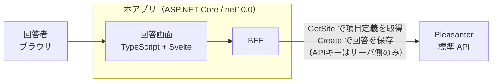

# VehicleVision.PleasanterTools.Questionnaire

**Pleasanter をバックエンドにした Web アンケート・Web フォームアプリ。**

- 回答画面は **Google Forms / Microsoft Forms に近い見た目・操作感**
- **アンケートの項目定義（設問・選択肢・必須有無）は Pleasanter 側のサイト設定で行う。**
  本アプリに独自のフォーム定義を持たない
- **回答データは Pleasanter のレコードとして蓄積する**
- **Pleasanter 本体は改造しない。** 標準 Web API を利用する独立したアプリ

## 構成



**API キーはサーバ側だけが持つ。** Pleasanter の API キーはリクエストボディに載せる方式のため、
ブラウザから直接 Pleasanter を叩く構成は取れない。

詳細は [`_documents/アーキテクチャ方針.md`](_documents/アーキテクチャ方針.md)。

## 技術スタック

Pleasanter 本体（`Pleasanter_1.5.7.0`）に揃えている。

| 層 | 採用 |
|---|---|
| ランタイム | .NET 10（`net10.0`）／SDK `10.0.100` |
| サーバ | C# / ASP.NET Core |
| フロントエンド | TypeScript + Vite + Svelte + SCSS |
| Pleasanter との接続 | 標準 Web API |

## 貢献する

**貢献の前に [`CLA.md`](CLA.md) への署名が要ります**（デュアルライセンスのため）。
手順は [`CONTRIBUTING.md`](CONTRIBUTING.md) を見てください。

## 開発をはじめる

**VS Code を使うなら [`_documents/開発環境.md`](_documents/開発環境.md) を見ること。**
ビルド・テスト・デバッグ・検証環境の起動を `.vscode` のタスクと構成にまとめてある
（環境変数を手で並べなくてよい）。

```bash
git clone https://github.com/vehiclevisionjp/VehicleVision.PleasanterTools.Questionnaire.git
cd VehicleVision.PleasanterTools.Questionnaire
git submodule update --init --recursive
```

### 開発環境は Docker で完結する

**ホストに .NET SDK も node も DB クライアントも要らない。**
Pleasanter・3 種類の RDBMS・本アプリをまとめて起動する。

```bash
docker compose --profile sqlserver up -d --wait   # SQL Server で動かす
docker compose --profile postgres  up -d --wait   # PostgreSQL で動かす
docker compose --profile mysql     up -d --wait   # MySQL で動かす
docker compose --profile "*" down -v              # 後片付け
```

| 到達先 | URL |
|---|---|
| 本アプリ | <http://localhost:8081> |
| Pleasanter | <http://localhost:8080>（`Administrator` / `pleasanter`） |

- **Pleasanter は profile を持たないので常に起動する**
- **[`tools/pleasanter-testenv/`](tools/pleasanter-testenv/README.md) を同時に起動しないこと。**
  ポートが衝突する。あちらは Pleasanter 単体の検証専用
- **Windows の Git Bash からは `MSYS_NO_PATHCONV=1` を付ける**

### ホストで直接ビルドする場合

.NET 10 SDK が要る（`global.json` で固定）。フロントエンドを直接ビルドするなら Node も要る。

```bash
cd src/VehicleVision.PleasanterTools.Questionnaire.Frontend
npm ci && npm run build   # 成果物は .Web/wwwroot へ出る
```


```bash
dotnet build
dotnet test
./scripts/license-check.sh
```

#### 動作確認（起動しているアプリへ HTTP で当てる）

```bash
docker compose --profile sqlserver up -d --wait
./scripts/smoke.sh
```

**単体テストでは見えない部分**（静的ファイルの配信・SPA のフォールバック・
セキュリティヘッダ・存在しない公開 ID の扱い）を見る。

#### 結合テスト（実機の Pleasanter に当てる）

**環境変数を設定したときだけ実行される。**

```bash
docker compose --profile postgres up -d --wait
QUESTIONNAIRE_INTEGRATION=1 dotnet test tests/VehicleVision.PleasanterTools.Questionnaire.Integration.Tests
```

> **設定していないと、結合テストは何も検証せずに緑になる。**
> **その緑を「通った」と読まないこと。** CI では必ず設定する。

### 設定

設定は `App_Data/Parameters/*.json` に置く（Pleasanter 本体と同じ方式）。
**API キーの実値はコミットしない。** 詳細は
[`App_Data/Parameters/README.md`](App_Data/Parameters/README.md)。

## リポジトリ構成

| パス | 内容 |
|---|---|
| [`_documents/アーキテクチャ方針.md`](_documents/アーキテクチャ方針.md) | 構成方針・決定事項・未確定事項 |
| [`_documents/機能一覧.md`](_documents/機能一覧.md) | Forms 相当のどこまで作るか |
| [`_documents/実機検証結果.md`](_documents/実機検証結果.md) | 実機で確定した Pleasanter の挙動 |
| [`_documents/データモデル設計.md`](_documents/データモデル設計.md) | DB スキーマ・版管理・3 RDBMS の型対応 |
| [`_documents/アプリケーション設計.md`](_documents/アプリケーション設計.md) | プロジェクト構成・API・送信ワーカー |
| [`_documents/画面設計.md`](_documents/画面設計.md) | 回答画面・管理アプリ |
| [`_documents/非機能設計.md`](_documents/非機能設計.md) | セキュリティ・障害時・テスト・運用 |
| [`_documents/ブランチ運用方針.md`](_documents/ブランチ運用方針.md) | ブランチ・保護ルール |
| [`_documents/リリース手順書.md`](_documents/リリース手順書.md) | バージョンの付け方・リリース手順 |
| [`_documents/添付ファイル検査-運用手順書.md`](_documents/添付ファイル検査-運用手順書.md) | ウイルススキャンの構成と運用 |
| [`tools/pleasanter-testenv/`](tools/pleasanter-testenv/README.md) | 検証環境（Docker） |
| `_reference/Implem.Pleasanter` | Pleasanter 本体（**AGPL v3 / 参照専用**）。[README](_reference/README.md) |
| `App_Data/Parameters/` | 設定ファイル |
| `scripts/` | 開発補助スクリプト |

## 開発規約

**[`.github/copilot-instructions.md`](.github/copilot-instructions.md) が単一の参照元。**
Claude Code は [`CLAUDE.md`](CLAUDE.md)、その他のエージェントは [`AGENTS.md`](AGENTS.md) から辿る。

- **Pleasanter 本体（AGPL v3）のコードは取り込まない。** `_reference/` は事実確認の参照専用
- Issue・PR・コミットメッセージはすべて日本語
- 作業ブランチは `develop` から分岐させる

## ライセンス

**デュアルライセンス**で提供します。詳細は [`LICENSING.md`](LICENSING.md)。

| | ライセンス | 想定する利用 |
|---|---|---|
| A | [GNU AGPL v3 以降](LICENSE) | オープンソースとして利用・改変・再配布する場合 |
| B | [PMC 商用ライセンス](LICENSE-COMMERCIAL.md) | AGPL の義務を負わずに利用したい場合（個別契約） |

SPDX 表記: `AGPL-3.0-or-later OR LicenseRef-PMC-Commercial`

**Pleasanter 本体（AGPL v3）を取り込まないことが、デュアルライセンスの前提です。**
取り込むと商用ライセンスでの提供ができなくなります。依存 OSS も寛容ライセンス
（MIT / BSD 系 / Apache-2.0）に限定します（[`NOTICE`](NOTICE)）。

Copyright (C) PMC Co.,Ltd.
