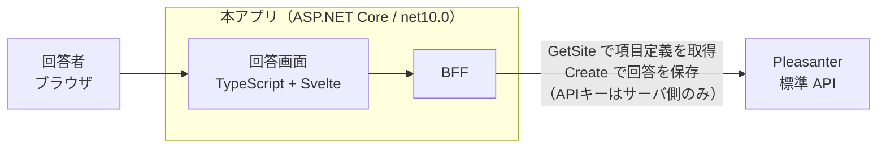

# VehicleVision.PleasanterTools.Questionnaire

**Pleasanter をバックエンドにした Web アンケート・Web フォームアプリ。**

- 回答画面は **Google Forms / Microsoft Forms に近い見た目・操作感**
- **アンケートの項目定義（設問・選択肢・必須有無）は Pleasanter 側のサイト設定で行う。**
  本アプリに独自のフォーム定義を持たない
- **回答データは Pleasanter のレコードとして蓄積する**
- **Pleasanter 本体は改造しない。** 標準 Web API を利用する独立したアプリ

## 構成



**API キーはサーバ側だけが持つ。** Pleasanter の API キーはリクエストボディに載せる方式のため、
ブラウザから直接 Pleasanter を叩く構成は取れない。

詳細は [`_documents/アーキテクチャ方針.md`](_documents/アーキテクチャ方針.md)。

## 技術スタック

Pleasanter 本体（`Pleasanter_1.5.7.0`）に揃えている。

| 層 | 採用 |
|---|---|
| ランタイム | .NET 10（`net10.0`）／SDK `10.0.100` |
| サーバ | C# / ASP.NET Core |
| フロントエンド | TypeScript + Vite + Svelte + SCSS |
| Pleasanter との接続 | 標準 Web API |

## 開発をはじめる

```bash
git clone https://github.com/vehiclevisionjp/VehicleVision.PleasanterTools.Questionnaire.git
cd VehicleVision.PleasanterTools.Questionnaire
git submodule update --init --recursive
```

設定は `App_Data/Parameters/*.json` に置く（Pleasanter 本体と同じ方式）。
**API キーの実値はコミットしない。** 詳細は
[`App_Data/Parameters/README.md`](App_Data/Parameters/README.md)。

## リポジトリ構成

| パス | 内容 |
|---|---|
| `_documents/` | 仕様書・方針・調査結果 |
| `_reference/Implem.Pleasanter` | Pleasanter 本体（**AGPL v3 / 参照専用**）。[README](_reference/README.md) |
| `App_Data/Parameters/` | 設定ファイル |
| `scripts/` | 開発補助スクリプト |

## 開発規約

**[`.github/copilot-instructions.md`](.github/copilot-instructions.md) が単一の参照元。**
Claude Code は [`CLAUDE.md`](CLAUDE.md)、その他のエージェントは [`AGENTS.md`](AGENTS.md) から辿る。

- **Pleasanter 本体（AGPL v3）のコードは取り込まない。** `_reference/` は事実確認の参照専用
- Issue・PR・コミットメッセージはすべて日本語
- 作業ブランチは `develop` から分岐させる

## ライセンス

Copyright (C) PMC Co.,Ltd.
