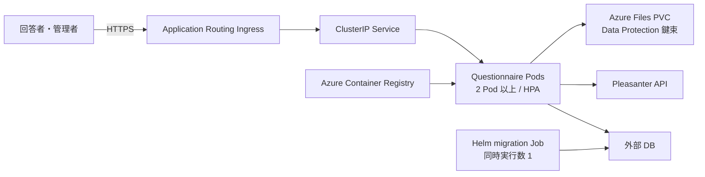

# AKS 導入更新運用手順書

## 対象と前提

本書は、本アプリを既存の Azure Kubernetes Service（AKS）へ Helm で導入し、
Azure Container Registry（ACR）のイメージへ更新する手順を定める。
AKS クラスター自体の作成、DB と Pleasanter の構築は対象外とする。

必要なものは次のとおり。

- AKS クラスター、ACR、外部 DB、Pleasanter が構築済み
- ローカルに Azure CLI、`kubectl`、Helm 4 または Helm 3
- AKS から DB と Pleasanter へ HTTPS/TLS で到達できるネットワーク
- ACR からイメージを pull できる AKS の権限
- `ReadWriteMany` を使える Azure Files CSI ストレージクラス
- Ingress を公開する場合は DNS 名と TLS 証明書

本リポジトリのチャートは `deploy/aks/questionnaire/` にある。
AKS Deployment Safeguards を前提に、非 root、読み取り専用ルートファイルシステム、
リソース要求・上限、probe、2 Pod 以上、PodDisruptionBudget を設定している。

## 構成



`/healthz` はプロセスの生存、`/ready` は本アプリ DB への接続を確認する。
Pleasanter が一時停止しても回答を DB に保留できるため、`/ready` は Pleasanter を確認しない。

複数 Pod で管理画面の Cookie を共用するため、ASP.NET Core Data Protection の鍵束を
Azure Files PVC に保存する。この PVC を消すと既存 Cookie が無効になるため、通常の更新では削除しない。

## 事前設定

### ACR と AKS を接続する

AKS の kubelet identity が ACR から pull できるようにする。

```bash
az aks update \
  --resource-group <AKSリソースグループ> \
  --name <AKS名> \
  --attach-acr <ACR名>

az aks get-credentials \
  --resource-group <AKSリソースグループ> \
  --name <AKS名>
```

組織の方針で `--attach-acr` を使えない場合は、ACR の権限モデルに合わせて
kubelet identity へ pull の最小権限を割り当てる。

### Namespace と資格情報を作る

資格情報を Helm values に書くと Helm release history に残る。
チャートは Secret を作らず、事前作成した Secret の名前だけを参照する。

```bash
kubectl create namespace questionnaire
```

次のファイルを安全な作業場所へ作る。リポジトリへ置かず、利用後に安全に削除する。

```text
QUESTIONNAIRE_DB_CONNECTIONSTRING=<本アプリDBの接続文字列>
QUESTIONNAIRE_PLEASANTER_APIKEY=<Pleasanter APIキー>
QUESTIONNAIRE_SECRET_KEY=<Base64の32バイト鍵>
```

Secret を作成する。

```bash
kubectl create secret generic questionnaire-secrets \
  --namespace questionnaire \
  --from-env-file=.questionnaire-secrets.env
```

`QUESTIONNAIRE_SECRET_KEY` は紛失すると登録済みの2要素認証を復号できない。
Azure Key Vault 等へ控えを保管する。Secret の更新は同名で再生成して適用する。

```bash
kubectl create secret generic questionnaire-secrets \
  --namespace questionnaire \
  --from-env-file=.questionnaire-secrets.env \
  --dry-run=client -o yaml | kubectl apply -f -
```

### Ingress と TLS を用意する

AKS Application Routing add-on を使う場合、Ingress class は
`webapprouting.kubernetes.azure.com` とする。TLS Secret を先に作る。

`config.forwardedNetworks` には Application Routing Ingress からアプリ Pod へ接続するときの
送信元 CIDR だけを指定する。これは `X-Forwarded-For` と `X-Forwarded-Proto` を信頼する範囲である。
無関係な VNet 全体や `0.0.0.0/0` を指定しない。ネットワーク方式により Pod CIDR または
Ingress node/subnet の CIDR になるため、クラスター管理者が実際の構成から確定する。

Application Routing の Pod と node の配置は次で確認できる。

```bash
kubectl get pods --namespace app-routing-system -o wide
kubectl get nodes -o wide
```

```bash
kubectl create secret tls questionnaire-tls \
  --namespace questionnaire \
  --cert=questionnaire.crt \
  --key=questionnaire.key
```

証明書を別の仕組みで管理する場合は、同名の TLS Secret が作られるようにする。
Production ではアプリが HTTPS へリダイレクトするため、Ingress を有効にする場合は
host と TLS Secret の両方が必須である。

## イメージを ACR へ発行する

`.github/workflows/aks-image.yml` を手動実行する。GitHub Environment
`aks-production` に次の Repository/Environment variables を設定する。

| 変数 | 内容 |
| --- | --- |
| `AZURE_CLIENT_ID` | GitHub OIDC で使う Microsoft Entra アプリまたは user-assigned managed identity |
| `AZURE_TENANT_ID` | Microsoft Entra tenant ID |
| `AZURE_SUBSCRIPTION_ID` | ACR のある subscription ID |
| `AZURE_ACR_NAME` | ACR 名。`azurecr.io` は付けない |

Azure 側には GitHub Environment `aks-production` を subject とする federated credential を作り、
対象 identity へ ACR Tasks のビルド送信に必要な最小権限を割り当てる。
GitHub へ client secret は登録しない。

`source_ref` にはリリース済みタグまたは確定したコミット SHA を指定する。
`image_tag` を省略すると、そのコミット SHA の先頭12桁を使う。上書き可能な `latest` は禁止している。

```bash
gh workflow run aks-image.yml \
  -f source_ref=v0.2.0 \
  -f image_tag=v0.2.0
```

Actions の Summary に、発行したイメージ名と digest が出る。

## 初回導入

`values-production.example.yaml` を作業場所へコピーし、ACR、Pleasanter URL、
`forwardedNetworks`、公開 host、TLS Secret 名を環境に合わせる。
例の `10.244.0.0/16` は仮値なので必ず置き換える。資格情報は書かない。

```bash
cp deploy/aks/questionnaire/values-production.example.yaml questionnaire-production.yaml

helm lint deploy/aks/questionnaire \
  --values questionnaire-production.yaml

helm upgrade --install questionnaire deploy/aks/questionnaire \
  --namespace questionnaire \
  --values questionnaire-production.yaml \
  --atomic \
  --wait \
  --timeout 10m
```

Helm の `pre-install` hook がマイグレーション Job を1 Podだけ起動し、成功してから
Deployment を作る。DB 接続に失敗するかマイグレーションに失敗した場合、導入は止まる。
各アプリ Pod でマイグレーションを実行しないため、スケールアウト時に競合しない。

確認する。

```bash
kubectl get deploy,pod,service,ingress,hpa,pdb,pvc \
  --namespace questionnaire

kubectl rollout status deployment/questionnaire-questionnaire \
  --namespace questionnaire \
  --timeout=5m

curl --fail https://questionnaire.example.com/healthz
curl --fail https://questionnaire.example.com/ready
```

リソース名は release 名と chart 名から作る。`questionnaire` 以外の release 名を使った場合は
`kubectl get` で実名を確認する。

## 更新

DB のバックアップを取得し、新イメージを ACR へ発行してから values の `image.tag` を更新する。
マイグレーション内容と後方互換性は Release 本文で確認する。

適用前に、Helm 標準の `template` でレンダリング結果をレビューする。

```bash
helm template questionnaire deploy/aks/questionnaire \
  --namespace questionnaire \
  --values questionnaire-production.yaml > rendered.yaml
```

適用する。

```bash
helm upgrade questionnaire deploy/aks/questionnaire \
  --namespace questionnaire \
  --values questionnaire-production.yaml \
  --atomic \
  --wait \
  --timeout 10m
```

`pre-upgrade` hook のマイグレーションが先に成功し、その後 Deployment が
`maxUnavailable: 0` でローリング更新される。更新後は初回導入と同じ確認を行う。

## 失敗時とロールバック

### migration Job を調べる

成功した hook Job は自動削除する。失敗した Job は調査のため残す。

```bash
kubectl get jobs --namespace questionnaire
kubectl logs job/questionnaire-questionnaire-migrate --namespace questionnaire
kubectl describe job questionnaire-questionnaire-migrate --namespace questionnaire
```

接続文字列、DB のファイアウォール、名前解決、TLS 設定を直してから同じ `helm upgrade` を再実行する。

### アプリをロールバックする

```bash
helm history questionnaire --namespace questionnaire
helm rollback questionnaire <REVISION> \
  --namespace questionnaire \
  --wait \
  --timeout 10m
```

Helm rollback では `pre-upgrade` hook を実行しない。DB マイグレーションは自動で戻らない。
旧アプリと新 DB に後方互換性がない場合は、先に取得した DB バックアップから復元するか、
互換性を戻す修正版イメージを発行する。判断できない場合は Pod だけを戻さない。

### Pod が Ready にならない

```bash
kubectl get pods --namespace questionnaire
kubectl describe pod <Pod名> --namespace questionnaire
kubectl logs <Pod名> --namespace questionnaire
kubectl get events --namespace questionnaire --sort-by=.lastTimestamp
```

- `/healthz` が失敗する: プロセス起動、ポート、リソース不足を確認する
- `/ready` だけ失敗する: DB 接続、Secret、名前解決、TLS、ファイアウォールを確認する
- PVC が Pending: `dataProtection.storageClassName` と Azure Files CSI を確認する
- 片方の Pod へ移るとログアウトする: Data Protection PVC の mount と書き込み権限を確認する
- ImagePullBackOff: AKS kubelet identity の ACR pull 権限とイメージタグを確認する

## バックアップと定期確認

- DB は組織の RPO/RTO に合わせてバックアップと復元試験を行う
- Data Protection PVC を削除・作り直す前に鍵束を退避する
- `QUESTIONNAIRE_SECRET_KEY` の控えを Key Vault 等で保全する
- TLS 証明書と OIDC federated credential の期限・subject を定期確認する
- HPA の replica 数、CPU/メモリ、再起動回数、`/ready` の失敗を監視する
- AKS、node image、Ingress、Azure Files CSI の更新方針をクラスター運用側で定める

## 参照した一次情報

いずれも 2026-08-30 参照。

- [AKS Deployment Safeguards](https://learn.microsoft.com/azure/aks/deployment-safeguards)
- [Azure Files CSI を AKS で使う](https://learn.microsoft.com/azure/aks/azure-files-csi)
- [AKS Application Routing](https://learn.microsoft.com/azure/aks/app-routing)
- [ACR Tasks の概要](https://learn.microsoft.com/azure/container-registry/container-registry-tasks-overview)
- [GitHub Actions から Azure への OpenID Connect](https://learn.microsoft.com/azure/developer/github/connect-from-azure-openid-connect)
- [Helm chart hook](https://helm.sh/docs/topics/charts_hooks/)
