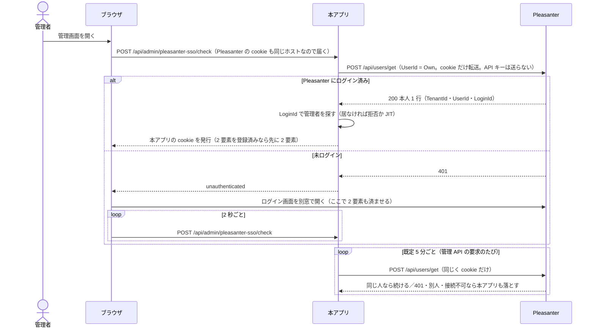

# Pleasanter SSO 運用手順書

**Pleasanter にログインしている人が、そのまま本アプリの管理画面へ入れるようにする**（シングルサインオン）
手順と、その仕組み・前提・配置例（Issue #464）。

**既定は無効。** 設定しなければ、これまでどおりログイン ID とパスワード（＋ 2 要素）、または SAML だけになる。

- 実装: `src/VehicleVision.PleasanterTools.Questionnaire.Web/Services/PleasanterSsoOptions.cs`、
  `Services/PleasanterSsoOptionsProvider.cs`、`Services/PleasanterSessionVerifier.cs`、
  `Services/PleasanterSsoAuthenticator.cs`、`Services/PleasanterSsoSessionRevalidator.cs`、
  `Endpoints/AdminPleasanterSsoEndpoints.cs`
- 保存先: `src/VehicleVision.PleasanterTools.Questionnaire.Data/PleasanterSsoSettingStore.cs`、
  `Migrations/M0032_PleasanterSsoSettings.cs`
- 画面: `src/VehicleVision.PleasanterTools.Questionnaire.Frontend/src/admin/components/SignInPanel.svelte`、
  `components/PleasanterSsoSettingsPanel.svelte`、`lib/pleasanterSso.ts`
- **追加した依存は無い**（`NOTICE` の変更なし）
- **Pleasanter 本体のコードは参照も取り込みもしていない**（規約 6）
- **Pleasanter 側に何も置かない。** 本人は Pleasanter の標準の API で確かめるので、定義ファイルも
  Pleasanter の再起動も要らず、DBMS ごとの SQL も要らない

> ⚠️ **本アプリと Pleasanter を同じホスト名で動かすことが前提**（[4 章](#4-前提)）。
> 本番では**本アプリをサブパス（例 `/questionnaire/`）に置く**（`QUESTIONNAIRE_PATH_BASE`。[サブパス配置-運用手順書](サブパス配置-運用手順書.md)）。
> 手元の検証（`localhost` のポート違い）ではサブパスにしなくても動く。

## 1. できること

| 項目 | 内容 |
|---|---|
| 起点 | 本アプリのログイン画面の「Pleasanter でログイン」釦。**ログイン画面を開いた時点で一度だけ黙って確かめ、既に Pleasanter にログインしていればそのまま入る** |
| Pleasanter 未ログインのとき | Pleasanter のログイン画面を別窓で開き、2 秒ごとに確かめる。ログインが済むと自動で入る（最長 5 分） |
| 利用者の突き合わせ | **ログイン ID**（Pleasanter の `LoginId` を本アプリのログイン ID として扱う。SAML と同じ） |
| 本人の確かめ方 | **標準の API**: `/api/users/get` を 1 回、読むだけ。利用者の API 利用が禁止されていれば本アプリの API キーで引き直す（[2.3](#23-利用者の-api-利用を禁止しているとき)） |
| 未登録の利用者 | **拒絶**（既定）か **その場で登録**（JIT）を選べる。JIT の役割も選べる |
| Pleasanter 側の 2 要素 | **終えた人しか通らない**（TOTP・メールのワンタイムパスワードとも実機で確認。[6 章](#6-2-要素認証の扱い)） |
| 本アプリの 2 要素 | **SAML と同じ扱い**（登録済みなら通す、`required` なら登録させる） |
| 再検証 | 既定 5 分ごとに Pleasanter に確かめ直す。Pleasanter でログアウト・無効化された人は本アプリからも落とす |
| ログアウト | 本アプリから落とす。設定すれば続けて Pleasanter のログアウト画面へ移す |
| 設定の反映 | DB の設定は**再起動なし**で反映する（30 秒以内） |
| 設定できる人 | `Administrator` だけ（権限 `settings.pleasanterSso`） |

## 2. 仕組み

Pleasanter は IdP ではない（外部アプリへトークンを発行する口もログイン API も無い）。
代わりに、**ブラウザが持つ Pleasanter の cookie を本アプリのサーバが Pleasanter へ転送し、
Pleasanter 自身に「この cookie の持ち主は誰か」を答えさせる。**

本人は Pleasanter の標準の API で確かめる。転送した cookie で次の 1 回だけを呼ぶ。**読むだけで、Pleasanter へは何も書かない。**

```text
POST {内部 URL}/api/users/get
{"ApiVersion":1.1,"View":{"ColumnFilterHash":{"UserId":"[\"Own\"]"}}}
```

Pleasanter は利用者 ID の絞り込みの `Own` を**ログイン中の利用者 ID に置き換える**ので、本人の 1 行だけが返る。
応答の `TenantId`・`UserId`・`LoginId`・`Name` をそのまま使う。
利用者の API 利用を禁止している Pleasanter で 403 が返ったときの扱いは [2.3](#23-利用者の-api-利用を禁止しているとき)。



### 2.1 ソースでの根拠（`_reference/Implem.Pleasanter`、`Pleasanter_1.5.8.1` / `626a173e`）

| 事実 | 根拠 |
|---|---|
| API は cookie でも認証される（API キーが無ければ `User.Identity.Name` で利用者を引く） | `Implem.Pleasanter/Libraries/Requests/Context.cs:489-508` |
| `/api/users/get` は認証されていなければ 401 | `Implem.Pleasanter/Controllers/Api/UsersController.cs:21-38` |
| 利用者 ID の絞り込みの `Own` はログイン中の利用者 ID に置き換わる | `Implem.Pleasanter/Libraries/Settings/View.cs:2439-2482`（`ConvertedValue` / `ConvertedOwn`） |
| `/api/users/get` は呼んだ人のテナントの利用者だけを返す | `Implem.Pleasanter/Models/Users/UserUtilities.cs:5063-5190`（`Users_TenantId(context.TenantId)`） |
| `/api/users/get` は利用者の API 利用が禁止されていると 403 | `UserUtilities.cs:5072`（`UserValidators.OnEntry`）→ `Libraries/General/Validators.cs:72-85`、`Libraries/Settings/UserSettings.cs:102-108` |
| `/api/sessions/set` は認証されていなければ 401、API 利用の禁止は見ない。応答に利用者 ID が載る | `Implem.Pleasanter/Controllers/Api/SessionsController.cs:35-50`、`Models/Sessions/SessionUtilities.cs:354-390` |
| 2 要素を終えるまで認証 cookie は出ない | `Implem.Pleasanter/Models/Users/UserModel.cs:4711-4748` |
| API の Token 検査は既定で無効 | `Implem.Pleasanter/App_Data/Parameters/Security.json` の `TokenCheck: false`、`Filters/CheckApiContextAttributes.cs` |
| 認証 cookie は `Cookie.Domain` を設定していない（ホスト単位でしか届かない） | `Implem.Pleasanter/Startup.cs:150-190` |
| ログアウトは、受け取った cookie を `Pleasanter_` と `ExcludeCookiePrefixes` 以外すべて消す | `Implem.Pleasanter/Libraries/Requests/Context.cs:1365-1381`、`Libraries/Security/Authentications.cs:39-45` |

### 2.2 実機での確認（`tools/pleasanter-testenv`、Pleasanter 1.5.8.1 ＋ SQL Server 2025）

**`users/get` と代わりの経路（2026-09-25）:**

| 手順 | 結果 |
|---|---|
| 一般利用者（`sso-user1`）の cookie で `users/get`（`UserId = Own`） | 200、`TotalCount` 1、`LoginId` `sso-user1`（UserId=2） |
| `Administrator` の cookie で同じ | 200、`TotalCount` 1、`LoginId` `Administrator` |
| 偽の `Pleasanter_SessionGuid` だけ | 401 |
| 絞り込みを付けない `users/get`（一般利用者） | 見える利用者が全部返る（2 件）。本アプリは `Own` の絞り込みを必ず付ける |
| `User.json` の `DisableApi` を `true`・API キーなし | 403。本アプリは接続不可として扱い、設定を案内する警告を出す |
| `DisableApi` を `true`・本アプリに API キーあり（キーの持ち主は `AllowApi`） | `sessions/set` 200（UserId=2）→ API キーで `users/2/get` 200 → 本人 |
| 同上・API キーが違う | `users/2/get` が 401。**未ログインではなく接続不可**として扱う |
| **TOTP 有効**・パスワードだけ通した段階 | 401（`Pleasanter_SessionGuid` しか無い） |
| **TOTP 有効**・コード入力後 | 200、本人 |

いずれも本アプリの検証サービス（`PleasanterSessionVerifier`）に実際の cookie を渡して確かめた。

**2026-09-24 の確認（当時は本人確認に拡張 SQL を使っていた。拡張 SQL の方式はその後削除した）:**
cookie の認証（`context.Authenticated`）と本アプリ側の流れは本人確認の問い合わせに依らないため、
記録として残す。

| 手順 | 結果 |
|---|---|
| ログアウト後の（古い）cookie | 401 |
| **メールのワンタイムパスワード有効**・パスワードだけ | 401 |
| **メールのワンタイムパスワード有効**・コード入力後 | 200 |
| 本アプリ（SQLite で起動）の確認の入口 → 管理 API → Pleasanter でログアウト → 再検証 | 入れる → 使える → 間隔を過ぎた最初の要求で 401、セッションも消える |
| 本アプリの 2 要素を `required` にして確認の入口 | `next=enroll` → 登録 → ログイン後も Pleasanter の印が引き継がれ再検証の対象になる |

### 2.3 利用者の API 利用を禁止しているとき

`User.json` の `DisableApi` や利用者ごとの API 禁止を使っていると、利用者の cookie で呼んだ
`/api/users/get` は **403** になる（2.1 の表）。このときは次のように扱う。

| 本アプリの Pleasanter 接続設定 | 扱い |
|---|---|
| `QUESTIONNAIRE_PLEASANTER_BASEURL` と `QUESTIONNAIRE_PLEASANTER_APIKEY` がある | **代わりの経路**で本人を確かめる（下の 2 回） |
| API キーが無い | **接続不可**（`http-403`）。ログに設定を案内する警告を出す。API キーを設定する |

**本アプリは回答を Pleasanter へ書くために API キーを必ず持つ**（`QUESTIONNAIRE_PLEASANTER_APIKEY`）ので、
代わりの経路のために新しく用意するものは無い。「API キーが無い」は、接続設定を済ませる前の構成でだけ起きる。

代わりの経路:

1. **cookie を転送して** `POST {内部 URL}/api/sessions/set` を呼ぶ
   （本文 `{"ApiVersion":1.1,"SessionKey":"VehicleVision.Questionnaire.SsoProbe","SessionValue":"<UNIX 時刻>"}`）。
   応答 `{"StatusCode":200,"Response":{"UserId":2,...}}` から利用者 ID を得る。sessions の API は API 利用の禁止を見ない。
   **401 はここでも「未ログイン」**
2. **本アプリの API キーで** `POST {QUESTIONNAIRE_PLEASANTER_BASEURL}/api/users/{UserId}/get` を呼び、
   `TenantId`・`LoginId`・`Name` を得る。**この要求には cookie を付けない。**
   **1 行ちょうど・`TotalCount` 1・1 回目と同じ `UserId`** でなければ成功にしない

- **`sessions/set` は Pleasanter のセッションごとに小さな値を 1 つ書く。** `SavePerUser` を付けないので
  Pleasanter のセッションと一緒に消える。値に意味は無く、応答から利用者 ID を読むためだけに書く
- **2 回目に本アプリの API キーを使う理由。** `users/get` は API 利用の禁止を必ず確かめる。
  利用者本人の cookie では禁止に当たるので、API の利用を許された本アプリの接続用アカウントのキーで引く
- **API キーは本アプリの接続設定の URL（回答を送っている先）へだけ送る。** 内部 URL へは送らない。
  内部 URL を書き換えられてもキーが外へ出ないようにするため。**内部 URL と接続設定の URL は同じ Pleasanter を指すこと**
- **API キーの持ち主と同じテナントの利用者しか引けない**（`users/get` がテナントで絞る）。
  **複数テナントの Pleasanter でも、テナントと本アプリの配置は 1 対 1**（1 つの本アプリは 1 つのテナントの
  API キーで回答を書く）なので、キーの持ち主と利用者のテナントは一致する。
  別テナントの利用者が来たときは `user-no-row` の接続不可になり、通さない
- **API キーの問い合わせの 401・403 は「未ログイン」ではなく接続不可**（キーの誤りや、キーの持ち主の API 禁止）
- **時間切れ（`TIMEOUTSECONDS`）は 3 回の合計に掛かる**
- ⚠️ **代わりの経路は `sessions/set` の応答に載る利用者 ID に頼っている。** API を禁止した環境では、
  Pleasanter の版を上げたら接続の試験（7.2）で本人が返ることを確かめ直すこと

## 3. 決めていること（変えないこと）

- ⚠️ **Pleasanter の API キーをブラウザへ渡さない**（規約 8）。**cookie を転送する問い合わせに API キーを載せない。**
  API キーを使うのは 2.3 の代わりの経路の 2 回目だけで、そのときは cookie を送らない。宛先は本アプリの接続設定の URL だけ
- ⚠️ **本アプリの cookie（`q.` で始まるもの）は Pleasanter へ送らない。** 設定で `q` や `q.admin` を
  転送対象に書くことも拒否する
- ⚠️ **成功と判断するのは、JSON の業務ステータスが 200 で、TenantId・UserId（1 以上の整数）・LoginId が
  きっちり読めた 1 行だけ**（`users/get` は `TotalCount` も 1）。応答を正しく読めたことを確かめるため。
  転送（3xx）・HTML・時間切れ・JSON でないもの・5xx・0 行・複数行は
  すべて「接続不可」で、**決して成功にしない。** cookie を転送した問い合わせの 401（HTTP でも業務ステータスでも）だけが「未ログイン」
- **cookie を覚えない・転送を追わない HttpClient を使う**（`UseCookies=false`、`AllowAutoRedirect=false`）。
  cookie は要求ごとに `Cookie` ヘッダで付ける。ある管理者の cookie を別の管理者の問い合わせへ混ぜない
- **cookie の値と API キーはログへ出さない。** 転送した個数と応答の状態・時間だけを残す
- **内部 URL はサーバ間の問い合わせにだけ使う。** 画面へ返すのはログイン・ログアウト画面の URL だけ
- **最初の管理者を Pleasanter から作らせない。** 管理者が 0 人の間、確認の入口は 409 を返し、
  最初の管理者を作る画面に釦も出さない（SAML と同じ理由。誰でも全権を取れてしまう）
- **確認の入口は JSON の本文（空の `{}`）でしか受けない。** 他所のサイトの form から勝手にログインさせない
- **確認の入口はログインの試行（5 分に 10 回）とは別の枠**（送信元 IP ごとに 5 分に 300 回）。
  ログインを待つ間の問い合わせで、合言葉のログインまで止めない
- **「まだ Pleasanter にログインしていない」だけの問い合わせは操作の記録に残さない。**
  入った・断られた・接続不可は `AuditLogs` に残す（`loginId`、`pleasanterTenantId`、`pleasanterUserId`、`result`）
- **再検証で接続できなかったときにセッションを延ばさない。** 本アプリからも落とし、管理 API は 503 を返す
- **機能を無効にしたら、それで入っていた人も次の要求で落とす**（確かめる手段が無いため）

## 4. 前提

### 4.1 同じホスト名で動かすこと

cookie はホスト名単位でしか届かない。Pleasanter は `Cookie.Domain` を設定していないので、
**本アプリと Pleasanter を同じホスト名で動かす**必要がある。**ポートは cookie の区別に使われない**ので、
手元では `http://localhost:8080`（Pleasanter）と `http://localhost:5067`（本アプリ）のように並べても動く。

本番では、**Pleasanter を `/`、本アプリを `/questionnaire/` のようなサブパスに置く。**
Pleasanter の cookie は Pleasanter 自身の PathBase に閉じるため、逆（Pleasanter をサブパス）だと
本アプリへ届かない（詳細は #465）。

本アプリのサブパスは `QUESTIONNAIRE_PATH_BASE` で指定する。設定と配置の詳細は
[サブパス配置-運用手順書](サブパス配置-運用手順書.md) を参照。

### 4.2 Pleasanter の `TokenCheck` を無効のままにすること

`App_Data/Parameters/Security.json` の `TokenCheck` が `true` の Pleasanter では、API に
リクエストごとのトークンを求めるため**動かない。** 既定は `false`。

### 4.3 Pleasanter の IP 制限を使っているなら、本アプリのサーバを許可すること

問い合わせの送信元は**本アプリのサーバ**（ブラウザではない）。`Security.json` などで
Pleasanter への接続元を絞っている場合は、本アプリのサーバの IP アドレスを許可する。

### 4.4 Pleasanter のログアウトは本アプリの cookie も消すことがある

Pleasanter はログアウト時に、**受け取った cookie を `Pleasanter_` で始まるもの以外すべて消す**
（2.1 の表）。本アプリの cookie（`q.admin`）が同じパスで Pleasanter にも届く構成
（手元のポート違いなど）では、**Pleasanter でログアウトすると本アプリからも即座にログアウトされる。**
本アプリをサブパスに置いた構成では、本アプリの cookie の Path がサブパスに絞られるため届かないので消されず、
本アプリ側の再検証（既定 5 分以内）で落ちる。
消されたくない場合は Pleasanter の `Security.json` の `ExcludeCookiePrefixes` に `q.` を足す。

## 5. Pleasanter 側の準備

### 5.1 準備は要らない

**Pleasanter 側に何も置かない。** 定義ファイルも Pleasanter の再起動も要らず、DBMS の違いも関係しない。
本アプリの設定で内部 URL などを入れるだけでよい（7 章）。

置いた設定を確かめるには、Pleasanter にブラウザでログインしてから、本アプリの
**Pleasanter ログイン設定 → 接続の試験** を押す（保存前の値で問い合わせる）。
本人のログイン ID・利用者 ID・テナント ID が出れば正しい。

コマンドで確かめる場合（Pleasanter に直接）:

```bash
# ログインして cookie を得る
curl -s -o /dev/null -c jar.txt -b jar.txt http://localhost:8080/users/login
curl -s -o /dev/null -c jar.txt -b jar.txt -H "X-Requested-With: XMLHttpRequest" \
  --data-urlencode "Users_LoginId=Administrator" --data-urlencode "Users_Password=..." \
  "http://localhost:8080/users/authenticate?ReturnUrl="

# API キー無しで、本人だけに絞って users/get を呼ぶ（TotalCount が 1 で本人が返る）
curl -s -b jar.txt -H "Content-Type: application/json" \
  -d '{"ApiVersion":1.1,"View":{"ColumnFilterHash":{"UserId":"[\"Own\"]"}}}' \
  http://localhost:8080/api/users/get
```

### 5.2 利用者の API 利用を禁止している Pleasanter

`User.json` の `DisableApi` などで利用者の API 利用を禁止していても、本アプリの Pleasanter 接続設定
（`QUESTIONNAIRE_PLEASANTER_BASEURL`・`QUESTIONNAIRE_PLEASANTER_APIKEY`）があれば動く（2.3）。
回答の送信のために既に設定しているので、追加の作業は無い。キーの持ち主には API の利用を許しておく
（`DisableApi` のときは利用者の `AllowApi`。回答の送信にも要る）。

## 6. 2 要素認証の扱い

### 6.1 Pleasanter 側の 2 要素（TOTP・メールのワンタイムパスワード）

**Pleasanter は 2 要素を終えるまで認証 cookie を出さない**（2.1 の表）。パスワードだけ通した段階では
`Pleasanter_SessionGuid` しか無く、`users/get`・`sessions/set` とも 401 になる。
どちらも同じ「認証されているか」の判定（`context.Authenticated`）を通るため。**本アプリは何もしなくても、
Pleasanter の 2 要素を終えた人しか通さない**（2.2 の表。`users/get` で TOTP を確認済み。
メールのワンタイムパスワードは 2026-09-24 に当時の問い合わせで確認しており、`users/get` でも同じ判定を
通ることからの推論）。

⚠️ **この性質に頼っている。** Pleasanter の版を上げたときは、2.2 の手順で 2 要素の途中が 401 に
なることを確かめ直すこと。

### 6.2 本アプリ側の 2 要素（SAML と同じ）

`QUESTIONNAIRE_ADMIN_TWOFACTOR` の方針は Pleasanter から来た人にも同じように効く
（[`SAML認証-運用手順書.md`](SAML認証-運用手順書.md) 2 章と同じ判断）。

- **本アプリで 2 要素を登録済みの人は、Pleasanter から来ても本アプリの 2 要素を通す。**
  Pleasanter 側の 2 要素に任せきりにしない。**`disabled` でも省かない**
- **`required` なら、Pleasanter から来た人にも登録させる**
- 2 要素の途中状態から入り終えた後も、Pleasanter の本人の印は引き継がれ、再検証の対象になる

### 6.3 合言葉のログイン

- **ログイン ID とパスワードの入口は既定では残す**
- `QUESTIONNAIRE_ADMIN_PASSWORD_SIGNIN=false` を外部設定へ明示すると、
  **SAML か Pleasanter のログインのどちらかが有効な間だけ**、画面と認証 API の両方で塞ぐ
- ⚠️ **両方とも無効なら、塞ぐ指定を警告付きで無視する**（画面から無効にできるため、締め出し防止）
- **JIT で作った利用者はパスワードを持たない**（誰も知らない値を入れる）
- ⚠️ **合言葉を塞ぐ前に、Pleasanter のログインで実際に入り直せることを別のブラウザで確認する**

## 7. 本アプリ側の設定

### 7.1 設定を読む順序

SAML と同じ。**外部設定（環境変数・`App_Data/Parameters` など）→ DB の `PleasanterSsoSettings` → 既定値。**
外部設定で指定した項目は管理画面で「設定で固定されています」と出て編集できない。
更新後にマイグレーション 32 を適用する（自動適用が既定）。

| 鍵 | 意味 | 既定値 |
|---|---|---|
| `QUESTIONNAIRE_PLEASANTERSSO_ENABLED` | 有効にするか | `false` |
| `QUESTIONNAIRE_PLEASANTERSSO_INTERNALBASEURL` | 本アプリのサーバから Pleasanter へ届く URL（**有効時は必須**） | なし |
| `QUESTIONNAIRE_PLEASANTERSSO_LOGINURL` | ブラウザで開く Pleasanter のログイン画面（**有効時は必須**。`/users/login` など） | なし |
| `QUESTIONNAIRE_PLEASANTERSSO_LOGOUTURL` | 本アプリのログアウト後に開く Pleasanter のログアウト画面（`/users/logout` など） | なし（本アプリだけ落とす） |
| `QUESTIONNAIRE_PLEASANTERSSO_COOKIENAMES` | 転送する cookie の名前（前方一致、カンマ区切り） | `.AspNetCore.Cookies,Pleasanter_SessionGuid` |
| `QUESTIONNAIRE_PLEASANTERSSO_UNKNOWNUSER` | 未登録の利用者（`Reject` / `Register`） | `Reject` |
| `QUESTIONNAIRE_PLEASANTERSSO_REGISTERROLE` | JIT で作るときの役割 | `Editor` |
| `QUESTIONNAIRE_PLEASANTERSSO_REVALIDATEMINUTES` | 確かめ直す間隔（分、1〜60） | `5` |
| `QUESTIONNAIRE_PLEASANTERSSO_TIMEOUTSECONDS` | 問い合わせを待つ時間（秒、1〜30） | `5` |
| `QUESTIONNAIRE_PLEASANTERSSO_BUTTONLABEL` | ログイン画面の釦の文字 | なし（「Pleasanter でログイン」） |

- **内部 URL は Pleasanter へ直接つないでよい**（例 `http://127.0.0.1:8080/`）。cookie はホスト名に
  結び付いた値ではないので、リバースプロキシを経由しなくても Pleasanter は同じ人と判断する。
  Pleasanter をサブパスに置いているなら、そのパスまで含める
- **認証 cookie は分割されることがある**（`.AspNetCore.CookiesC1`、`C2` …）。前方一致なので既定のままで送れる。
  Pleasanter の cookie 名を変えている場合だけ書き換える
- **`users/get` で 403 が返ったときは、本アプリの Pleasanter 接続設定（`QUESTIONNAIRE_PLEASANTER_BASEURL`・
  `QUESTIONNAIRE_PLEASANTER_APIKEY`）を使う**（2.3）。新しい鍵は無い
- ⚠️ **`REGISTERROLE` を `Administrator` にすると、Pleasanter に居る全員が全権を持つ**
- **外部設定の書き間違いは起動時に落とす**（英語のメッセージを出して起動しない）。
  DB の値は保存時に検証するので、読めない値は保存されない

### 7.2 管理画面から設定する

1. `Administrator` で管理画面へログインする
2. 上部の **Pleasanter ログイン設定** を開く
3. 内部 URL・ログイン画面・（必要なら）ログアウト画面を入力する
4. 同じブラウザで Pleasanter にログインしてから **Pleasanter に問い合わせる**（接続の試験）を押し、
   本人が返ることと、そのログイン ID の管理者が本アプリに居ることを確かめる
5. 未登録の利用者の扱いと役割を確認し、**有効にする** に印を付けて **保存する**
6. 操作の記録で `PUT /api/admin/pleasanter-sso/settings` が成功していること（`changedFields`）を確認する
7. 別のブラウザで本アプリのログイン画面を開き、Pleasanter のログインで入れることを確かめる

### 7.3 自分でログアウトした直後

ログイン画面は開いたときに一度だけ黙って確かめるので、Pleasanter にログインしたままだと
本アプリからログアウトしても入り直してしまう。**これを避けるため、Pleasanter のログインが有効な構成で
本アプリからログアウトすると、ブラウザ（localStorage）に印を置き、自動では確かめない。**
「Pleasanter でログイン」釦を押すと印は外れる。Pleasanter からもログアウトさせたいときは
`LOGOUTURL` を設定する。

## 8. 配置例

いずれも **Pleasanter を `/`、本アプリを `/questionnaire/`** に置き、同じホスト名で配信する例。
本アプリには `QUESTIONNAIRE_PATH_BASE=/questionnaire` を設定し、**プレフィックスは剥がさずに本アプリへ渡す。**
IIS のサブアプリケーションでは PathBase を IIS が渡すので、設定しなくてもよい（しても二重にはならない）。
設定の詳細は [サブパス配置-運用手順書](サブパス配置-運用手順書.md)。

### 8.1 オンプレ IIS（サブアプリケーション）

1. Pleasanter のサイトの下に `questionnaire` アプリケーションを追加し、本アプリを配置する
2. **本アプリ用に別のアプリケーションプールを割り当てる**（ASP.NET Core のインプロセス同士は
   同じプールに同居できない）。同じプールにする場合は本アプリを `OutOfProcess` にする

```xml
<!-- 本アプリの .csproj（同じプールで動かす場合だけ） -->
<PropertyGroup>
  <AspNetCoreHostingModel>OutOfProcess</AspNetCoreHostingModel>
</PropertyGroup>
```

### 8.2 Apache（サブディレクトリへのリバースプロキシ）

```text
ProxyPreserveHost On
RequestHeader set X-Forwarded-Proto "https"

# 具体的なパスを先に書く
ProxyPass        /questionnaire/ http://127.0.0.1:8081/questionnaire/
ProxyPassReverse /questionnaire/ http://127.0.0.1:8081/questionnaire/

ProxyPass        / http://127.0.0.1:8080/
ProxyPassReverse / http://127.0.0.1:8080/
```

### 8.3 Nginx（`location /questionnaire/`）

```text
location /questionnaire/ {
    # URI を付けない proxy_pass はパスをそのまま渡す（プレフィックスを剥がさない）
    proxy_pass http://127.0.0.1:8081;
    proxy_set_header Host $host;
    proxy_set_header X-Forwarded-For $proxy_add_x_forwarded_for;
    proxy_set_header X-Forwarded-Proto $scheme;
}

location / {
    proxy_pass http://127.0.0.1:8080;
    proxy_set_header Host $host;
    proxy_set_header X-Forwarded-For $proxy_add_x_forwarded_for;
    proxy_set_header X-Forwarded-Proto $scheme;
}
```

本アプリの `QUESTIONNAIRE_FORWARDED_NETWORKS` などの転送ヘッダの設定は
[`導入-更新運用手順書.md`](導入-更新運用手順書.md) に従う。

### 8.4 Azure

App Service 2 つを別のホスト名（`*.azurewebsites.net`）で並べる現行の想定構成では、cookie が届かない。
次のいずれかで同じホスト名にまとめる（[サブパス配置-運用手順書](サブパス配置-運用手順書.md) と同じ。出典は参照 2026-09-24）。

| 方式 | 要点 | 注意 |
|---|---|---|
| **App Service（Windows）の仮想アプリケーション** | Pleasanter の App Service の「構成 → パスのマッピング」に `/questionnaire` の仮想アプリケーションを足す。IIS のサブアプリと同じ形で、**追加の部品も費用も要らない** | **Windows のみ。** 仮想アプリは同じワーカープロセスを共有するため**インプロセス同士は同居できない**（ANCM 500.35）。**本アプリを `OutOfProcess` にする**。スケールは Pleasanter と一緒 |
| Azure Front Door（Standard） | ルート `/questionnaire/*` → 本アプリ、`/*` → Pleasanter | 同じカスタムドメインを同じスタンプの 2 つの App Service へは付けられない。origin には既定ホスト名で渡すことになり、**Host から組み立てる絶対 URL** に注意。App Service 側は `AzureFrontDoor.Backend` ＋ `X-Azure-FDID` で直アクセスを塞ぐ |
| Application Gateway v2 | パスベースのルールで同様に振り分け。VNet 内・WAF | Front Door と同じホスト名の注意。固定費が高め |

出典（参照 2026-09-24）:

- <https://learn.microsoft.com/azure/app-service/configure-common#map-a-url-path-to-a-directory>
  （パスのマッピングは Windows のアプリだけ）
- <https://learn.microsoft.com/aspnet/core/host-and-deploy/iis/advanced#sub-applications>
  （インプロセスのサブアプリには別のアプリケーションプールが要る）
- <https://learn.microsoft.com/aspnet/core/test/troubleshoot-azure-iis#50035-ancm-multiple-in-process-applications-in-same-process>
- <https://learn.microsoft.com/aspnet/core/host-and-deploy/iis/out-of-process-hosting>（`AspNetCoreHostingModel`）
- <https://learn.microsoft.com/troubleshoot/azure/app-service/connection-issues-with-ssl-or-tls/troubleshoot-custom-domain-issues-azure-app-service>
- <https://learn.microsoft.com/azure/architecture/best-practices/host-name-preservation>

## 9. トラブルシューティング

サーバのログ（`PleasanterSessionVerifier`）と操作の記録（`POST /api/admin/pleasanter-sso/check` の `reason`）を見る。
**cookie の値はどちらにも出ない。**

| 症状 | 記録・ログの理由 | 原因と対処 |
|---|---|---|
| 釦が出ない | — | 無効、または管理者が 0 人（最初の管理者を先に作る）、またはログイン画面の URL が未設定 |
| 別窓でログインしても入れず待ち続ける | 記録なし（未ログイン扱い） | **ホスト名が違う**ため Pleasanter の cookie が本アプリへ届いていない（4.1）。Pleasanter の cookie のパスが本アプリの下に届かない配置（Pleasanter をサブパス）も同じ |
| 「管理者として登録されていません」 | `result=unknown-user` | 本アプリにそのログイン ID の管理者が居ない。先に作るか、`UNKNOWNUSER=Register` にする |
| 「利用を停止されています」 | `result=disabled` | 本アプリ側で止められている |
| 「Pleasanter に問い合わせできませんでした」 | `redirect` | 内部 URL が Pleasanter 以外（ログイン画面など）を指している |
| 同上 | `http-403` | 利用者の API 利用が禁止されていて、本アプリに API キーが無い（2.3）。API キーを設定する。IP 制限（4.3）・`TokenCheck: true`（4.2）でも起きる |
| 同上 | `http-400` / `http-404` | IP 制限で拒否（4.3）、`TokenCheck: true`（4.2）、内部 URL のパス違い |
| 同上 | `timeout` / `unreachable` | 本アプリのサーバから内部 URL へ届かない。名前解決・ファイアウォール・`TIMEOUTSECONDS` を確認 |
| 同上 | `not-json` | 内部 URL がリバースプロキシのエラーページなどを返している |
| 同上 | `no-row` / `multiple-rows` / `no-total-count` / `invalid-row` / `no-data` | 応答が本人 1 行として読めない。内部 URL が Pleasanter の API を指しているかを確認する |
| 同上（代わりの経路） | `session-*` | 2.3 の 1 回目（`sessions/set`）が失敗した。`session-no-user-id` は応答に利用者 ID が無い |
| 同上（代わりの経路） | `user-http-401` / `user-http-403` | 本アプリの接続設定の API キーが違う、またはキーの持ち主の API 利用が禁止されている |
| 同上（代わりの経路） | `user-no-row` / `user-mismatch` | 利用者が API キーの持ち主と別テナント、または接続設定の URL と内部 URL が別の Pleasanter を指している |
| 使っている途中で急にログアウトされる | ログ「Pleasanter からログアウトされていたため…」 | Pleasanter でログアウトした、または Pleasanter のセッションが切れた（`Session.json` の `RetentionPeriod`） |
| 同上（管理 API が 503） | ログ「Pleasanter に確かめ直せなかったため…」 | 再検証で Pleasanter に届かなかった。**延ばさずに落とす仕様。** Pleasanter の稼働を確認する |
| Pleasanter でログアウトしたら本アプリも即座に落ちた | — | 仕様（4.4）。Pleasanter が本アプリの cookie も消している |
| ログアウトしたのにすぐ入り直してしまう | — | 通常は起きない（7.3 の印）。印を保存できないブラウザ設定では、`LOGOUTURL` を設定して Pleasanter からも落とす |
| 起動しない（英語のメッセージ） | — | 外部設定の値が読めない（URL・数値・列挙・cookie 名）。メッセージの鍵を直す |

## 10. 検証の状況

| 項目 | 状況 |
|---|---|
| 検証サービスの判定（本文の `Own`・401・業務ステータス 401・転送・HTML・4xx/5xx・時間切れ・接続不可・壊れた JSON・1 行ちょうどと `TotalCount`・UserId 0 / 文字列 / 小数・大きすぎる応答・cookie の選別・403 で API キーの有無による分岐・代わりの経路の 401 と利用者 ID 違い・API キーをログにも cookie 付きの要求にも出さないこと・時間切れが全体に掛かること） | 単体テスト（`PleasanterSessionVerifierTests`） |
| 設定の読み取り・優先順位・保存 | 単体テスト（`PleasanterSsoOptionsTests`） |
| 未登録の扱い・本アプリの 2 要素 | 単体テスト（`PleasanterSsoAuthenticatorTests`） |
| 再検証（間隔・別人・ログアウト・接続不可・機能の無効化）と `AdminSessionGuard` への組み込み | 単体テスト（`PleasanterSsoSessionRevalidatorTests`、`AdminSessionGuardTests`） |
| SQL Server の Pleasanter 実機との往復・再検証・本アプリの 2 要素 | 2026-09-24 に手元で確認（2.2。当時の本人確認は拡張 SQL）。**`users/get` で本アプリを起動した状態の往復は未確認** |
| `users/get` と代わりの経路（一般利用者・管理者・未ログイン・`DisableApi` で API キーあり／なし／違うキー） | 2026-09-25 に実機で確認（2.2） |
| Pleasanter の TOTP・メールのワンタイムパスワード | TOTP は 2026-09-25 に `users/get` で実機確認（2.2）。**メールのワンタイムパスワードは `users/get` では未確認**（2026-09-24 に当時の問い合わせで確認。同じ判定を通ることからの推論） |
| 利用者ごとの API 禁止（`DisableApi` 以外の禁止） | **未検証**（`UserSettings.AllowApi` の同じ判定に入る） |
| 複数テナント | **未検証**（検証環境のテナントは 1 つ） |
| PostgreSQL・MySQL の Pleasanter | DBMS に依らない（SQL を書かない）が実機では**未検証** |
| ブラウザでの画面操作（別窓・自動確認・ログアウトの印） | **未検証** |
| サブパス配置（8 章） | **未検証。** 本アプリ単体のサブパス配信は #465 で確認済み。IIS・Apache・Nginx・Azure の実機での SSO は未確認 |
