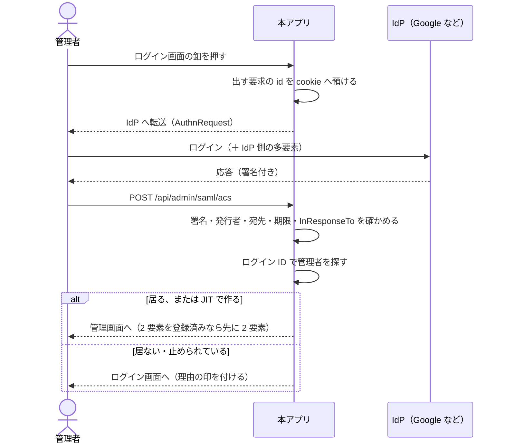

# SAML 認証 運用手順書

管理画面へ **SAML 2.0 のシングルサインオン**で入れるようにし、
管理画面から設定を変更する手順（Issue #166、#254、#423）。

**既定は無効。** 設定しなければ、これまでどおりログイン ID とパスワード（＋ 2 要素）だけになる。

- 実装: `src/VehicleVision.PleasanterTools.Questionnaire.Web/Services/SamlOptions.cs`、
  `Services/SamlOptionsProvider.cs`、`Services/SamlAuthenticator.cs`、
  `Endpoints/AdminSamlEndpoints.cs`
- 保存先: `src/VehicleVision.PleasanterTools.Questionnaire.Data/SamlSettingStore.cs`、
  `Migrations/M0024_SamlSettings.cs`
- 使っているライブラリ: [ITfoxtec.Identity.Saml2](https://github.com/ITfoxtec/ITfoxtec.Identity.Saml2)
  4.21.0（BSD-3-Clause。版は `Web` の `.csproj` と [`NOTICE`](../NOTICE)。2026-09-25 参照）

> **往復は CI で毎回確かめています**（Issue #190）。検証用の IdP（Keycloak）を
> `compose.yaml` の `saml` プロファイルで起こし、`SamlEndToEndTests` が
> **SP → IdP → SP の往復を通します。** 手元で確かめる手順は
> [`tools/saml-idp/README.md`](../tools/saml-idp/README.md)。
>
> **機械で押さえているのは 5 つ。**
>
> - 本アプリに居る人が IdP 経由で入れる
> - **本アプリに居ない人は拒絶される**（既定の `Reject`）
> - ⚠️ **2 要素が必須なら、SAML で来ても省略しない**
> - 途中を預ける cookie に `Secure` と `HttpOnly` が付く
> - 応答が無い要求では入れない
>
> ⚠️ **ただし Google Workspace そのものでは未検証です。**
> プロトコルの往復（署名の検証・`InResponseTo`・NameID の読み取り）は確かめましたが、
> **実際の IdP が属性をどう出すかは製品ごとに違います。**
> 本番へ入れる前に、その IdP で 1 回通してください。

## 1. できること

| 項目 | 内容 |
|---|---|
| 起点 | **SP 起動のみ**（本アプリのログイン画面の釦から始める） |
| 要求の送り方 | HTTP Redirect Binding（`AuthnRequest`） |
| 応答の受け方 | HTTP POST Binding（`/api/admin/saml/acs`。サブパス配置では `/questionnaire/api/admin/saml/acs` など。4.2 節） |
| 利用者の突き合わせ | **ログイン ID**（既定は `NameID`。属性からも取れる） |
| 未登録の利用者 | **拒絶**（既定）か **その場で登録**（JIT）を選べる |
| 単一ログアウト | **対応**（Issue #191）。`QUESTIONNAIRE_SAML_SINGLELOGOUTURL` を設定したときだけ使う。SP 起点・IdP 起点の両方を受ける |
| 設定の反映 | DB の設定は**再起動なし**で次の要求から反映する |
| 管理画面の入口 | `QUESTIONNAIRE_ADMIN_PATH` で変更できる。変更の反映にはアプリの再起動が必要 |
| 合言葉ログイン | `QUESTIONNAIRE_ADMIN_PASSWORD_SIGNIN=false` で SAML（または Pleasanter のログイン）の有効時だけ停止できる |
| 緊急時の入口 | `{管理画面の入口}?rescue={救済トークン}`。成功・失敗を監査し、5 分あたりのログイン試行上限と同じ回数に制限する |
| 設定できる人 | `Administrator` だけ。アンケートの権限とは別 |

### やり取りの流れ



## 2. 決めていること（変えないこと）

- ⚠️ **IdP の署名証明書は設定から与える。** メタデータの URL を渡して取りに行かせない。
  その URL を差し替えられた時点で、誰でも管理者になれてしまう
- ⚠️ **こちらが出していない応答（IdP 起動）は受け取らない。**
  出した要求の id を cookie へ預け、応答の `InResponseTo` と突き合わせる
- ⚠️ **2 要素の方針は SAML でも同じように効く**（`QUESTIONNAIRE_ADMIN_TWOFACTOR`）
    - **登録済みの人は、SAML で来ても 2 要素を通す。** IdP の多要素に任せきりにすると、
      登録済みの保護が弱くなる。**`disabled` でも省かない**
    - **`required` なら、SAML で来た人にも登録させる。**
      ここを抜け道にできると、IdP から入る限り必須の設定が効かない
- **JIT で作った利用者はパスワードを持たない。** 誰も知らない値を入れるので、
  パスワードのログインでは通らない
- **戻り先は管理画面の入口（`QUESTIONNAIRE_ADMIN_PATH`。サブパス配置ではサブパス込み）の下だけ**（オープンリダイレクトにしない。
  `Endpoints/AdminSamlEndpoints.cs` の `LocalReturnUrl`）
- **失敗の理由は画面へ返さない。** 決まった文言を出し、詳しい理由はサーバのログと
  操作の記録（`AuditLogs`）に残す
- **最初の管理者を作る画面には SAML の釦を出さない。**
  IdP から来た人を最初の管理者にすると、誰でも全権を取れる
- **ログイン ID とパスワードの入口は既定では残す。**
  `QUESTIONNAIRE_ADMIN_PASSWORD_SIGNIN=false` を外部設定へ明示した場合だけ、
  SAML の有効中は画面と認証 API の両方を塞ぐ
  （**Pleasanter のログイン（Issue #464）が有効な間も同じ。**[`Pleasanter-SSO-運用手順書.md`](Pleasanter-SSO-運用手順書.md) 6 章）
- ⚠️ **SAML が無効なとき（Pleasanter のログインも無効なとき）は、合言葉を塞ぐ指定を警告付きで無視する。**
  SAML は画面から再起動なしで無効にできるため、起動時の検証だけでは後から全員を
  締め出せる。認証手段が 1 つもない状態より復旧可能性を優先する
- **設定の変更は `AuditLogs` に残す。**
  証明書の本文は記録せず、`idpCertificate` を変更した事実だけを残す

### HTTPS が要る

やり取りの途中を預ける cookie は、IdP からの他サイト POST で戻ってくる必要があるため
`SameSite=None` にしている。**`SameSite=None` は `Secure` を伴わないとブラウザが捨てる**ので、
**SAML は HTTPS でしか動かない。** 手元で試すときは `https://localhost:8443` を使う。

## 3. 設定

### 3.1 設定を読む順序

次の順で、最初に値があるものを使う。

1. 環境変数、Key Vault、`App_Data/Parameters` などの**外部設定**
2. DB の `SamlSettings`
3. 既定値

外部設定で指定した項目は、管理画面に**「設定で固定されています」**と表示され、
編集できない。DB に保存済みの値は消さずに残るため、後で外部設定を外すと再び使われる。

⚠️ **既存環境の互換性を優先する。** これまでの環境変数を残したまま更新すれば、
DB の値より環境変数が優先され、動作は変わらない。

DB の保存先を作るため、更新後にマイグレーション 24 を適用する。
マイグレーションの実行方法は
[`データモデル設計.md`](データモデル設計.md) の「マイグレーション」を参照する。

### 3.2 管理画面から設定する

1. `Administrator` で管理画面へログインする
2. 上部の **SAML 設定**を開く
3. IdP の Entity ID、シングルサインオン URL、署名証明書などを入力する
4. 未登録利用者の扱いと、JIT 登録する場合の役割を確認する
5. 必要な場合は単一ログアウト URL も入力する
6. **保存する**を押す
7. 操作の記録で `PUT /api/admin/saml/settings` が成功していることを確認する

**保存した設定は再起動なしで反映される。** 有効化に必要な値が不足している場合や、
証明書・URL・列挙値を読めない場合は保存を拒否し、直前の設定を使い続ける。

⚠️ **合言葉を塞ぐ前に、SAML で実際に入り直せることを別のブラウザで確認する。**
`QUESTIONNAIRE_ADMIN_PASSWORD_SIGNIN=false` の状態で SAML 設定を壊すと、
**保存したその場で合言葉の入口も使えず、救済トークンがなければ詰む。**

### 3.3 外部設定で固定する

環境変数（または Key Vault）で固定する場合の一覧は
[`App_Data/Parameters/README.md`](../App_Data/Parameters/README.md)。

```bash
QUESTIONNAIRE_SAML_ENABLED=true
QUESTIONNAIRE_SAML_ENTITYID=https://questionnaire.example.jp
QUESTIONNAIRE_SAML_IDPENTITYID=https://accounts.google.com/o/saml2?idpid=XXXXXXXX
QUESTIONNAIRE_SAML_SINGLESIGNONURL=https://accounts.google.com/o/saml2/idp?idpid=XXXXXXXX
QUESTIONNAIRE_SAML_IDPCERTIFICATE="-----BEGIN CERTIFICATE-----
MIID...（IdP から落とした証明書をそのまま）
-----END CERTIFICATE-----"
# 単一ログアウト（任意）。**設定しなければ、これまでどおり本アプリの cookie を消すだけ**
QUESTIONNAIRE_SAML_SINGLELOGOUTURL=https://accounts.google.com/o/saml2/idp?idpid=XXXXXXXX
QUESTIONNAIRE_SAML_UNKNOWNUSER=Reject
QUESTIONNAIRE_SAML_BUTTONLABEL=会社アカウントでログイン
```

外部設定だけで `ENABLED=true` にしている従来構成では、足りない設定があると
**起動時に例外で止まる。** 管理画面から保存する場合は、保存時に同じ検証を行う。
どちらも「有効にしたつもりが効いていない」状態へ黙って落とさない。

### 3.4 合言葉ログインを塞ぐ

SAML でのログインを本番の IdP で確認してから、次を**外部設定**へ追加してアプリを再起動する。
管理画面の設定には出さない。

```bash
QUESTIONNAIRE_ADMIN_PASSWORD_SIGNIN=false
QUESTIONNAIRE_ADMIN_RESCUE_TOKEN={32文字以上の推測できない値}
```

`QUESTIONNAIRE_ADMIN_PASSWORD_SIGNIN` の既定は `true` で、未設定なら従来どおり
合言葉でもログインできる。`false` は **SAML か Pleasanter のログインが有効な間だけ**効く。両方とも無効なら、
全員を締め出さないため合言葉ログインを許可し、サーバログへ警告を出す。

#### 救済トークンを決めて保管する

救済トークンは**32文字以上**を必須とする。短い、人が考えた値、別サービスとの使い回しは避け、
32バイトの暗号学的乱数を Base64 にした値を使う。配布物では次のコマンドで生成できる。

```powershell
dotnet .\VehicleVision.PleasanterTools.Questionnaire.Web.dll --generate-secret-key
```

生成値は Azure Key Vault などの秘密管理基盤へ登録し、通常の IdP 管理者とは別に、
緊急対応を担う複数名が取り出せるようにする。リポジトリ、手順書、チケット、チャット、
平文の構成ファイルには控えない。秘密管理基盤そのものの障害に備える控えが必要な場合は、
組織の非常用資格情報と同じ暗号化・アクセス記録・定期棚卸しの対象にする。

#### IdP 障害時に救済する

```text
https://{本アプリのホスト}{QUESTIONNAIRE_ADMIN_PATH}?rescue={救済トークン}
```

一致すると URL から秘密を除いて管理画面へ転送し、そのブラウザに 10 分間だけ
合言葉の入口を出す。合言葉そのものと必要な 2 要素認証は省略しない。
未設定、32文字未満、不一致では入口を開かない。照合は固定時間で行う。

⚠️ **合言葉を塞いだ状態で IdP が停止すると、実行中のアプリにはこの逃げ道以外の
復旧手段がない。** 救済トークンを未設定にする運用では、IdP の復旧まで新しくログインできない。

URL はブラウザ履歴やリバースプロキシのアクセスログへ残る可能性があるため、
共有端末やチャット経由で使わない。使用後は `QUESTIONNAIRE_ADMIN_RESCUE_TOKEN` を新しい乱数へ
入れ替えて再起動し、古い値を失効させる。

救済の照合は、通常の管理画面表示や合言葉ログインを巻き込まない専用枠で制限する。
上限値は `QUESTIONNAIRE_LOGIN_ATTEMPTS_PER_5MIN` と同じで、送信元 IP ごとに 5 分間で数える。
専用枠にしたのは、救済トークンへの攻撃で通常のログインまで妨害されないようにするため。
成功・失敗はどちらも `AuditLogs` の対象 `AdminRescue` として残すが、
**問い合わせ文字列と救済トークンそのものは記録しない。**

### 未登録の利用者をどう扱うか

| 設定 | 振る舞い | 向く場面 |
|---|---|---|
| `Reject`（既定） | 本アプリに居ない利用者は通さない | **管理者を数人に絞る運用。** 追加は本アプリ側の招待で行う |
| `Register` | ログイン ID で管理者を作って通す | IdP 側のグループで「管理画面に入れる人」を管理している運用 |

⚠️ **`Register` を選ぶときは、IdP 側で本アプリへの割り当てを絞ること。**
組織全員へ配ったままにすると、**全社員が管理画面へ入れる。**
`QUESTIONNAIRE_SAML_REGISTERROLE` を `Administrator` にすると、その全員が全権を持つ。

### ログイン ID をどこから取るか

既定は `NameID` をそのまま使う。Google はここにメールアドレスを入れる。

属性から取りたいときは次のようにする。

```bash
QUESTIONNAIRE_SAML_LOGINIDSOURCE=Claim
QUESTIONNAIRE_SAML_LOGINIDCLAIM=login_id
```

⚠️ **突き合わせはログイン ID の文字列だけで行う**（DB へ列を足していない）。
**IdP 側でメールアドレスを変えると、本アプリでは別人になる。**
変えたときは、本アプリ側のログイン ID も合わせて直すこと。

## 4. 接続の試験と IdP へ登録する値

### 4.1 IdP メタデータの取得

SAML 設定画面の **接続の試験**へ IdP のメタデータ URL を入力し、
**メタデータを取得する**を押す。

この試験で行うのは次だけ。

- HTTP または HTTPS でメタデータを取得する
- 取得結果が SAML の `EntityDescriptor` または `EntitiesDescriptor` であることを確かめる
- `EntityDescriptor` に Entity ID があれば画面へ表示する

⚠️ **実際のログインは試さない。** IdP の画面へ移動しないため、設定画面から戻れなくならない。
取得の上限は 10 秒、XML は 1 MiB とし、外部実体や DTD は読まない。
また、接続試験を内部サービスの探索へ使わせないため、ループバック、プライベート、
リンクローカルなどの IP アドレスには接続せず、HTTP の転送も追わない。
**閉域内だけにある IdP はこの試験の対象外**だが、SAML ログイン自体にはこの制限を掛けない。

### 4.2 IdP へ登録する値

本アプリを起動してから、次の口が SP のメタデータを返す。

```text
GET https://{本アプリのホスト}/api/admin/saml/metadata
```

手で入力する IdP（Google など）には、次の 2 つを渡せばよい。

| 名前 | 値 |
|---|---|
| ACS URL（受け口） | `https://{本アプリのホスト}/api/admin/saml/acs` |
| Entity ID | `QUESTIONNAIRE_SAML_ENTITYID` に入れた値 |

`QUESTIONNAIRE_ADMIN_PATH` を変更しても、ACS URL は変わらない。変更されるのは SAML ログイン後の
管理画面への戻り先である。

⚠️ **`QUESTIONNAIRE_PATH_BASE`（サブパス配置。Issue #465）を設定すると ACS URL も変わる。**
`/questionnaire` なら `https://{本アプリのホスト}/questionnaire/api/admin/saml/acs` になり、メタデータも
`/questionnaire/api/admin/saml/metadata` から取る。前段のプロキシが `Host` を書き換える構成では
ACS URL が正しく組み立たない（[`サブパス配置-運用手順書.md`](サブパス配置-運用手順書.md) 3 章）。
リバースプロキシの経路変更などで外部から見える ACS URL も変える場合は、
**IdP 側へ登録した ACS URL も必ず変更する。** IdP 側が古い URL のままでは応答を受け取れない。

## 5. Google Workspace の設定例

出典: [独自のカスタム SAML アプリを設定する（Google Workspace 管理者ヘルプ）](https://knowledge.workspace.google.com/admin/apps/set-up-your-own-custom-saml-app)
（`https://support.google.com/a/answer/6087519` からの転送先。2026-09-09 参照）。
**画面の文言は変わることがあるので、実物に合わせて読むこと。**

1. Google 管理コンソール → **アプリ** → **ウェブアプリとモバイルアプリ**
2. **アプリを追加** → **カスタム SAML アプリを追加**
3. アプリ名（例: `アンケート管理画面`）を入れて次へ
4. **「Google IdP 情報」の画面で次を控える**
    - **SSO の URL** → `QUESTIONNAIRE_SAML_SINGLESIGNONURL`
    - **エンティティ ID** → `QUESTIONNAIRE_SAML_IDPENTITYID`
    - **証明書** をダウンロード（`.pem`）→ `QUESTIONNAIRE_SAML_IDPCERTIFICATE`
5. **「サービス プロバイダの詳細」**へ次を入れる
    - **ACS の URL**: `https://{本アプリのホスト}/api/admin/saml/acs`（サブパス配置ではサブパスを挟む。4.2 節）
    - **エンティティ ID**: `QUESTIONNAIRE_SAML_ENTITYID` と同じ値
    - **名前 ID の形式**: `EMAIL`
    - **名前 ID**: `基本情報 > メインのメール`
6. 属性のマッピングは**空でよい**（既定では `NameID` だけを使う）
7. アプリを保存したら、**アクセスを許す組織部門またはグループを絞る**
    - ⚠️ **`UNKNOWNUSER=Register` のときは、ここが実質の管理者名簿になる**
8. **「ユーザーアクセス」を「オン」にする。** 反映に数分掛かることがある

### 確かめること

1. 管理画面（既定は `/admin`。`QUESTIONNAIRE_ADMIN_PATH` で変えていればその入口）を開き、**「シングルサインオンでログイン」の釦が出ている**こと
2. 釦を押して Google のログインへ飛ぶこと
3. 戻ってきて管理画面に入れること（`Reject` のときは、
   本アプリ側に同じログイン ID の管理者を先に作っておく）
4. **本アプリに居ない利用者で試して、断られること**

## 6. うまくいかないとき

ログイン画面へ戻され、URL に `?samlError=...` が付く。

| 印 | 画面の文言 | 見るところ |
|---|---|---|
| `unknown-user` | 管理画面に登録されていません | `UNKNOWNUSER` の設定。ログイン ID が IdP の値と一致しているか |
| `disabled` | 利用を停止されています | 本アプリ側でその利用者を止めていないか |
| `invalid` | 完了できませんでした | **サーバのログを見る**（下記） |

`invalid` のときにログへ出る主な理由。

| ログ | 原因 |
|---|---|
| 対応する要求が見つかりませんでした | cookie が戻っていない。**HTTPS になっているか**、15 分以上掛かっていないか |
| こちらの出した要求のものではありませんでした | IdP 起動で来ている。本アプリのログイン画面から始めること |
| SAML の応答を受け取れませんでした | 署名が合わない（証明書が古い）／`EntityID` の食い違い／時刻のずれ |

⚠️ **証明書を入れ替えるときは、新旧 2 枚を並べて設定してから IdP を切り替えること。**
1 枚ずつ入れ替えると、切り替えの瞬間に誰も入れなくなる。
管理画面から変更した場合は、変更項目 `idpCertificate` が操作の記録に残る。

## 7. 手元で試す

`compose.yaml` の `saml` プロファイルに**検証用の IdP（Keycloak）**を入れてある。

```bash
DEV_SAML_ENABLED=true docker compose --profile sqlserver --profile saml up -d --wait
python tools/saml-idp/roundtrip.py admin@example.jp idp-test-password
```

**確かめた振る舞い**（2026-09-09）。

| 試したこと | 結果 |
|---|---|
| 本アプリに居る利用者 | 入れる（`role` と `permissions` が返る） |
| 本アプリに居ない利用者（`Reject`） | 入れない（`/admin?samlError=unknown-user`） |
| 本アプリに居ない利用者（`Register`） | `Editor` として作られて入れる |
| 2 要素が `required` | **入れない。** 途中状態になり登録を求められる |
| 送り付けられた応答（IdP 起動） | 断る（`samlError=invalid`） |
| 改ざんした応答（署名が合わない） | 断る（`samlError=invalid`） |

詳しくは [`tools/saml-idp/README.md`](../tools/saml-idp/README.md)。

## 8. まだやっていないこと

- ~~**単一ログアウト（SLO）**~~ — **対応した**（Issue #191）。
  ⚠️ **こちらからの要求に署名は付けない。** 署名を求める IdP と繋ぐには
  SP の秘密鍵が要るので、**その IdP では使えない**（設定しなければ従来どおり動く）
- **IdP 起動のログイン** — 受け取らない（上記の決めごと）
- **`AuthnRequest` への署名** — こちらの署名用証明書を持たせていない
- **Google Workspace そのものでの確認** — 未実施
  （プロトコルの往復は検証用の IdP で確認済み）
