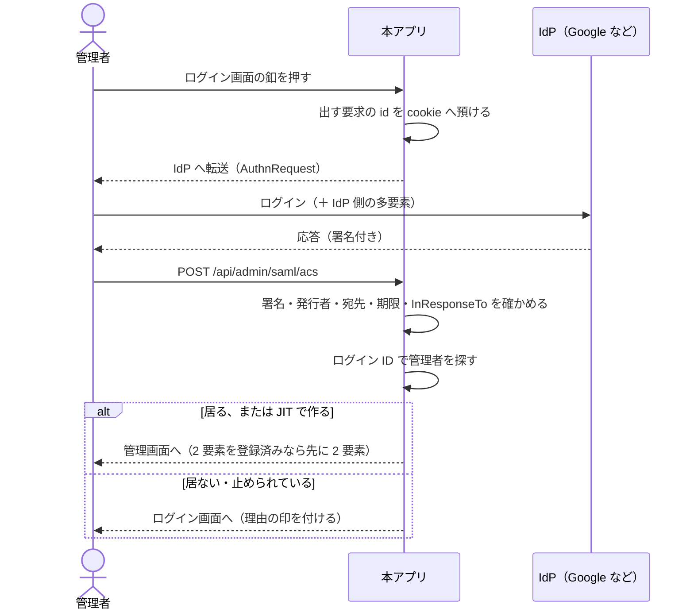

# SAML 認証 運用手順書

管理画面へ **SAML 2.0 のシングルサインオン**で入れるようにする手順（Issue #166）。

**既定は無効。** 設定しなければ、これまでどおりログイン ID とパスワード（＋ 2 要素）だけになる。

- 実装: `src/VehicleVision.PleasanterTools.Questionnaire.Web/Services/SamlOptions.cs`、
  `Services/SamlAuthenticator.cs`、`Endpoints/AdminSamlEndpoints.cs`
- 使っているライブラリ: [ITfoxtec.Identity.Saml2](https://github.com/ITfoxtec/ITfoxtec.Identity.Saml2)
  4.20.1（BSD-3-Clause。2026-09-09 参照）

> **⚠️ 実際の IdP との突き合わせは未検証です。**
> 手元に IdP を用意できていないため、署名の検証まで通した確認は行えていません。
> 本番へ入れる前に、検証環境で 1 回通してください。

## 1. できること

| 項目 | 内容 |
|---|---|
| 起点 | **SP 起動のみ**（本アプリのログイン画面の釦から始める） |
| 要求の送り方 | HTTP Redirect Binding（`AuthnRequest`） |
| 応答の受け方 | HTTP POST Binding（`/api/admin/saml/acs`） |
| 利用者の突き合わせ | **ログイン ID**（既定は `NameID`。属性からも取れる） |
| 未登録の利用者 | **拒絶**（既定）か **その場で登録**（JIT）を選べる |
| 単一ログアウト | **未対応**（本アプリのログアウトは本アプリの cookie だけを消す） |

### やり取りの流れ



## 2. 決めていること（変えないこと）

- ⚠️ **IdP の署名証明書は設定から与える。** メタデータの URL を渡して取りに行かせない。
  その URL を差し替えられた時点で、誰でも管理者になれてしまう
- ⚠️ **こちらが出していない応答（IdP 起動）は受け取らない。**
  出した要求の id を cookie へ預け、応答の `InResponseTo` と突き合わせる
- ⚠️ **本アプリ側で 2 要素を登録している人は、SAML で来ても 2 要素を通す。**
  IdP の多要素に任せきりにすると、登録済みの保護が弱くなる
- **JIT で作った利用者はパスワードを持たない。** 誰も知らない値を入れるので、
  パスワードのログインでは通らない
- **戻り先は `/admin` の下だけ**（オープンリダイレクトにしない）
- **失敗の理由は画面へ返さない。** 決まった文言を出し、詳しい理由はサーバのログと
  操作の記録（`AuditLogs`）に残す
- **最初の管理者を作る画面には SAML の釦を出さない。**
  IdP から来た人を最初の管理者にすると、誰でも全権を取れる

### HTTPS が要る

やり取りの途中を預ける cookie は、IdP からの他サイト POST で戻ってくる必要があるため
`SameSite=None` にしている。**`SameSite=None` は `Secure` を伴わないとブラウザが捨てる**ので、
**SAML は HTTPS でしか動かない。** 手元で試すときは `https://localhost:8443` を使う。

## 3. 設定

環境変数（または Key Vault）で与える。一覧は
[`App_Data/Parameters/README.md`](../App_Data/Parameters/README.md)。

```bash
QUESTIONNAIRE_SAML_ENABLED=true
QUESTIONNAIRE_SAML_ENTITYID=https://questionnaire.example.jp
QUESTIONNAIRE_SAML_IDPENTITYID=https://accounts.google.com/o/saml2?idpid=XXXXXXXX
QUESTIONNAIRE_SAML_SINGLESIGNONURL=https://accounts.google.com/o/saml2/idp?idpid=XXXXXXXX
QUESTIONNAIRE_SAML_IDPCERTIFICATE="-----BEGIN CERTIFICATE-----
MIID...（IdP から落とした証明書をそのまま）
-----END CERTIFICATE-----"
QUESTIONNAIRE_SAML_UNKNOWNUSER=Reject
QUESTIONNAIRE_SAML_BUTTONLABEL=会社アカウントでログイン
```

**足りない設定があるまま `ENABLED=true` にすると、起動時に例外で止まる。**
「有効にしたつもりが効いていない」を後から探さないようにするため、黙って無効へ落とさない。

### 未登録の利用者をどう扱うか

| 設定 | 振る舞い | 向く場面 |
|---|---|---|
| `Reject`（既定） | 本アプリに居ない利用者は通さない | **管理者を数人に絞る運用。** 追加は本アプリ側の招待で行う |
| `Register` | ログイン ID で管理者を作って通す | IdP 側のグループで「管理画面に入れる人」を管理している運用 |

⚠️ **`Register` を選ぶときは、IdP 側で本アプリへの割り当てを絞ること。**
組織全員へ配ったままにすると、**全社員が管理画面へ入れる。**
`QUESTIONNAIRE_SAML_REGISTERROLE` を `Administrator` にすると、その全員が全権を持つ。

### ログイン ID をどこから取るか

既定は `NameID` をそのまま使う。Google はここにメールアドレスを入れる。

属性から取りたいときは次のようにする。

```bash
QUESTIONNAIRE_SAML_LOGINIDSOURCE=Claim
QUESTIONNAIRE_SAML_LOGINIDCLAIM=login_id
```

⚠️ **突き合わせはログイン ID の文字列だけで行う**（DB へ列を足していない）。
**IdP 側でメールアドレスを変えると、本アプリでは別人になる。**
変えたときは、本アプリ側のログイン ID も合わせて直すこと。

## 4. IdP へ登録する値

本アプリを起動してから、次の口が SP のメタデータを返す。

```text
GET https://{本アプリのホスト}/api/admin/saml/metadata
```

手で入力する IdP（Google など）には、次の 2 つを渡せばよい。

| 名前 | 値 |
|---|---|
| ACS URL（受け口） | `https://{本アプリのホスト}/api/admin/saml/acs` |
| Entity ID | `QUESTIONNAIRE_SAML_ENTITYID` に入れた値 |

## 5. Google Workspace の設定例

出典: [独自のカスタム SAML アプリを設定する（Google Workspace 管理者ヘルプ）](https://knowledge.workspace.google.com/admin/apps/set-up-your-own-custom-saml-app)
（`https://support.google.com/a/answer/6087519` からの転送先。2026-09-09 参照）。
**画面の文言は変わることがあるので、実物に合わせて読むこと。**

1. Google 管理コンソール → **アプリ** → **ウェブアプリとモバイルアプリ**
2. **アプリを追加** → **カスタム SAML アプリを追加**
3. アプリ名（例: `アンケート管理画面`）を入れて次へ
4. **「Google IdP 情報」の画面で次を控える**
    - **SSO の URL** → `QUESTIONNAIRE_SAML_SINGLESIGNONURL`
    - **エンティティ ID** → `QUESTIONNAIRE_SAML_IDPENTITYID`
    - **証明書** をダウンロード（`.pem`）→ `QUESTIONNAIRE_SAML_IDPCERTIFICATE`
5. **「サービス プロバイダの詳細」**へ次を入れる
    - **ACS の URL**: `https://{本アプリのホスト}/api/admin/saml/acs`
    - **エンティティ ID**: `QUESTIONNAIRE_SAML_ENTITYID` と同じ値
    - **名前 ID の形式**: `EMAIL`
    - **名前 ID**: `基本情報 > メインのメール`
6. 属性のマッピングは**空でよい**（既定では `NameID` だけを使う）
7. アプリを保存したら、**アクセスを許す組織部門またはグループを絞る**
    - ⚠️ **`UNKNOWNUSER=Register` のときは、ここが実質の管理者名簿になる**
8. **「ユーザーアクセス」を「オン」にする。** 反映に数分掛かることがある

### 確かめること

1. 管理画面（`/admin`）を開き、**「シングルサインオンでログイン」の釦が出ている**こと
2. 釦を押して Google のログインへ飛ぶこと
3. 戻ってきて管理画面に入れること（`Reject` のときは、
   本アプリ側に同じログイン ID の管理者を先に作っておく）
4. **本アプリに居ない利用者で試して、断られること**

## 6. うまくいかないとき

ログイン画面へ戻され、URL に `?samlError=...` が付く。

| 印 | 画面の文言 | 見るところ |
|---|---|---|
| `unknown-user` | 管理画面に登録されていません | `UNKNOWNUSER` の設定。ログイン ID が IdP の値と一致しているか |
| `disabled` | 利用を停止されています | 本アプリ側でその利用者を止めていないか |
| `invalid` | 完了できませんでした | **サーバのログを見る**（下記） |

`invalid` のときにログへ出る主な理由。

| ログ | 原因 |
|---|---|
| 対応する要求が見つかりませんでした | cookie が戻っていない。**HTTPS になっているか**、15 分以上掛かっていないか |
| こちらの出した要求のものではありませんでした | IdP 起動で来ている。本アプリのログイン画面から始めること |
| SAML の応答を受け取れませんでした | 署名が合わない（証明書が古い）／`EntityID` の食い違い／時刻のずれ |

⚠️ **証明書を入れ替えるときは、新旧 2 枚を並べて設定してから IdP を切り替えること。**
1 枚ずつ入れ替えると、切り替えの瞬間に誰も入れなくなる。

## 7. まだやっていないこと

- **単一ログアウト（SLO）** — 本アプリのログアウトは本アプリの cookie だけを消す
- **IdP 起動のログイン** — 受け取らない（上記の決めごと）
- **`AuthnRequest` への署名** — こちらの署名用証明書を持たせていない
- **実機の IdP での確認** — 未実施
