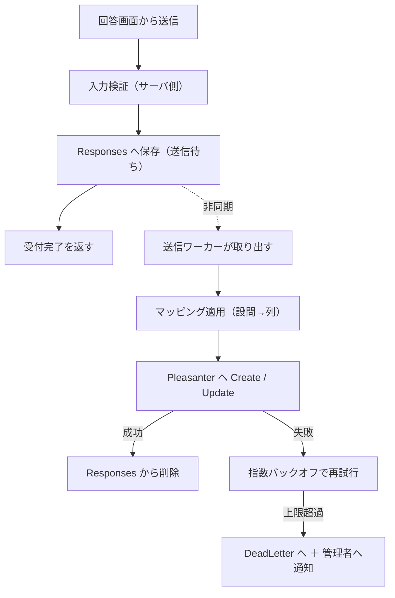

# アプリケーション設計

## 1. プロジェクト構成

ランタイムは Pleasanter に揃えて **.NET 10 / C#**、フロントは **TypeScript + Vite + Svelte + SCSS**
（[`アーキテクチャ方針.md`](アーキテクチャ方針.md) 13 章）。

| プロジェクト | 役割 |
|---|---|
| `.Web` | ASP.NET Core ホスト。回答画面・管理アプリ・API を配信 |
| `.Core` | ドメイン。設問モデル・マッピング・検証。**外部依存を持たない** |
| `.Data` | DB アクセス。3 RDBMS の方言差をここへ閉じ込める |
| `.Pleasanter` | Pleasanter 標準 API のクライアント |
| `.Worker` | 送信ワーカー |
| `.Frontend` | TypeScript + Vite + Svelte（回答画面・管理アプリ） |
| `tests/` | 単体・結合・3 RDBMS 統合 |

**`.Core` に DB も HTTP も持ち込まない。** マッピングと検証はここに集約し、
Pleasanter が無くても単体テストできる状態を保つ。

## 2. 処理の流れ



**受付完了を返すのは `Responses` へコミットした後。** ここより前で失敗したら、
回答者にエラーを返して再送してもらう。**コミット後は失われない。**

## 3. API

### 3.1 回答画面向け（認証なし）

| メソッド | パス | 用途 |
|---|---|---|
| `GET` | `/api/forms/{publicId}` | 公開中のアンケート定義（スナップショット）を返す |
| `GET` | `/api/forms/{publicId}/responses/{responseToken}` | 自分の回答を読む。**送信待ちを先に見る**（下記） |
| `PUT` | `/api/forms/{publicId}/responses/{responseToken}` | 回答を保存（新規・編集とも同じ） |

- **`responseToken` はブラウザが持つ。Pleasanter の `ReferenceId` は絶対に返さない**
- **読み出しは 2 段構え。** `Responses` に同じトークンがあればそれを返し、
  無ければ Pleasanter から `Get` する（[`アーキテクチャ方針.md`](アーキテクチャ方針.md) 10 章）
- 定義は `publicId` からスナップショットを引く。**下書きは絶対に返さない**

### 3.2 管理アプリ向け（認証あり）

アンケートの CRUD、設問・ページ・選択肢の編集、マッピングの編集、プレビュー、
公開・停止、送信待ちの状況、デッドレターの確認と手動再送、管理者の管理。

**認可は `AdminUsers.Role` だけで判定する。** Pleasanter のグループ・組織は参照しない
（[`アーキテクチャ方針.md`](アーキテクチャ方針.md) 11 章）。

## 4. Pleasanter クライアント

**API キーはサーバ側だけが持つ。** ログ・例外・キャッシュにフル値を残さない。

| 項目 | 方針 |
|---|---|
| 認証 | リクエストボディの `ApiKey`。**ヘッダ方式は無い** |
| タイムアウト | 設定で外部化（既定 30 秒） |
| 再試行 | **クライアント側では再試行しない。** 失敗は送信ワーカーの再送に委ねる |
| エラー分類 | 「一時的（再送する）」と「恒久的（デッドレター行き）」を分ける |

### エラーの分類

| Pleasanter の応答 | 分類 |
|---|---|
| 接続不可・タイムアウト・5xx | **一時的。** 再送する |
| 401（認証失敗） | **一時的として扱い、かつ管理者へ通知。** キーの失効・設定ミスは人が直す必要がある |
| 400（不正なデータ） | **恒久的。** 再送しても通らない。デッドレターへ |
| 403（権限なし） | **恒久的。** 設定ミス。デッドレター＋通知 |

**分類を誤ると、直らないものを延々と再送し続けるか、直るものを捨てる。**

## 5. 日時の扱い（実機検証の結論を実装へ）

**Pleasanter は日時をサーバの OS ローカル時刻で保存し、API 境界で
「API キー保有ユーザの `TimeZone`」との間で変換する**
（[`実機検証結果.md`](実機検証結果.md) 4 章。実測で確定）。

したがって実装は次を守る。

1. **アプリ内部は `DateTimeOffset` で扱う。** `DateTime` を素で持ち回らない
2. **Pleasanter へ渡す直前にだけ、「API キー保有ユーザの `TimeZone`」基準の値へ変換する。**
   変換は `.Pleasanter` の 1 か所に閉じ込める
3. **`TimeZone` の値は設定として明示し、起動時に実機と突き合わせて食い違いを検出する**
4. **未設定の日付は `1899-12-30T00:00:00` が返る。** 未回答は
   `DateTime.MinValue` を送って未設定へ戻す（[`実機検証結果.md`](実機検証結果.md) 9 章）。
   **`null` を送ると `400` で送信そのものが落ちる**

> **運用の制約として文書化すること。** API キー保有ユーザの `TimeZone` と、
> Pleasanter サーバの OS タイムゾーンは、**運用開始後に変更してはならない。**

## 6. 検証エンジン

**サーバとクライアントで同じ判定になること。** ずれると、画面では通るのに保存で弾かれる。

- **判定規則はスナップショットの定義から生成する。** 画面側とサーバ側で規則を二重に書かない
- **サーバ側の検証は必ず行う。** クライアント側は体験のためだけのもの
- 正規表現による検証は**実行時間の上限を設ける**
- **列の制約も検証に含める。** `Class` は 1024 文字、`Num` は `decimal(19,4)`
  （[`実機検証結果.md`](実機検証結果.md) 1 章）。溢れる値は保存前に弾く

## 7. マッピング実行エンジン

`MappingNodes` / `MappingEdges` を評価して、回答を Pleasanter の列の値へ変換する。

- ノードは `QuestionInput` / `Transform` / `Condition` / `ColumnOutput`
- **1 入力 → 複数出力を許す**（複数選択 → 複数のチェック列など）
- **評価は決定的にする。** 同じ回答からは常に同じ列の値が出ること
- **保存時に循環参照を検出して拒否する。** 実行時に無限ループさせない
- **未接続の出力列は「触らない」。** 空文字で上書きしない

### 添付ファイル

**`Upsert` のボディに Base64 で同梱できる**（実機で確認済み）。

```json
{ "AttachmentsHash": { "AttachmentsA": [
  { "Name": "a.txt", "Base64": "...", "Added": true, "ContentType": "text/plain" } ] } }
```

- `Get` で返るのは `Guid` / `Name` / `Size` のみ。**内容は `api/binaries/{guid}/get` 系で取る**
- **送信待ちの `PayloadJson` に Base64 が載る。** サイズ上限を決め、
  超える添付は受け付けない

## 8. 送信ワーカー（未確定 #3 の決着案）

**`.Web` に同居する Hosted Service として動かす。** 別プロセスにしない。

- Azure App Service で**別プロセスを常駐させる手段が限られる**ため
- **`Always On` を有効にすること。** 無効だとアイドルで停止して送信が止まる

### 排他

**DB のステータス更新で取る。** 外部のキュー基盤を持ち込まない。

1. `Status = Pending` かつ `NextAttemptAt <= 現在` の行を、
   **1 文で `Sending` ＋ `LockedBy` ＋ `LockedUntil` に更新して取得する**
2. 送信が成功したら削除、失敗したら `Pending` へ戻して `NextAttemptAt` を後ろへ
3. **`LockedUntil` を過ぎた `Sending` は `Pending` とみなす。**
   ワーカーが落ちても回答は失われない

**スケールアウトすると二重登録があり得る。** `Upsert` をやめたので冪等ではない
（[`アーキテクチャ方針.md`](アーキテクチャ方針.md) 9 章）。**排他は必須。**

### 再送の間隔

**指数バックオフ。** Pleasanter 復旧直後に溜まった分を一斉送信すると再び落とす。
同時送信数にも上限を設ける。
