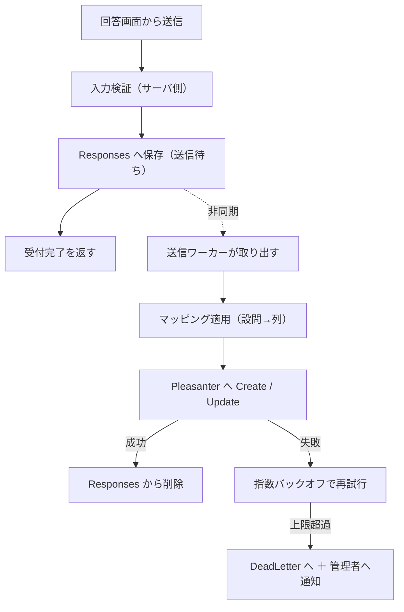

# アプリケーション設計

## 1. プロジェクト構成

ランタイムは Pleasanter に揃えて **.NET 10 / C#**、フロントは **TypeScript + Vite + Svelte + SCSS**
（[`アーキテクチャ方針.md`](アーキテクチャ方針.md) 13 章）。

| プロジェクト | 役割 |
|---|---|
| `.Web` | ASP.NET Core ホスト。回答画面・管理アプリ・API を配信 |
| `.Core` | ドメイン。設問モデル・マッピング・検証。**外部依存を持たない** |
| `.Data` | DB アクセス。4 RDBMS の方言差をここへ閉じ込める |
| `.Pleasanter` | Pleasanter 標準 API のクライアント |
| `.Worker` | 送信ワーカー（回答・メール・配布資料の受取履歴）と保持期限の掃除。**`.Web` の Hosted Service として動く**（8 章） |
| `.Mail` | メールの組み立てと送信（SMTP / Azure Communication Services / Amazon SES） |
| `.Scripting` | マッピングの変換 `script` を実行する（Jint） |
| `.Frontend` | TypeScript + Vite + Svelte（回答画面・管理アプリ） |
| `tests/` | プロジェクトごとの単体テスト（`.Core` / `.Mail` / `.Pleasanter` / `.Scripting` / `.Web` / `.Worker`）と、4 RDBMS へ当てる `.Integration.Tests` |

プロジェクトの一覧は `src/` と `tests/` の実物で確認した（2026-09-25）。
`.Mail` は `src/VehicleVision.PleasanterTools.Questionnaire.Mail/`（`SmtpMailTransport.cs` /
`AcsMailTransport.cs` / `SesMailTransport.cs`）、`.Scripting` は `JintScriptConverter.cs`。

**`.Core` に DB も HTTP も持ち込まない。** マッピングと検証はここに集約し、
Pleasanter が無くても単体テストできる状態を保つ。

## 2. 処理の流れ



**受付完了を返すのは `Responses` へコミットした後。** ここより前で失敗したら、
回答者にエラーを返して再送してもらう。**コミット後は失われない。**

## 3. API

### 3.1 回答画面向け（認証なし）

| メソッド | パス | 用途 |
|---|---|---|
| `GET` | `/api/forms/{publicId}` | 公開中のアンケート定義（スナップショット）を返す |
| `GET` | `/api/forms/{publicId}/responses/{responseToken}` | 自分の回答を読む。**送信待ちを先に見る**（下記） |
| `PUT` | `/api/forms/{publicId}/responses/{responseToken}` | 回答を保存（新規・編集とも同じ） |
| `POST` | `/api/forms/{publicId}/ticket` | 送信チケットを発行する。**アンケートの実在を見ない** |
| `POST` | `/api/forms/{publicId}/edit-link` | 再編集リンクのトークンを引き換える（Issue #202）。**トークンは本文で受ける** |
| `POST` | `/api/forms/{publicId}/asset-ticket` | 配布資産の引換券を引き換える（Issue #318） |
| `GET` | `/api/forms/{publicId}/header-image` | 公開中の版のヘッダ画像 |
| `GET` | `/api/forms/{publicId}/assets/{assetId}` | 公開中の版の本文が参照する自前資産 |

- **`responseToken` はブラウザが持つ。Pleasanter の `ReferenceId` は絶対に返さない**
- **読み出しは 2 段構え。** `Responses` に同じトークンがあればそれを返し、
  無ければ Pleasanter から `Get` する（[`アーキテクチャ方針.md`](アーキテクチャ方針.md) 10 章）
- 定義は `publicId` からスナップショットを引く。**下書きは絶対に返さない**

経路は `src/VehicleVision.PleasanterTools.Questionnaire.Web/Endpoints/FormEndpoints.cs`
112-398 行で確認した（2026-09-25）。

### 3.2 管理アプリ向け（認証あり）

アンケートの CRUD、設問・ページ・選択肢の編集、マッピングの編集、プレビュー、
公開・停止、送信待ちの状況、デッドレターの確認と手動再送、管理者の管理。

SAML・Pleasanter ログインの設定、アプリケーション設定、メンテナンスの切り替えも画面から行う。

**認可は `AdminUsers.Role` だけで判定する。** Pleasanter のグループ・組織は参照しない
（[`アーキテクチャ方針.md`](アーキテクチャ方針.md) 11 章）。
役割ごとの権限は `Web/Services/AdminPermissions.cs` の対応表で決める。

入口は `Web/Endpoints/Admin*Endpoints.cs` に分かれ、`/api/admin/...` の下に並ぶ
（`Program.cs` 966-990 行、2026-09-25 確認）。

### 3.3 管理画面へのログイン

ログインの方法は 3 つ。**どれで入っても本アプリの管理者（`AdminUsers`）へ結び付け、
本アプリのセッションを発行する。**

| 方法 | 入口 | 備考 |
| --- | --- | --- |
| 合言葉（ログイン ID ＋パスワード） | `POST /api/admin/login` | 2 要素（TOTP）は本アプリで持つ |
| SAML | `/api/admin/saml/...` | [`SAML認証-運用手順書.md`](SAML認証-運用手順書.md) |
| Pleasanter のログイン | `POST /api/admin/pleasanter-sso/check` | [`Pleasanter-SSO-運用手順書.md`](Pleasanter-SSO-運用手順書.md) |

**Pleasanter のログインは、ブラウザが持つ Pleasanter の cookie をサーバが Pleasanter の
標準 API（`/api/users/get` を `UserId=Own` で絞る）へ転送して本人を確かめる。**
Pleasanter 側に準備は要らない。**API キーはブラウザへ渡さない。**

- **本アプリと Pleasanter を同じホスト名で動かし、本アプリをサブパスに置くこと。**
  cookie はホスト名ごとにしか届かない
- 無効な間、確認の入口は 404 を返す。設定を画面から変えられるよう、経路は常に登録する
- **最初の管理者を Pleasanter から作らせない**（管理者が 0 人なら `409`）
- 利用者の API 利用が禁止されていて 403 が返ったときだけ、本アプリの API キーで確かめる
- 設定は `GET` / `PUT /api/admin/pleasanter-sso/settings`、接続の試験は
  `POST /api/admin/pleasanter-sso/settings/test`。**`settings.pleasanterSso` を持つ役割
  （`Administrator`）だけ**

実装根拠: `Web/Endpoints/AdminPleasanterSsoEndpoints.cs` 6-24、52-150、154-233 行、
`Web/Services/PleasanterSessionVerifier.cs` 58-81 行、`Web/Services/AdminPermissions.cs` 74-79 行
（2026-09-25 確認）。設定の置き場所は [`データモデル設計.md`](データモデル設計.md) 2.15。

### 3.4 画面の入口とサブパス

| 経路 | 返すもの |
| --- | --- |
| `/`・`/index.html`・`/f/{publicId}` | 回答画面の入口 HTML |
| `QUESTIONNAIRE_ADMIN_PATH`（既定 `/admin`）とその下 | 管理画面の入口 HTML |
| `/admin.html` | **404。** 管理画面の素の HTML は配らない |

- **入口の HTML は静的ファイルとして返さない。** `HtmlShell` が配置先の経路
  （サブパスと管理画面パス）を meta 要素へ埋めてから返す
- 画面は埋められたサブパスから API と画面の経路を組み立てる（`Frontend/src/lib/basePath.ts`）。
  **`/api/...` を直に書くと、サブパス配下では同じホストの Pleasanter へ要求が飛ぶ**
- サブパスは `QUESTIONNAIRE_PATH_BASE` で指定する（`PathBaseOptions.cs` 23 行、
  `PathBaseMiddleware.cs`）。置き方は [`サブパス配置-運用手順書.md`](サブパス配置-運用手順書.md)

実装根拠: `Web/Program.cs` 1009-1074 行、`Web/HtmlShell.cs`、`Web/AdminPathOptions.cs` 8-9 行
（2026-09-25 確認）。

## 4. Pleasanter クライアント

**API キーはサーバ側だけが持つ。** ログ・例外・キャッシュにフル値を残さない。

| 項目 | 方針 |
|---|---|
| 認証 | リクエストボディの `ApiKey`。**ヘッダ方式は無い** |
| タイムアウト | 設定で外部化（既定 30 秒） |
| 再試行 | **クライアント側では再試行しない。** 失敗は送信ワーカーの再送に委ねる |
| エラー分類 | 「一時的（再送する）」と「恒久的（デッドレター行き）」を分ける |

### エラーの分類

| Pleasanter の応答 | 分類 |
|---|---|
| 5xx・408・429 | **一時的。** 再送する |
| 接続不可・タイムアウト（応答が返らない） | **できたかどうか分からない。** 回答 JSON 列に埋めたトークンで照合してから、完了・再送・デッドレターを決める。回答 JSON 列が無ければ照合できないのでデッドレターへ |
| 401（認証失敗） | **一時的として扱い、かつ管理者へ通知。** キーの失効・設定ミスは人が直す必要がある |
| 400（不正なデータ） | **恒久的。** 再送しても通らない。デッドレターへ |
| 403（権限なし）・404 | **恒久的。** 設定ミス。デッドレター＋通知 |

分類は `Pleasanter/PleasanterApiClient.cs` 13-30、185-241 行、扱いは
`Worker/ResponseSender.cs` 150-232 行で確認した（2026-09-25）。
**デッドレターへ回すと必ず管理者への知らせ（`DeadLettered`）を積む。**

**分類を誤ると、直らないものを延々と再送し続けるか、直るものを捨てる。**

## 5. 日時の扱い（実機検証の結論を実装へ）

**Pleasanter は日時をサーバの OS ローカル時刻で保存し、API 境界で
「API キー保有ユーザの `TimeZone`」との間で変換する**
（[`実機検証結果.md`](実機検証結果.md) 4 章。実測で確定）。

したがって実装は次を守る。

1. **アプリ内部は `DateTimeOffset` で扱う。** `DateTime` を素で持ち回らない
2. **Pleasanter へ渡す直前にだけ、「API キー保有ユーザの `TimeZone`」基準の値へ変換する。**
   変換は `.Pleasanter` の 1 か所に閉じ込める
3. **`TimeZone` の値は設定として明示し、起動時に実機と突き合わせて食い違いを検出する**
4. **未設定の日付は `1899-12-30T00:00:00` が返る。** 未回答は
   `DateTime.MinValue` を送って未設定へ戻す（[`実機検証結果.md`](実機検証結果.md) 9 章）。
   **`null` を送ると `400` で送信そのものが落ちる**

> **運用の制約として文書化すること。** API キー保有ユーザの `TimeZone` と、
> Pleasanter サーバの OS タイムゾーンは、**運用開始後に変更してはならない。**

## 6. 検証エンジン

**サーバとクライアントで同じ判定になること。** ずれると、画面では通るのに保存で弾かれる。

- **判定規則はスナップショットの定義から生成する。** 画面側とサーバ側で規則を二重に書かない
- **サーバ側の検証は必ず行う。** クライアント側は体験のためだけのもの
- 正規表現による検証は**実行時間の上限を設ける**
- **列の制約も検証に含める。** `Class` は 1024 文字、`Num` は `decimal(19,4)`
  （[`実機検証結果.md`](実機検証結果.md) 1 章）。溢れる値は保存前に弾く

## 7. マッピング実行エンジン

公開版に固めた割り当て（`ColumnAssignments` / `AssignmentSources`。
[`データモデル設計.md`](データモデル設計.md) 2.4）を評価して、回答を Pleasanter の列の値へ変換する。

- **形は `Source(N) : Converter(0..1) : Target(1)` だけ。** 1 行が 1 列への割り当てになる
- 変換は `identity` / `join` / `map` / `toNumber` / `toCheck` / `contains` / `constant` /
  `coalesce` / `when` / `script`（`Core/Mapping/MappingEvaluator.cs` 8-51 行、2026-09-25 確認）。
  `script` は `.Scripting`（Jint）で実行する
- **1 つの設問を複数の割り当ての入力に使ってよい**（複数選択 → 複数のチェック列など）
- **評価は決定的にする。** 同じ回答からは常に同じ列の値が出ること
- **出力が 1 本に固定されているので、循環参照は構造的に起こらない。** 検出の仕組みは持たない
- **未接続の出力列は「触らない」。** 空文字で上書きしない

### 添付ファイル

**`Create` / `Update` のボディに Base64 で同梱する**（`Pleasanter/PleasanterRecordBuilder.cs`
162-218 行、2026-09-25 確認。実機では `Upsert` のボディで確認済み）。
**本アプリは `Upsert` を使わない**（8 章）。

```json
{ "AttachmentsHash": { "AttachmentsA": [
  { "Name": "a.txt", "Base64": "...", "Added": true, "ContentType": "text/plain" } ] } }
```

- `Get` で返るのは `Guid` / `Name` / `Size` のみ。**内容は `api/binaries/{guid}/get` 系で取る**
- **送信待ちの `PayloadJson` に Base64 が載る。** サイズ上限を決め、
  超える添付は受け付けない

## 8. 送信ワーカー（未確定 #3 の決着案）

**`.Web` に同居する Hosted Service として動かす。** 別プロセスにしない。

- Azure App Service で**別プロセスを常駐させる手段が限られる**ため
- **`Always On` を有効にすること。** 無効だとアイドルで停止して送信が止まる

### 排他

**DB のステータス更新で取る。** 外部のキュー基盤を持ち込まない。

1. `Status = Pending` かつ `NextAttemptAt <= 現在` の行を、
   **1 文で `Sending` ＋ `LockedBy` ＋ `LockedUntil` に更新して取得する**
2. 送信が成功したら削除、失敗したら `Pending` へ戻して `NextAttemptAt` を後ろへ
3. **`LockedUntil` を過ぎた `Sending` は `Pending` とみなす。**
   ワーカーが落ちても回答は失われない

**スケールアウトすると二重登録があり得る。** `Upsert` をやめたので冪等ではない
（[`アーキテクチャ方針.md`](アーキテクチャ方針.md) 9 章）。**排他は必須。**

### 再送の間隔

**指数バックオフ。** Pleasanter 復旧直後に溜まった分を一斉送信すると再び落とす。
同時送信数にも上限を設ける。
