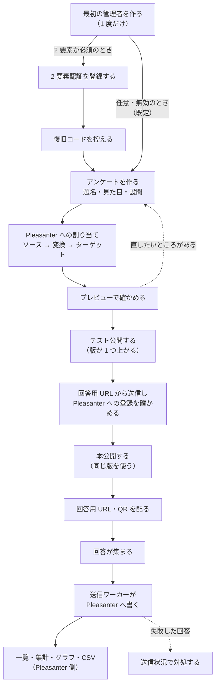
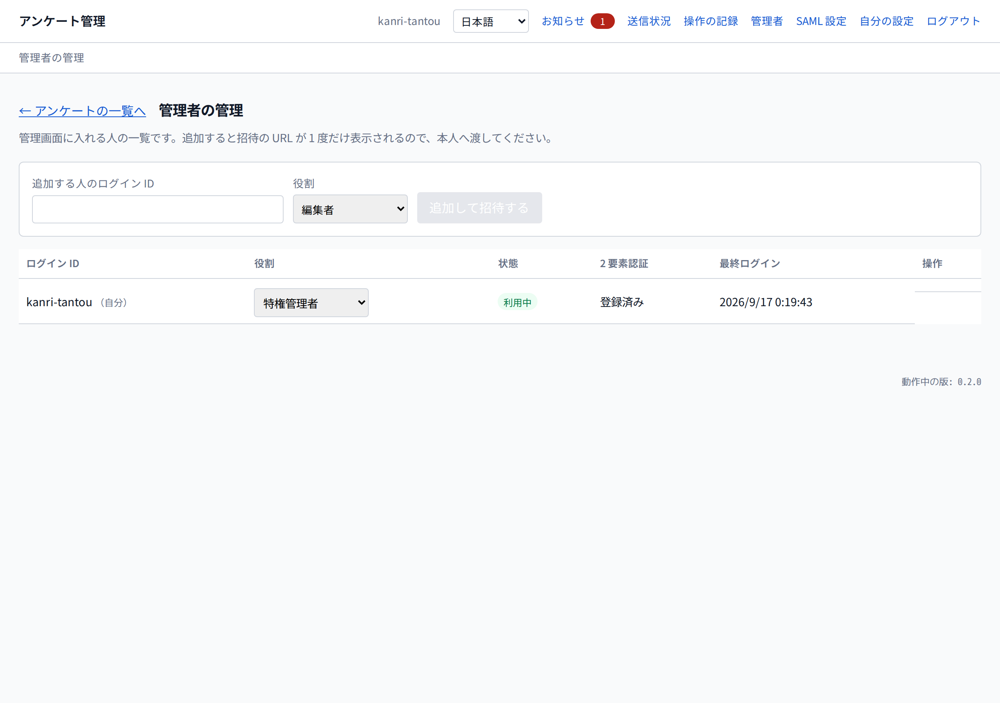
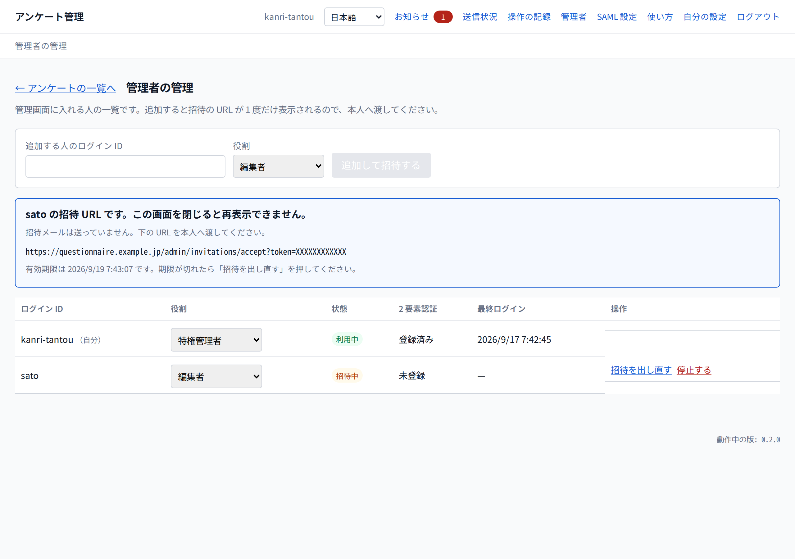
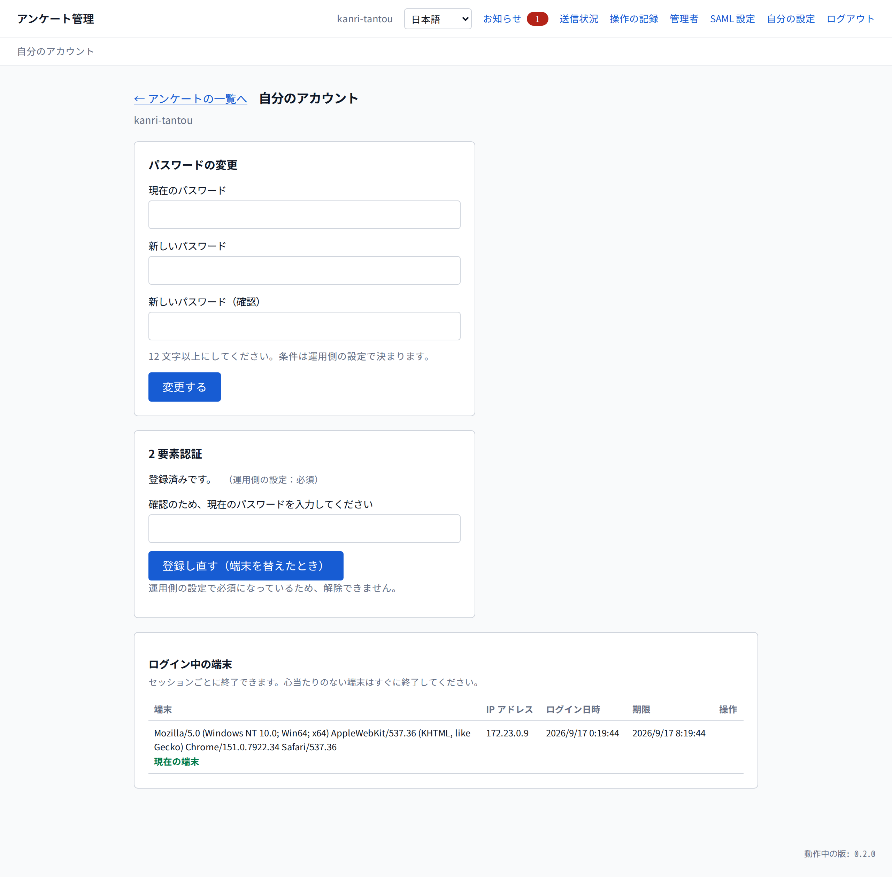
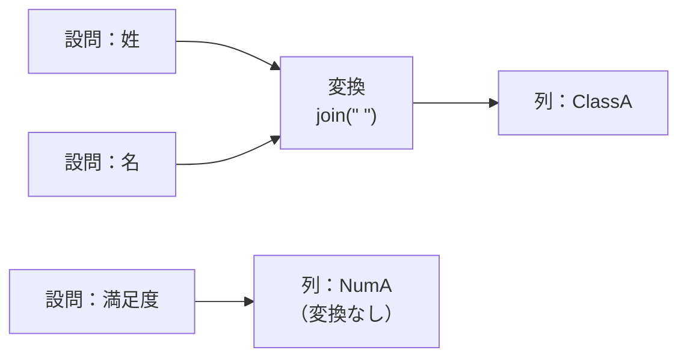

# アンケート作成-運用手順書

**アンケートを作って公開し、回答が Pleasanter に溜まるまでの手順。**
最初の管理者を作るところから順に書いてある。

- 対象は**アンケートを作る人**（管理者）。回答者に配る画面の見え方も併せて載せる
- **アプリの導入・更新・DB 作成は対象外。**
  [`導入-更新運用手順書.md`](導入-更新運用手順書.md)（Azure Web App／オンプレミス IIS）または
  [`AKS-導入更新運用手順書.md`](AKS-導入更新運用手順書.md) を先に済ませておくこと
- 画面の写しは [`tools/screenshots/shots/`](../tools/screenshots/shots/) のもの。
  **写しは Playwright で撮り直せる**（[`tools/screenshots/README.md`](../tools/screenshots/README.md)）

## 1. 前提

| 前提 | 内容 |
| --- | --- |
| Pleasanter | 動いていること。**本アプリは Pleasanter 本体を改造しない** |
| 回答の保存先 | **回答を溜める Pleasanter のサイト**（テーブル）を先に作っておくこと |
| API キー | Pleasanter 側で発行し、**本アプリの設定に入れておくこと**（サーバ側だけが持つ） |
| 権限 | API キーの利用者が、保存先サイトへレコードを作成・更新できること |

> **API キーはブラウザへ渡らない。** Pleasanter の API キーはリクエストボディに載せる方式のため、
> ブラウザから直接 Pleasanter を叩く構成は取れない
> （[`アーキテクチャ方針.md`](アーキテクチャ方針.md)）。

## 2. 全体の流れ



**設問の定義は本アプリの DB が持ち、回答は Pleasanter のレコードとして溜まる。**
集計機能は本アプリに無い（[13 章](#13-集計は-pleasanter-側で行う)）。

## 3. 最初の管理者を作る

**入口はここで一度きり。** 管理者が 1 人も登録されていないときだけ、この画面が出る。


1. ブラウザで `/admin` を開く
2. **ログイン ID** と **パスワード**を入れる
3. 「登録する」を押す

**パスワードの条件は運用側の設定で決まる**（`App_Data/Parameters/Security.json`）。
既定は **12 文字以上**で、**ログイン ID と同じ文字列は使えない**。
数字や記号を必須にしたいときは、正規表現の条件を有効にする（書き方は Pleasanter 本体と同じ）。

> **2 人目以降はこの画面から作れない。** 管理者の追加は、ログイン後の管理者管理から行う。
> 管理者の定期的な見直しは [`管理者の棚卸し-運用手順書.md`](管理者の棚卸し-運用手順書.md)。

### 3.1 2 要素認証を登録する

**登録するかは運用側の設定で決まる**（`QUESTIONNAIRE_ADMIN_TWOFACTOR`）。

| 設定 | 初期設定のとき | 後から |
| --- | --- | --- |
| `required`（必須） | **この画面が出る。登録するまで管理画面へ入れない** | 解除できない |
| `optional`（既定） | **この画面は出ない。** そのまま管理画面へ入る | 自分で登録・解除できる |
| `disabled`（無効） | 出ない | 登録できない |

⚠️ **`disabled` にしても、すでに登録している人からは 2 要素を外さない。**
設定 1 つで保護が消えると危ないため。外すときは自分で解除するか、
Administrator に解除してもらう。

以下は `required` の場合の画面。管理画面は全アンケートの定義と回答に触れるため、
**2 要素まで通さないと入れない。**

> **この手順書の図は `required` にした状態のもの。**
> 検証環境（`compose.yaml`）も `required` にしてある（Issue #172）。
> **既定の `optional` のままだと、この節と 3.2 は飛ばされ**、
> 最初の管理者を作った直後にアンケートの一覧へ入る。
> その場合でも、後から自分で登録できる。


1. 認証アプリで QR を読み取る（読み取れないときは、下に出ている文字列を手で入力する）
2. 「認証アプリに表示された 6 桁のコード」へ入力して「登録する」を押す

### 3.2 復旧コードを控える


- **この画面を閉じると二度と表示できない。** 端末を失ったときは、このコードでログインする
- **1 つにつき 1 回だけ使える**
- 控えたら「控えました」に印を付けて「管理画面へ進む」

## 4. ログインする

| 画面 | すること |
| --- | --- |
|  | ログイン ID とパスワードを入れる |
|  | 認証アプリの 6 桁の数字を入れる |

認証アプリが使えないときは、数字の入力画面から**復旧コードでのログイン**へ切り替えられる。

## 5. 管理者を増やす・自分の設定を変える

ヘッダの**「管理者」**と**「自分の設定」**から開く。
「管理者」は**管理者を扱う権限を持つ人だけ**に出る。

### 5.1 管理者の一覧



| 列 | 読み方 |
| --- | --- |
| 状態 | **利用中** / **招待中**（まだ受け取っていない） / **停止中** |
| 2 要素認証 | 登録済みか。**共有鍵そのものは誰にも見えない** |
| 最終ログイン | **止め忘れを見つける手掛かり。** 一度も入っていなければ「—」 |

**押せない操作は釦が出ない。**

- **自分自身は停止できず、自分の役割も変えられない**（手が滑ったときに戻せない）
- **最後の特権管理者は停止も降格もできない。**
  「最後」は**利用中で、かつ一度でもログインした人**で数える。
  **招待を出しただけの人は数えない**（その人はまだ入れないため）

### 5.2 管理者を追加して招待する

1. 「追加する人のログイン ID」と「役割」を入れて**「追加して招待する」**
2. **招待の URL が表示される。これを本人へ渡す**



⚠️ **URL が出るのはこの 1 回だけ。** 画面を閉じると再表示できない
（保存しているのは URL の中身のハッシュだけ）。
**閉じてしまったら「招待を出し直す」**を押す（**前の URL は使えなくなる**）。

> **ログイン ID がメールアドレスなら、招待メールを本人へ送る**（Issue #189）。
> 送れたかどうかは画面に出る。**送れていなければ、表示された URL を手で渡す。**
>
> 送られないのは次のいずれか。
>
> - サーバ側でメールが有効になっていない（`QUESTIONNAIRE_MAIL_ENABLED`）
> - メールに載せる URL の起点が未設定（`QUESTIONNAIRE_MAIL_BASEURL`）
> - ログイン ID がメールアドレスの形ではない
>
> 設定は [`導入-更新運用手順書.md`](導入-更新運用手順書.md) 3.2.1。

本人は URL を開き、**自分でパスワードを決めて**入る。
期限は既定で 48 時間。

### 5.3 端末を失った人を戻す

| 段階 | すること |
| --- | --- |
| 1 | 本人が**復旧コード**でログインする（[3.2](#32-復旧コードを控える)） |
| 2 | 復旧コードも尽きたら、**ほかの管理者が一覧から「2 要素認証を解除する」** |

⚠️ **解除は保護を外す操作。** 押す前に確認が出て、**操作の記録に残る**。
解除された人は、**次のログインで登録し直しになる**（2 要素が必須の設定のとき）。

### 5.4 自分のアカウント



- **パスワードの変更** — 現在のパスワードを合わせて入れる
- **2 要素認証** — 登録・**登録し直し**（端末を替えたとき）・解除
- **新しい回答のメール通知** — 受け取る本人が有効にする。**既定は無効**

**どの操作も現在のパスワードを聞かれる。**
離席した画面を使われただけで、保護を差し替えられないようにするため。

> **この図は 2 要素が「必須」の設定で撮っている**（[3.1](#31-2-要素認証を登録する)）。
> **必須のときは「解除する」の釦が出ない。**
> 「任意」にしていれば、ここから自分で解除できる。

### 5.5 新しい回答を知らせる

本番公開したアンケートへ新しい回答が来ると、管理画面の**「お知らせ」**へ表示される。
同じアンケートの未読通知は 1 行へまとまり、件数と最初・最後の受付時刻を確認できる。
**テスト回答と、送信済み回答の編集は件数へ加えない。**

メールでも受け取る場合は、**「自分の設定」**で
**「新しい回答をメールで受け取る」**を有効にする。

- 設定は管理者ごとで、**既定は無効**。受け取りたい本人だけが有効にする
- ログイン ID がメールアドレスで、サーバ側のメール送信が有効な場合に届く
- 回答が来るたびには送らず、**24 時間ごと**に未送信分をまとめる
- メールに載るのは**アンケート名・新しい回答の件数・集計期間**だけ
- ⚠️ **回答の中身はメールに載らない。** Pleasanter の権限で保護された画面から確認する
- メールを送れない構成でも、管理画面の「お知らせ」には表示される

## 6. アンケートを作る


一覧には**題名・状態・公開中の版・回答数・回答用 URL・更新日時**が出る。行ごとに次の操作ができる。

| 操作 | 内容 |
| --- | --- |
| 停止 | 受付を手で止める |
| QR コード | 回答用 URL の QR を出す |
| 公開設定 | 受付の開始・終了日時、回答数の上限、bot 対策の要否 |
| サイト ID を変更 | 下書き・テスト公開の書き込み先を変更する。送信待ちがある間と本公開後は変更できない |
| 複製 | 同じ定義を写して別のアンケートにする |
| テンプレートにする | 次に作るときの雛形にする |
| アーカイブ | 回答受付を止め、通常の一覧から畳む |
| 完全に削除 | アーカイブ済みを本アプリから削除する。`Administrator` だけ |

- **新しく作る**か、**テンプレート**から作る
- 通常はアンケートをアーカイブして残す。過去の回答を、当時の割り当てで解釈できるため
  （[`アーキテクチャ方針.md`](アーキテクチャ方針.md)）。一覧は題名と状態で絞り込める

### 6.1 設問エディタ


上から順に、次を設定する。

| 区画 | 設定するもの |
| --- | --- |
| 編集する言語 | 入力した文言がどの言語に入るか。**他の言語の文言はそのまま残る** |
| 題名・説明・送信後に出す文言 | 回答画面の見出しと、送信後の画面に出す文言 |
| 進捗バーを出す／送信後の編集を許す | 回答画面の振る舞い |
| 回答画面の見た目 | 強調の色・地の色・文字の色・書体・ヘッダ画像 |
| 設問 | 設問文・種類・必須・補足・選択肢・表示条件 |
| ページ | ページを足して区切る（改ページ）。ページごとに行き先を決められる |
| Pleasanter への割り当て | [7 章](#7-pleasanter-への割り当て) |

- **編集しても、テスト公開するまで実行へ影響しない。**
  テスト公開したときに版が 1 つ上がり、本公開ではその版をそのまま使う
- **ヘッダ画像は PNG・JPEG・GIF・WebP の 2 MB 以内。** 外部の URL は指定できない
- **書体は 4 種類ともアプリに同梱している**（ゴシック体・明朝体・丸ゴシック体・等幅）ので、
  回答者の端末に無くても同じ見た目になる
    - 外部から書体を読み込まないので、**インターネットへ出られない環境でも崩れない**
    - **等幅は日本語も等幅**になる

### 6.2 設問の種類

記述式・段落・単一選択・複数選択・プルダウン・尺度・星評価・日付・時刻・
選択グリッド・チェックボックスグリッド・ランキング・ファイル添付・説明文ブロック・
画像や動画の埋め込みが選べる（[`機能一覧.md`](機能一覧.md)）。

- **尺度は「NPS のかたちにする」で 0〜10 ＋両端の文言のプリセットになる**
- **説明文ブロックと埋め込みは、保存先の列を持たない**（表示だけ）
- **埋め込みの配信元は運用側の設定で絞る**（`QUESTIONNAIRE_EMBED_ALLOWEDHOSTS`。既定は空）

#### 6.2.1 自由入力を自動で変換する

記述式と段落では、回答の自動変換を設問ごとに設定できる。

| 設定 | 変換 | 用途の例 |
| --- | --- | --- |
| 英数字・記号 | 全角から半角 | 電話番号・郵便番号・メールアドレス・URL |
| カナ | 半角から全角 | 氏名・住所 |
| 空白 | 全角から半角 | 氏名の区切り |
| 前後の空白 | 取り除く | 貼り付け時に混ざった空白 |

- **4 つの設定は独立しており、既定はすべて無効。** 既存アンケートの回答を書き換えない
- 回答画面には自動変換することを表示し、入力欄から移動したときに見た目を揃える
- **受け付ける値はサーバが変換する。** 変換後にメール・URL・正規表現を検査し、
  変換後の値を回答 JSON と Pleasanter へ保存する
- 公開前に受け付けた回答は遡って変換しない
- NFKC は使わない。`㍿`、`①`、`Ⅳ`、`㎡` など、指定した範囲外の文字は変えない

実装根拠は `QuestionSettings.cs` 25-34 行、`AnswerNormalizer.cs` 8-125 行、
`ResponseIntake.cs` 292-356 行（2026-09-16 確認）。

### 6.3 選択肢は「見せる文字列」と「保存する値」を分ける

選択肢の欄は 2 つある。**左が回答画面に出る文字列、右が Pleasanter へ保存される値。**

| 画面に出る | 保存される |
| --- | --- |
| とても満足 | `very` |
| おおむね満足 | `ok` |
| あまり満足していない | `poor` |

- 「その他」に印を付けると、**選択肢＋自由記述**の 2 つを持つ選択肢になる
- 自由記述は、割り当ての入力の口で `OtherText` として選べる（[7.3](#73-入力の口)）

### 6.4 回答に応じて出し分ける

**本アプリの中心機能。** 2 通りある。

| やり方 | どこで設定するか | 効き方 |
| --- | --- | --- |
| **選んだときの行き先** | 選択肢ごと | その選択肢を選んだら、指定したページへ飛ぶ |
| **表示条件** | 設問ごと | 前の設問の回答に応じて、その設問を出す・出さない |

- **行き先は後ろのページだけ。** 前へ戻す指定はできない
- **表示条件に選べるのは、その設問より前にある設問だけ**
- **設問の順序のシャッフルは、表示条件を持つ設問があるページでは指定できない**
  （公開時に弾く。[`機能一覧.md`](機能一覧.md)）

### 6.5 終了したアンケートを畳む

**まずアーカイブして畳む。** 一覧から直接完全削除はできない。

1. 一覧で対象の「アーカイブ」を押す
2. **回答受付が停止する**という確認を読み、続ける
3. 通常の一覧から消えたことを確認する

確認や再利用が必要になったら「アーカイブ済みも表示」を選び、対象の「復元」を押す。
復元すると、アーカイブ前の公開状態へ戻る。アーカイブ中は回答用 URL を開けず、
下書き保存・テスト公開・本公開もできない。

通常は次のデータを残す必要があるため、アーカイブしたまま保管する。

- 公開時に固定した `SurveyVersions` は、過去の回答を当時の設問と割り当てで解釈するための
  **不変版**である
- `ResponseTokens` は送信後も残り、回答を編集するときに Pleasanter の
  `ReferenceId` を引くために要る
- Pleasanter 側の回答レコードは本アプリから消さないため、アンケートだけを消すと
  **Pleasanter に残った回答の出どころを辿れなくなる**
- 監査ログは操作の記録として残す

保管が不要になったアーカイブ済みアンケートは、`Administrator` が次の手順で完全削除できる。

1. 「アーカイブ済みも表示」を選ぶ
2. 対象の「完全に削除」を押す
3. 本番・テストを合わせた回答件数、Pleasanter サイト ID、アーカイブ日時を確認する
4. **Pleasanter 側の回答は残ること**と、削除後はその回答が何のアンケートだったかを
   本アプリから辿れないことを確認する
5. 対象の題名を入力し、「完全に削除する」を押す

⚠️ **送信待ちまたは送信中の回答・メールがある間は削除できない。**
送信の完了またはデッドレターへの移動を確認してからやり直す。デッドレターは完全削除に含まれる。
完全削除しても Pleasanter 側のレコードは消えない。必要な場合は、削除前に表示されたサイト ID を
使い、Pleasanter 側で別途削除する。完全削除の操作と削除前の識別情報は監査ログに残る。

アーカイブ済みの回答用 URL は、存在しない公開 ID と同じ応答になる。
停止中との違いを外部から判別させないためである。

## 7. Pleasanter への割り当て

**設問と Pleasanter の列は 1 対 1 ではない。** 設問（入力）を 1 つ以上選び、
必要なら変換をはさんで、**Pleasanter の列 1 本へ書く。**



| 形 | 意味 |
| --- | --- |
| 入力 1 つ・変換なし・出力 1 本 | そのまま写す |
| 入力 N 個・変換 1 つ・出力 1 本 | まとめて 1 本へ書く |

- **出力は必ず 1 本。** そのため循環参照も、同じ列への値の衝突も起こらない
- **入力が複数のときは変換が必須**（どうまとめるかが決まらないため）
- **1 つの設問を複数の列へ写すには、割り当てを列の数だけ並べる**

`Title`、`Body`、`Status`、`Manager`、`Owner`、`Locked` は Pleasanter レコード本体へ書く
特別な割り当て先として選べる。`StartTime`、`CompletionTime`、`WorkValue`、`ProgressRate`、
`RemainingWorkValue` は期限付きテーブルだけで選べる。

- `Status`、`Manager`、`Owner` には整数、`Locked` には `true` または `false`、
  `WorkValue`、`ProgressRate`、`RemainingWorkValue` には小数を出す割り当てだけを指定できる
- `Manager` と `Owner` は Pleasanter の**利用者 ID**。回答者が書いた氏名などの文字列は割り当てられない
- `StartTime` と `CompletionTime` は日時として扱い、日付列と同じ形式で変換される

> ⚠️ **`Title` は Pleasanter の一覧で見える。** 完全匿名のアンケートでは、氏名・メールアドレスなど
> 個人を特定し得る回答を `Title` へ割り当てないこと。

### 7.1 変換の種類

| 変換 | 何をするか | 設定 |
| --- | --- | --- |
| （変換なし） | そのまま写す | — |
| `join` | 入力を連結して 1 つにする | `separator` |
| `map` | 値を別の値へ置き換える | `map.{元の値}` |
| `toCheck` | 指定の値が含まれていれば `true` | `value` |
| `contains` | 指定の語を含む値があれば `true` | `keyword` |
| `constant` | 入力によらず決めた値を出す | `value` |
| `coalesce` | 空でない最初の値を出す | — |
| `when` | 一致する入力があれば A、無ければ B | `when` / `then` / `else` |
| `script` | JavaScript で自由に変換する | `script` |

根拠: [`src/VehicleVision.PleasanterTools.Questionnaire.Core/Mapping/MappingEvaluator.cs`](../src/VehicleVision.PleasanterTools.Questionnaire.Core/Mapping/MappingEvaluator.cs)
（`ConverterOperations`）。

### 7.2 スクリプト変換

**固定の変換だけでは足りないときの逃げ道。** `input`（文字列の配列）を受け取り、
`return` した値が列へ入る。

```js
// 空を除いて、大文字にして、スラッシュで繋ぐ
return input
  .filter(function (v) { return v !== ''; })
  .map(function (v) { return v.toUpperCase(); })
  .join(' / ');
```

- 返せるのは**文字列・数値・真偽値とそれらの配列**。
  `null` / `undefined` / 空配列は**値なし**（＝列を消す）になる
- **同じ回答からは常に同じ結果が出るようにしてある。**
  `Date` は `undefined`、`Math.random` は例外になる
- **上限が掛かる**（列 1 本あたり）

    | 上限 | 既定 | 設定名 |
    | --- | --- | --- |
    | 実行時間 | 200 ミリ秒 | `QUESTIONNAIRE_SCRIPT_TIMEOUT_MS` |
    | メモリ | 4 MiB | `QUESTIONNAIRE_SCRIPT_MEMORY_BYTES` |
    | 再帰の深さ | 64 段 | `QUESTIONNAIRE_SCRIPT_RECURSION_LIMIT` |

- **打ち切られた回答はデッドレターへ回る。** 黙って空の値は入らない（[11 章](#11-送信状況を見る)）

根拠: [`アーキテクチャ方針.md`](アーキテクチャ方針.md) 8 章、
[`src/VehicleVision.PleasanterTools.Questionnaire.Scripting/JintScriptConverter.cs`](../src/VehicleVision.PleasanterTools.Questionnaire.Scripting/JintScriptConverter.cs)。

### 7.3 入力の口

**設問の回答は 1 種類ではない。** 入力ごとに、どれを取るかを選ぶ。

| 口 | 中身 |
| --- | --- |
| 回答の値 | 回答そのもの |
| その他の自由記述 | 「その他」を選んだときに書かれた文字列 |
| 添付のファイル名 | 添付されたファイルの名前 |

**添付そのものは別枠。** 添付の設問 1 つを添付列へそのまま繋ぐ形で、変換は掛けられない。

### 7.4 列の本数に気を付ける

- **Pleasanter の標準の列は型ごとに 26 本**（`A`〜`Z`）。
  グリッドやランキングは **1 設問で行数ぶんの列を食う**
- **割り当ての画面に、型ごとの使用本数が出る**（例: `Class: 1 / 126 列`）。
  開いたときと「取り直す」を押したときに、書き込み先サイトの列定義から数える
- **Pleasanter へ接続できない・権限が無いときは、標準の型ごとに 26 列で数える。**
  この場合も編集は続けられ、画面に標準の本数を使っていることが出る
- **Enterprise の項目拡張で列を増やしてあれば、増えた列がそのまま候補に出る。**
  実機では `Class` が 126 本になっていた（[`実機検証結果.md`](実機検証結果.md) 1 章）
- **実際の列数を超えても止めない。** **知らせるだけにしてある**
   （[`画面設計.md`](画面設計.md)）
- **`Class` 列は 1024 文字が上限。** 複数選択を連結して 1 列へ入れる方式は、
  選択肢が多いと溢れる。**溢れは切らずに拒否する**
- レコード本体へ書く特別な割り当て先は、型ごとに 26 本の枠ではないため、使用本数に含まれない

### 7.5 回答 JSON 列を割り当てるかどうか

**回答そのものを JSON にして `Description` 系の列 1 本へ保存できる。**
これを**回答の正本**として扱い、他の列は集計用の派生値になる。

| 割り当てる | 割り当てない |
| --- | --- |
| **回答の編集ができる**（`join` のような戻せない変換を使っても、設問へ復元できる） | **回答の編集ができない** |
| `Description` 列を 1 本消費する | 列を設問へ全部使える |
| 回答内容が 1 列にまとまる | 個人情報を 1 か所へ集めない |

> ⚠️ **公開してから気付くと、既に集まった回答は編集できないまま。**
> 割り当てないときは、保存前に管理画面が「このアンケートは回答の編集ができません」と伝える。

## 8. プレビューで確かめる


- **回答画面と同じ描き方で、保存前の下書きを確かめられる。** 入力しても保存も送信もされない
- 「**入力して確かめる**」では、必須入力の確認を含めて**分岐も実際に辿れる。**「最初から」で先頭に戻る
- 「**デザインを確かめる**」では、ページ一覧から分岐先を含む全ページと「送信後」を直接開ける。送信後は確認文の記法と回答を編集する釦、別の回答を送信する釦も確かめられる。PC・タブレット・スマホの幅を選び、狭い幅での崩れも確認する
- 言語を切り替えて、他の言語の文言も確かめられる

### 8.1 自動返信メールを設定する（Issue #189）

**回答者へ「受け付けました」をメールで知らせる。既定では送らない。**

⚠️ **アンケートに「メールアドレス」の欄があるときだけ設定できる。**
宛先は回答から採るので、欄が無ければ有効にしても 1 通も出ない。

1. 設問を 1 つ足し、種類を**記述式（1 行）**、**入力の形式**を**「メールアドレス」**にする
2. 編集画面の「自動返信メール」で**「自動返信メールを送る」**を入れる
3. **宛先にする設問**を選び、**件名**と**本文**を書く
4. 必要なら**「本文のあとに回答の写しを付ける」**を入れる
5. **公開すると反映される**（件名と本文は定義の一部で、公開した版で固定される）

**件名と本文には差し込みを書ける**（Issue #209）。

| 書き方 | 差し込まれるもの |
| --- | --- |
| `{{title}}` | アンケートの題名（**回答者の言語のもの**） |
| `{{submittedAt}}` | 受付日時（**運用側の時間帯**。`QUESTIONNAIRE_PLEASANTER_TIMEZONE`） |

- **知らない差し込みはそのまま残る。** 書き間違いに気付けるようにしてある
- **初めて有効にしたときは雛形が入る。** 一度書き換えたものは上書きしない
- ⚠️ **題名を手で書かないこと。** 複製やテンプレートから作ると、
  **文面の中の題名だけ古いまま残る**

| 覚えておくこと | 内容 |
| --- | --- |
| 宛先を答えなかった人 | **送らない。** 宛先の設問を必須にするかは運用側で決める |
| 文面の言語 | **回答者が使っていた言語で送る。** 書いていない言語は日本語へ落ちる |
| 書式 | **付けられない。** 文字だけが送られる |
| 編集されたとき | **送り直さない。** 直すたびに同じ知らせが届かないようにしてある |

⚠️ **回答の写しを付けると、回答の中身がメールとして外へ出る。**
受け取るのは回答者本人だが、**経路が暗号化されているとは限らない。**

#### 回答を直すためのリンクを付ける（Issue #202）

**「本文のあとに、回答を直すためのリンクを付ける」**を入れると、
回答者が自分でやり直せる URL がメールに載る。

- **有効日数を決められる**（既定 7 日）。**受付期間の終了は超えない。**
  受付を停止すると、その時点で使えなくなる
- **期限内は何度でも開ける。** スマホで開いて後で PC で直せる
- **「回答の編集を許可する」が入っていないと設定できない**（公開のときに弾かれる）

⚠️ **このリンクを知っている人は、その回答を書き換えられる。**
転送された場合や共有メールボックスでは、**本人以外でも直せる。**
**そこは割り切っている**（完全匿名の公開フォームで、それ以上の本人確認をする前提が無い）。

**漏れたと分かったら「再編集リンクをすべて無効にする」**を押す。
これまでに送ったリンクが全部開けなくなる（**回答そのものは消えない**）。

> **サーバ側でメールが有効になっていないと、画面がそう伝える。**
> 設定だけ済ませて「送っているつもり」にならないようにしてある。

## 9. テスト公開してから配る

1. 設問エディタで「テスト公開する」を押す（版が 1 つ上がる）
2. 一覧で「テスト中」と表示された**回答用 URL**を開いて回答を送る
3. Pleasanter 側で、回答が意図したサイト・列へ登録されたことを確かめる
4. 必要なら「下書きへ戻す」で直し、もう一度テスト公開する
5. 問題が無ければ一覧で「本公開」を押す。**テストした版をそのまま使う**
6. 回答用 URL（`/f/{PublicId}`）を配る。QR コードも出せる
7. 受付の開始・終了日時、回答数の上限は「公開設定」で決める
8. 途中で止めるときは「停止」

テスト公開中の回答も実際に Pleasanter へ入る。管理画面では本番回答と分けて件数を示し、
本番の回答数上限には含めない。**本公開しても自動では削除しない。**
Pleasanter 側のテスト回答は、件数を確認して運用側が手で削除する。

Pleasanter のサイト ID は下書き・テスト公開の間だけ変更できる。
変更すると旧サイトを指すテスト回答の対応表を捨てるが、
**Pleasanter 側のレコードは削除されない。** 送信待ちが残っている間は変更できない。

> **回答用 URL に Pleasanter のサイト ID は出ない。** 推測できない乱数を使う
> （[`データモデル設計.md`](データモデル設計.md)）。

### 9.1 回答画面を他サイトへ埋め込む

1. 運用担当者が `QUESTIONNAIRE_EMBED_ALLOWEDPARENTS` に埋め込み先の親ホストを設定し、
   アプリを再起動する
2. アンケート一覧の「公開設定」で「回答画面を他サイトへの埋め込みで利用できるようにする」
   を有効にして保存する
3. 表示された貼り付け用コードを、そのまま親サイトへ貼る

`sandbox` は付けない。本アプリ自身の回答画面を出すものであり、回答送信などの動作を
不要に制限しないためである。タグには回答画面を識別する `title` と、画面外での読み込みを
遅らせる `loading="lazy"` が付く。貼り付け用コードには、回答画面の高さに合わせて
`iframe` の高さを自動調整するスクリプトも含まれる。

- スクリプトは本アプリと同じ生成元から、その `iframe` 自身が送った高さだけを受け入れる。
  高さは 10,000 px 以下に制限する
- `iframe` だけを貼っても回答画面は使える。その場合は高さ 800 px の枠内をスクロールする。
  親サイトの CSP などでインラインスクリプトを使えない場合も、この貼り方にできる
- 高さを親サイトへ知らせるだけであり、親サイトから回答画面を操作したり、親サイトの
  スクロール位置を動かしたりしない

⚠️ **埋め込みは HTTPS でのみ利用できる。** 回答送信に使う Cookie は
`SameSite=None; Secure` であり、平文 HTTP ではブラウザが送信しない。
`QUESTIONNAIRE_ALLOW_INSECURE` を有効にした開発・閉域環境では埋め込み回答は成立しない。

- 親ホストを設定しただけでは埋め込めない。アンケートごとの許可も必要
- アンケートごとの許可は公開し直さなくても直ちに反映される。止めるときは公開設定で無効にする
- 許可した親サイトが改ざんされると、回答画面をクリックジャッキングへ利用され得る。
  `QUESTIONNAIRE_EMBED_ALLOWEDPARENTS` には管理下のホストだけを書く

回答トークンと回答の下書きは、回答者のブラウザの Web Storage に保存する。
`iframe` の中では保存領域が**埋め込み元サイトごとに分かれる**ため、同じアンケートでも
埋め込み元が違えば別の端末のように振る舞う。直接開いた画面や別の親サイトで使った
前回の回答は引き継がれず、保存した下書きも見えない。消えたのではなく、
別の保存領域を参照しているため、同じ埋め込み元から開いて確認する。

## 10. 回答者に見える画面

| 画面 | 見え方 |
| --- | --- |
|  | 必須の設問には `*` が付く。ログインは要らない |
|  | 同じ画面が携帯でも並ぶ |
|  | 送信後に出す文言と、「回答を編集する」「別の回答を送信する」 |
|  | 受け付けていない URL では、理由を出さずにこの画面になる |

- **回答者の言語はブラウザの中だけで決まる**（URL の `?lang=` → ブラウザの言語設定 → 日本語）。
  サーバへ送らず、保存もしない（[`多言語対応方針.md`](多言語対応方針.md)）
- **「回答を編集する」は、回答 JSON 列を割り当てていて、かつ
  「送信後の編集を許す」にしているときだけ出る**（[7.5](#75-回答-json-列を割り当てるかどうか)）
- **下書き保存はアンケートごとに切り替える。既定は無効。**
  有効にしても**端末の中だけ**に置き、サーバへは送らない
- **テスト公開中は、回答画面と送信後の画面にテスト中であることを表示する。**
  URL は本公開と同じで誰でも開けるため、回答者にも状態を明示する

## 11. 送信状況を見る


**回答はいったん本アプリの DB へ受け、送信ワーカーが Pleasanter へ書く。**
Pleasanter が落ちていても回答は失われない。

| 見るところ | 意味 |
| --- | --- |
| 送信待ち | まだ Pleasanter へ届いていない件数と、最も古い滞留時刻 |
| 送信できなかった回答 | **再送の上限に達したもの（デッドレター）。自動では送り直さない** |
| 滞留による受付停止 | 滞留が上限を超えると受付を自動で止める。**追いつけば自動で受け付け直す** |
| 受け付けなかった添付 | ウイルス検査で弾いた記録 |

- **この画面に回答の中身は出さない。** 出るのは失敗の理由・滞留の状況・回答トークンまで
  （[`画面設計.md`](画面設計.md)）
- デッドレターは、**原因を直してから**手で送信待ちへ戻す

## 12. 操作の記録を見る


- 管理画面で行われた操作（日時・実行者・操作・結果・対象・送信元）が残る
- **この一覧を開いたことは記録されない。** 記録は一定期間を過ぎると自動で消える
- 実行者・期間で絞り込める。「断られた操作だけ」に絞れる

## 13. 集計は Pleasanter 側で行う

**本アプリに集計機能は無い。** 回答は Pleasanter のレコードとして溜まるので、
**一覧・集計・グラフ・CSV エクスポートは Pleasanter の機能を使う。**

> **この線を越えると、Pleasanter をバックエンドにする意味が薄れる**
> （[`機能一覧.md`](機能一覧.md) 6 章）。

⚠️ **Pleasanter 上でレコードを直接書き換えても、本アプリ側の解釈は変わらない。**
回答の正本は JSON 列（割り当てている場合）であり、他の列は派生値である。

## 14. 困ったとき

| 症状 | 見るところ |
| --- | --- |
| 回答が Pleasanter に出てこない | **送信状況**（[11 章](#11-送信状況を見る)）。送信待ちに溜まっていないか、デッドレターに落ちていないか |
| デッドレターが増える | 割り当ての不備（型が合わない・桁溢れ・スクリプトの打ち切り）。割り当てを直してから送信待ちへ戻す |
| 回答用 URL が開けない | 受付期間・手動停止・回答数の上限・滞留による自動停止のいずれか。**回答者には理由を出さない** |
| 列が足りない | 割り当ての画面の残り本数を見る。Pleasanter サイト側の項目拡張で増やす（[7.4](#74-列の本数に気を付ける)） |
| 回答者が編集できない | 回答 JSON 列を割り当てているか、「送信後の編集を許す」になっているか（[7.5](#75-回答-json-列を割り当てるかどうか)） |
| 2 要素認証の端末を失った | 復旧コードでログインする（[3.2](#32-復旧コードを控える)）。**使い切ったら、ほかの管理者に一覧から解除してもらう**（[5.3](#53-端末を失った人を戻す)。解除は記録に残る） |
| 管理者が誰も入れない | [`管理者の棚卸し-運用手順書.md`](管理者の棚卸し-運用手順書.md) |

## 15. 関連文書

| 文書 | 内容 |
| --- | --- |
| [`機能一覧.md`](機能一覧.md) | 設問形式・オプションの一覧と、対応の範囲 |
| [`画面設計.md`](画面設計.md) | 各画面が何を出すか、なぜそう出すか |
| [`アーキテクチャ方針.md`](アーキテクチャ方針.md) | 割り当ての構造、変換、回答の正本の考え方 |
| [`データモデル設計.md`](データモデル設計.md) | 版管理、公開 ID、DB スキーマ |
| [`非機能設計.md`](非機能設計.md) | bot 対策・添付検査・レート制限 |
| [`導入-更新運用手順書.md`](導入-更新運用手順書.md) | 導入・設定・更新・ロールバック |
| [`添付ファイル検査-運用手順書.md`](添付ファイル検査-運用手順書.md) | ウイルス検査の構成と運用 |
| [`管理者の棚卸し-運用手順書.md`](管理者の棚卸し-運用手順書.md) | 管理者アカウントの定期見直し |
