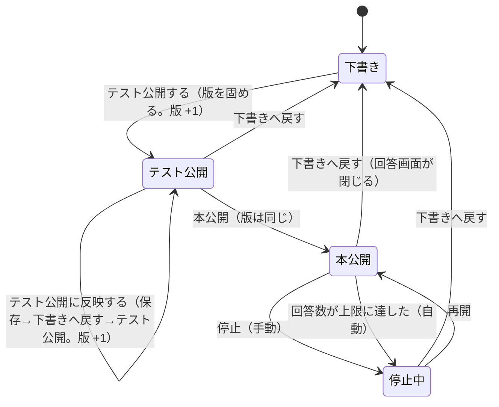
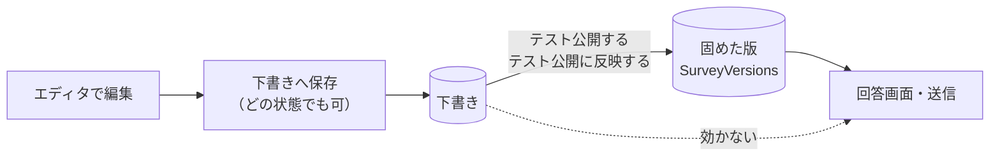
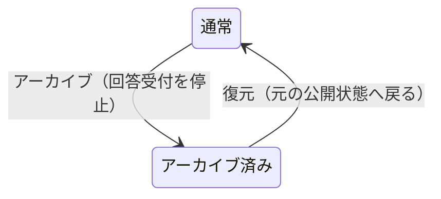

# アンケート公開状態フロー

アンケートの公開状態と、編集・公開・停止・アーカイブの関係。
**「編集したのに回答画面へ効かない」を防ぐための、状態ごとの動きの一覧。**
操作の画面設計は [`画面設計.md`](画面設計.md)、列の定義は [`データモデル設計.md`](データモデル設計.md)。

> 根拠は 2026-10-10 時点のソース（行番号は同日のもの）。
> 画面は実機で確かめていない。

## 1. 要点

- **編集は常に「下書き」へ保存される。** 回答画面が読むのは、公開時に固めた**版（スナップショット）**だけ
- **版は不変。** 編集を回答画面へ効かせるには、版を固め直す（= 下書きへ戻して、テスト公開し直す）
- **本公開は版を作らない。** テスト公開で固めた版を、そのまま使う
- **アーカイブは公開状態とは別軸。** どの状態にも重なる

## 2. 状態

| 状態 | 値 | 回答画面 | 回答が読む版 |
| --- | --- | --- | --- |
| 下書き（`Draft`） | 0 | 開けない | なし（`PublishedVersion` が空、または前回の版） |
| 本公開（`Published`） | 1 | 開ける | 固めた版 |
| 停止中（`Suspended`） | 2 | 受け付けない | 固めた版 |
| テスト公開（`TestPublished`） | 3 | 開ける（**「テスト公開中」と常に表示**） | 固めた版 |

停止中の理由は `SuspendedReason` に残る（`Manual` = 手で停止 / `ResponseLimitReached` = 回答数上限で自動停止）。

## 3. 状態遷移

| 操作 | 画面の場所 | API | 元の状態 | 先の状態 | 版 |
| --- | --- | --- | --- | --- | --- |
| テスト公開する | エディタ | `POST /{id}/test-publish` | 下書きだけ | テスト公開 | **+1** |
| テスト公開に反映する | エディタ | 保存 → `revert-to-draft` → `test-publish` | テスト公開 | テスト公開 | **+1** |
| 下書きへ戻す | 一覧・エディタ | `POST /{id}/revert-to-draft` | テスト公開・本公開・停止中 | 下書き（停止の理由は消す） | 変わらない |
| 本公開 | 一覧 | `POST /{id}/publish` | テスト公開だけ | 本公開 | **変わらない** |
| 停止 | 一覧 | `POST /{id}/suspend` | 本公開だけ | 停止中（`Manual`） | 変わらない |
| 再開 | 一覧 | `POST /{id}/resume` | 停止中だけ | 本公開 | 変わらない |

- **元の状態が違えばサーバは `InvalidSurveyStatus` で断る。**
  画面は、押せる操作だけを出す（エディタ: 下書きは「テスト公開する」、テスト公開は「テスト公開に反映する」、
  本公開・停止中は「下書きへ戻す」）
- **再開は上限に達したままでは断る。** 再開しても最初の回答で再び自動停止するだけなので、先に上限を上げる
- **テンプレートには状態が無い。** 公開も停止もできない

## 4. 編集はどこへ効くか

- 下書きの保存は、アーカイブ済み以外のどの状態でも通る。**通っても、固めた版には効かない**
- そのため、下書き以外のエディタには「編集は下書きに保存されるだけで、公開中の版には反映されない」と常に表示する
- **本公開中・停止中からも「下書きへ戻す」で直せる**（Issue #542）。
  戻すと**回答画面は閉じる**（下書きは受け付けないため）。固めた版は消えず、
  直して再度テスト公開 → 本公開すると次の版ができる。画面は確認を挟む
- **過去の版へ戻す操作と、編集の undo / redo は無い。**
  `SurveyVersions` に版は残るが、管理画面にも API にも、版の一覧・参照・復元の口は無い
  （2026-10-10 に管理画面の `src` とエンドポイントを検索して確認。未対応）。
  エディタの保護は、未保存の変更があるときの離脱確認と、保存の競合検出（`revision`）だけ

## 5. 状態ごとに変えられるもの

| 項目 | 下書き | テスト公開 | 本公開・停止中 |
| --- | --- | --- | --- |
| 下書きの保存 | 可 | 可（版には効かない） | 可（版には効かない） |
| Pleasanter サイト ID の変更 | 可（本番の回答が無いとき） | 可（同左） | **不可** |
| 回答の受付 | しない | する（**テスト回答として別集計**） | 本公開のみする |

- **サイト ID の変更は、送信待ちがあればサーバが拒否する**（どのサイトへ送るかが決まらないため）
- **本番の回答が 1 件でもあれば、下書きへ戻した後でも変更できない。**
  回答の対応表が旧サイトのレコードを指したままになり、次の編集が新サイトの別のレコードを更新するため
- **テスト回答は回答数上限と滞留監視から外す。** Pleasanter 側のレコードは運用側が手で消す

## 6. アーカイブ（別軸）

- アーカイブ済みは、保存・テスト公開・本公開・停止・再開のすべてを断る
- 回答画面では、存在しない公開 ID と同じ画面にする（実在を推測させない）
- 完全削除はアーカイブ済みだけ。`Administrator` が題名を入力して行う

## 7. 根拠

| 内容 | 場所 |
| --- | --- |
| テスト公開は下書きだけ | `AdminSurveyEndpoints.cs:916`（判定は 955） |
| 本公開は版を作らず、テスト公開だけ受け付ける | `AdminSurveyEndpoints.cs:1150`（判定は 1168） |
| 下書きへ戻すはテスト公開だけ | `AdminSurveyEndpoints.cs:1190`（判定は 1208） |
| 停止・再開と、上限到達時の再開拒否 | `AdminSurveyEndpoints.cs:1586` |
| 回答数上限による自動停止 | `SurveySnapshotStore.cs:457` |
| サイト ID の変更は下書き・テスト公開だけ | `SurveySnapshotStore.cs:507` |
| 下書きの保存はアーカイブ済み以外で通る | `AdminSurveyEndpoints.cs:563` |
| 下書きの取得応答に `status` を含める | `SurveyDraftStore.cs`（`SurveyDraft.Status`） |
