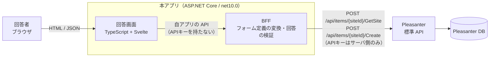
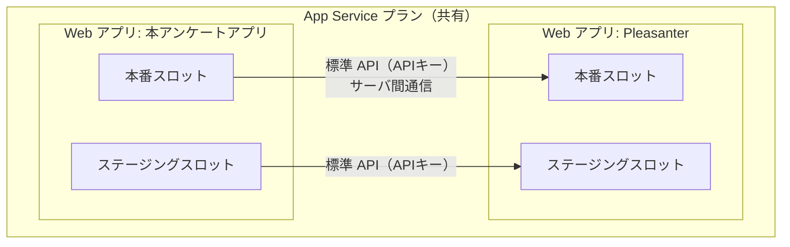

# アーキテクチャ方針

Pleasanter をバックエンドにした Web アンケート・Web フォームアプリの構成方針。

**この文書の Pleasanter に関する記述は、`_reference/Implem.Pleasanter`（`Pleasanter_1.5.7.0` /
`870a56ae` / 2026-08-12）の実ソースを根拠にしている。** 根拠のファイルパスを各節に記載する。
実機の応答で確認すべき点は「未確定事項」にまとめる。

## 1. 目的とスコープ

- 回答画面は **Google Forms / Microsoft Forms に近い見た目・操作感**にする
- **アンケートの項目定義（設問・選択肢・必須有無）は Pleasanter 側のサイト設定で行う。**
  本アプリに独自のフォーム定義を持たない
- **回答データは Pleasanter のレコードとして蓄積する。** 集計・エクスポートは Pleasanter の機能を使う
- **Pleasanter 本体は改造しない。** 標準 API を利用する独立したアプリとして作る

### 決定事項（2026-08-18）

| 論点 | 決定 |
|---|---|
| アンケートとサイトの対応 | **1 アンケート = 1 Pleasanter サイト** |
| 回答者の認証 | **完全匿名。** URL を知っていれば誰でも回答できる |
| 配置 | **同一 App Service プラン上に Web アプリをもう 1 つ**（デプロイスロットではない） |

**1 アンケート = 1 サイト**にしたことで、サイトの `SiteSettings` がそのまま 1 枚のフォーム定義になる。
本アプリ側に「どの列がどのアンケートの設問か」を判定する仕組みを持たなくてよい。
回答用 URL は 1 サイトに 1 本を割り当てる（URL にサイト ID を素で出すかは 3 章の「要検討」）。

## 2. 全体構成

**要点は「ブラウザから Pleasanter を直接叩かせない」こと。** 理由は次節。

## 3. API キーの受け渡し方式（BFF が必須になる理由）

Pleasanter の API キーは **リクエストボディの JSON に `ApiKey` として載せる**方式である。

- 根拠: `Implem.Pleasanter/Libraries/Requests/Context.cs`（`SetUserProperties`）
  — リクエストボディを `Api` として解釈し、`ApiKey` が空でなければ
  `Rds.UsersWhere().ApiKey(ApiKey)` でユーザを特定している
- `X-API-Key` や `Authorization: Bearer` といった**ヘッダ方式は実装されていない**
  （`Libraries/Requests/` と `Filters/` を検索して該当なし）

したがって：

- **API キーを持つのはサーバ側だけ。** ブラウザへ配布する設計は取れない
- 匿名の回答者からの投稿は、**本アプリのサーバが Pleasanter 用の資格情報を代理保持**して中継する
- API キーは設定ファイルへ直書きせず、環境変数または Azure Key Vault から読む。
  ログ・例外・キャッシュにフル値を残さない

### 帰結：回答者の記録のされ方

代理投稿になるため、**Pleasanter 上の作成者（`Creator`）は API キーの持ち主に固定される。**
全レコードが同じ利用者の作成物として並ぶことになる。

**回答者は完全匿名とする**（決定事項）。したがって、

- **回答者の識別が要る場合は、氏名・メールなどを「設問」としてサイト設定側に置く。**
  本アプリは認証を行わず、回答者を特定しない
- **重複回答は防げない。** 同じ人が何度でも投稿できる。防ぎたくなった場合は、
  回答用 URL に一意のトークンを持たせる方式への変更が必要になる
- 回答画面の URL は**推測されにくいものにする。** サイト ID を素で晒すと、
  URL を総当たりされたときに他のアンケートへ到達し得る

> **要検討。** URL の秘匿方法（サイト ID を直接使うか、別の公開用 ID を割り当てるか）は
> 実装時に決める。「未確定事項」参照。

## 4. フォーム定義の取得

`POST /api/items/{siteId}/GetSite` の応答に **`SiteSettings` がそのまま含まれる。**

- 根拠: `Implem.Pleasanter/Controllers/Api/ItemsController.cs`（`GetSite`）→
  `ItemModel.GetByApi(referenceType: "Sites")`
- 根拠: `Implem.Pleasanter/Models/Sites/SiteApiModel.cs` — `public SiteSettings SiteSettings { get; set; }`

`SiteSettings.Columns`（`Implem.Pleasanter/Libraries/Settings/Column.cs`）から、回答画面の
コントロールを組み立てる。

| Column のプロパティ | 用途 |
|---|---|
| `ColumnName` | 送信時のキー |
| `LabelText` | 設問文 |
| `Description` | 設問の補足説明 |
| `ControlType` | コントロール種別（`ChoicesText` / `Attachments` など） |
| `ChoicesControlType` | 選択肢の表示形式（既定は `DropDown`。`Radio` などを取り得る） |
| `MultipleSelections` | 複数選択の可否 |
| `ChoicesText` | 選択肢の定義（生テキスト） |
| `ValidateRequired` / `Required` | 必須入力 |
| `MaxLength` | 文字数上限 |
| `DecimalPlaces` / `Unit` | 数値の桁・単位 |
| `DefaultInput` | 初期値 |
| `EditorReadOnly` | 入力不可 |

### コントロールの対応付け（案）

`Implem.Pleasanter/Libraries/HtmlParts/HtmlFields.cs` の `enum ControlTypes` は
`Text` / `TextBox` / `TextBoxNumeric` / `TextBoxDateTime` / `TextBoxMultiLine` / `MarkDown` /
`RTEditor` / `DropDown` / `Radio` / `CheckBox` / `Slider` / `Spinner` / `Attachments`。
これを Forms 相当の設問形式へ寄せる。

| Pleasanter 側の設定 | 回答画面の設問形式 |
|---|---|
| 選択肢あり ＋ `ChoicesControlType=Radio` | ラジオボタン（単一選択） |
| 選択肢あり ＋ `ChoicesControlType=DropDown` | プルダウン |
| 選択肢あり ＋ `MultipleSelections=true` | チェックボックス（複数選択） |
| `TextBoxMultiLine` | 記述式（段落） |
| `TextBox` | 記述式（1 行） |
| `TextBoxNumeric` / `Spinner` / `Slider` | 数値 |
| `TextBoxDateTime` | 日付・時刻 |
| `CheckBox` | はい／いいえ |
| `Attachments` | ファイル添付 |

### 注意：選択肢の解決

`Column.ChoiceHash`（解決済みの選択肢辞書）には **`[NonSerialized]` が付いている**
（`Column.cs`）。**API 応答に載るかはソースだけでは確定できない。**

- 載らない場合、本アプリ側で `ChoicesText` を解析する必要がある
- `ChoicesText` には固定の選択肢リストのほか、**他サイトへのリンクや部署・ユーザ参照といった
  動的な指定**が書ける。これらの解決方法は実機で確認して決める

## 5. 回答の保存

`POST /api/items/{siteId}/Create` にレコードを作る
（`Implem.Pleasanter/Controllers/Api/ItemsController.cs`）。

利用し得る他のエンドポイント（同ファイルで確認済み）:
`Get` / `Update` / `Upsert` / `Delete` / `BulkDelete` / `BulkUpsert` / `Import` / `Export` /
`GetSite` / `CreateSite` / `UpdateSite` / `DeleteSite`。

**入力検証は本アプリ側でも必ず行う。** Pleasanter 側の検証に任せると、エラー表示が
Forms 風の画面に馴染まない。サイト設定を根拠に、必須・桁・選択肢の妥当性を自前で検証する。

## 6. タイムゾーン

**タイムゾーンが 3 つ別々に存在し得る。取り違えると回答日時が 9 時間ずれる。**

| # | 何のタイムゾーンか | 既定 |
|---|---|---|
| 1 | 本アプリの実行環境 | **Azure App Service は既定 UTC** |
| 2 | API キーに紐づく Pleasanter ユーザ | そのユーザの `Users.TimeZone` |
| 3 | 回答者（ブラウザ） | 回答者の端末設定 |

根拠（`_reference/Implem.Pleasanter`）:

- `Implem.Pleasanter/Libraries/Requests/Context.cs:125` — `Context.TimeZoneInfo` の既定は
  `Environments.TimeZoneInfoDefault`
- 同 `:573` — 利用者が特定できた場合は `userModel.TimeZoneInfo` で上書きされる。
  **API キー認証でもこの経路を通るため、`Context` のタイムゾーンは「API キーの持ち主」のものになる**
- `Implem.Pleasanter/Models/Users/UserModel.cs:89` — `Users.TimeZone`（文字列 ID）から解決
- `Implem.Pleasanter/App_Data/Parameters/Service.json:4` — `"TimeZoneDefault": "UTC"`（本体の既定）
- `Implem.DefinitionAccessor/Initializer.cs:1328` — 上記から `Environments.TimeZoneInfoDefault` を解決

### 方針

1. **Azure App Service で動かす場合はアプリ設定 `WEBSITE_TIME_ZONE` を `Tokyo Standard Time` にし、
   実行環境を JST へ寄せる。** これが一番事故が少ない
2. **それに依存しきらない。** 実行環境の既定に頼らず、`App_Data/Parameters/Service.json` の
   `TimeZoneDefault` を明示し、アプリ内では**タイムゾーンを持つ型（`DateTimeOffset`）で扱う**
3. **API キーの持ち主の `TimeZone` を確認し、`Pleasanter.json` の `ApiKeyUserTimeZoneId` に記録する。**
   本アプリの既定と食い違う場合、日付項目の送受信でずれる
4. 回答者のタイムゾーンは、**表示にのみ使い、保存値の解釈には使わない**

> **要検証。** Pleasanter の API が日付項目をどのタイムゾーンで解釈して返すかは、
> ソースだけでは確定できない。**API キーの持ち主の `TimeZone` を JST 以外に設定した状態で、
> 日付項目の往復を実機で確認すること。**
>
> 同じ論点は `EizoGiken.PleasanterTools.McpServer` でも扱われている
> （`App_Data/Parameters/Rds.json` の `SourceTimeZoneId` / `DefaultTimeZoneId`）。

## 7. 設定ファイル

**Pleasanter 本体と同じく `App_Data/Parameters/*.json` に置く。**
書き方・上書きの優先順位・資格情報の扱いは
[`App_Data/Parameters/README.md`](../App_Data/Parameters/README.md) を参照。

## 8. 技術スタック

**Pleasanter 本体に揃える**（根拠は `_reference/Implem.Pleasanter` の実物）。

| 層 | 採用 | 根拠 |
|---|---|---|
| ランタイム | .NET 10（`net10.0`）／SDK `10.0.100` | `global.json` と 14 個の `*.csproj` すべて |
| サーバ | C# / ASP.NET Core | 本体と同じ |
| フロントエンド | TypeScript + Vite + Svelte + SCSS | `Implem.PleasanterFrontend/`（`components/svelte.config.js`、`vite.config.ts`） |
| Pleasanter との接続 | **Web API（標準 API）** | 方針として確定。DB 直結はしない |

- `Nullable` は本体が `disable` だが、**本アプリは新規実装なので `enable`**（`Directory.Build.props`）
- Pleasanter 本体のコード・パッケージは参照しない（AGPL。`_reference/README.md`）

### DB 直結をしない理由

Pleasanter の DB へ直接書き込むと、**本体側の検証・通知・サーバスクリプト・履歴管理を
すべて迂回する**ことになり、Pleasanter 上でデータが壊れて見える。
本アプリは書き込みを伴うため、標準 API 経由に限定する。

## 9. 配置（Azure App Service）

**同一の App Service プラン上に、Pleasanter とは別の Web アプリとして本アプリを置く**（決定事項）。

- **デプロイスロットは同一 Web アプリの複製**であり、別アプリを載せる仕組みではない。
  そのため Pleasanter のスロットに本アプリを置く構成は取らない
- 本アプリ → Pleasanter は**サーバ間通信**なので、ブラウザ側の CORS は発生しない
- API キー・Pleasanter のベース URL は**アプリケーション設定（環境変数）**で外部化し、
  **スロットごとに別の値を差せるようにする**（ステージングは検証用 Pleasanter へ向ける）
    - 接続先を取り違えたまま入れ替わると事故になるため、
      これらは**スロット設定（swap 時に入れ替えない設定）にする**
- **アプリ設定 `WEBSITE_TIME_ZONE` に `Tokyo Standard Time` を設定する**（6 章）

## 10. 未確定事項

**推測で進めず、確認してから実装すること。**

| # | 論点 | 確認方法 |
|---|---|---|
| 1 | `GetSite` の応答に選択肢（`ChoiceHash`）が載るか。載らない場合の `ChoicesText` 解析範囲 | 実機の API 応答 |
| 2 | 日付項目がどのタイムゾーンで解釈・返却されるか | 実機で往復を確認 |
| 3 | 回答用 URL の作り方（サイト ID を直接使うか、別の公開用 ID を割り当てるか） | 実装時に決める |
| 4 | 添付ファイルの投稿経路（`api/binaries` 系の利用可否） | `_reference` 調査 ＋ 実機 |
| 5 | 「どのサイトを回答フォームとして公開してよいか」の指定方法（許可リストか、サイト側の目印か） | 要件確認 |
| 6 | 回答後の画面（完了メッセージ・再回答の導線）と、回答の再編集を許すか | 要件確認 |
| 7 | 回答者への自動返信メールの要否（Pleasanter の通知機能を使うか本アプリで送るか） | 要件確認 |

### 決着済み（2026-08-18）

| 論点 | 決定 |
|---|---|
| アンケートとサイトの対応 | 1 アンケート = 1 Pleasanter サイト |
| 回答者の認証・匿名公開 | 完全匿名。URL を知っていれば誰でも回答できる |
| 回答者の識別 | 認証では行わない。必要なら氏名・メールを設問として置く |
| 重複回答の防止 | **行わない**（匿名のため防げない） |
| Pleasanter との接続 | Web API（標準 API）。DB 直結はしない |
| Azure の構成 | 同一プラン上の別 Web アプリ。デプロイスロットではない |
