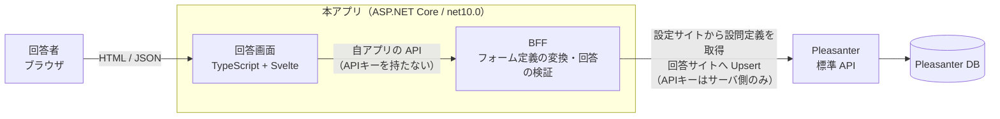
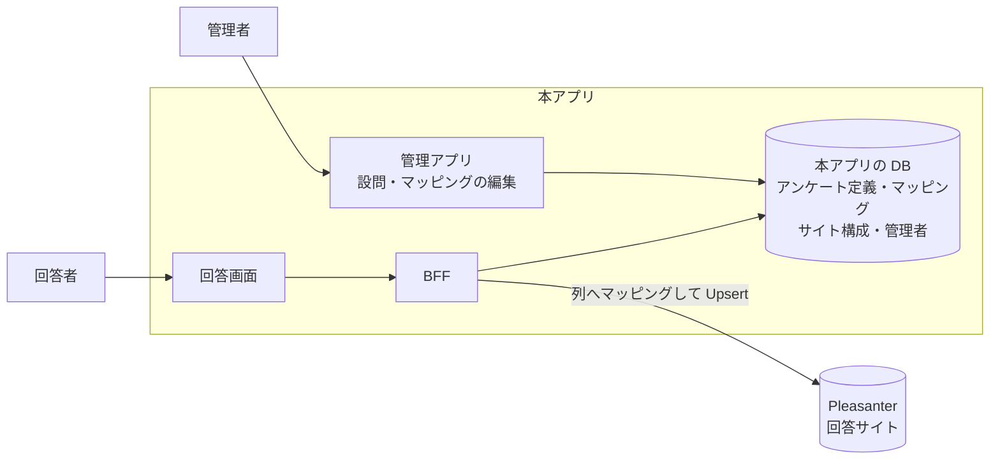
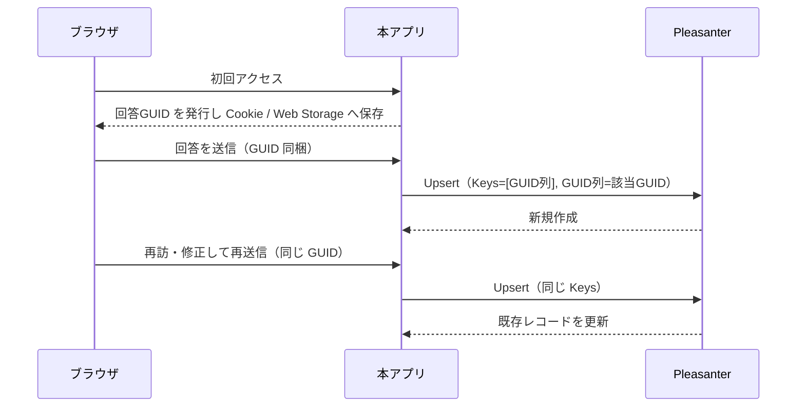
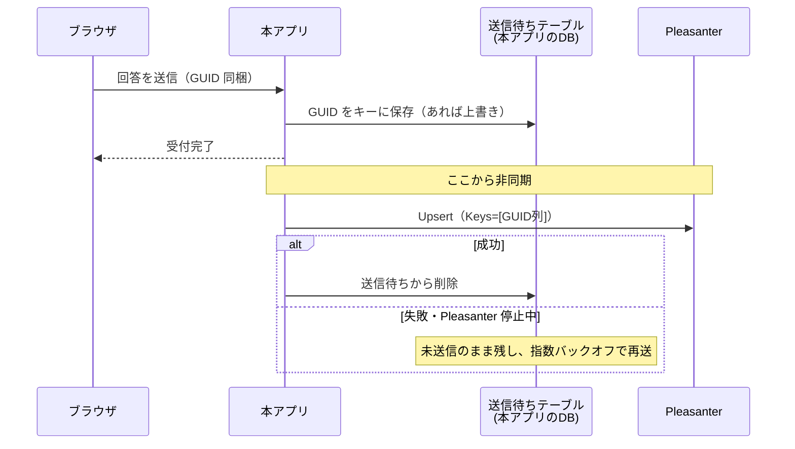
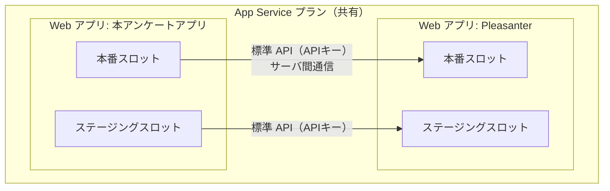

# アーキテクチャ方針

Pleasanter をバックエンドにした Web アンケート・Web フォームアプリの構成方針。

**この文書の Pleasanter に関する記述は、`_reference/Implem.Pleasanter`（`Pleasanter_1.5.7.0` /
`870a56ae` / 2026-08-12）の実ソースを根拠にしている。** 根拠のファイルパスを各節に記載する。
実機の応答で確認すべき点は「未確定事項」にまとめる。

## 1. 目的とスコープ

**本ツールの存在理由は、Pleasanter 純正のフォーム機能では出来ないが
Google Forms / Microsoft Forms では出来ること を実現すること。**
Pleasanter のサイト設定で表現できる範囲を画面に写すだけなら、標準の編集画面で足りる。
**差分こそが製品**であり、Pleasanter の表現力は出発点であって上限ではない（7 章）。

- 回答画面は **Google Forms / Microsoft Forms に近い見た目・操作感**にする
- **設問定義の主は本アプリの DB。** Pleasanter の列は回答の保存先として扱い、
  実行時にマッピングする（8 章）
- **回答データは Pleasanter のレコードとして蓄積する。** 集計・エクスポートは Pleasanter の機能を使う
- **回答データは Pleasanter へ、アプリの設定は本アプリの DB へ**（7 章）。
  Pleasanter は**回答の置き場**として使い、集計・エクスポートは本体の機能に任せる
- **Pleasanter 本体は改造しない。** 標準 API を利用する独立したアプリとして作る

### 決定事項（2026-08-18）

| 論点 | 決定 |
|---|---|
| アンケートとサイトの対応 | **1 アンケート = 1 Pleasanter サイト** |
| 回答者の認証 | **完全匿名。** URL を知っていれば誰でも回答できる |
| 配置 | **同一 App Service プラン上に Web アプリをもう 1 つ**（デプロイスロットではない） |

**1 アンケート = 1 サイト**にしたことで、サイトの `SiteSettings` がそのまま 1 枚のフォーム定義になる。
本アプリ側に「どの列がどのアンケートの設問か」を判定する仕組みを持たなくてよい。
回答用 URL は 1 サイトに 1 本を割り当てる（URL にサイト ID を素で出すかは 3 章の「要検討」）。

## 2. 全体構成

**要点は「ブラウザから Pleasanter を直接叩かせない」こと。** 理由は次節。

## 3. API キーの受け渡し方式（BFF が必須になる理由）

Pleasanter の API キーは **リクエストボディの JSON に `ApiKey` として載せる**方式である。

- 根拠: `Implem.Pleasanter/Libraries/Requests/Context.cs`（`SetUserProperties`）
  — リクエストボディを `Api` として解釈し、`ApiKey` が空でなければ
  `Rds.UsersWhere().ApiKey(ApiKey)` でユーザを特定している
- `X-API-Key` や `Authorization: Bearer` といった**ヘッダ方式は実装されていない**
  （`Libraries/Requests/` と `Filters/` を検索して該当なし）

したがって：

- **API キーを持つのはサーバ側だけ。** ブラウザへ配布する設計は取れない
- 匿名の回答者からの投稿は、**本アプリのサーバが Pleasanter 用の資格情報を代理保持**して中継する
- API キーは設定ファイルへ直書きせず、環境変数または Azure Key Vault から読む。
  ログ・例外・キャッシュにフル値を残さない

### 帰結：回答者の記録のされ方

代理投稿になるため、**Pleasanter 上の作成者（`Creator`）は API キーの持ち主に固定される。**
全レコードが同じ利用者の作成物として並ぶことになる。

**回答者は完全匿名とする**（決定事項）。したがって、

- **回答者の識別が要る場合は、氏名・メールなどを「設問」としてサイト設定側に置く。**
  本アプリは認証を行わず、回答者を特定しない
- **サーバ側では重複投稿を判定できない。** 抑止は Cookie / Web Storage で行う（9 章）。
  端末単位の抑止であって本人確認ではない
- 回答画面の URL は**推測されにくいものにする。** サイト ID を素で晒すと、
  URL を総当たりされたときに他のアンケートへ到達し得る

> **要検討。** URL の秘匿方法（サイト ID を直接使うか、別の公開用 ID を割り当てるか）は
> 実装時に決める。「未確定事項」参照。

## 4. 回答サイトの列の取得

**設問定義は本アプリの DB が持つ（7 章）。** `GetSite` は
**「マッピング先としてどんな列が使えるか」を調べるために使う。**
管理アプリで列を選ばせるときの候補元であり、回答画面をここから組み立てるわけではない。

`POST /api/items/{siteId}/GetSite` の応答に **`SiteSettings` がそのまま含まれる。**

- 根拠: `Implem.Pleasanter/Controllers/Api/ItemsController.cs`（`GetSite`）→
  `ItemModel.GetByApi(referenceType: "Sites")`
- 根拠: `Implem.Pleasanter/Models/Sites/SiteApiModel.cs` — `public SiteSettings SiteSettings { get; set; }`

`SiteSettings.Columns`（`Implem.Pleasanter/Libraries/Settings/Column.cs`）から、
**マッピング先の列とその制約**を読み取る。

| Column のプロパティ | 用途 |
|---|---|
| `ColumnName` | 送信時のキー |
| `LabelText` | 設問文 |
| `Description` | 設問の補足説明 |
| `ControlType` | コントロール種別（`ChoicesText` / `Attachments` など） |
| `ChoicesControlType` | 選択肢の表示形式（既定は `DropDown`。`Radio` などを取り得る） |
| `MultipleSelections` | 複数選択の可否 |
| `ChoicesText` | 選択肢の定義（生テキスト） |
| `ValidateRequired` / `Required` | 必須入力 |
| `MaxLength` | 文字数上限 |
| `DecimalPlaces` / `Unit` | 数値の桁・単位 |
| `DefaultInput` | 初期値 |
| `EditorReadOnly` | 入力不可 |

### 列の型と受け入れられる値（マッピングの制約）

`Implem.Pleasanter/Libraries/HtmlParts/HtmlFields.cs` の `enum ControlTypes` は
`Text` / `TextBox` / `TextBoxNumeric` / `TextBoxDateTime` / `TextBoxMultiLine` / `MarkDown` /
`RTEditor` / `DropDown` / `Radio` / `CheckBox` / `Slider` / `Spinner` / `Attachments`。
**設問形式をこれに合わせるのではなく、設問の値をこれへ写せるかの判定に使う。**

| Pleasanter 側の列 | 受け取れる値 |
|---|---|
| 選択肢あり ＋ `ChoicesControlType=Radio` | ラジオボタン（単一選択） |
| 選択肢あり ＋ `ChoicesControlType=DropDown` | プルダウン |
| 選択肢あり ＋ `MultipleSelections=true` | チェックボックス（複数選択） |
| `TextBoxMultiLine` | 記述式（段落） |
| `TextBox` | 記述式（1 行） |
| `TextBoxNumeric` / `Spinner` / `Slider` | 数値 |
| `TextBoxDateTime` | 日付・時刻 |
| `CheckBox` | はい／いいえ |
| `Attachments` | ファイル添付 |

### 注意：選択肢の解決

`Column.ChoiceHash`（解決済みの選択肢辞書）には **`[NonSerialized]` が付いている**
（`Column.cs`）。**API 応答に載るかはソースだけでは確定できない。**

- 載らない場合、本アプリ側で `ChoicesText` を解析する必要がある
- `ChoicesText` には固定の選択肢リストのほか、**他サイトへのリンクや部署・ユーザ参照といった
  動的な指定**が書ける。これらの解決方法は実機で確認して決める

## 5. 回答の保存

**`POST /api/items/{siteId}/Upsert` を使う**（`Create` ではない）。回答ごとの GUID をキーに
突き合わせることで、初回投稿と修正投稿を同じ経路で扱える。詳細は 9 章。

**呼ぶのは再送ワーカーであって、回答画面のリクエスト処理ではない。**
回答は必ず本アプリの DB（送信待ちテーブル）を経由してから送る（10 章）。

利用し得る他のエンドポイント（同ファイルで確認済み）:
`Get` / `Update` / `Upsert` / `Delete` / `BulkDelete` / `BulkUpsert` / `Import` / `Export` /
`GetSite` / `CreateSite` / `UpdateSite` / `DeleteSite`。

**入力検証は本アプリ側でも必ず行う。** Pleasanter 側の検証に任せると、エラー表示が
Forms 風の画面に馴染まない。サイト設定を根拠に、必須・桁・選択肢の妥当性を自前で検証する。

## 6. タイムゾーン

**タイムゾーンが 3 つ別々に存在し得る。取り違えると回答日時が 9 時間ずれる。**

| # | 何のタイムゾーンか | 既定 |
|---|---|---|
| 1 | 本アプリの実行環境 | **Azure App Service は既定 UTC** |
| 2 | API キーに紐づく Pleasanter ユーザ | そのユーザの `Users.TimeZone` |
| 3 | 回答者（ブラウザ） | 回答者の端末設定 |

根拠（`_reference/Implem.Pleasanter`）:

- `Implem.Pleasanter/Libraries/Requests/Context.cs:125` — `Context.TimeZoneInfo` の既定は
  `Environments.TimeZoneInfoDefault`
- 同 `:573` — 利用者が特定できた場合は `userModel.TimeZoneInfo` で上書きされる。
  **API キー認証でもこの経路を通るため、`Context` のタイムゾーンは「API キーの持ち主」のものになる**
- `Implem.Pleasanter/Models/Users/UserModel.cs:89` — `Users.TimeZone`（文字列 ID）から解決
- `Implem.Pleasanter/App_Data/Parameters/Service.json:4` — `"TimeZoneDefault": "UTC"`（本体の既定）
- `Implem.DefinitionAccessor/Initializer.cs:1328` — 上記から `Environments.TimeZoneInfoDefault` を解決

### 方針

1. **Azure App Service で動かす場合はアプリ設定 `WEBSITE_TIME_ZONE` を `Tokyo Standard Time` にし、
   実行環境を JST へ寄せる。** これが一番事故が少ない
2. **それに依存しきらない。** 実行環境の既定に頼らず、`App_Data/Parameters/Service.json` の
   `TimeZoneDefault` を明示し、アプリ内では**タイムゾーンを持つ型（`DateTimeOffset`）で扱う**
3. **API キーの持ち主の `TimeZone` を確認し、`Pleasanter.json` の `ApiKeyUserTimeZoneId` に記録する。**
   本アプリの既定と食い違う場合、日付項目の送受信でずれる
4. 回答者のタイムゾーンは、**表示にのみ使い、保存値の解釈には使わない**

> **実機で確定した（2026-08-18）。** [`実機検証結果.md`](実機検証結果.md) 4 章。
>
> **DB には Pleasanter サーバの OS ローカル時刻で書かれ、API の境界で
> 「API キー保有ユーザの `TimeZone`」との間で変換される。**
> 同じレコードが、キー保有ユーザの設定を変えるだけで 09:00 にも 18:00 にも見えた。
>
> したがって **`TimeZone` も `WEBSITE_TIME_ZONE` も、運用開始後に変更してはならない。**

## 7. 拡張設定（Pleasanter に置き場所が無い設定）

**本ツールの存在理由は、Pleasanter 純正のフォーム機能では出来ないが Google Forms /
Microsoft Forms では出来ること を実現すること。** したがって
「Pleasanter にその設定が無いからできない」で終わらせない。**無いなら置き場所を設計する。**

### 対象になる設定の例

条件分岐（回答に応じたページ移動・設問の出し分け）／直線尺度・星評価・行列（グリッド）設問／
進捗バー／1 問 1 ページ表示／選択肢のシャッフル／「その他」自由記述付き選択肢／
受付期間・回答上限／回答後の自動返信／回答画面のテーマ・ヘッダ画像。

### 構成（2026-08-18 決定）

**役割の線引き:**

| 何を | どこへ |
|---|---|
| アンケート定義（設問・選択肢・ページ構成・分岐） | **本アプリの DB** |
| 列へのマッピング（変換・条件） | **本アプリの DB** |
| アンケートサイトの構成（どの Pleasanter サイトへ書くか） | **本アプリの DB** |
| 管理者の認証情報 | **本アプリの DB**（10 章） |
| **回答データ** | **Pleasanter の回答サイト** |

1. **管理アプリは本アプリ内に作る。** 分岐条件のような設定は Pleasanter の標準グリッドでは
   編集体験を作れない
2. **設定は本アプリの DB に持つ。** リレーショナルに持てるので整合性制約・検索・履歴を
   自前で設計でき、回答画面の表示ごとに Pleasanter へ問い合わせずに済む
3. **実行時は、定義と回答サイトの列とのマッピングに従って、回答を列へ写して `Upsert`**（8 章）

**設問定義の主は本アプリの DB**（2026-08-18 決定）。当初は Pleasanter のサイト設定を
主とする想定だったが、**それでは Pleasanter が表現できる設問しか作れず、本ツールの目的に反する。**

> **当初は「独自 DB を持たない」ため設定を Pleasanter のサイトへ JSON で置く方針だった。**
> 管理者の認証情報のために DB を持つと決めた時点でその前提が消えたので、
> 設定も DB へ寄せた。Pleasanter のレコード列へ JSON を詰める方式は、
> 桁の制限・スキーマの不在・同時編集の扱いといった問題を抱えていた。

### 落とし穴：2 つのストアがずれる

**設定は本アプリの DB、回答は Pleasanter** という分割になったため、
**バックアップと復元が 2 系統になる。** 片方だけ古い状態へ戻すと、
マッピングと回答の対応が崩れ、**保存済みの回答を誤って解釈する。**

- **マッピングにバージョンを持たせ、回答レコードにその版を記録すること。**
  版が合わない回答は、集計時に区別できるようにする
- 定義を変更したとき、**既存の回答が読めなくなる変更（列の割り当て変更）かどうかを
  管理アプリ側で判定して警告する**
- 復元手順は「両方を同じ時点へ戻す」ことを前提に文書化する

## 8. 設問から列へのマッピング

**設問定義の主は本アプリの DB。** Pleasanter の列は**回答の保存先**として扱い、
実行時にマッピングして書き込む（2026-08-18 決定）。

これにより、Pleasanter の列で表現できない設問（行列・尺度・「その他」付き選択肢など）も、
**1 設問を複数列へ展開する**形で保存できる。

### マッピングに必要な要素

| 要素 | 役割 |
|---|---|
| 入力 | 設問（JSON 側の設問 ID） |
| 変換 | 値の加工。**1 入力 → 複数出力もある** |
| 条件 | 条件分岐（この回答なら別の列へ、条件付き必須、設問の出し分け） |
| 出力 | Pleasanter の列（`ClassA` / `NumA` など） |

変換で想定しているもの（**1 対 1 の写しでは足りない**）:

| 変換 | 例 |
|---|---|
| 選択肢 → コード | 「とても満足」→ `5` |
| 複数選択 → 連結 | 「A, C」→ `"A,C"` を 1 列へ |
| **複数選択 → 複数のチェック列を ON/OFF** | 「A, C」→ `CheckA=true` / `CheckB=false` / `CheckC=true` |
| **文字列の内容を判定してフラグを立てる** | 自由記述に特定語が含まれたら `CheckD=true` |
| **数値 → 選択肢へ射影** | 回答 `4` → `ClassA="満足"`（区間で選択肢へ割り当て） |
| 尺度・星評価 → 数値 | ★4 → `NumA=4` |
| 行列（グリッド）→ 行ごとの列 | 行 3 つ × 尺度 → `NumB` / `NumC` / `NumD` |
| 日付整形・単位変換 | 表示は「令和 8 年」、保存は ISO 日付 |

**「1 設問 = 1 列」を前提にしないこと。** 変換ブロックの入出力は多対多になり得る。

### 編集 UI の方針（検討中）

**FBD（ファンクションブロックダイアグラム）風のノードエディタ**で、
設問・変換・条件・列をブロックとして置き、コネクタで繋ぐ案を検討する。
変換と条件が 1 枚の図で追えるため、分岐を含むマッピングを表現しやすい。

**先に決めるべきはデータモデルの方。** マッピングを**ノードとエッジの構造**で定義しておけば、
編集 UI が最初は表形式でも、後からグラフ UI へ載せ替えられる。逆にすると作り直しになる。

> **要検討。** 既製のノードエディタ部品を使うか自作するか、およびそのライセンス。
> 導入する OSS は寛容ライセンス（MIT / BSD 系）に限る。**採用前に一次情報で確認すること。**

### 列の本数という上限

Pleasanter の標準の列（`ClassA`〜 / `NumA`〜 など）は**型ごとに本数が決まっている。**
1 設問を複数列へ展開する以上、**設問数がそのまま列を食う。**

- Enterprise の**項目拡張**を使うと型ごとの本数を増やせる
  （`Implem.ParameterAccessor/Parts/ExtendedColumns.cs` が
  `Class` / `Num` / `Date` / `Description` / `Check` / `Attachments` の本数を持つ）
- **標準で何本使えるかは公開リポジトリのソースからは確定できなかった。**
  `App_Data/Definitions/Definition_Column/` に `Results_*` は 7 件しか無く、
  `ClassA`〜`ClassZ` の定義は含まれていない。**実機の DB で確認すること**

> **設計上の含意。** 上限に当たったとき、1 アンケート = 1 サイトの前提のもとでは
> 「設問数の多いアンケートが作れない」という形で表面化する。
> **上限と、超えたときの挙動（管理アプリ側で弾く）を早めに決めること。**

## 9. 多重投稿の抑止と回答の編集

**完全匿名のため、サーバ側で回答者を識別できない。**
そこで **回答ごとに GUID を発行し、それをキーに `Upsert` する**（2026-08-18 決定）。

> 図は GUID と `Upsert` の対応だけを示している。**実際には本アプリと Pleasanter の間に
> 送信待ちテーブルが挟まり、送信は非同期になる**（10 章）。

### `Upsert` の仕様（実ソースで確認済み）

`POST /api/items/{siteId}/Upsert` は、リクエストボディの **`Keys`（列名の配列）** で
既存レコードを突き合わせる。

- 根拠: `Implem.Pleasanter/Models/Results/ResultUtilities.cs`（`UpsertByApi`）
  — `api.Keys` の各列について、レコード側の値を取り出して
  `SearchTypes.ExactMatch` のフィルタを組み立てている
- `Keys` が空、または JSON 側にキー列の値が無い場合はエラー（`InvalidUpsertKey`）

したがって **GUID を保持する列を 1 本用意し、`Keys` にその列を指定する**だけでよい。

### この方式の利点

- **多重投稿の抑止と投稿内容の編集が、同じ 1 つの仕組みで済む**
- **レコード ID をブラウザへ渡さずに済む。** Pleasanter のレコード ID は連番なので、
  そのまま渡して `Update` させると他人の回答を書き換えられる。GUID なら推測できない
- サーバ側にトークン → レコード ID の対応表を持たなくてよい

### 前提と限界を隠さないこと

- **端末単位・ブラウザ単位の抑止であって、本人確認ではない。**
  Cookie / Web Storage を消す・別ブラウザを使う・シークレットウィンドウを使えば回避できる
- **抑止を目的にする場合は、その旨を要件として合意しておく。**
  厳密な一意性が要るなら、匿名前提を捨てて URL トークン方式へ変える必要がある
- **GUID はブラウザが握る値なので、他人の GUID を知れば書き換えられる。**
  URL やメール本文へ GUID を載せる場合は、漏れる経路がないか確認すること

## 10. 回答の送信（常時アウトボックス）

**回答は必ず本アプリの DB へ書いてから、非同期で Pleasanter へ送る**（2026-08-18 決定）。
Pleasanter が落ちていても回答を失わない。

完全匿名なので、送信に失敗した回答は**再入力してもらう以外に取り戻す手が無い。**
何ページも書いた末に失われるのは、Forms なら起きない壊れ方になる。

### なぜ「失敗時だけ退避」にしなかったか

**稀にしか通らない経路は、本番で初めて動いて壊れる。**
障害時にだけ動く仕組みは、肝心の障害時に動かない。
経路を 1 本にすれば、退避も再送も**毎回動いているので常に検証されている**状態になる。

引き換えに、**Pleasanter への反映は常に少し遅れる**。回答者にとっては受付完了が返れば
済む話なので、実用上の問題は小さい。

### 送信待ちテーブルは「キュー」ではない

**GUID ごとに 1 行。** 同じ回答が編集されたら**上書きする。**

`Upsert` は GUID で突き合わせるので、**同じ回答の途中経過を順番に送る必要が無い。
最新の状態だけ送ればよい。** これにより次が消える。

- 送信順序の保証
- 同一回答に対する更新の競合
- 溜まった更新の一括処理

**この単純化は、回答ごとの GUID をキーに `Upsert` する設計（9 章）から来ている。**

### 帰結：読み出しも 2 段構え

**未送信の回答は Pleasanter にまだ無い。** 回答者が編集で戻ってきたとき、
Pleasanter だけを見ると**自分がさっき送った内容が見えない。**

**回答の読み出しは、送信待ちテーブルを先に見る。**

1. 送信待ちテーブルに同じ GUID があれば、**それを返す**（未送信の最新状態）
2. 無ければ Pleasanter から `Get` する（送信済み）

管理アプリのプレビューや回答状況も同じ順序で見ること。

### 一時保管であって蓄積先ではない

**回答データの正本は Pleasanter**（1 章の線引き）。送信待ちテーブルは
**送れるまで預かる置き場**であり、**送信できたら消す。**

- **集計・エクスポートの対象にしないこと。** 参照先を増やすと
  「回答の正本はどこか」が曖昧になる
- 管理画面には**未送信件数と最古の滞留時刻**を出す。溜まっていることに
  気づけないのが一番まずい

### 個人情報が常に自前 DB を経由する

**常時経由にした以上、回答本文は必ず一度は本アプリの DB に載る。**
氏名・メール・自由記述が含まれ得る。

- **送信できたら必ず消す。** 送信済みレコードを「念のため」残さない
- **滞留の上限期間を決め、超えたものの扱い（通知して手動対応）を決める**
- ログ・例外・監視へ回答本文を出さない
- バックアップの保護レベルを、Pleasanter の回答サイトと同等以上にする

### 再送ワーカーの注意（Azure App Service）

- **スケールアウトすると同じ回答を複数インスタンスが拾う。**
  `Upsert` が冪等なので実害は小さいが、**取り出しの排他は入れる**
- **スロット swap と再起動で処理が中断される。** 中断されても失われない作りにする
  （取り出し中に落ちたら未送信へ戻る）
- 常駐処理を動かすなら **Always On** が要る。無効だとアイドルで停止して送信が止まる
- **再送の間隔は指数バックオフにする。** Pleasanter 復旧直後に溜まった分を一斉送信すると
  再び落とす

### 失敗し続けたとき

- 再送回数・経過時間の上限を決め、超えたものは**デッドレターとして分離**する
- **管理者へ通知する。** 黙って溜め続けない
- デッドレターは管理画面から内容を確認し、手動で再送できるようにする

### 添付ファイルをどう扱うか

回答に添付があると、**バイナリも送信待ちに載る。**
DB に入れるか、別のストレージへ置くかは未確定（「未確定事項」参照）。

## 11. 管理画面の認証と認可

**認証も認可も本アプリで完結させる**（2026-08-18 決定）。Pleasanter は参照しない。

| | 決定 |
|---|---|
| 認証 | **本アプリに独自のログインを持つ** |
| 認可 | **本アプリの DB のロールだけで判定する** |

### なぜ Pleasanter のログインを使わないのか

**Pleasanter は IdP ではない。** `App_Data/Parameters/Authentication.json` の `Provider` は
Pleasanter が認証を**受ける**側の設定で（既定 `None`。`LdapParameters` / `SamlParameters` /
`PasskeyParameters` / `TrustedProxyParameters` がある）、
**外部アプリへトークンを発行する認可エンドポイントは見当たらない。**
`Controllers/Api/SessionsController.cs` も `Get` / `Set` / `Delete` のみでログイン用ではない。

「Pleasanter にログインさせて結果を本アプリが受け取る」は本体改造なしには実現できず、
**Pleasanter 本体は改造しないという方針に反する。**

### 管理者アカウント

本アプリの DB に持つ。

- ログイン ID
- **パスワードハッシュのみ**（平文・可逆暗号にしない。ソルト付きの実績ある KDF を使う）
- ロール（認可はこれだけで判定する）

**資格情報を Pleasanter のサイトへ置かないこと。** そのサイトを Pleasanter 上で
閲覧できる人にハッシュが見えてしまい、サイト権限の設定ミスがそのまま事故になる。

### 引き受けたリスク：退職者の止め忘れ

**Pleasanter のユーザ・グループとは連動しない。** 異動や退職があっても本アプリ側は
何も変わらないため、**管理者権限を止め忘れる。**

- **管理者の棚卸しを運用手順に含めること。** 機械が検知しない
- 管理アプリに**最終ログイン日時**を持たせ、長期間使われていないアカウントが
  一覧で分かるようにする

### 採らなかった案：Pleasanter のグループ・組織で認可する

要件が変わったときのために、調査結果を残す。

**`POST /api/extended/sql`（拡張SQL）を使えば、Pleasanter の DB へ直接つながずに
所属判定ができる。** 呼び出し側が SQL を送るのではなく、Pleasanter サーバに
**登録済みの SQL を名前で呼ぶ**仕組み。

- 根拠: `Implem.Pleasanter/Controllers/Api/ExtendedController.cs`（`[HttpPost("Sql")]`）
- 根拠: `Implem.Pleasanter/Models/Extensions/ExtensionUtilities.cs`（`Sql` / `ExecuteDataSet`）
- `Api: true` を付けた SQL だけが対象。`Name` で選択し、`Params` は
  `SqlParamCollection` へ束縛される（**文字列連結していない**）
- SQL 本体は Pleasanter 側の `App_Data/Parameters/ExtendedSqls/*.json`
- 代替として `POST /api/users/get` / `/api/groups/get` / `/api/depts/get` も実在する

**採用する場合の注意。** `ExtendedSql` が継承する `ExtendedBase` の
`DeptIdList` / `GroupIdList` / `UserIdList` による絞り込みは、`ExtensionWhere` が
`context.DeptId` / `context.Groups` / `context.UserId`、すなわち **API キーの持ち主**と
突き合わせる（`ExtensionUtilities.cs:193-195`）。本アプリはサービスアカウントの
API キー 1 本で動くため、**この絞り込みは管理者ごとの制御にはならない。**
管理者ごとの判定は本アプリ側で書く必要がある。

また、この案を採るには**管理者レコードに対応する Pleasanter ユーザ
（`LoginId` または `UserId`）を持たせる**必要がある。

## 12. 設定ファイル

**Pleasanter 本体と同じく `App_Data/Parameters/*.json` に置く。**
書き方・上書きの優先順位・資格情報の扱いは
[`App_Data/Parameters/README.md`](../App_Data/Parameters/README.md) を参照。

なお、ここに置くのは**アプリの動作設定**（接続先・タイムゾーン等）であり、
**アンケートごとの拡張設定は 7 章のとおり Pleasanter 側へ保存する。**
## 13. 技術スタック

**Pleasanter 本体に揃える**（根拠は `_reference/Implem.Pleasanter` の実物）。

| 層 | 採用 | 根拠 |
|---|---|---|
| ランタイム | .NET 10（`net10.0`）／SDK `10.0.100` | `global.json` と 14 個の `*.csproj` すべて |
| サーバ | C# / ASP.NET Core | 本体と同じ |
| フロントエンド | TypeScript + Vite + Svelte + SCSS | `Implem.PleasanterFrontend/`（`components/svelte.config.js`、`vite.config.ts`） |
| Pleasanter との接続 | **Web API（標準 API）** | 方針として確定。DB 直結はしない |
| 本アプリの DB | **SQL Server / PostgreSQL / MySQL の 3 つ** | Pleasanter が対応する RDBMS に揃える |

- `Nullable` は本体が `disable` だが、**本アプリは新規実装なので `enable`**（`Directory.Build.props`）
- Pleasanter 本体のコード・パッケージは参照しない（AGPL。`_reference/README.md`）

### 3 RDBMS 対応

**本アプリの DB は Pleasanter と同じ 3 つ（SQL Server / PostgreSQL / MySQL）に対応する。**
導入先の Pleasanter が使っている RDBMS に合わせられないと、DB サーバを別に立てることになる。

- **方言差を 1 か所へ閉じ込める。** 識別子クォート・ページング・自動採番・
  日時型・`UPSERT` 相当の書き方が 3 者で違う
- **SQL を文字列連結しない。** 必ずパラメータ化する
- **3 つすべてで動くことを CI で検証する。** 1 つでしか試していない SQL は、
  残り 2 つで必ず落ちる
- `EizoGiken.PleasanterTools.McpServer` が同じ 3 RDBMS 対応を `IDbProvider` で
  実装している。**設計の参考にはしてよいが、コードは持ち込まない**（別リポジトリ・別ライセンス）

> **要検討。** ORM を使うか（EF Core は 3 つとも公式/準公式プロバイダがある）、
> Dapper 等で方言を自前抽象化するか。**マイグレーションを 3 RDBMS で
> 同じ手順にできるか**が選定の分かれ目になる。

### Pleasanter の DB へ直結しない理由

**本アプリが自前の DB を持つことと、Pleasanter の DB へ直結することは別の話。**
Pleasanter の DB へ直接書き込むと、**本体側の検証・通知・サーバスクリプト・履歴管理を
すべて迂回する**ことになり、Pleasanter 上でデータが壊れて見える。
Pleasanter との読み書きは標準 API 経由に限定する。

## 14. 配置（Azure App Service）

**同一の App Service プラン上に、Pleasanter とは別の Web アプリとして本アプリを置く**（決定事項）。

- **デプロイスロットは同一 Web アプリの複製**であり、別アプリを載せる仕組みではない。
  そのため Pleasanter のスロットに本アプリを置く構成は取らない
- 本アプリ → Pleasanter は**サーバ間通信**なので、ブラウザ側の CORS は発生しない
- API キー・Pleasanter のベース URL は**アプリケーション設定（環境変数）**で外部化し、
  **スロットごとに別の値を差せるようにする**（ステージングは検証用 Pleasanter へ向ける）
    - 接続先を取り違えたまま入れ替わると事故になるため、
      これらは**スロット設定（swap 時に入れ替えない設定）にする**
- **アプリ設定 `WEBSITE_TIME_ZONE` に `Tokyo Standard Time` を設定する**（6 章）

## 15. 未確定事項

**推測で進めず、確認してから実装すること。**

| # | 論点 | 確認方法 |
|---|---|---|
| 1 | 回答用 URL の作り方（サイト ID を直接使うか、別の公開用 ID を割り当てるか） | 実装時に決める |
| 2 | マッピング編集 UI をノードエディタにするか。既製部品を使う場合はライセンス | 一次情報で確認 |
| 3 | 再送ワーカーの動かし方（Hosted Service ／ 別プロセス）と排他の取り方 | 実装時に決める |
| 4 | 管理者の棚卸し手順（退職者の止め忘れを運用でどう防ぐか） | 要件確認 |
| 5 | 送信待ちの滞留上限と、超えたときの扱い。デッドレターの通知先 | 要件確認 |
| 6 | 添付ファイルの投稿経路（`api/binaries` 系の利用可否）と、一時保管でのバイナリの持ち方 | `_reference` 調査 ＋ 実機 |
| 7 | 「どのサイトを回答フォームとして公開してよいか」の指定方法（許可リストか、サイト側の目印か） | 要件確認 |
| 8 | DB スキーマのマイグレーション手段（3 RDBMS で同じ手順にできるか） | 実装時に決める |

### 実機で確定した事項（2026-08-18）

詳細は [`実機検証結果.md`](実機検証結果.md)。

| 論点 | 結果 |
|---|---|
| 標準の列の本数 | **型ごとに 26 本**（`A`〜`Z`）。項目拡張で増やせる。`Class` は trial 既定で 126 本 |
| 列の桁 | `Class` は **1024 文字**、`Num` は `decimal(19,4)`、`Date` は `datetime`、`Description` は `nvarchar(max)` |
| `GetSite` の `ChoiceHash` | **載らない。** `ChoicesText` を自前で解析する必要がある |
| `Upsert` ＋ `Keys` | **期待どおり動く。** 同じ GUID で何度送っても 1 件に集約される |
| 日時の扱い | **DB はサーバの OS ローカル時刻で保存、API はキー保有ユーザの `TimeZone` で返す。** 読む側の設定で同じレコードが違う時刻に見える |
| 未設定の日付 | **`1899-12-30T00:00:00` が返る。** 未回答と区別できない |

### 決着済み（2026-08-18）

| 論点 | 決定 |
|---|---|
| 製品の位置づけ | **Pleasanter 純正では出来ず Google Forms / MS Forms では出来ることを実現するツール** |
| 機能スコープ | **できるだけフルカバー**（[`機能一覧.md`](機能一覧.md)）。**自動返信メールのみ対象外**で、後から足せる形にする |
| 集計・エクスポート | **作らない。** Pleasanter の機能に任せる |
| アンケートとサイトの対応 | 1 アンケート = 1 Pleasanter サイト |
| 回答者の認証・匿名公開 | 完全匿名。URL を知っていれば誰でも回答できる |
| 回答者の識別 | 認証では行わない。必要なら氏名・メールを設問として置く |
| 設問定義の主 | **本アプリの DB。** Pleasanter の列は回答の保存先として扱う |
| 設定の置き場所 | **本アプリの DB**（アンケート定義・マッピング・サイト構成・管理者）。回答だけ Pleasanter |
| 本アプリの DB | **Pleasanter と同じく SQL Server / PostgreSQL / MySQL の 3 つに対応する** |
| 拡張設定の編集 UI | **本アプリ内に管理アプリを作る**（Pleasanter の標準グリッドでは編集体験を作れないため） |
| 回答の保存経路 | 設定 JSON と回答サイトの列を**マッピング**して `Upsert`。1 設問 = 1 列を前提にしない |
| 多重投稿の抑止・投稿内容の編集 | **回答ごとに GUID を発行し、それをキーに `Upsert` する。** レコード ID はブラウザへ渡さない |
| Pleasanter との接続 | Web API（標準 API）。DB 直結はしない |
| 管理画面の認証 | **本アプリに独自のログインを持つ**（Pleasanter は IdP ではないため） |
| 管理画面の認可 | **本アプリの DB のロールだけで判定する。** Pleasanter のユーザ・グループとは連動しない |
| 回答の送信 | **常に本アプリの DB（送信待ちテーブル）を経由し、非同期で Pleasanter へ送る。** 送れたら消す |
| 送信待ちの持ち方 | **GUID ごとに 1 行。** 編集は上書き。順序保証は要らない（`Upsert` が冪等なため） |
| 回答の読み出し | **送信待ちテーブルを先に見て、無ければ Pleasanter から `Get`** |
| Azure の構成 | 同一プラン上の別 Web アプリ。デプロイスロットではない |
