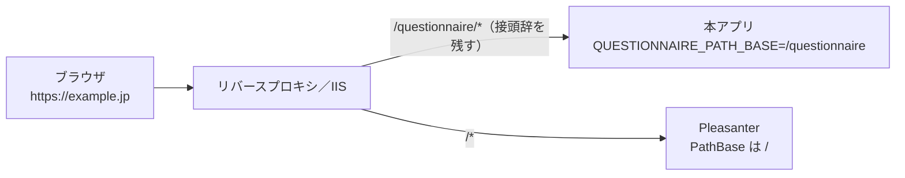

# サブパス配置 運用手順書

本書は、本アプリを **Pleasanter と同じホスト名のサブパス**（例 `https://example.jp/questionnaire/`）に
置く運用者向けの手順書である（Issue #465）。サブパスを使わない構成では読む必要はない。
導入・更新の手順そのものは [`導入-更新運用手順書.md`](導入-更新運用手順書.md) に従う。

## 1. なぜサブパスに置くのか

Pleasanter のログインで本アプリの管理画面へ入る機能（Issue #464）は、ブラウザが持つ Pleasanter の
cookie を本アプリのサーバが受け取れることが前提になる。cookie はホスト単位でしか届かないうえ、
Pleasanter の cookie は **Pleasanter 自身の PathBase に閉じる**。

- 認証 cookie: `Cookie.Path` を指定していないため、ASP.NET Core の既定で PathBase が使われる
  （`_reference/Implem.Pleasanter/Implem.Pleasanter/Startup.cs:150-190`）
- `Pleasanter_SessionGuid`: `Path = Request.PathBase`
  （`_reference/Implem.Pleasanter/Implem.Pleasanter/Libraries/Requests/Context.cs:382-393`）

Pleasanter を `/pleasanter/` に置くと cookie の Path も `/pleasanter` になり、`/` にいる本アプリへ
届かない。**Pleasanter を `/`、本アプリを `/questionnaire/` のようなサブパスに置く。**



逆に、**本アプリの cookie は `/questionnaire` の下に閉じる**ので、同じホストの Pleasanter へは送られない
（4 章）。

## 2. 設定

```text
QUESTIONNAIRE_PATH_BASE=/questionnaire
```

| 項目 | 内容 |
| --- | --- |
| 未設定・空・`/` | 従来どおり `/` で動く |
| 書式 | `/` で始め、末尾に `/` を付けない。各区切りは英数字と `-` `_` `.` `~` だけ。`.` と `..` の区切り、`?`・`#`・`%`・空白は不可。256 文字以内。階層（`/apps/questionnaire`）は可 |
| 書式違反 | **起動時に英語のメッセージで止まる**（`QUESTIONNAIRE_PATH_BASE must start with '/' ...`） |
| 反映 | 起動時に 1 度だけ読む。変更後はアプリを再起動する |
| 画面からの変更 | できない（外部設定だけ。`QUESTIONNAIRE_ADMIN_PATH` と同じ扱い） |

設定すると次のとおり振る舞う。

- `/questionnaire/...` だけに応答し、**サブパスの外（`/api/...` や `/admin`）は 404** を返す。
  同じホストの Pleasanter の経路を奪わないため
- **例外は `/healthz` と `/ready`。** サブパスの内外どちらでも応答する。コンテナの HEALTHCHECK や
  Kubernetes の probe はプロキシを通らず直接当たることが多いため（どちらもアンケートの情報を返さない）
- 起動ログへ `Path base is set to /questionnaire by QUESTIONNAIRE_PATH_BASE.` が出る

⚠️ **Git Bash（MSYS）から `/questionnaire` を環境変数で渡すと、`C:/Program Files/Git/questionnaire` に
書き換わる。** 書式違反で起動が止まるので気付けるが、手元で試すときは `MSYS_NO_PATHCONV=1` を付ける。

### 2.1 URL の変わり方

| 用途 | サブパス無し | `QUESTIONNAIRE_PATH_BASE=/questionnaire` |
| --- | --- | --- |
| 回答画面 | `/f/{公開ID}` | `/questionnaire/f/{公開ID}` |
| 管理画面 | `/admin`（`QUESTIONNAIRE_ADMIN_PATH`） | `/questionnaire/admin` |
| API | `/api/...` | `/questionnaire/api/...` |
| SAML の ACS | `/api/admin/saml/acs` | `/questionnaire/api/admin/saml/acs` |
| SAML のメタデータ | `/api/admin/saml/metadata` | `/questionnaire/api/admin/saml/metadata` |
| 生存確認 | `/healthz`、`/ready` | `/questionnaire/healthz` と `/healthz` の両方 |

**画面は組み立て直さなくてよい。** 配置用 ZIP の画面は資産を相対で参照しており、入口の HTML
（`index.html` / `admin.html`）へはサーバが配信時にサブパスを埋め込む
（[`HtmlShell.cs`](../src/VehicleVision.PleasanterTools.Questionnaire.Web/HtmlShell.cs)）。
同じ ZIP を `/` にもサブパスにも置ける。`wwwroot/admin.html` を直接開く URL は 404 を返す
（管理画面の入口は `QUESTIONNAIRE_ADMIN_PATH` だけ）。

### 2.2 メール本文の URL（`QUESTIONNAIRE_MAIL_BASEURL`）

招待・自動返信・再編集リンク・配布資産のリンクは `QUESTIONNAIRE_MAIL_BASEURL` を起点に作る。
**サブパスを書いても書かなくてもよい。** 起点の末尾がサブパスで終わっていなければ、本アプリが足す
（[`PathBaseOptions.ComposePublicUrl`](../src/VehicleVision.PleasanterTools.Questionnaire.Web/PathBaseOptions.cs)）。

| `QUESTIONNAIRE_MAIL_BASEURL` | 招待メールの URL |
| --- | --- |
| `https://example.jp` | `https://example.jp/questionnaire/admin/invitations/accept?token=...` |
| `https://example.jp/questionnaire` | 同上（二重には足さない） |

## 3. 置き方

**どの方式でも、プロキシは `/questionnaire` の接頭辞を剥がさずに本アプリへ渡す。**
剥がす構成（nginx の `proxy_pass http://.../;` など）では、本アプリがサブパスの外の要求として 404 を返す。

**Host ヘッダは元のまま渡す。** 本アプリは SAML の ACS URL を要求の `Host` とスキームから組み立てる。
`X-Forwarded-Host` は読まない（信頼できない相手に宛先を書き換えさせないため）。スキームは
`X-Forwarded-Proto` を `QUESTIONNAIRE_FORWARDED_NETWORKS` に登録したプロキシからだけ受け取る。

### 3.1 オンプレミス IIS のサブアプリケーション

Pleasanter のサイトの下へ、本アプリをサブアプリケーション（`/questionnaire`）として追加する。

1. 本アプリ専用のアプリケーションプールを作る（`.NET CLR version` は `No Managed Code`）
2. Pleasanter のサイトの下に本アプリのフォルダを置き、IIS Manager で **Convert to Application** する
3. **Application Pool** に 1 で作ったプールを選ぶ

**IIS のサブアプリケーションでは `QUESTIONNAIRE_PATH_BASE` を設定しなくても動く。** ASP.NET Core Module
（ANCM）がサブアプリケーションのパスを PathBase として渡すため。**設定する場合は同じ値にする**
（`/questionnaire`）。同じ値なら二重に剥がさない。違う値を設定すると全要求が 404 になる。
設定しておくと、IIS 以外の経路（直接 Kestrel へ当てる確認など）でもサブパスの外を 404 にできる。

⚠️ **アプリケーションプールは Pleasanter と分ける。** ASP.NET Core のインプロセスホスティングは
1 つのプールに 1 アプリしか載せられず、共有すると `HTTP Error 500.35 - ANCM Multiple In-Process
Applications in same Process` になる。どうしても共有する場合は、本アプリを OutOfProcess にする（3.4）。

配置用 ZIP の `web.config` は `<location path="." inheritInChildApplications="false">` で囲まれており、
本アプリの設定は子へ継承されない。⚠️ **親（Pleasanter）の `web.config` が `aspNetCore` ハンドラを
`location` で囲まずに持っていると、子の本アプリへ継承されて衝突する可能性がある。**
これは Pleasanter の配置物に依存するため本リポジトリでは確認していない。導入時に本アプリの URL が
`HTTP Error 500.19` になる場合は、Pleasanter 側の `web.config` を確認する。

### 3.2 Apache（mod_proxy）

```apache
# 接頭辞を剥がさない（左右とも /questionnaire/ で揃える）
ProxyPass        "/questionnaire/" "http://127.0.0.1:5000/questionnaire/"
ProxyPassReverse "/questionnaire/" "http://127.0.0.1:5000/questionnaire/"

# Host を元のまま渡す（SAML の ACS URL を正しく組み立てるため）
ProxyPreserveHost On

# HTTPS を Apache で終端する場合
RequestHeader set X-Forwarded-Proto "https"

# それ以外は Pleasanter へ
ProxyPass        "/" "http://127.0.0.1:8080/"
ProxyPassReverse "/" "http://127.0.0.1:8080/"
```

`/questionnaire/` の行を `/` の行より先に書く（先に一致したものが使われる）。`X-Forwarded-For` は
mod_proxy_http が既定で付ける。本アプリ側で `QUESTIONNAIRE_FORWARDED_NETWORKS` に Apache の
アドレス（同じ機械なら `127.0.0.1/32`）を登録する。

### 3.3 Nginx

```nginx
location /questionnaire/ {
    # URI を書かない。書くと location に一致した部分が置き換わり、接頭辞が剥がれる
    proxy_pass http://127.0.0.1:5000;
    proxy_set_header Host $host;
    proxy_set_header X-Forwarded-For $proxy_add_x_forwarded_for;
    proxy_set_header X-Forwarded-Proto $scheme;
}

location / {
    proxy_pass http://127.0.0.1:8080;
    proxy_set_header Host $host;
    proxy_set_header X-Forwarded-For $proxy_add_x_forwarded_for;
    proxy_set_header X-Forwarded-Proto $scheme;
}
```

`proxy_set_header Host` の既定は `$proxy_host`（転送先の名前）なので、明示して元の Host を渡す。
本アプリ側で `QUESTIONNAIRE_FORWARDED_NETWORKS` に Nginx のアドレスを登録する。

### 3.4 Azure App Service（Windows）の仮想アプリケーション

Pleasanter の App Service（Windows）の **設定 → 構成 → パスのマッピング** に仮想アプリケーション
`/questionnaire`（物理パス例 `site\wwwroot\questionnaire`）を追加し、そこへ本アプリを配置する。
IIS のサブアプリケーションと同じ形で、追加の部品も費用も要らない。

- **Windows の App Service だけ。** パスのマッピングは Linux では使えない
- ⚠️ **本アプリを OutOfProcess にする。** 仮想アプリケーションは親と同じアプリケーションプールで動くため、
  インプロセス同士は同居できない（`500.35`）。配置物の `web.config` の `hostingModel="inprocess"` を
  `hostingModel="outofprocess"` に書き換えるか、ソースから作る場合は次で発行する

  ```bash
  dotnet publish src/VehicleVision.PleasanterTools.Questionnaire.Web -c Release \
      -p:AspNetCoreHostingModel=OutOfProcess -o publish
  ```

- **アプリ設定（環境変数）は Pleasanter と共有される。** 本アプリの設定は `QUESTIONNAIRE_*` で始まるので
  衝突しないが、`ASPNETCORE_ENVIRONMENT` のような共通の名前は両方に効く
- スケールアウト・再起動・スロットの swap は Pleasanter と一緒になる
- ANCM が PathBase を渡すので `QUESTIONNAIRE_PATH_BASE` は無くても動く。設定するなら `/questionnaire`

### 3.5 Azure Front Door / Application Gateway のパス振り分け

本アプリと Pleasanter を別々の App Service に置き、前段で `/questionnaire/*` → 本アプリ、
`/*` → Pleasanter と振り分ける。前段はパスを書き換えずに転送する（本アプリには
`QUESTIONNAIRE_PATH_BASE=/questionnaire` を設定する）。

⚠️ **Host 名の扱いに注意する。**

- 本アプリは SAML の ACS URL を要求の `Host` から組み立てる。前段が Host を App Service の既定の名前
  （`*.azurewebsites.net`）に書き換えると、**SAML の ACS URL とメタデータが既定の名前になり、SAML ログインが
  成立しない**。メール本文の URL は `QUESTIONNAIRE_MAIL_BASEURL` から作るので影響を受けない
- Host を保つには、Front Door なら origin の **Origin host header を空**に、Application Gateway なら
  **Override with new host name をオフ**にし、同じカスタムドメインを App Service 側にも登録する
- ⚠️ **同じカスタムドメインは、同じスタンプ（スケールユニット）の 2 つの App Service へは登録できない。**
  本アプリと Pleasanter が同じスタンプに載る場合は、どちらか一方しか Host を保てない。
  SAML を使うなら、3.4 の仮想アプリケーションを選ぶか、別リージョンなど別スタンプへ置く
- 本アプリの cookie は `Domain` を付けないので、ブラウザは前段のホスト名に対して保存する。Host を
  書き換えても cookie 自体は壊れない

**App Service への直接アクセスを塞ぐ。** アクセス制限でサービスタグ `AzureFrontDoor.Backend` を許可し、
さらに HTTP ヘッダ `X-Azure-FDID` に自分の Front Door の ID を指定する（サービスタグだけでは
他の利用者の Front Door からも届く）。Application Gateway は VNet 内に置き、アクセス制限で
そのサブネットだけを許可する。

Application Gateway v2 は固定費が高めで、Front Door と同じ Host 名の注意がある。

## 4. 本アプリの cookie の Path

サブパスを設定すると、本アプリが発行する cookie はすべてサブパスの下に閉じる。

| cookie | Path（`/questionnaire` のとき） | 根拠 |
| --- | --- | --- |
| `q.admin` / `q.admin.pending` / `q.admin.reenroll` | `/questionnaire` | Cookie 認証の既定（PathBase）。[`AdminAuthEndpoints.cs`](../src/VehicleVision.PleasanterTools.Questionnaire.Web/Endpoints/AdminAuthEndpoints.cs) の `AdminAuthSchemes.Configure` は Path を指定しない |
| `q.admin.saml`（SAML の途中） | `/questionnaire/api/admin/saml` | [`AdminSamlEndpoints.cs`](../src/VehicleVision.PleasanterTools.Questionnaire.Web/Endpoints/AdminSamlEndpoints.cs) |
| `q.admin.rescue`（救済トークン） | `/questionnaire/api/admin` | [`AdminPasswordSignInPolicy.cs`](../src/VehicleVision.PleasanterTools.Questionnaire.Web/Services/AdminPasswordSignInPolicy.cs) |
| 配布資産の引換券 | `/questionnaire/api/forms/{公開ID}/assets` | [`FormEndpoints.cs`](../src/VehicleVision.PleasanterTools.Questionnaire.Web/Endpoints/FormEndpoints.cs) の `AssetCookieOptions` |
| `q.a.{公開ID}`（回答済みの印。画面が置く） | `/questionnaire/f/{公開ID}` | `Frontend/src/lib/api.ts` |

⚠️ **サブパスへ移した直後は、以前 `/` で発行された cookie がブラウザに残る。** 管理者は一度ログインし直す。
回答済みの印（`q.a.*`）は `/f/{公開ID}` のまま残り、サブパス配下の画面からは読めない
（localStorage の印は残るので、同じ端末の多重投稿の判定は続く）。

## 5. 確認

```bash
base="https://example.jp/questionnaire"
curl -fsS "$base/healthz"
curl -fsS "$base/ready"
# サブパスの外は 404（Pleasanter が居る構成ではプロキシが Pleasanter へ送る）
curl -s -o /dev/null -w "%{http_code}\n" "http://127.0.0.1:5000/api/admin/session"
```

1. `https://example.jp/questionnaire/admin` で管理画面が開き、ログインと画面内の移動ができる
2. ブラウザの開発者ツールで、要求がすべて `/questionnaire/` 配下に出ていること
3. cookie `q.admin` の Path が `/questionnaire` であること
4. 回答画面 `https://example.jp/questionnaire/f/{公開ID}` でテスト回答ができる
5. SAML を使う場合、`/questionnaire/api/admin/saml/metadata` の ACS URL が
   `https://example.jp/questionnaire/api/admin/saml/acs` であり、IdP 側にも同じ URL を登録していること
6. 招待メールや自動返信のリンクが `/questionnaire/` を含むこと

## 6. 根拠

外部仕様は次の一次資料を **2026-09-24** に参照した。

- [Configure an App Service app — Map a URL path to a directory](https://learn.microsoft.com/azure/app-service/configure-common#map-a-url-path-to-a-directory)
  — パスのマッピング（仮想アプリケーション）は Windows だけ
- [Advanced configuration of the ASP.NET Core Module and IIS — Sub-applications](https://learn.microsoft.com/aspnet/core/host-and-deploy/iis/advanced#sub-applications)
  — サブアプリケーション、インプロセスではプールを分けること
- [Troubleshoot ASP.NET Core on Azure App Service and IIS — 500.35](https://learn.microsoft.com/aspnet/core/test/troubleshoot-azure-iis#50035-ancm-multiple-in-process-applications-in-same-process)
  — 同じプロセスに複数のインプロセスアプリを載せられない
- [Out-of-process hosting with IIS and ASP.NET Core](https://learn.microsoft.com/aspnet/core/host-and-deploy/iis/out-of-process-hosting)
  — `AspNetCoreHostingModel`、IIS Integration が PathBase を設定する
- [Troubleshoot custom domain issues in Azure App Service](https://learn.microsoft.com/troubleshoot/azure/app-service/connection-issues-with-ssl-or-tls/troubleshoot-custom-domain-issues-azure-app-service)
  — 同じスタンプの別の App Service へ同じカスタムドメインを追加できない
- [Preserve the original HTTP host name between a reverse proxy and its back-end web application](https://learn.microsoft.com/azure/architecture/best-practices/host-name-preservation)
  — Front Door の Origin host header、Application Gateway の Override with new host name
- [Set up Azure App Service access restrictions — Restrict access to a specific Azure Front Door instance](https://learn.microsoft.com/azure/app-service/app-service-ip-restrictions#restrict-access-to-a-specific-azure-front-door-instance)
  — `AzureFrontDoor.Backend` と `X-Azure-FDID`
- [nginx: ngx_http_proxy_module — proxy_pass](https://nginx.org/en/docs/http/ngx_http_proxy_module.html#proxy_pass)
  — URI を書かない `proxy_pass` は要求 URI をそのまま渡す。`Host` の既定は `$proxy_host`
- [Apache HTTP Server: mod_proxy](https://httpd.apache.org/docs/2.4/mod/mod_proxy.html)
  — `ProxyPass` / `ProxyPassReverse` / `ProxyPreserveHost`、既定で付く `X-Forwarded-*`

本アプリ側の実装は次のとおり。

- [`PathBaseOptions.cs`](../src/VehicleVision.PleasanterTools.Questionnaire.Web/PathBaseOptions.cs)
  — 設定の検証とメールの起点
- [`PathBaseMiddleware.cs`](../src/VehicleVision.PleasanterTools.Questionnaire.Web/PathBaseMiddleware.cs)
  — サブパスの受け付けと 404、ANCM との二重回避
- [`HtmlShell.cs`](../src/VehicleVision.PleasanterTools.Questionnaire.Web/HtmlShell.cs)
  — 入口の HTML への埋め込み
- `Program.cs` — `UseForwardedHeaders` → サブパス → `UseRouting` の順
- `Frontend/src/lib/basePath.ts` — 画面側で URL を組み立てる唯一の入口
- [`PathBaseTests.cs`](../tests/VehicleVision.PleasanterTools.Questionnaire.Web.Tests/PathBaseTests.cs)
  — Kestrel へ HTTP で当てた確認

⚠️ **未検証の事項。** IIS のサブアプリケーション、Azure App Service の仮想アプリケーション、Apache、
Nginx、Front Door、Application Gateway の実機では確認していない。確認したのは Kestrel を直接
`QUESTIONNAIRE_PATH_BASE=/questionnaire` で起動した状態と、ANCM の振る舞いを真似た単体テストだけである。
