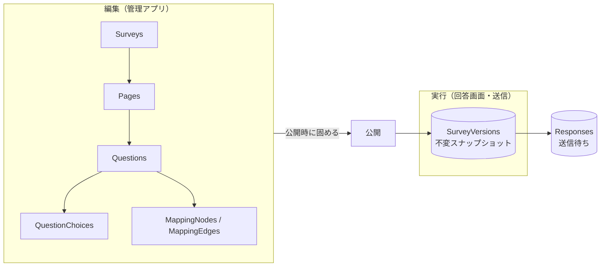

# データモデル設計

本アプリの DB に持つもの。**回答データは Pleasanter が正本**で、ここには持たない
（送信待ちの一時保管を除く。[`アーキテクチャ方針.md`](アーキテクチャ方針.md) 10 章）。

## 1. 全体の考え方

**編集用の正規化テーブルと、実行用の不変スナップショットを分ける。**



**なぜ分けるか。** 設問やマッピングは公開後も編集される。編集がそのまま実行に効くと、
**回答の途中で設問が変わる**、**過去の回答を今の定義で解釈してしまう**という壊れ方をする。

- **公開すると、その時点の定義とマッピングを 1 つの不変スナップショットとして固める**
- **回答レコードは、どのスナップショットで作られたかを持つ**
- 編集は常に下書き側で行い、公開するまで実行に影響しない

これは 10 章で挙げた「設定と回答で 2 系統のバックアップがずれる」問題への対処でもある。
**版が合わない回答は、集計時に区別できる。**

## 2. テーブル

### 2.1 アンケート

| テーブル | 主な列 | 備考 |
|---|---|---|
| `Surveys` | `SurveyId`(PK) / `PublicId` / `Title` / `PleasanterSiteId` / `Status` / `SuspendedReason` / `SuspendedAt` / `AcceptFrom` / `AcceptTo` / `ResponseLimit` / `DisplayMode` / `Theme` / `PublishedVersion` / `CreatedAt` / `UpdatedAt` | 1 アンケート = 1 Pleasanter サイト |
| `SurveyVersions` | `SurveyId`+`Version`(PK) / `DefinitionJson` / `MappingJson` / `PublishedAt` / `PublishedBy` | **不変。** 公開のたびに 1 行増える |

**`PublicId` は推測不能な値にする**（回答用 URL に使う。3 章）。
`SurveyId` や `PleasanterSiteId` を URL に出さない。

**`SuspendedReason` は「管理者が手で止めた」と「閾値で自動停止した」を区別する。**
管理画面で理由が分かること。**自動停止からの復帰は人が判断する**（勝手に再開しない）。

### 2.2 設問（編集用）

| テーブル | 主な列 |
|---|---|
| `Pages` | `PageId`(PK) / `SurveyId` / `SortOrder` / `TitleJson` / `DescriptionJson` |
| `Questions` | `QuestionId`(PK) / `SurveyId` / `PageId` / `SortOrder` / `QuestionType` / `TitleJson` / `DescriptionJson` / `IsRequired` / `SettingsJson` |
| `QuestionChoices` | `ChoiceId`(PK) / `QuestionId` / `SortOrder` / `Value` / `LabelJson` / `IsOther` |

- `QuestionType` は `Text` / `Paragraph` / `Radio` / `Checkbox` / `Dropdown` /
  `Scale` / `Rating` / `Date` / `Time` / `Grid` / `Ranking` / `File` / `Note`（説明文）など
- **`SettingsJson`** に型ごとの固有設定（尺度の下限上限、行列の行、検証規則、シャッフル可否）
- **`Note`（説明文）や画像は「列に写さない設問」**として同じテーブルに置く。
  マッピングを持たないことで表現する

### 2.3 多言語

**`*Json` の列は、最初から言語コードをキーにしたオブジェクトで持つ。**

```json
{ "ja": "ご満足いただけましたか", "en": "Were you satisfied?" }
```

**後から多言語化すると、全テーブルの文字列列を作り直すことになる。**
使うのが日本語だけでも、器は最初から用意する。

### 2.4 マッピング

FBD 風のノードエディタへ載せ替えられるよう、**最初からノードとエッジで持つ**
（[`アーキテクチャ方針.md`](アーキテクチャ方針.md) 8 章）。

| テーブル | 主な列 |
|---|---|
| `MappingNodes` | `NodeId`(PK) / `SurveyId` / `NodeType` / `ConfigJson` / `PositionX` / `PositionY` |
| `MappingEdges` | `EdgeId`(PK) / `SurveyId` / `FromNodeId` / `FromPort` / `ToNodeId` / `ToPort` |

`NodeType` は `QuestionInput`（設問）/ `Transform`（変換）/ `Condition`（条件）/
`ColumnOutput`（Pleasanter の列）。

- **1 入力 → 複数出力を許す。** 複数選択から複数のチェック列を ON/OFF する等
- **循環参照を検出して保存を拒否する**
- `PositionX` / `PositionY` は画面用。実行には使わない

### 2.5 回答の送信待ち

| テーブル | 主な列 |
|---|---|
| `Responses` | `ResponseGuid`(PK) / `SurveyId` / `SurveyVersion` / `PayloadJson` / `Status` / `RetryCount` / `NextAttemptAt` / `LastError` / `LockedBy` / `LockedUntil` / `CreatedAt` / `UpdatedAt` |

- **`ResponseGuid` が主キー。キューではない。** 同じ回答の編集は上書きする
  （[`アーキテクチャ方針.md`](アーキテクチャ方針.md) 10 章）
- `Status` は `Pending` / `Sending` / `DeadLetter`。**`Sent` は持たない。送信できたら行を消す**
- `LockedBy` / `LockedUntil` で再送ワーカーの排他を取る。
  **期限切れのロックは自動で解放する**（ワーカーが落ちても失われない）
- **`PayloadJson` に回答本文が入る。** 個人情報を含み得るので、
  送信後に確実に消し、ログへ出さない

### 2.6 管理者

| テーブル | 主な列 |
|---|---|
| `AdminUsers` | `AdminUserId`(PK) / `LoginId` / `PasswordHash` / `Role` / `IsDisabled` / `LastLoginAt` / `CreatedAt` / `TotpSecretEncrypted` / `TotpEnabledAt` |
| `AdminRecoveryCodes` | `RecoveryCodeId`(PK) / `AdminUserId` / `CodeHash` / `UsedAt` |
| `AuditLogs` | `AuditLogId`(PK) / `OccurredAt` / `AdminUserId` / `Action` / `TargetType` / `TargetId` / `DetailJson` / `IpAddress` |

- **`PasswordHash` はソルト付きの実績ある KDF のみ。** 平文・可逆暗号にしない
- **`LastLoginAt` は必須。** 退職者の止め忘れを見つける唯一の手掛かりになる
  （[`アーキテクチャ方針.md`](アーキテクチャ方針.md) 11 章）
- **多要素認証（TOTP）を第 1 弾から入れる**（[`非機能設計.md`](非機能設計.md) 1 章）
    - **`TotpSecretEncrypted` は暗号化して保存する。** 平文で持たない
    - **`AdminRecoveryCodes` の `CodeHash` はハッシュのみ。** 使ったら `UsedAt` を立てて再利用させない
    - 回復コードが無いと、端末紛失で全員が締め出される
- **`AuditLogs` に回答本文を入れない**

## 3. 回答用 URL（未確定 #1 の決着案）

**`Surveys.PublicId` に推測不能な値を持たせ、`/f/{PublicId}` を回答用 URL にする。**

- 1 アンケート = 1 サイト かつ完全匿名なので、**サイト ID を素で出すと総当たりで
  他のアンケートへ到達し得る**
- `PublicId` は暗号論的乱数から作る。連番や UUIDv1 のような推測可能なものにしない
- **公開停止しても `PublicId` は再利用しない**

## 4. 3 RDBMS の型対応

**SQL Server / PostgreSQL / MySQL の 3 つに対応する**（Pleasanter に揃える）。

| 論理型 | SQL Server | PostgreSQL | MySQL |
|---|---|---|---|
| GUID | `uniqueidentifier` | `uuid` | `char(36)` |
| 短い文字列 | `nvarchar(n)` | `varchar(n)` | `varchar(n)`（`utf8mb4`） |
| 長い文字列・JSON | `nvarchar(max)` | `text` | `longtext` |
| 日時 | `datetime2` | `timestamptz` | `datetime(6)` |
| 真偽 | `bit` | `boolean` | `tinyint(1)` |
| 採番 | `IDENTITY` | `GENERATED AS IDENTITY` | `AUTO_INCREMENT` |

**注意点。**

- **JSON はネイティブ JSON 型を使わない。** 3 者で機能差が大きく、
  検索・更新の書き方が揃わない。**文字列として持ち、アプリ側で解釈する**
- **日時は必ずタイムゾーン付きで扱う。** MySQL の `datetime` はタイムゾーンを持たないため、
  **アプリ側で UTC に正規化して格納する**
- **MySQL の `utf8mb4` を明示する。** 既定が `utf8`（3 バイト）だと絵文字が入らない
- **照合順序（大文字小文字の区別）を明示する。** 既定は 3 者で違う。
  `LoginId` の一意性判定が環境で変わると事故になる

## 5. マイグレーション（未確定 #8 の決着案）

**EF Core のマイグレーションは provider ごとに別のマイグレーション集合が要る。**
3 RDBMS では 3 系統を保守することになり、ずれる。

**1 つの定義から 3 つへ適用できるマイグレーションツールを使う**方針とする。

> **要確認。** 具体的な選定は、**採用候補のライセンスを一次情報で確認してから決める。**
> 導入する OSS は寛容ライセンス（MIT / BSD / Apache 系）に限る。

いずれを採るにせよ次を守る。

- **マイグレーションは前方のみ。** ロールバック用のスクリプトに頼らない
- **3 RDBMS すべてに適用するテストを CI に入れる。** 1 つでしか試していない DDL は残り 2 つで落ちる
- **アプリ起動時に自動適用しない。** スケールアウト時に同時実行され得る

## 6. 保持と削除

| 対象 | 方針 |
|---|---|
| `Responses`（送信待ち） | **送信できたら即削除。** 「念のため」残さない |
| `Responses`（デッドレター） | 滞留上限を超えたら分離し、**管理者へ通知**。手動対応後に削除 |
| `AuditLogs` | 保持期間を決めて超過分を削除する |
| `SurveyVersions` | **消さない。** 過去の回答を解釈するために要る |
