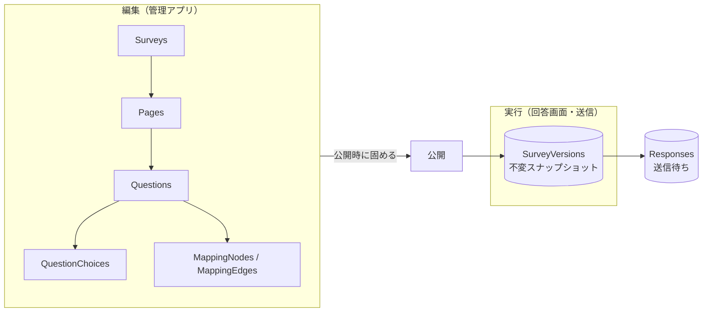

# データモデル設計

本アプリの DB に持つもの。**回答データは Pleasanter が正本**で、ここには持たない
（送信待ちの一時保管を除く。[`アーキテクチャ方針.md`](アーキテクチャ方針.md) 10 章）。

## 1. 全体の考え方

**編集用の正規化テーブルと、実行用の不変スナップショットを分ける。**



**なぜ分けるか。** 設問やマッピングは公開後も編集される。編集がそのまま実行に効くと、
**回答の途中で設問が変わる**、**過去の回答を今の定義で解釈してしまう**という壊れ方をする。

- **公開すると、その時点の定義とマッピングを 1 つの不変スナップショットとして固める**
- **回答レコードは、どのスナップショットで作られたかを持つ**
- 編集は常に下書き側で行い、公開するまで実行に影響しない

これは 10 章で挙げた「設定と回答で 2 系統のバックアップがずれる」問題への対処でもある。
**版が合わない回答は、集計時に区別できる。**

## 2. テーブル

### 2.1 アンケート

| テーブル | 主な列 | 備考 |
|---|---|---|
| `Surveys` | `SurveyId`(PK) / `PublicId` / `Title` / `PleasanterSiteId` / `ResponseJsonColumn` / `Status` / `SuspendedReason` / `SuspendedAt` / `AcceptFrom` / `AcceptTo` / `ResponseLimit` / `DisplayMode` / `Theme` / `PublishedVersion` / `CreatedAt` / `UpdatedAt` | 1 アンケート = 1 Pleasanter サイト |
| `SurveyVersions` | `SurveyId`+`Version`(PK) / `DefinitionJson` / `MappingJson` / `PublishedAt` / `PublishedBy` | **不変。** 公開のたびに 1 行増える |

**`PublicId` は推測不能な値にする**（回答用 URL に使う。3 章）。
`SurveyId` や `PleasanterSiteId` を URL に出さない。

**`ResponseJsonColumn` は NULL 可**（割り当ては任意。
[`アーキテクチャ方針.md`](アーキテクチャ方針.md) 8 章）。
NULL なら**回答の正本が無く**、編集で設問へ戻せるのは可逆な変換で写した派生列の範囲だけになる。

**回答の突き止めには Pleasanter の列を使わない。** レコードの `ReferenceId` で辿り、
「トークン → `ReferenceId`」の対応は `ResponseTokens`（下記）に持つ。
**列は型ごとに 26 本しか無いが、本アプリの DB の行は安い。**

**`Surveys` の版に紐づけないこと。** 予約列の割り当てはサイトの構成であって、
設問定義の版とは寿命が違う。**ただし途中で変更すると、既存の回答が読めなくなる。**
公開後の変更は管理アプリで警告すること。

**`SuspendedReason` は「管理者が手で止めた」と「閾値で自動停止した」を区別する。**
管理画面で理由が分かること。**自動停止からの復帰は人が判断する**（勝手に再開しない）。

### 2.2 設問（編集用）

| テーブル | 主な列 |
|---|---|
| `Pages` | `PageId`(PK) / `SurveyId` / `SortOrder` / `TitleJson` / `DescriptionJson` |
| `Questions` | `QuestionId`(PK) / `SurveyId` / `PageId` / `SortOrder` / `QuestionType` / `TitleJson` / `DescriptionJson` / `IsRequired` / `SettingsJson` |
| `QuestionChoices` | `ChoiceId`(PK) / `QuestionId` / `SortOrder` / `Value` / `LabelJson` / `IsOther` |

- `QuestionType` は `Text` / `Paragraph` / `Radio` / `Checkbox` / `Dropdown` /
  `Scale` / `Rating` / `Date` / `Time` / `Grid` / `Ranking` / `File` / `Note`（説明文）など
- **`SettingsJson`** に型ごとの固有設定（尺度の下限上限、行列の行、検証規則、シャッフル可否）
- **`Note`（説明文）や画像は「列に写さない設問」**として同じテーブルに置く。
  マッピングを持たないことで表現する

### 2.3 多言語

**`*Json` の列は、最初から言語コードをキーにしたオブジェクトで持つ。**

```json
{ "ja": "ご満足いただけましたか", "en": "Were you satisfied?" }
```

**後から多言語化すると、全テーブルの文字列列を作り直すことになる。**
使うのが日本語だけでも、器は最初から用意する。

**空の言語は鍵ごと持たない。** 空文字を入れると、未翻訳のときの落とし先
（`ja`）へ落ちずに空文字が返る。**画面の文言の持ち方と言語の決め方は
[`多言語対応方針.md`](多言語対応方針.md)。**

### 2.4 マッピング

**構造は `Source(N) : Converter(0..1) : Target(1)`**
（[`アーキテクチャ方針.md`](アーキテクチャ方針.md) 8 章）。
取り得る形は `1 : 0 : 1` か `N : 1 : 1` の 2 通りだけ。

| テーブル | 主な列 |
|---|---|
| `ColumnAssignments` | `AssignmentId`(PK) / `SurveyId` / `TargetColumn` / `ConverterOperation` / `ConverterConfigJson` / `SortOrder` / `PositionX` / `PositionY` |
| `AssignmentSources` | `SourceId`(PK) / `AssignmentId` / `QuestionId` / `Port` / `SortOrder` |

- **`TargetColumn` はアンケート内で一意。** 同じ列への割り当てを 2 つ作らせない
- **`ConverterOperation` が NULL なら入力は 1 つでなければならない**
- **`AssignmentSources.SortOrder` が入力の順序。** 変換へ渡す順を決める
- `Port` は `Value` / `OtherText` / `FileNames`
- `PositionX` / `PositionY` は画面用。実行には使わない

**出力が 1 本に固定されているので、循環参照も合流の衝突も構造的に起こらない。**
検出の仕組みを持たなくてよい。

### 2.5 回答の送信待ち

| テーブル | 主な列 |
|---|---|
| `ResponseTokens` | `ResponseToken`(PK) / `SurveyId` / `PleasanterReferenceId` / `CreatedAt` / `UpdatedAt` |
| `Responses` | `ResponseToken`(PK) / `SurveyId` / `SurveyVersion` / `PayloadJson` / `Status` / `RetryCount` / `NextAttemptAt` / `LastError` / `LockedBy` / `LockedUntil` / `CreatedAt` / `UpdatedAt` |

- **`ResponseToken` が主キー。キューではない。** 同じ回答の編集は上書きする
  （[`アーキテクチャ方針.md`](アーキテクチャ方針.md) 10 章）
- **`ResponseTokens` は送信後も残す。** 回答の編集で `ReferenceId` を引くために要る。
  `Responses`（送信待ち）が消えても、こちらは消さない
- **`PleasanterReferenceId` は NULL 可。** まだ `Create` していない状態を表す
- **`ResponseToken` は暗号論的乱数。** これを知っている人はその回答を書き換えられる
- `Status` は `Pending` / `Sending` / `DeadLetter`。**`Sent` は持たない。送信できたら行を消す**
    - **ウイルススキャンに Defender for Storage を使う場合は `ScanPending` が加わる。**
      判定が非同期になるため（[`添付ファイル検査-運用手順書.md`](添付ファイル検査-運用手順書.md) 4 章）。
      **結果が出るまで Pleasanter へ送らない**
- `LockedBy` / `LockedUntil` で再送ワーカーの排他を取る。
  **期限切れのロックは自動で解放する**（ワーカーが落ちても失われない）
- **`PayloadJson` に回答本文が入る。** 個人情報を含み得るので、
  送信後に確実に消し、ログへ出さない

### 2.6 管理者

| テーブル | 主な列 |
|---|---|
| `AdminUsers` | `AdminUserId`(PK) / `LoginId` / `PasswordHash` / `Role` / `IsDisabled` / `LastLoginAt` / `CreatedAt` / `TotpSecretEncrypted` / `TotpEnabledAt` / `Language` |
| `AdminRecoveryCodes` | `RecoveryCodeId`(PK) / `AdminUserId` / `CodeHash` / `UsedAt` |
| `AdminInvitations` | `InvitationId`(PK) / `AdminUserId` / `TokenHash` / `ExpiresAt` / `UsedAt` / `CreatedAt` / `CreatedBy` |
| `AuditLogs` | `AuditLogId`(PK) / `OccurredAt` / `AdminUserId` / `Action` / `TargetType` / `TargetId` / `DetailJson` / `IpAddress` |

- **`PasswordHash` はソルト付きの実績ある KDF のみ。** 平文・可逆暗号にしない
- **`LastLoginAt` は必須。** 退職者の止め忘れを見つける唯一の手掛かりになる
  （[`アーキテクチャ方針.md`](アーキテクチャ方針.md) 11 章）
- **多要素認証（TOTP）を第 1 弾から入れる**（[`非機能設計.md`](非機能設計.md) 1 章）
    - **`TotpSecretEncrypted` は暗号化して保存する。** 平文で持たない
    - **`AdminRecoveryCodes` の `CodeHash` はハッシュのみ。** 使ったら `UsedAt` を立てて再利用させない
    - 回復コードが無いと、端末紛失で全員が締め出される
- **2 人目以降は `AdminInvitations` を通して迎える**（[`非機能設計.md`](非機能設計.md) 1 章）
    - **既定の合言葉を配らない。** 追加した時点の `PasswordHash` は**誰も知らない値**で埋め、
      合言葉は招かれた本人が決める
    - **`TokenHash` はハッシュのみ。** 期限（`ExpiresAt`）を必ず持たせ、
      使ったら `UsedAt` を立てて再利用させない
    - **未使用の招待は出し直しで消える。** 使用済みの行は、使われた事実として残す
- **`Role` の変更と `IsDisabled` は、最後の `Administrator` を残す条件付きで更新する。**
  通してしまうと誰も入れなくなり、復旧手段が DB の直接操作しか無くなる
    - 頭数に入れるのは**有効かつ `LastLoginAt` が入っている `Administrator` だけ。**
      招待しただけの管理者は誰も知らない合言葉しか持たず、**本当に入れるか分からない**
- **`Language` は管理画面を出す言語**（[`多言語対応方針.md`](多言語対応方針.md) 2 章）
    - **NULL 可。** 「まだ選んでいない」を表す。既定値で `ja` を埋めない
      （埋めると「日本語を選んだ人」と区別できなくなる）
    - **回答者側に同じものを作らない。** 完全匿名を崩す
- **`AuditLogs` に回答本文を入れない**

## 3. 回答用 URL（未確定 #1 の決着案）

**`Surveys.PublicId` に推測不能な値を持たせ、`/f/{PublicId}` を回答用 URL にする。**

- 1 アンケート = 1 サイト かつ完全匿名なので、**サイト ID を素で出すと総当たりで
  他のアンケートへ到達し得る**
- `PublicId` は暗号論的乱数から作る。連番や UUIDv1 のような推測可能なものにしない
- **公開停止しても `PublicId` は再利用しない**

## 4. 3 RDBMS の型対応

**SQL Server / PostgreSQL / MySQL の 3 つに対応する**（Pleasanter に揃える）。

**実際に 3 つへ流して確認した対応**（2026-08-18 / FluentMigrator 8.0.1）。

| 論理型 | SQL Server | PostgreSQL | MySQL |
|---|---|---|---|
| GUID | `uniqueidentifier` | `uuid` | `char(36)` |
| 短い文字列 | `nvarchar(n)` | `varchar(n)` | `varchar(n)` |
| 長い文字列・JSON | `nvarchar(max)` | `text` | `longtext` |
| 日時 | `datetime2` | `timestamp without time zone` | **`datetime`** |
| 真偽 | `bit` | `boolean` | `tinyint(1)` |

**長い文字列は `AsString(int.MaxValue)` で 3 者それぞれの最大長の型へ写る。**
`AsCustom` で型名を書き分ける必要は無い。

**注意点。**

- **JSON はネイティブ JSON 型を使わない。** 3 者で機能差が大きく、
  検索・更新の書き方が揃わない。**文字列として持ち、アプリ側で解釈する**
- **日時は必ずタイムゾーン付きで扱う。** MySQL の `datetime` はタイムゾーンを持たないため、
  **アプリ側で UTC に正規化して格納する**
- **MySQL は秒未満を保持せず、四捨五入して格納する。** `AsDateTime2()` は
  `datetime`（`datetime(6)` ではない）へ写った
    - **切り捨てずに渡すと、保存直後の `NextAttemptAt` が現在より未来へ丸められ、
      その行が次の秒まで確保できなくなる**（実機で踏んだ）
    - **アプリ側で秒未満を切り捨ててから渡す。** 3 者で同じ振る舞いにするため
    - 並び替えに使う列は、**同じ秒に複数並ぶ前提**で書くこと（順序が一意に決まらない）
- **PostgreSQL では `DateTimeKind` を外してから渡す**（実機で踏んだ／2026-08-18）
    - Npgsql は `DateTimeKind.Utc` を見て型を `timestamptz` と判断する。
      ところが列は `timestamp`（時間帯を持たない）なので、
      **PostgreSQL がセッションの時間帯へ変換してから格納する**
    - 検証用サーバの `TimeZone` が `Asia/Tokyo` だったため、
      **保存値が 9 時間先になっていた**。`LockedUntil` が未来に飛び、
      待っても締め出しが解けない形で表に出た
    - `DateTime.SpecifyKind(value, DateTimeKind.Unspecified)` にすれば
      `timestamp` と判断され、渡した値がそのまま入る
    - **DB へ渡す時刻は必ず `DbTime.ForDb` を通す。**
      `DateTime.UtcNow` を直接パラメータに載せない
    - **検証用 PostgreSQL の時間帯を UTC にして隠さない。**
      実運用でサーバが UTC である保証は無く、
      **どの時間帯でも同じ値が入ること**こそが要る
- **MySQL の `utf8mb4` を明示する。** 既定が `utf8`（3 バイト）だと絵文字が入らない
- **照合順序（大文字小文字の区別）を明示する。** 既定は 3 者で違う。
  `LoginId` の一意性判定が環境で変わると事故になる

## 5. マイグレーション（未確定 #8 の決着案）

**EF Core のマイグレーションは provider ごとに別のマイグレーション集合が要る。**
3 RDBMS では 3 系統を保守することになり、ずれる。

**1 つの定義から 3 つへ適用できるマイグレーションツールを使う**方針とする。

> **要確認。** 具体的な選定は、**採用候補のライセンスを一次情報で確認してから決める。**
> 導入する OSS は寛容ライセンス（MIT / BSD / Apache 系）に限る。

いずれを採るにせよ次を守る。

- **マイグレーションは前方のみ。** ロールバック用のスクリプトに頼らない
- **3 RDBMS すべてに適用するテストを CI に入れる。** 1 つでしか試していない DDL は残り 2 つで落ちる
- **アプリ起動時に自動適用しない。** スケールアウト時に同時実行され得る
- **番号を重複させない。** 重複してもエラーにはならず、
  **先に適用された方の番号が `VersionInfo` に入り、もう 1 本は静かに飛ばされる。**
  表が作られないまま、その表を使う機能だけが動く形になる
    - **枝分かれした作業を合流させたときに起きる。** どちらも単体では正しく動き、
      合流して初めて壊れる（実際に踏んだ／2026-08-19）
    - **合流のときに採番し直すこと。** クラス名の番号と `[Migration(n)]` の両方を直す
    - `MigrationNumberTests` が重複・飛び番・名前と属性の食い違いを見ている

## 6. 保持と削除

| 対象 | 方針 |
|---|---|
| `Responses`（送信待ち） | **送信できたら即削除。** 「念のため」残さない |
| `Responses`（デッドレター） | 滞留上限を超えたら分離し、**管理者へ通知**。手動対応後に削除 |
| `AuditLogs` | 保持期間を決めて超過分を削除する |
| `SurveyVersions` | **消さない。** 過去の回答を解釈するために要る |
