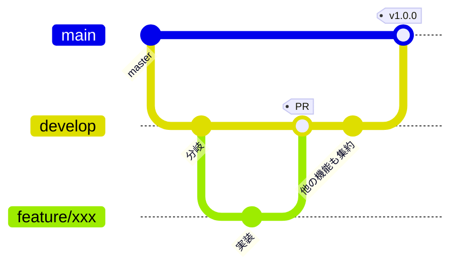

# ブランチ運用方針

どのブランチから分岐し、どこへ PR を向け、どこでリリースするか。
`VehicleVision.Dealer` の体系に合わせつつ、**本リポジトリの事情に合わせて変えた点は
理由を明記する。**

## ブランチの種類

| ブランチ | 役割 | 直接 push | 作業の base |
|---|---|---|---|
| `develop` | 開発を集約する | 不可 | **ここ** |
| `master` | リリース確定状態を保持する | 不可（PR 必須） | 原則不可 |
| 作業ブランチ | 機能追加・修正の単位。`feature/**` `fix/**` | 可 | — |

**既定ブランチは `develop`。** `develop` と `master` を合わせて「根幹ブランチ」と呼ぶ。

> **Dealer との違い。** Dealer は `develop_{バージョン}` / `master_{バージョン}` の
> バージョン別運用だが、**本リポジトリは単一系列でリリースするため版無しで運用する**
> （[`リリース手順書.md`](リリース手順書.md)）。
> 複数バージョンを並行保守する必要が出たら、そこで Dealer と同じ版別運用へ移行する。

## 全体の流れ



| 段階 | 操作 | 実行者 |
|---|---|---|
| 開発開始 | `develop` から作業ブランチを切る | 各開発者 |
| レビュー | 作業ブランチ → `develop` へ PR | 各開発者 |
| 取り込み | 必須チェック通過後に `develop` へマージ | 各開発者 |
| リリース準備 | `develop` → `master` へ PR | リリース担当 |
| リリース | `master` へタグを付けて Release | リリース担当 |

## 守ること

- **`master` へ直接 PR を向けない。** 作業は必ず `develop` 起点
- **PR 本文に `Closes #N` を書く**
- **ドキュメントだけの変更でも PR を通す。** 直接 push で済ませない
- **ブランチ保護のバイパスを通常運用で使わない。** 管理者はバイパスできてしまう

## 作業ツリー（worktree）の切り方

**別ブランチの作業はメインツリーで切り替えず、`git worktree` を切って行う。**

```bash
git worktree add -b feature/xxx \
  ../VehicleVision.PleasanterTools.Questionnaire.worktrees/{Issue番号}-{概要} \
  origin/develop
```

- ディレクトリは `VehicleVision.PleasanterTools.Questionnaire.worktrees/{Issue番号}-{概要}`
- 番号がまだ無いときは `unassigned-{概要}`。採番できたらリネームする
- **使用済みの worktree は片付ける。** ただし**未 push の変更があるツリーは消さない**

## ブランチ保護

**Repository rulesets で設定する**（classic branch protection は使わない）。

| ruleset | 対象 | ルール |
|---|---|---|
| `develop-protection` | `refs/heads/develop` | 削除禁止、force push 禁止 |
| `master-protection` | `refs/heads/master` | 上記に加えて **PR 必須**（承認 0 件） |
| `release-tag-protection` | `refs/tags/v*` | 削除禁止、force push 禁止 |

- **`master` の PR 必須は承認数 0。** レビューを強制するためではなく、
  リリース確定ブランチへ直接 push が入らないようにするための設定
- **リポジトリ管理者と自動化 bot はバイパスできる。** 緊急時の復旧経路を塞がないため。
  **通常運用でバイパスを使わないこと**
- `delete_branch_on_merge` を有効にする。マージすると head ブランチが自動削除される

> **未整備。** **必須ステータスチェックはまだ設定していない。CI が無いため。**
> CI を作ったら、ジョブ名を必須チェックに登録し、この表を更新すること。
> **登録したジョブ名は以後変更しない**（必須チェックの名前と一致している必要がある）。

## ラベルと Milestone

**ラベル名は `{区分番号}-{区分名}:{値}` の形式**（Dealer と同じ体系）。

> **未整備。** 運用を始める時点で Dealer の体系から必要なものを移植すること。
