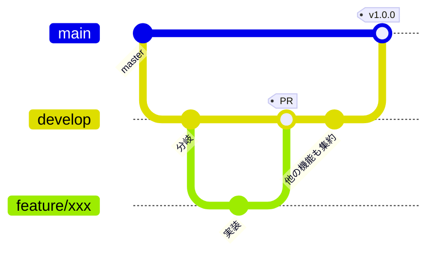

# ブランチ運用方針

どのブランチから分岐し、どこへ PR を向け、どこでリリースするか。
`VehicleVision.Dealer` の体系に合わせつつ、**本リポジトリの事情に合わせて変えた点は
理由を明記する。**

## ブランチの種類

| ブランチ | 役割 | 直接 push | 作業の base |
|---|---|---|---|
| `develop` | 開発を集約する | 不可 | **ここ** |
| `master` | リリース確定状態を保持する | 不可（PR 必須） | 原則不可 |
| 作業ブランチ | 機能追加・修正の単位。`feature/**` `fix/**` | 可 | — |

**既定ブランチは `develop`。** `develop` と `master` を合わせて「根幹ブランチ」と呼ぶ。

> **Dealer との違い。** Dealer は `develop_{バージョン}` / `master_{バージョン}` の
> バージョン別運用だが、**本リポジトリは単一系列でリリースするため版無しで運用する**
> （[`リリース手順書.md`](リリース手順書.md)）。
> 複数バージョンを並行保守する必要が出たら、そこで Dealer と同じ版別運用へ移行する。

## 全体の流れ



| 段階 | 操作 | 実行者 |
|---|---|---|
| 開発開始 | `develop` から作業ブランチを切る | 各開発者 |
| レビュー | 作業ブランチ → `develop` へ PR | 各開発者 |
| 取り込み | 必須チェック通過後に `develop` へマージ | 各開発者 |
| リリース準備 | `develop` → `master` へ PR | リリース担当 |
| リリース | `master` へタグを付けて Release | リリース担当 |

## 守ること

- **作業ブランチは `develop` から分岐させ、PR の base も `develop` にすること**

    ```bash
    git switch develop && git pull
    git switch -c feature/xxx
    gh pr create --base develop --draft --title "WIP: ..."
    ```

- **`master` を base にした PR を出さないこと**
    - リリース確定済みの状態が、レビュー前の変更で動くため
    - リリース時のみ `develop` → `master` の PR を出す（[`リリース手順書.md`](リリース手順書.md)）
    - `master` は PR 必須にしてあるため、直接 push は通らない
- **ドキュメントだけの変更でも PR を通すこと。** 直接 push で済ませない
- **PR 本文に `Closes #N` を書くこと**
- **ブランチ保護のバイパスを通常運用で使わないこと。** 管理者はバイパスできてしまう

## 作業ツリー（worktree）の切り方

**別ブランチの作業は、メインツリーでブランチを切り替えるのではなく `git worktree` を
切って行うこと。** 並列で作業するときだけでなく、単独で 1 ブランチ触るときも同じ扱いにする。

**理由。** 1 つの作業ツリーでブランチを切り替えると、他の作業中の変更やビルド成果物
（`bin/` `obj/` `node_modules/` `_dist/`）を壊す。分岐元から直接 worktree を作れば、
**切り忘れによる誤ったブランチへのコミットも防げる。**

| 項目 | 決まり |
|---|---|
| 置き場所 | 本体リポジトリと並列の `VehicleVision.PleasanterTools.Questionnaire.worktrees/` 配下 |
| ディレクトリ名 | `{PR番号 または Issue番号}-{概要}` |
| 概要の書き方 | 英小文字のケバブケース。何の作業か分かる短い語 |
| 番号が無いとき | `unassigned-{概要}`。**採番できたらリネームすること** |

```bash
# Issue #12 の作業ツリーを、新しいブランチごと切る
git worktree add -b feature/12-answer-validator     ../VehicleVision.PleasanterTools.Questionnaire.worktrees/12-answer-validator     origin/develop

# 既存ブランチのツリーを切る
git worktree add     ../VehicleVision.PleasanterTools.Questionnaire.worktrees/34-rate-limit     feature/34-rate-limit

# 番号がまだ無いとき（採番できたらリネームする）
git worktree add -b fix/xxx     ../VehicleVision.PleasanterTools.Questionnaire.worktrees/unassigned-login-timeout     origin/develop
```

- **番号を先頭に置くこと。** フォルダ名を見ただけでどの Issue / PR の作業か分かる状態を保つ
- **`unassigned-` のまま放置しないこと。** どの作業のツリーか追えなくなる
- 用が済んだツリーは `git worktree remove <パス>` で片付けること
    - 使用済み＝マージ済み、または作業を取りやめたもの
    - **未 push の変更があるツリーは消さないこと。** 退避するか残すかは利用者に確認する
    - **マージ済みかどうかは PR の状態と内容で判断すること。** squash マージのため
      `git cherry` や祖先判定は当てにならない

## 一時成果物の置き場所

- 調査メモ・生成したコマンドリスト・検証用スクリプトなど**その場限りの成果物は
  `temp/{yyyyMMdd}_{内容}/` に出すこと**
- `temp/` は `.gitignore` 済み。コミットしないこと
- リポジトリ直下や各プロジェクト配下へ直接置かないこと。消し忘れが混ざる

## CI の実行条件

**`develop` と `master` を合わせて「根幹ブランチ」と呼ぶ。**

| ワークフロー | ジョブ名（＝チェック名） | 実行契機 |
|---|---|---|
| `.github/workflows/ci.yml` | `ビルドと単体テスト` | 全ブランチへの push、根幹ブランチを対象とする PR |
| 同上 | `フロントエンド` | 同上 |
| 同上 | `ライセンス検査`（`scripts/license-check.sh`） | 同上 |
| `.github/workflows/integration.yml` | `3 RDBMS 結合テスト` | 根幹ブランチへの push、根幹ブランチを対象とする PR |

- **ジョブ名を変えないこと。** 必須ステータスチェックはチェック名で照合するため、
  改名すると「待ち続けるが永遠に来ない」状態になりマージできなくなる
- **単体テストのジョブは結合テストを実行しない。** `QUESTIONNAIRE_INTEGRATION` を
  設定しないと何も検証せずに緑になるため、混ぜると「通った」と誤読する
- **結合テストは 1 ジョブにまとめて直列で回す。** 3 RDBMS を並列のジョブへ分けると、
  同じテーブルを触るテストが互いの行を消し合う

### まだ CI に載せていないもの

| 対象 | 理由 |
|---|---|
| CodeQL | 別 Issue で用意する |
| 依存の脆弱性検査（`dotnet list package --vulnerable` など） | 別 Issue で用意する。更新の PR は Dependabot が出す |
| `scripts/smoke.sh` | 起動している本アプリのコンテナが要る |
| `EndToEndTests` / `AdminAuthEndToEndTests` / `PleasanterApiClientTests` | Pleasanter 本体の検証環境（`implem/pleasanter` ＋ CodeDefiner）が要る |
| Release | 別 Issue で用意する（[`リリース手順書.md`](リリース手順書.md)） |

**Pleasanter を要するものは手元の `docker compose` で確認すること。**
CI が緑でも、そこは検証されていない。

### 依存の更新（Dependabot）

`.github/dependabot.yml` で nuget / npm / github-actions を週次で見る。
**base は `develop`。** 更新 PR にも上表の必須チェックが適用される。

**寛容ライセンス（MIT / BSD 系 / Apache-2.0）以外へ変わった依存は入れないこと**
（[`LICENSING.md`](../LICENSING.md)）。採用を続けるなら [`NOTICE`](../NOTICE) を直す。

## ブランチ保護

**Repository rulesets で設定する**（classic branch protection は使わない）。

| ruleset | 対象 | ルール |
|---|---|---|
| `develop-protection` | `refs/heads/develop` | 削除禁止、force push 禁止 |
| `master-protection` | `refs/heads/master` | 上記に加えて **PR 必須**（承認 0 件） |
| `release-tag-protection` | `refs/tags/v*` | 削除禁止、force push 禁止 |

- **`master` の PR 必須は承認数 0。** レビューを強制するためではなく、
  リリース確定ブランチへ直接 push が入らないようにするための設定
- **リポジトリ管理者と自動化 bot はバイパスできる。** 緊急時の復旧経路を塞がないため。
  **通常運用でバイパスを使わないこと**
- `delete_branch_on_merge` を有効にする。マージすると head ブランチが自動削除される

> **未整備。** **必須ステータスチェックはまだ設定していない。CI が無いため。**
> CI を作ったら、ジョブ名を必須チェックに登録し、この表を更新すること。
> **登録したジョブ名は以後変更しない**（必須チェックの名前と一致している必要がある）。

## ラベルと Milestone

**ラベル名は `{区分番号}-{区分名}:{値}` の形式**（Dealer と同じ体系）。

> **未整備。** 運用を始める時点で Dealer の体系から必要なものを移植すること。
