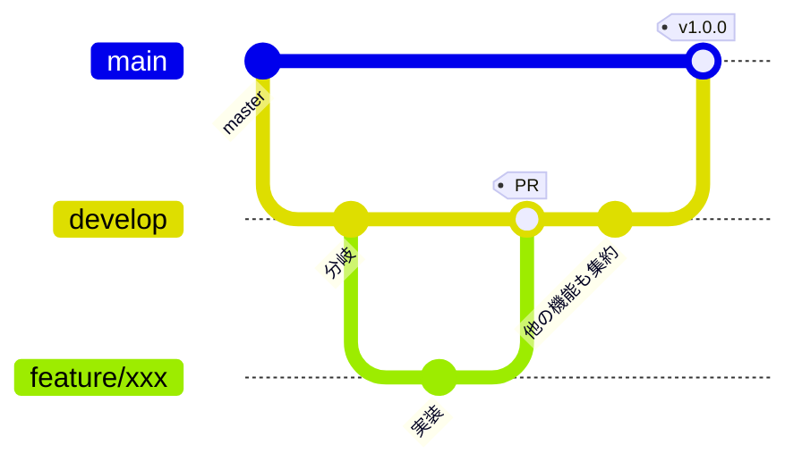

# ブランチ運用方針

どのブランチから分岐し、どこへ PR を向け、どこでリリースするか。
`VehicleVision.Dealer` の体系に合わせつつ、**本リポジトリの事情に合わせて変えた点は
理由を明記する。**

## ブランチの種類

| ブランチ | 役割 | 直接 push | 作業の base |
|---|---|---|---|
| `develop` | 開発を集約する | 不可 | **ここ** |
| `master` | リリース確定状態を保持する | 不可（PR 必須） | 原則不可 |
| 作業ブランチ | 機能追加・修正の単位。`feature/**` `fix/**` | 可 | — |

**既定ブランチは `develop`。** `develop` と `master` を合わせて「根幹ブランチ」と呼ぶ。

> **Dealer との違い。** Dealer は `develop_{バージョン}` / `master_{バージョン}` の
> バージョン別運用だが、**本リポジトリは単一系列でリリースするため版無しで運用する**
> （[`リリース手順書.md`](リリース手順書.md)）。
> 複数バージョンを並行保守する必要が出たら、そこで Dealer と同じ版別運用へ移行する。

## 全体の流れ



| 段階 | 操作 | 実行者 |
|---|---|---|
| 開発開始 | `develop` から作業ブランチを切る | 各開発者 |
| レビュー | 作業ブランチ → `develop` へ PR | 各開発者 |
| 取り込み | 必須チェック通過後に `develop` へマージ | 各開発者 |
| リリース準備 | `develop` → `master` へ PR | リリース担当 |
| リリース | `master` へタグを付けて Release | リリース担当 |

## 守ること

- **作業ブランチは `develop` から分岐させ、PR の base も `develop` にすること**

    ```bash
    git switch develop && git pull
    git switch -c feature/xxx
    gh pr create --base develop --draft --title "WIP: ..."
    ```

- **`master` を base にした PR を出さないこと**
    - リリース確定済みの状態が、レビュー前の変更で動くため
    - リリース時のみ `develop` → `master` の PR を出す（[`リリース手順書.md`](リリース手順書.md)）
    - `master` は PR 必須にしてあるため、直接 push は通らない
- **ドキュメントだけの変更でも PR を通すこと。** 直接 push で済ませない
- **PR 本文に `Closes #N` を書くこと**
- **ブランチ保護のバイパスを通常運用で使わないこと。** 管理者はバイパスできてしまう

## 作業ツリー（worktree）の切り方

**別ブランチの作業は、メインツリーでブランチを切り替えるのではなく `git worktree` を
切って行うこと。** 並列で作業するときだけでなく、単独で 1 ブランチ触るときも同じ扱いにする。

**理由。** 1 つの作業ツリーでブランチを切り替えると、他の作業中の変更やビルド成果物
（`bin/` `obj/` `node_modules/` `_dist/`）を壊す。分岐元から直接 worktree を作れば、
**切り忘れによる誤ったブランチへのコミットも防げる。**

| 項目 | 決まり |
|---|---|
| 置き場所 | 本体リポジトリと並列の `VehicleVision.PleasanterTools.Questionnaire.worktrees/` 配下 |
| ディレクトリ名 | `{PR番号 または Issue番号}-{概要}` |
| 概要の書き方 | 英小文字のケバブケース。何の作業か分かる短い語 |
| 番号が無いとき | `unassigned-{概要}`。**採番できたらリネームすること** |

```bash
# Issue #12 の作業ツリーを、新しいブランチごと切る
git worktree add -b feature/12-answer-validator     ../VehicleVision.PleasanterTools.Questionnaire.worktrees/12-answer-validator     origin/develop

# 既存ブランチのツリーを切る
git worktree add     ../VehicleVision.PleasanterTools.Questionnaire.worktrees/34-rate-limit     feature/34-rate-limit

# 番号がまだ無いとき（採番できたらリネームする）
git worktree add -b fix/xxx     ../VehicleVision.PleasanterTools.Questionnaire.worktrees/unassigned-login-timeout     origin/develop
```

- **番号を先頭に置くこと。** フォルダ名を見ただけでどの Issue / PR の作業か分かる状態を保つ
- **`unassigned-` のまま放置しないこと。** どの作業のツリーか追えなくなる
- 用が済んだツリーは `git worktree remove <パス>` で片付けること
    - 使用済み＝マージ済み、または作業を取りやめたもの
    - **未 push の変更があるツリーは消さないこと。** 退避するか残すかは利用者に確認する
    - **マージ済みかどうかは PR の状態と内容で判断すること。** squash マージのため
      `git cherry` や祖先判定は当てにならない

## 一時成果物の置き場所

- 調査メモ・生成したコマンドリスト・検証用スクリプトなど**その場限りの成果物は
  `temp/{yyyyMMdd}_{内容}/` に出すこと**
- `temp/` は `.gitignore` 済み。コミットしないこと
- リポジトリ直下や各プロジェクト配下へ直接置かないこと。消し忘れが混ざる

## CI の実行条件

**`develop` と `master` を合わせて「根幹ブランチ」と呼ぶ。**

| ワークフロー | ジョブ名（＝チェック名） | 実行契機 | 必須 |
|---|---|---|---|
| `.github/workflows/ci.yml` | `ビルドと単体テスト` | 全ブランチへの push、根幹ブランチを対象とする PR | ○ |
| 同上 | `フロントエンド` | 同上 | ○ |
| 同上 | `ライセンス検査`（`scripts/license-check.sh`） | 同上 | ○ |
| `.github/workflows/integration.yml` | `3 RDBMS 結合テスト` | 根幹ブランチへの push、根幹ブランチを対象とする PR | ○ |
| `.github/workflows/e2e.yml` | `端から端まで通す試験` | 根幹ブランチへの push、日次（03:00 JST）、手動 | — |
| `.github/workflows/codeql.yml` | `CodeQL 前提の確認` | 全ブランチへの push、週次、手動 | — |
| 同上 | `CodeQL 解析（C#）` | 同上 | — |
| 同上 | `CodeQL 解析（TypeScript）` | 同上 | — |
| 同上 | `CodeQL の読み方` | 同上 | — |
| `.github/workflows/dependency-audit.yml` | `NuGet 依存の脆弱性検査` | 全ブランチへの push、週次、手動 | — |
| 同上 | `npm 依存の脆弱性検査` | 同上 | — |
| 同上 | `NOTICE と依存の整合検査`（`scripts/notice-check.sh`） | 同上 | — |
| `.github/workflows/reference-submodule-update.yml` | `上流の最新タグと突き合わせる` | 日次（08:00 JST）、手動 | — |
| `.github/workflows/release.yml` | `リリース検証` / `GitHub Release 作成` | `v*` タグの push、手動（dry-run） | — |

- **ジョブ名を変えないこと。** 必須ステータスチェックはチェック名で照合するため、
  改名すると「待ち続けるが永遠に来ない」状態になりマージできなくなる
    - 「必須」が `—` のものは ruleset へ登録していないため改名しても止まらないが、
      登録する日が来たときに困るので、やはり変えないこと
- **単体テストのジョブは結合テストを実行しない。** `QUESTIONNAIRE_INTEGRATION` を
  設定しないと何も検証せずに緑になるため、混ぜると「通った」と誤読する
- **結合テストは 1 ジョブにまとめて直列で回す。** 3 RDBMS を並列のジョブへ分けると、
  同じテーブルを触るテストが互いの行を消し合う
- **端から端まで通す試験は PR ごとには回さない。** Pleasanter 実機の起動
  （CodeDefiner のスキーマ作成を含む）に数分かかり、PR の待ち時間が延びる。
  根幹ブランチへ入った後と日次で回し、先に確かめたいときは手動で流す
    - **Pleasanter 本体（AGPL v3）は公式イメージを起動するだけ。**
      ソースの参照・コピー・リンク・プロジェクト参照はしない。
      起動しているのは「相手方の実機」であって、本製品の一部ではない

### CodeQL（`codeql.yml`）

**advanced setup（ワークフローを自分で持つ形）で回す。** GitHub 管理の default setup は
実行契機もクエリスイートも制御できず、上表の方針と食い違うため使わない。

| 項目 | 内容 |
|---|---|
| 対象言語 | `csharp`（実ビルドをトレース）、`javascript-typescript`（ビルド無し） |
| クエリスイート | `security-extended`（`.github/codeql/codeql-config.yml`） |
| 結果の置き場所 | Security タブ > Code scanning。**ジョブのログには出ない** |

- ⚠️ **リポジトリで GitHub Advanced Security（Code Security）が有効でないと動かない。**
  本リポジトリは internal のため、無効のままでは解析結果の送信が
  `Advanced Security must be enabled for this repository to use code scanning.` で失敗する
    - **整うまでは `CodeQL 前提の確認` ジョブが解析を飛ばす。** 全ブランチの push で
      回すため、失敗させ続けると「CI が赤いのが普通」の状態になる。
      飛ばしたことは警告とジョブ要約に残るので、**`skipped` を「合格」と読まないこと**
    - 設定はリポジトリの Settings から行う。**有効にするまでこのリポジトリの
      コードは静的解析されていない**
- ⚠️ **アラートの題名と解説は英語のまま。** CodeQL のクエリと解説は GitHub 提供の
  クエリパックに埋め込まれており、日本語へ差し替える口が無い。
  **却下（dismiss）するときの理由は日本語で書くこと**
- ⚠️ **`.svelte` は解析されない。** CodeQL の JavaScript/TypeScript 抽出器の対象外。
  **画面のロジックは `.ts` 側へ置くこと。** `.svelte` へ寄せるほど守備範囲が狭くなる
- **C# は `build-mode: manual` で実ビルドをトレースする。** ビルド無し（`none`）でも
  解析できるが精度が落ちる。`autobuild` にしないのは、ソリューションが `.slnx` で
  自動検出できる保証が無いため

### 依存の脆弱性検査（`dependency-audit.yml`）

| 対象 | 手段 |
|---|---|
| NuGet | `scripts/nuget-vulnerable-check.sh`（`dotnet list package --vulnerable --include-transitive`） |
| npm | `npm audit --audit-level=moderate` と `npm audit signatures` |
| `NOTICE` の整合 | `scripts/notice-check.sh` |

- ⚠️ **`dotnet list package --vulnerable` は、脆弱性を見つけても終了コード 0 を返す。**
  そのまま CI のステップにすると永遠に緑になる。JSON を読んで落とすスクリプトを挟んでいる
- **`actions/dependency-review-action` は使わない。** GitHub の依存関係グラフを前提にする
  action で、internal リポジトリでは Advanced Security の有効化が要る。
  上記 2 つは GitHub 側の有効化状態に関係なく動く
- **週次でも回す。** 脆弱性はこちらのコードが変わらなくても増える

### まだ CI に載せていないもの

| 対象 | 理由 |
|---|---|
| `scripts/smoke.sh` | 起動している本アプリのコンテナが要る |
| `EndToEndTests` / `AdminAuthEndToEndTests` / `PleasanterApiClientTests` | Pleasanter 本体の検証環境（`implem/pleasanter` ＋ CodeDefiner）が要る |

**Pleasanter を要するものは手元の `docker compose` で確認すること。**
CI が緑でも、そこは検証されていない。

### 参照サブモジュールの最新化（`reference-submodule-update.yml`）

**毎日 08:00 JST に、`_reference/Implem.Pleasanter` の固定位置が上流の最新
リリースタグより遅れていないかを見る。** 遅れていれば Issue と Draft PR を自動で出す。

| 段 | 中身 |
|---|---|
| 検出 | `scripts/reference-submodule-check.sh`（上流の `Pleasanter_*` タグを版順に並べ、最大の版と突き合わせる） |
| 起票 | `scripts/reference-submodule-open-pr.sh`（Issue → ブランチ → Draft PR） |

- **`Dependabot` の `gitsubmodule` は使わない。** 追えるのは追跡ブランチの最新コミットだけで、
  **タグを見ない**（[dependabot-core#1639](https://github.com/dependabot/dependabot-core/issues/1639)、
  2026-09-11 参照）。本リポジトリは [`_reference/README.md`](../_reference/README.md) の方針どおり
  リリースタグへ固定しており、未タグのコミットへ動かされると固定の意味が無くなる
- ⚠️ **`Release_*` 系のタグは版の新しさを表していない**（2020 年で更新が止まっている）。
  見るのは `Pleasanter_<x>.<y>.<z>.<w>` だけ
- ⚠️ **版を書いてあるドキュメントは自動で書き換えない。** 「この版の実ソースを根拠にしている」と
  書いてある文書の版だけ機械的に上げると、**確認していない版を根拠にしたことになる。**
  確認先は自動 PR の本文に列挙される
- ⚠️ **検証環境のイメージ（`tools/pleasanter-testenv`）は自動で上げない。**
  上げると E2E が壊れた原因を切り分けられなくなる
- ⚠️ **自動 PR には CI が回らない。** `GITHUB_TOKEN` の push / PR 作成では他のワークフローが
  起動しない。**確かめるには close → reopen する**か、自分のコミットを 1 つ載せる
- ⚠️ **既に同じ版の PR が開いていれば何もしない。** 毎日同じ PR を作らないため

### 依存の更新（Dependabot）

`.github/dependabot.yml` で nuget / npm / github-actions を週次で見る。
**base は `develop`。** 更新 PR にも上表の必須チェックが適用される。

**寛容ライセンス（MIT / BSD 系 / Apache-2.0）以外へ変わった依存は入れないこと**
（[`LICENSING.md`](../LICENSING.md)）。採用を続けるなら [`NOTICE`](../NOTICE) を直す。

## ブランチ保護

**Repository rulesets で設定する**（classic branch protection は使わない）。

| ruleset | 対象 | ルール |
|---|---|---|
| `develop-protection` | `refs/heads/develop` | 削除禁止、force push 禁止、**必須ステータスチェック** |
| `master-protection` | `refs/heads/master` | 上記に加えて **PR 必須**（承認 0 件） |
| `release-tag-protection` | `refs/tags/v*` | 削除禁止、force push 禁止 |

- **`master` の PR 必須は承認数 0。** レビューを強制するためではなく、
  リリース確定ブランチへ直接 push が入らないようにするための設定
- **リポジトリ管理者と自動化 bot はバイパスできる。** 緊急時の復旧経路を塞がないため。
  **通常運用でバイパスを使わないこと**
- `delete_branch_on_merge` を有効にする。マージすると head ブランチが自動削除される

### 必須ステータスチェック

`develop-protection` と `master-protection` の両方へ、
[CI の実行条件](#ci-の実行条件)の 4 つのジョブ名を登録済み。

| チェック名 | 出どころ |
|---|---|
| `ビルドと単体テスト` | `.github/workflows/ci.yml` |
| `フロントエンド` | 同上 |
| `ライセンス検査` | 同上 |
| `3 RDBMS 結合テスト` | `.github/workflows/integration.yml` |

**CodeQL と依存の脆弱性検査は、あえて必須にしていない。**
どちらも「こちらのコードが変わらなくても赤くなる」検査で、
新たに公開された脆弱性やクエリパックの更新で既存コードが引っかかった瞬間、
**その修正 PR 自体がマージできなくなる。** 門番ではなく、気付くための仕掛けとして扱う。

**端から端まで通す試験も必須にしていない。** 根幹ブランチへ入った後に回す作りなので、
PR のマージ判定には間に合わない。**壊れていたら push の直後に気付く**位置付け。

**参照サブモジュールの最新化も必須にしていない。** そもそも PR の検査ではなく、
**上流が動いたことに気付くための仕掛け**である。

- **登録したジョブ名は以後変更しない**（必須チェックの名前と一致している必要がある）
- `strict_required_status_checks_policy` は無効。
  マージ前に base の最新を取り込み直すことまでは求めない
- **ruleset を触るときは、まず現状を GET して差分だけ足すこと。**
  `PUT /repos/{owner}/{repo}/rulesets/{id}` は**送らなかったルールを消す**
  （<https://docs.github.com/en/rest/repos/rules>）

## ラベルと Milestone

**ラベル名は `{区分番号}-{区分名}:{値}` の形式**（Dealer と同じ体系）。

> **未整備。** 運用を始める時点で Dealer の体系から必要なものを移植すること。
