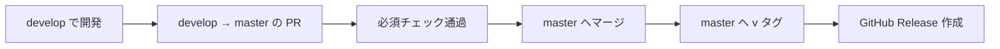

# リリース手順書

## バージョンの付け方

**セマンティックバージョニング（`メジャー.マイナー.パッチ`）を使う。**
タグは `v` を付けて `v1.2.3`。

| 上げるもの | いつ |
|---|---|
| メジャー | **後方互換を壊す変更。** 既存のアンケート定義が読めなくなる、Pleasanter の列の割り当てが変わる、API の互換が切れる |
| マイナー | 機能追加。互換は保つ |
| パッチ | 不具合修正のみ |

- **`1.0.0` 未満は互換を保証しない。** 第 1 弾のリリースまでは `0.x.y` を使う
- プレリリースは `v1.0.0-rc.1` のように付ける

> **Dealer 方式（`X.Y_Rev_YYYYMMDD`）を採らない理由。**
> あちらは特定顧客向けに同一系列を継続的に納品する製品で、日付が版の意味を持つ。
> **本製品はデュアルライセンス（AGPL ＋ 商用）で外部へも配布し得るため、
> 利用者が互換性を判断できる必要がある。** 日付では互換の有無が分からない。

### アセンブリのバージョン

`Directory.Build.props` の `VersionPrefix` を単一の情報源にする。
**各 `.csproj` に個別のバージョンを書かない。**

## リリースの手順

1. **`develop` で対象の変更がすべて入っていることを確認する**
2. **`VersionPrefix` を上げる PR を `develop` へ出す**
3. **`develop` → `master` の PR を出す。** base は `master`
4. 必須チェック通過後にマージする
5. **`master` の該当コミットへ `vX.Y.Z` のタグを付ける**
6. **GitHub Release を作る。** 変更内容を日本語で書く

### タグを付けるとき

- **タグは `master` にだけ付ける。** `develop` へ付けない
- **タグを付け直さない。** `release-tag-protection` で削除・force push を禁止している。
  間違えたら次のパッチ版を出す

## リリース物に含めるもの

| 種別 | 内容 |
|---|---|
| ソース | GitHub が自動で付ける |
| 変更内容 | Release 本文。**日本語** |
| ライセンス | `LICENSE` / `LICENSING.md` / `LICENSE-COMMERCIAL.md` / `NOTICE` |

**`NOTICE` の依存一覧が最新であることをリリース前に確認する。**
デュアルライセンスの前提（依存はすべて寛容ライセンス）が崩れていないかの確認でもある
（[`../LICENSING.md`](../LICENSING.md)）。

## リリース前の確認

- [ ] `dotnet build` が警告 0 で通る
- [ ] 単体テストが通る
- [ ] **3 RDBMS 統合テストが通る**（SQL Server / PostgreSQL / MySQL）
- [ ] `scripts/license-check.sh` が通る
- [ ] `NOTICE` の依存一覧が実際の依存と一致している
- [ ] **破壊的変更があればメジャーを上げている**
- [ ] マイグレーションがある場合、**適用手順を Release 本文に書いている**

> **未整備。** CI・自動リリースワークフローはまだ無い。
> 当面は手順を手で実行し、**CI を作った時点でこの文書を更新すること。**
