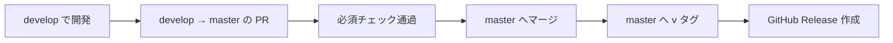
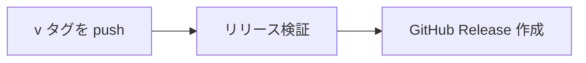

# リリース手順書

## バージョンの付け方

**セマンティックバージョニング（`メジャー.マイナー.パッチ`）を使う。**
タグは `v` を付けて `v1.2.3`。

| 上げるもの | いつ |
| --- | --- |
| メジャー | **後方互換を壊す変更。** 既存のアンケート定義が読めなくなる、Pleasanter の列の割り当てが変わる、API の互換が切れる |
| マイナー | 機能追加。互換は保つ |
| パッチ | 不具合修正のみ |

- **`1.0.0` 未満は互換を保証しない。** 第 1 弾のリリースまでは `0.x.y` を使う
- プレリリースは `v1.0.0-rc.1` のように付ける

> **Dealer 方式（`X.Y_Rev_YYYYMMDD`）を採らない理由。**
> あちらは特定顧客向けに同一系列を継続的に納品する製品で、日付が版の意味を持つ。
> **本製品はデュアルライセンス（AGPL ＋ 商用）で外部へも配布し得るため、
> 利用者が互換性を判断できる必要がある。** 日付では互換の有無が分からない。

### アセンブリのバージョン

`Directory.Build.props` の `VersionPrefix` を単一の情報源にする。
**各 `.csproj` に個別のバージョンを書かない。**

## リリースの手順



1. **`develop` で対象の変更がすべて入っていることを確認する**
2. **`VersionPrefix` を上げる PR を `develop` へ出す**
3. **`develop` → `master` の PR を出す。** base は `master`
4. 必須チェック通過後にマージする
5. **`master` の該当コミットへ `vX.Y.Z` のタグを付けて push する**
6. **GitHub Release ができる。** ここから先は `.github/workflows/release.yml` が行う

**1〜5 は人が行い、6 は自動。** タグを push した時点で Release ワークフローが動く。

### タグを付けるとき

- **タグは `master` にだけ付ける。** `develop` へ付けない
    - Release ワークフローが `git merge-base --is-ancestor` で確かめ、
      含まれていなければ Release を作らずに落とす
- **タグを付け直さない。** `release-tag-protection` で削除・force push を禁止している。
  間違えたら次のパッチ版を出す

```bash
git switch master && git pull
git tag v0.2.0
git push origin v0.2.0
```

## Release ワークフロー

`.github/workflows/release.yml`。**`v*` タグの push で動く。**



| ジョブ | すること |
| --- | --- |
| `リリース検証` | タグの形式・タグが `master` に含まれること・`VersionPrefix` との一致・ビルド・単体テスト・フロントエンド・`license-check.sh`・`notice-check.sh`・配置用 ZIP |
| `GitHub Release 作成` | 日本語の本文を組み立てて `gh release create`。配置用 ZIP、SHA-256、ライセンス 4 ファイルを添付 |

- **Release 本文は前回のタグからのコミット件名で組み立てる。**
  squash マージの運用なので、件名がそのまま PR のタイトル（日本語）になっている
    - `gh release create --generate-notes` は使わない。見出しが英語で入るため
    - ⚠️ **自動生成された本文には目を通すこと。** マイグレーションの適用手順など、
      コミット件名に出てこないものは入らない
- **プレリリース（`v1.0.0-rc.1`）は自動で prerelease 印が付く**
- **`3 RDBMS 結合テスト` はここでは回さない。** タグは `master` 上のコミットへ付ける
  決まりで、そのコミットは `master` への push 時点で `integration.yml` が検証済み

### dry-run

**リリース経路はリリース時にしか動かないため、壊れていても次のリリースまで気付けない。**
`workflow_dispatch` の `dry_run`（既定 `true`）で、Release の作成だけを外して
検証部分を通せる。**リリース作業に入る前に一度回すこと。**

```bash
gh workflow run release.yml -f dry_run=true
```

## リリース物に含めるもの

| 種別 | 内容 |
| --- | --- |
| ソース | GitHub が自動で付ける |
| 配置用 ZIP | `VehicleVision.PleasanterTools.Questionnaire-X.Y.Z.zip`。Azure Web App／IIS 共用 |
| チェックサム | 配置用 ZIP と同名の `.zip.sha256` |
| 変更内容 | Release 本文。**日本語** |
| ライセンス | `LICENSE` / `LICENSING.md` / `LICENSE-COMMERCIAL.md` / `NOTICE` |

配置用 ZIP の直下は、そのまま Web アプリの配置先になる。Release ワークフローは
次が含まれることを検査してから ZIP を作り、SHA-256 を再検査して Release へ渡す。

- サーバ DLLと IIS 用 `web.config`
- `wwwroot/index.html` と `wwwroot/admin.html`
- `App_Data/Parameters/README.md`
- ライセンス 4 ファイル

導入と更新は[`導入-更新運用手順書.md`](導入-更新運用手順書.md)を参照する。

**`NOTICE` の依存一覧が最新であることをリリース前に確認する。**
デュアルライセンスの前提（依存はすべて寛容ライセンス）が崩れていないかの確認でもある
（[`../LICENSING.md`](../LICENSING.md)）。

## リリース前の確認

| 確認項目 | 誰が |
| --- | --- |
| `dotnet build` が警告 0 で通る | Release ワークフロー（`TreatWarningsAsErrors=true`） |
| 単体テストが通る | Release ワークフロー |
| **3 RDBMS 結合テストが通る**（SQL Server / PostgreSQL / MySQL） | `integration.yml`（`master` への push 時） |
| `scripts/license-check.sh` が通る | Release ワークフロー |
| `NOTICE` の依存一覧が実際の依存と一致している | `scripts/notice-check.sh`（Release ワークフローと `dependency-audit.yml`） |
| 配置用 ZIP に DLL、画面、設定の説明、ライセンスが含まれ、SHA-256 が一致する | Release ワークフロー |
| **破壊的変更があればメジャーを上げている** | **人** |
| マイグレーションがある場合、**適用手順を Release 本文に書いている** | **人**（自動生成の本文へ追記する） |
| 依存のライセンスが寛容ライセンスのままか | **人**（[`../LICENSING.md`](../LICENSING.md)） |

**「人」の欄は機械で確かめられないもの。** ワークフローが緑でも確認は要る。

> **タグは付け直せない。** 検証はタグを push した後に走るので、
> 失敗したら次のパッチ版を出すことになる。
> **リリース作業に入る前に dry-run を回しておくこと。**
