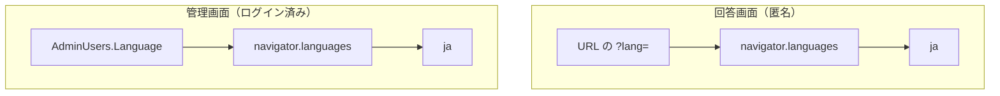

# 多言語対応方針

**アンケートの中身（設問・選択肢・見出し）と、画面自身の文言は別物として扱う。**
前者は利用者が入力するデータで `LocalizedText` に載る（[`データモデル設計.md`](データモデル設計.md) 2.3）。
後者は本アプリが持つ文言で、この文書が扱うのはこちら側の決め事。

器として対応する言語は **7 つ**。画面の文言カタログは、翻訳が揃ったものから追加する。
未翻訳の言語を選んでも、画面自身の文言は英語（`en`）を経て日本語（`ja`）へ落ちるため、器だけを先に開けても
画面は壊れない。

| 本アプリのコード | 言語 | 画面カタログ |
|---|---|---|
| `en` | 英語 | 翻訳済み |
| `zh` | 中国語 | 未翻訳（`en`、`ja` の順にフォールバック） |
| `ja` | 日本語 | 翻訳済み |
| `de` | ドイツ語 | 未翻訳（`en`、`ja` の順にフォールバック） |
| `ko` | 韓国語 | 未翻訳（`en`、`ja` の順にフォールバック） |
| `es` | スペイン語 | 未翻訳（`en`、`ja` の順にフォールバック） |
| `vi` | ベトナム語 | 未翻訳（`en`、`ja` の順にフォールバック） |

> **Pleasanter との境界だけ、ベトナム語は `vi` と `vn` を読み替える。**
> 本アプリとブラウザでは ISO 639-1 の `vi` を使い、Pleasanter へ渡す直前に `vn` へ、
> Pleasanter から受け取った直後に `vi` へ変換する。この変換は
> `Core/Localization/SupportedLanguages.cs` にだけ置く。`navigator.languages` は `vi` を
> 返すため、アプリ内で `vn` を使うと自動判定が効かない。

## 1. 落とし先

| 対象 | 落とす順 | 理由 |
|---|---|---|
| 画面自身の文言 | 選択した言語 → `en` → `ja` | 日本語を読めない利用者にも、まず英語で操作できるようにする。`en` にも文言が無ければ、全鍵を持つ `ja` へ落として空欄を防ぐ |
| アンケートの中身（`LocalizedText`） | 選択した言語 → `ja` | 作成者が日本語で入力した設問・選択肢・見出しを空欄にしない |

**アンケートの中身が未翻訳のときは `LocalizedText.DefaultLanguage`（`ja`）へ落とす。**
設問が 1 つ訳されていないだけで画面が空になっては困る。

**画面自身の文言は `UI_FALLBACK_LANGUAGE`（`en`）を経て `ja` へ落とす。**
言語選択やアンケートの中身に使う `DEFAULT_LANGUAGE` は `ja` のまま変えない。

- 対応外の言語コードが来ても**例外にしない。** 「指定されなかった」として扱う
  （`Core/Localization/SupportedLanguages.cs`）
- **地域は見ない。** `en-US` も `en-GB` も `en`。
  地域ごとに文言を分けると、翻訳の抜けを見つけるのが一気に難しくなる

## 2. 言語の決め方

### 回答画面

**回答者は完全匿名なので、サーバに言語を覚えさせない。**

1. URL の `?lang=ja` / `?lang=en`（**共有される URL に載る。これが一番強い**）
2. ブラウザの言語設定（`navigator.languages`。`Accept-Language` と同じ出どころ）
3. `ja`

**画面上の言語切り替えは URL を書き換えるだけ**にする。
Web Storage にも Cookie にもサーバにも残さない。3 章を参照。

### 管理画面

1. **利用者ごとの設定**（`AdminUsers.Language`。ログインすれば端末を変えても付いてくる）
2. ブラウザの言語設定
3. `ja`

**サーバが返す文言は `Accept-Language` で決める。**
管理画面は自分が使っている言語を要求ヘッダに明示して送るので、
画面の文言とサーバから返る文言が食い違わない
（`fetch` は `Accept-Language` を上書きできる）。

> **`AdminUsers.Language` はサーバ側の文言の決定に使わない。**
> 使うと、要求ごとに管理者を 1 行読み直すことになるうえ、
> 画面が実際に描いている言語と食い違い得る。**設定は画面の初期値を決めるためのもの。**

## 3. 匿名性への影響

**言語の選択を回答者の追跡に使えるようにしない**（[`非機能設計.md`](非機能設計.md) 1 章）。

- **回答画面はサーバへ言語を送らない。** 定義は全言語ぶんが 1 つの JSON で届き、
  どの言語で描くかはブラウザの中だけで決まる
- **回答に言語を記録しない。** 送信する内容へ言語コードを含めない
- **言語の選択を保存しない。** localStorage / Cookie に置くと、
  「回答済みの印」と組み合わさって回答者を絞り込む材料が 1 つ増える
- `Accept-Language` は要求すれば必ず届く値なので**新たに増える情報は無い**が、
  ログに残さないこと

## 4. 文言の持ち方

| 場所 | 置き場所 | 鍵の抜けの見つけ方 |
|---|---|---|
| 回答画面 | `Frontend/src/lib/i18n/messages.ts` | 型で落ちる（`svelte-check`） |
| 管理画面 | `Frontend/src/admin/lib/i18n/messages.ts` | 型で落ちる（`svelte-check`） |
| サーバが返す文言 | `Web/Localization/ServerMessages.cs` | 単体テストで落ちる |

**日本語のカタログが鍵の一覧そのもの。** 英語のカタログは
`Record<MessageKey, string>` として書くので、**足し忘れると型検査で落ちる**。
`npm run check` と `npm run build` の両方が `svelte-check` を通す。

サーバ側は `ServerMessageKeys` の定数とカタログの鍵が
**厳密に一致していること**を単体テストで見る。
定数を足してカタログへ入れ忘れても、その逆でも落ちる。

**3 言語目以降は `AddAll`（言語ごとの辞書で渡す口）で足す。**
2 言語ぶんの `Add` は、既存の 46 件をそのまま書き続けるために残してある。

### 書式

**日付・数値は `Intl` に言語を渡して整形する。**
`toLocaleString('ja-JP')` のように言語を焼き付けない。

- 日付時刻: `Intl.DateTimeFormat`（`ja` → `ja-JP`、`en` → `en-US`）
- 数値: `Intl.NumberFormat`

**保存値の解釈には使わない**（[`アーキテクチャ方針.md`](アーキテクチャ方針.md) 6 章）。
整形は表示の直前だけで行う。

## 4.1 7 言語の器を開けるときに触る場所（Issue #195）

**実際に 3 言語目（`zh`）を足してみて、何が起きるかを確かめた**（2026-09-14）。
**器は足りている。** 7 言語ぶんの器を開けるときに触るのは次の 4 か所だけで、
**それ以外はどこも壊れなかった**（型検査が出した誤りがちょうど 4 件）。

| 触る場所 | 中身 |
|---|---|
| `Frontend/src/lib/i18n/language.ts` | `Language` 型・`SUPPORTED_LANGUAGES`・`LANGUAGE_NAMES`・`LOCALES` |
| `Frontend/src/lib/i18n/messages/` | 回答画面のカタログ（未翻訳言語は `en`、`ja` の順にフォールバック） |
| `Frontend/src/admin/lib/i18n/messages/` | 管理画面のカタログ（未翻訳言語は `en`、`ja` の順にフォールバック） |
| `Core/Localization/SupportedLanguages.cs` | `All` へ言語コードを足す |

- **サーバ側（C#）は、言語コードを足すだけでビルドが通る。**
  カタログに無い言語は `en`、`ja` の順に落ちる（1 章）
- **`ServerMessages` の文言（46 件）は、2 言語ぶんの書き方で書かれている。**
  3 言語目以降は `AddAll`（言語ごとの辞書で渡す口）で足せるようにしてある
- **言語を選ぶ UI は決め打ちになっていない。** `SUPPORTED_LANGUAGES` を回しているだけ
- **書式は `LOCALES` へ 1 行足すだけ**（`zh` → `zh-CN` など）

### ⚠️ 同梱している書体では中国語を出せない

**実測した**（2026-09-14）。同梱の Noto Sans JP の `unicode-range` に、
**簡体字にしか無い字（`U+7B80` 简・`U+8FB9` 边・`U+8FD9` 这）が入っていない**
（日本語にもある `U+65E5` 日 は入っている）。

**中国語を足すなら、書体も足すことになる。** 足さなければ、
回答者の端末が持っている書体で表示され、**端末によって見え方が変わる。**
書体は **SIL OFL 1.1 まで可**（2026-09-08 決定。[`../NOTICE`](../NOTICE)）。

> **右から左に書く言語（RTL）は、この確認の範囲外。**
> 字の並びだけでなく画面の作りに効くので、必要になった時点で別に確かめること。

## 5. 管理画面での入力

**設問・選択肢・見出しは言語ごとに入力できる。**
編集する言語を画面上部で切り替え、入力欄はその言語へ書き込む。

- **`LocalizedText` の器は変えない。** 変えると過去の版が読めなくなる
  （[`データモデル設計.md`](データモデル設計.md) 2.3）
- **空にした言語は鍵ごと消す。** 空文字を残すと、
  `LocalizedText.Get` が既定の言語へ落ちずに空文字を返してしまう
- **他の言語を巻き込まない。** 編集していない言語の値はそのまま保つ
