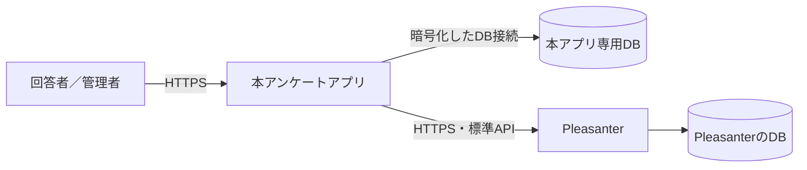

# 導入・更新運用手順書

本書は、VehicleVision.PleasanterTools.Questionnaire を **Docker を使わずに**導入・更新する
運用者向けの手順書である。対象は次の 2 構成。

- Azure App Service の Windows Web App
- オンプレミス Windows Server の IIS

いずれも GitHub Release の同じ配置用 ZIP を使う。アプリは .NET 10 の
フレームワーク依存配置であり、実行先に .NET 10 のランタイムが必要となる。

## 1. 最初に確認すること

### 1.1 構成



**本アプリ専用 DB と Pleasanter の DB は別にする。** 同じ DB サーバを共用してもよいが、
同じデータベースへ本アプリのマイグレーションを適用してはならない。本アプリは
Pleasanter の DB へ直結せず、標準 Web API だけを使う
（[`アーキテクチャ方針.md`](アーキテクチャ方針.md) 13 章）。

### 1.2 対応する DB

| RDBMS | `QUESTIONNAIRE_DB_PROVIDER` |
| --- | --- |
| SQL Server / Azure SQL Database | `SqlServer` |
| PostgreSQL | `PostgreSql` |
| MySQL | `MySql` |

マイグレーションは FluentMigrator による**前方適用のみ**で、アプリ起動時には自動適用しない。
通常起動時に未適用のマイグレーションが見つかると、アプリは安全のため起動を中止する
（[`MigrationCommand.cs`](../src/VehicleVision.PleasanterTools.Questionnaire.Web/MigrationCommand.cs#L5-L85)、
[`Program.cs`](../src/VehicleVision.PleasanterTools.Questionnaire.Web/Program.cs#L333-L350)）。

### 1.3 用意するもの

- 導入する版の GitHub Release にある次の 2 ファイル
    - `VehicleVision.PleasanterTools.Questionnaire-X.Y.Z.zip`
    - 同名の `.zip.sha256`
- .NET 10 を実行できる Azure Web App、または .NET 10 Hosting Bundle を入れた IIS
- 本アプリ専用の空 DB
- 本アプリから到達できる Pleasanter と、その API キー
- 本アプリ用の DNS 名と HTTPS 証明書
- DB と Pleasanter API キーを保存する秘密情報の管理場所

## 2. 配置用 ZIP を確認する

Release Actions は、サーバ DLL、IIS 用 `web.config`、回答画面、管理画面、設定の説明、
ライセンス文書を 1 つの ZIP にする。ZIP の直下がそのまま Web アプリの配置先になる。

ダウンロード後、SHA-256 を確認する。

```powershell
$version = "X.Y.Z"
$zip = "VehicleVision.PleasanterTools.Questionnaire-$version.zip"
$expected = (Get-Content "$zip.sha256").Split(' ', [System.StringSplitOptions]::RemoveEmptyEntries)[0]
$actual = (Get-FileHash $zip -Algorithm SHA256).Hash.ToLowerInvariant()
if ($actual -ne $expected.ToLowerInvariant()) {
    throw "配置用 ZIP の SHA-256 が一致しません"
}
```

資格情報の実値は ZIP に含まれない。ZIP を展開して、少なくとも次が存在することを確認する。

```text
VehicleVision.PleasanterTools.Questionnaire.Web.dll
web.config
wwwroot/index.html
wwwroot/admin.html
App_Data/Parameters/README.md
LICENSE
LICENSING.md
LICENSE-COMMERCIAL.md
NOTICE
```

### 2.1 Release ZIP がまだ無い版をソースから作る場合

正式な配布には Release ZIP を使う。過去の Release など、配置用 ZIP が添付されていない版を
やむを得ず配置するときだけ、タグを checkout したソースから作る。

```powershell
$version = "X.Y.Z"
$publish = Join-Path $PWD "temp\publish-$version"

Push-Location src\VehicleVision.PleasanterTools.Questionnaire.Frontend
npm ci
npm run build
Pop-Location

dotnet restore VehicleVision.PleasanterTools.Questionnaire.slnx
dotnet publish src\VehicleVision.PleasanterTools.Questionnaire.Web `
    --no-restore -c Release -o $publish

Copy-Item App_Data $publish -Recurse
Copy-Item LICENSE,LICENSING.md,LICENSE-COMMERCIAL.md,NOTICE $publish
Compress-Archive -Path "$publish\*" `
    -DestinationPath "VehicleVision.PleasanterTools.Questionnaire-$version.zip"
```

**`npm run build` を先に行う。** 省くと `dotnet publish` 自体は成功しても、回答画面と管理画面が
入っていない配置物になる。ビルド環境には `global.json` の .NET SDK と、フロントエンドの
`package.json` が要求する Node.js が必要である。

## 3. DB と共通設定を用意する

### 3.1 空 DB を作る

DB サーバ側の管理手順に従い、空のデータベースを作る。FluentMigrator はテーブルや索引を作るが、
**データベース自体は作らない。** SQL Server では接続文字列に存在しない DB 名を書いても作成されない。

例として DB 名を次のようにする。

| RDBMS | DB 名の例 | 注意 |
| --- | --- | --- |
| SQL Server / Azure SQL | `Questionnaire` | Pleasanter の DB とは別に作る |
| PostgreSQL | `questionnaire` | Pleasanter の DB とは別に作る |
| MySQL | `questionnaire` | 文字セットを `utf8mb4` にする |

DB アカウントは次の 2 用途を分けることを推奨する。

| 用途 | 権限 |
| --- | --- |
| マイグレーション用 | 本アプリ専用 DB 内でテーブル、列、索引を作成・変更できる権限 |
| アプリ実行用 | マイグレーション後の本アプリ用テーブルに対する必要最小限の読み書き権限 |

同じ接続設定キーを使うため、マイグレーション実行時だけマイグレーション用接続文字列を
実行プロセスへ渡し、Web アプリには実行用接続文字列を設定する。

### 3.2 必須設定

次を**環境変数**として与える。資格情報を `appsettings.json`、配置用 ZIP、ソース管理へ書かない。

| 設定 | 内容 |
| --- | --- |
| `ASPNETCORE_ENVIRONMENT` | `Production` |
| `QUESTIONNAIRE_DB_PROVIDER` | `SqlServer` / `PostgreSql` / `MySql` |
| `QUESTIONNAIRE_DB_CONNECTIONSTRING` | 本アプリ専用 DB の接続文字列 |
| `QUESTIONNAIRE_PLEASANTER_BASEURL` | Pleasanter のベース URL |
| `QUESTIONNAIRE_PLEASANTER_APIKEY` | Pleasanter の API キー |
| `QUESTIONNAIRE_PLEASANTER_TIMEZONE` | API キーユーザのタイムゾーン。日本なら `Asia/Tokyo` |
| `QUESTIONNAIRE_SECRET_KEY` | 32 バイト乱数の Base64。失うと登録済みの 2 要素が使えなくなる |

秘密鍵は配置用 ZIP の DLL で生成できる。標準出力へ 1 回だけ出るため、そのまま秘密情報の
管理場所へ登録し、平文ファイルへ残さない。

```powershell
dotnet .\VehicleVision.PleasanterTools.Questionnaire.Web.dll --generate-secret-key
```

`QUESTIONNAIRE_SECRET_KEY` は更新のたびに作り直さず、同じ環境では同じ値を維持する。

DB 接続は暗号化と接続先証明書の検証が必須である。実装が許す条件は
[`ConnectionSecurity.cs`](../src/VehicleVision.PleasanterTools.Questionnaire.Data/ConnectionSecurity.cs#L30-L119)を参照する。

| RDBMS | 本番接続の要点 |
| --- | --- |
| SQL Server | `Encrypt=True;TrustServerCertificate=False` |
| PostgreSQL | `Ssl Mode=VerifyCA` または `VerifyFull` |
| MySQL | `SslMode=VerifyCA` または `VerifyFull` |

`QUESTIONNAIRE_DB_ALLOW_INSECURE=true` と
`QUESTIONNAIRE_DB_SKIP_MIGRATION_CHECK=true` は検証用の逃げ道である。**本番では設定しない。**

### 3.3 マイグレーションの共通コマンド

配置用 ZIP を展開したディレクトリで実行する。

```powershell
# 未適用のものを表示するだけ。未適用があれば終了コード 1
dotnet .\VehicleVision.PleasanterTools.Questionnaire.Web.dll --migrate-status

# DB の起動を最大 180 秒待ち、未適用のものを前方適用する
dotnet .\VehicleVision.PleasanterTools.Questionnaire.Web.dll --migrate --wait-for-db=180

# もう一度確認する。終了コード 0 なら適用済み
dotnet .\VehicleVision.PleasanterTools.Questionnaire.Web.dll --migrate-status
if ($LASTEXITCODE -ne 0) {
    throw "未適用のDBマイグレーションがあります"
}
```

`--migrate` を Web アプリの常設の起動引数にしてはならない。マイグレーションが終わると
プロセスは終了するため、Web アプリが再起動を繰り返す。

## 4. Azure App Service（Windows Web App）へ導入する

### 4.1 Web App を作る

Azure portal で次を作成する。

1. Pleasanter と同じ App Service プラン、または要件に合う別プランへ
   **本アプリ専用の Windows Web App**を作る
2. ランタイムスタックを `.NET 10` にする
3. HTTPS のみを有効にする
4. 常駐する送信ワーカーを止めないため、**Always On**を有効にする
5. Health check のパスを `/healthz` にする
6. カスタムドメインと管理済み証明書、または組織の証明書を設定する

Pleasanter の Web Appへ本アプリを上書きせず、別の Web App として作る。配置の決定事項は
[`アーキテクチャ方針.md`](アーキテクチャ方針.md) 14 章を参照する。

`/healthz` はプロセスの生存だけを返す。DB と Pleasanter の疎通を確認する readiness check ではないため、
導入後の確認では管理画面とテスト用アンケートも確認する。

### 4.2 アプリ設定を登録する

Azure portal の Web App の環境変数へ、3.2 の設定を登録する。秘密情報は可能なら
App Service の Key Vault 参照にする。少なくとも次はデプロイスロット設定にして、swap で
別環境の値と入れ替わらないようにする。

- `QUESTIONNAIRE_DB_CONNECTIONSTRING`
- `QUESTIONNAIRE_PLEASANTER_BASEURL`
- `QUESTIONNAIRE_PLEASANTER_APIKEY`
- `QUESTIONNAIRE_PLEASANTER_TIMEZONE`
- `QUESTIONNAIRE_SECRET_KEY`

日本時間で運用する場合は、Web App の環境変数へ次も登録する。

```text
WEBSITE_TIME_ZONE=Tokyo Standard Time
```

設定値を CLI の引数へ直接書くと、シェル履歴や操作ログへ秘密が残り得る。portal、Key Vault 参照、
または秘密を保護できる CI/CD から登録する。

### 4.3 初回配置とDB作成

配置用 ZIP は展開せずに Zip Deploy する。

```powershell
$resourceGroup = "<リソースグループ>"
$webApp = "<Web App名>"
$zip = ".\VehicleVision.PleasanterTools.Questionnaire-X.Y.Z.zip"

az webapp deploy `
    --resource-group $resourceGroup `
    --name $webApp `
    --src-path $zip
```

初回は DB が空なので、通常プロセスは未適用マイグレーションを検出して起動を中止する。
Azure portal から Web App の Kudu（高度なツール）を開き、Debug console で
`site/wwwroot` へ移動して次を実行する。

```powershell
dotnet .\VehicleVision.PleasanterTools.Questionnaire.Web.dll --migrate --wait-for-db=180
dotnet .\VehicleVision.PleasanterTools.Questionnaire.Web.dll --migrate-status
```

Kudu のコンソールにも Web App の環境変数が渡る。Web App に実行用の最小権限しか与えない構成では、
DB へ到達できる保護された運用端末または CI/CD ジョブで、マイグレーション用接続文字列を
一時的なプロセス環境変数として与えて同じ DLL を実行する。

マイグレーション完了後に Web App を再起動する。

### 4.4 スロットを使う場合

本番とステージングで、DB と Pleasanter の接続先も分ける。本番 DB にステージングの試験データを
書かないよう、3.2 の接続設定をすべてデプロイスロット設定にする。

```powershell
az webapp deploy `
    --resource-group $resourceGroup `
    --name $webApp `
    --slot staging `
    --src-path $zip
```

ステージングで 4.6 の確認を終えてから swap する。ただし DB マイグレーションを含む版では、
**新旧アプリの両方が移行後スキーマで動けると Release 本文に明記された場合だけ**無停止 swap を行う。
明記が無い場合はメンテナンス時間を設け、4.5 の順序で更新する。

### 4.5 更新する

1. Release 本文でマイグレーションの有無と破壊的変更を確認する
2. 配置用 ZIP と `.sha256` を取得し、SHA-256 を確認する
3. DB をバックアップし、復元手順を確認する
4. 回答受付を止めるメンテナンス時間に入る
5. 新版の DLL で `--migrate-status`、`--migrate`、再度 `--migrate-status` を実行する
6. 新版 ZIP を Zip Deploy する
7. Web App を再起動し、4.6 を確認する
8. 問題が無ければ回答受付を再開する

DB の移行は前方のみである。コードだけ旧版へ戻せるとは限らない。移行後スキーマと旧版の互換性が
Release 本文で保証されていなければ、ロールバックは**旧版 ZIP と移行直前の DB バックアップを組にして**行う。

### 4.6 動作確認

```powershell
$baseUrl = "https://<本アプリのホスト名>"
Invoke-RestMethod "$baseUrl/healthz"
```

続けて次を人が確認する。

- `$baseUrl/admin` が表示され、初回管理者を設定または既存管理者でログインできる
- テスト用アンケートを表示できる
- テスト回答が本アプリの送信待ちを経て Pleasanter へ登録される
- 管理画面の未送信件数が継続的に増えていない
- App Service のログに資格情報や回答本文が出ていない

## 5. オンプレミス IIS へ導入する

### 5.1 IIS と .NET を用意する

1. Windows Serverへ IIS の Web Server 役割を追加する
2. **IIS の追加後に** .NET 10 Hosting Bundle をインストールする
3. Hosting Bundle のインストーラが要求した場合はサーバ、または IIS サービスを再起動する
4. `dotnet --list-runtimes` で `Microsoft.AspNetCore.App 10.` が表示されることを確認する

Hosting Bundle は .NET ランタイムと ASP.NET Core Module を IISへ登録する。IISより先に
Hosting Bundleを入れていた場合は、IIS追加後に Hosting Bundleを修復インストールする。

### 5.2 専用サイトとアプリケーションプールを作る

IIS Manager で次を作成する。

| 項目 | 設定例 |
| --- | --- |
| サイト名 | `Questionnaire` |
| アプリケーションプール | `QuestionnairePool` |
| .NET CLR version | `No Managed Code` |
| Managed pipeline mode | `Integrated` |
| Enable 32-Bit Applications | `False` |
| 物理パス | `C:\inetpub\Questionnaire\current` |
| バインド | 組織の DNS 名、HTTPS 443、正式な証明書 |

IIS アプリケーションプールの ID に、配置先フォルダの「読み取りと実行」権限を与える。
本アプリは通常、配置先へ書き込まない。障害調査で `web.config` の stdout log を一時的に有効にする場合だけ、
専用ログフォルダへ書き込み権限を追加し、調査後に無効化する。

### 5.3 環境変数を設定する

3.2 の設定を `QuestionnairePool` 専用の環境変数として登録する。IIS Manager の
Configuration Editor で `system.applicationHost/applicationPools` の対象プールにある
`environmentVariables`へ登録すれば、同じサーバの別アプリと設定を分離できる。

資格情報を配置フォルダの `web.config` へ直書きしない。IIS 設定ファイル自体も管理者だけが読めるようにし、
組織の秘密情報管理製品からプロセス環境へ注入できる場合はそちらを優先する。変更後は
`QuestionnairePool`をリサイクルする。

### 5.4 初回配置する

版ごとのディレクトリへ ZIP を展開する。ZIP 自体を IIS の物理パスには置かない。

```powershell
$version = "X.Y.Z"
$zip = "VehicleVision.PleasanterTools.Questionnaire-$version.zip"
$releaseDir = "C:\inetpub\Questionnaire\releases\$version"
New-Item -ItemType Directory -Path $releaseDir -Force
Expand-Archive -Path $zip -DestinationPath $releaseDir
```

管理者 PowerShellで、マイグレーション用の接続設定をそのプロセスだけに与え、3.3 の
`--migrate` と `--migrate-status` を実行する。その後、IISサイトの物理パスを
`$releaseDir`へ設定し、サイトと `QuestionnairePool`を開始する。

### 5.5 更新する

1. Release 本文を確認し、ZIP の SHA-256 を検証する
2. 新版を新しい `releases\X.Y.Z` へ展開する。旧版フォルダへ上書きしない
3. DB をバックアップし、復元手順を確認する
4. IIS サイトを停止して回答受付を止める
5. 新版 DLL から `--migrate-status`、`--migrate`、再度 `--migrate-status` を実行する
6. IIS サイトの物理パスを新版のディレクトリへ切り替える
7. アプリケーションプールとサイトを開始する
8. 5.6 を確認する
9. 問題が無ければ、組織の保存期間に従って古い配置物とバックアップを整理する

ファイルを稼働中のフォルダへ上書きすると、DLL が新旧混在した状態でプロセスが再起動し得る。
必ず版ごとの別ディレクトリへ展開してから物理パスを切り替える。

ロールバック条件は Azure と同じである。移行後スキーマと旧版の互換性が保証されていなければ、
旧版フォルダへ戻すだけでは足りず、移行直前の DB バックアップも復元する。

### 5.6 動作確認

```powershell
$baseUrl = "https://<本アプリのホスト名>"
Invoke-RestMethod "$baseUrl/healthz"
```

4.6 と同じ管理画面、テスト回答、Pleasanter 登録、滞留件数、ログを確認する。加えて Windows の
イベントビューアーと IIS ログに ASP.NET Core Module の起動エラーが無いことを確認する。

## 6. 障害時の切り分け

| 症状 | 最初に確認すること |
| --- | --- |
| `HTTP Error 500.30` | アプリ設定の不足、DB 接続の暗号化条件、未適用マイグレーション、イベントログ |
| `HTTP Error 500.31` | .NET 10 Hosting Bundle／App Service ランタイムスタック |
| `DB のスキーマが古い` | 新版 DLL で `--migrate-status` を実行し、未適用一覧を見る |
| DBへ接続できない | DB名、DNS、ファイアウォール、TLS証明書、実行ユーザの権限 |
| 画面が404または空 | `wwwroot/index.html` と `wwwroot/admin.html` が配置されているか |
| 回答は受け付けるがPleasanterへ届かない | Pleasanter URL・APIキー・APIキーユーザの権限、管理画面の滞留と知らせ |
| 再送が進まない | App Service の Always On、IISアプリプールの停止・アイドル設定 |
| HTTPSへリダイレクトし続ける | リバースプロキシの `X-Forwarded-Proto` と HTTPS バインド |

例外ログへ接続文字列、API キー、回答本文を貼らない。問い合わせ時は秘密部分を伏せ、版、RDBMS、
終了コード、未適用マイグレーション名、HTTPステータスを伝える。

## 7. 外部仕様の根拠

以下は Microsoft の一次資料を **2026-08-30** に参照した。Azure portal、Azure CLI、IIS、
.NET Hosting Bundle の操作は変わり得るため、導入時にも最新版を確認する。

- [Host ASP.NET Core on Windows with IIS](https://learn.microsoft.com/aspnet/core/host-and-deploy/iis/)
  — Hosting Bundle、ASP.NET Core Module、アプリケーションプール、`web.config`
- [Deploy files to App Service](https://learn.microsoft.com/azure/app-service/deploy-zip)
  — Zip Deploy と `az webapp deploy`
- [Configure an App Service app](https://learn.microsoft.com/azure/app-service/configure-common)
  — アプリ設定、Always On、全般設定
- [Set up staging environments in Azure App Service](https://learn.microsoft.com/azure/app-service/deploy-staging-slots)
  — デプロイスロット、スロット固有設定、swap
- [Monitor App Service instances using Health check](https://learn.microsoft.com/azure/app-service/monitor-instances-health-check)
  — Health check パスと正常性判定
- [Configure an ASP.NET Core app for Azure App Service](https://learn.microsoft.com/azure/app-service/configure-language-dotnetcore)
  — ASP.NET Core のランタイムと配置

本アプリ固有の根拠は次の実装と設計である。

- `Program.cs` の[必須設定](../src/VehicleVision.PleasanterTools.Questionnaire.Web/Program.cs#L17-L63)、
  [起動前のマイグレーション検査](../src/VehicleVision.PleasanterTools.Questionnaire.Web/Program.cs#L333-L350)、
  [HTTPSと`/healthz`](../src/VehicleVision.PleasanterTools.Questionnaire.Web/Program.cs#L380-L443)
- [`MigrationCommand.cs`](../src/VehicleVision.PleasanterTools.Questionnaire.Web/MigrationCommand.cs#L5-L100)
  — `--migrate`、`--migrate-status`、`--wait-for-db`
- [`ConnectionSecurity.cs`](../src/VehicleVision.PleasanterTools.Questionnaire.Data/ConnectionSecurity.cs#L30-L119)
  — DB接続の暗号化と証明書検証
- [`データモデル設計.md`](データモデル設計.md) 5章
  — 3 RDBMS、前方のみ、起動時に自動適用しない方針
