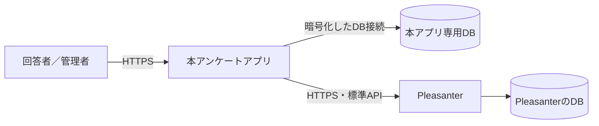

# 導入・更新運用手順書

本書は、VehicleVision.PleasanterTools.Questionnaire を **Docker を使わずに**導入・更新する
運用者向けの手順書である。対象は次の構成。

- Azure App Service の Linux Web App（**推奨**）
- Azure App Service の Windows Web App
- オンプレミス Windows Server の IIS

いずれも GitHub Release の同じ配置用 ZIP を使う。アプリは .NET 10 の
フレームワーク依存配置であり、実行先に .NET 10 のランタイムが必要となる。
配置用 ZIP には IIS 用の `web.config` も引き続き含める。Linux では使われないが、
同じ ZIP を Windows Web App と IIS にも配るため削除しない。

## 1. 最初に確認すること

### 1.1 構成



**本アプリ専用 DB と Pleasanter の DB は別にする。** 同じ DB サーバを共用してもよいが、
同じデータベースへ本アプリのマイグレーションを適用してはならない。本アプリは
Pleasanter の DB へ直結せず、標準 Web API だけを使う
（[`アーキテクチャ方針.md`](アーキテクチャ方針.md) 13 章）。

### 1.2 対応する DB

| RDBMS | `QUESTIONNAIRE_DB_PROVIDER` |
| --- | --- |
| SQL Server / Azure SQL Database | `SqlServer` |
| PostgreSQL | `PostgreSql` |
| MySQL | `MySql` |
| SQLite（簡易セットアップ・デバッグ専用） | `Sqlite` |

⚠️ **SQLite は本番運用に使わない。** Pleasanter は SQLite に対応していないため、
Pleasanter と DB サーバを共有する構成にもできない。選択中は起動ログと管理画面へ警告が出る。

マイグレーションは FluentMigrator による**前方適用のみ**で、アプリ起動時には自動適用しない。
通常起動時に未適用のマイグレーションが見つかると、アプリは安全のため起動を中止する
（[`MigrationCommand.cs`](../src/VehicleVision.PleasanterTools.Questionnaire.Web/MigrationCommand.cs#L5-L85)、
[`Program.cs`](../src/VehicleVision.PleasanterTools.Questionnaire.Web/Program.cs#L333-L350)）。

### 1.3 用意するもの

- 導入する版の GitHub Release にある次の 2 ファイル
    - `VehicleVision.PleasanterTools.Questionnaire-X.Y.Z.zip`
    - 同名の `.zip.sha256`
- .NET 10 を実行できる Azure Web App、または .NET 10 Hosting Bundle を入れた IIS
- 本アプリ専用の空 DB
- 本アプリから到達できる Pleasanter と、その API キー
- 本アプリ用の DNS 名と HTTPS 証明書。**HTTPS を推奨し、HTTP は閉じた環境だけで使う**
- DB と Pleasanter API キーを保存する秘密情報の管理場所

## 2. 配置用 ZIP を確認する

Release Actions は、サーバ DLL、IIS 用 `web.config`、回答画面、管理画面、設定の説明、
ライセンス文書を 1 つの ZIP にする。ZIP の直下がそのまま Web アプリの配置先になる。

ダウンロード後、SHA-256 を確認する。

```powershell
$version = "X.Y.Z"
$zip = "VehicleVision.PleasanterTools.Questionnaire-$version.zip"
$expected = (Get-Content "$zip.sha256").Split(' ', [System.StringSplitOptions]::RemoveEmptyEntries)[0]
$actual = (Get-FileHash $zip -Algorithm SHA256).Hash.ToLowerInvariant()
if ($actual -ne $expected.ToLowerInvariant()) {
    throw "配置用 ZIP の SHA-256 が一致しません"
}
```

資格情報の実値は ZIP に含まれない。ZIP を展開して、少なくとも次が存在することを確認する。

```text
VehicleVision.PleasanterTools.Questionnaire.Web.dll
web.config
wwwroot/index.html
wwwroot/admin.html
App_Data/Parameters/README.md
LICENSE
LICENSING.md
LICENSE-COMMERCIAL.md
NOTICE
```

### 2.1 Release ZIP がまだ無い版をソースから作る場合

正式な配布には Release ZIP を使う。過去の Release など、配置用 ZIP が添付されていない版を
やむを得ず配置するときだけ、タグを checkout したソースから作る。

```powershell
$version = "X.Y.Z"
$publish = Join-Path $PWD "temp\publish-$version"

Push-Location src\VehicleVision.PleasanterTools.Questionnaire.Frontend
npm ci
npm run build
Pop-Location

dotnet restore VehicleVision.PleasanterTools.Questionnaire.slnx
dotnet publish src\VehicleVision.PleasanterTools.Questionnaire.Web `
    --no-restore -c Release -o $publish

Copy-Item App_Data $publish -Recurse
Copy-Item LICENSE,LICENSING.md,LICENSE-COMMERCIAL.md,NOTICE $publish
Compress-Archive -Path "$publish\*" `
    -DestinationPath "VehicleVision.PleasanterTools.Questionnaire-$version.zip"
```

**`npm run build` を先に行う。** 省くと `dotnet publish` 自体は成功しても、回答画面と管理画面が
入っていない配置物になる。ビルド環境には `global.json` の .NET SDK と、フロントエンドの
`package.json` が要求する Node.js が必要である。

## 3. DB と共通設定を用意する

### 3.1 空 DB を作る

DB サーバ側の管理手順に従い、空のデータベースを作る。FluentMigrator はテーブルや索引を作るが、
**データベース自体は作らない。** SQL Server では接続文字列に存在しない DB 名を書いても作成されない。

例として DB 名を次のようにする。

| RDBMS | DB 名の例 | 注意 |
| --- | --- | --- |
| SQL Server / Azure SQL | `Questionnaire` | Pleasanter の DB とは別に作る |
| PostgreSQL | `questionnaire` | Pleasanter の DB とは別に作る |
| MySQL | `questionnaire` | 文字セットを `utf8mb4` にする |
| SQLite | `App_Data/questionnaire.db` | DB サーバは不要。接続文字列を省略すると自動作成する |

DB アカウントは次の 2 用途を分けることを推奨する。

| 用途 | 権限 |
| --- | --- |
| マイグレーション用 | 本アプリ専用 DB 内でテーブル、列、索引を作成・変更できる権限 |
| アプリ実行用 | マイグレーション後の本アプリ用テーブルに対する必要最小限の読み書き権限 |

同じ接続設定キーを使うため、マイグレーション実行時だけマイグレーション用接続文字列を
実行プロセスへ渡し、Web アプリには実行用接続文字列を設定する。

### 3.2 必須設定

次を**環境変数**として与える。資格情報を `appsettings.json`、配置用 ZIP、ソース管理へ書かない。

| 設定 | 内容 |
| --- | --- |
| `ASPNETCORE_ENVIRONMENT` | `Production` |
| `QUESTIONNAIRE_DB_PROVIDER` | `SqlServer` / `PostgreSql` / `MySql`。簡易セットアップ・デバッグだけ `Sqlite` |
| `QUESTIONNAIRE_DB_CONNECTIONSTRING` | 本アプリ専用 DB の接続文字列。`Sqlite` だけは省略できる |
| `QUESTIONNAIRE_DB_AUTO_MIGRATE` | 未設定または `true` のときに起動時の未適用マイグレーションを適用する。`false` で無効にする。既定は有効 |
| `QUESTIONNAIRE_DB_MIGRATION_LOCK_TIMEOUT_SECONDS` | 起動時の自動適用で排他を待つ上限秒。既定は `300` |
| `QUESTIONNAIRE_PLEASANTER_BASEURL` | Pleasanter のベース URL |
| `QUESTIONNAIRE_PLEASANTER_APIKEY` | Pleasanter の API キー |
| `QUESTIONNAIRE_PLEASANTER_TIMEZONE` | API キーユーザのタイムゾーン。日本なら `Asia/Tokyo` |
| `QUESTIONNAIRE_SECRET_KEY` | 32 バイト乱数の Base64。失うと登録済みの 2 要素が使えなくなる |

秘密鍵は配置用 ZIP の DLL で生成できる。標準出力へ 1 回だけ出るため、そのまま秘密情報の
管理場所へ登録し、平文ファイルへ残さない。

```powershell
dotnet .\VehicleVision.PleasanterTools.Questionnaire.Web.dll --generate-secret-key
```

`QUESTIONNAIRE_SECRET_KEY` は更新のたびに作り直さず、同じ環境では同じ値を維持する。

DB 接続は暗号化と接続先証明書の検証が必須である。実装が許す条件は
[`ConnectionSecurity.cs`](../src/VehicleVision.PleasanterTools.Questionnaire.Data/ConnectionSecurity.cs#L30-L119)を参照する。

| RDBMS | 本番接続の要点 |
| --- | --- |
| SQL Server | `Encrypt=True;TrustServerCertificate=False` |
| PostgreSQL | `Ssl Mode=VerifyCA` または `VerifyFull` |
| MySQL | `SslMode=VerifyCA` または `VerifyFull` |

SQLite はローカルファイルを直接読むため、この通信暗号化検査の対象外である。
代わりに DB ファイルをアプリ実行ユーザーだけが読み書きできるよう、配置先の権限を制限する。

起動時の自動適用は既定で有効であるため、Web アプリの DB アカウントには
スキーマ変更権限も必要になる。最小権限を優先して実行用アカウントと分ける場合は、
`QUESTIONNAIRE_DB_AUTO_MIGRATE=false` を設定し、3.3 の手動コマンドを使う。

`QUESTIONNAIRE_DB_ALLOW_INSECURE=true` と
`QUESTIONNAIRE_DB_SKIP_MIGRATION_CHECK=true` は検証用の逃げ道である。**本番では設定しない。**

### 3.2.1 HTTP で運用する場合（閉じた環境専用。Issue #270）

**HTTPS を推奨する。** インターネットへ公開する環境や、通信経路を信頼できない環境では
HTTP を使わない。イントラネットなどの閉じた環境で HTTP が必要な場合に限り、運用者が
次を明示する。

```text
QUESTIONNAIRE_ALLOW_INSECURE=true
```

この値を設定すると、HTTPS へのリダイレクトと HSTS の両方が止まり、起動ログと管理画面へ
警告が出る。HSTS だけを残すとブラウザが HTTPS 接続を記憶し、HTTP へ切り替えても戻れなく
なるため、片方だけを止める設定はない。未設定または `false` では、`Development` 以外で
従来どおり HTTPS リダイレクトと HSTS が有効になる。不正な値では起動しない。

リバースプロキシで HTTPS を終端する構成は HTTP 運用ではない。
`QUESTIONNAIRE_FORWARDED_NETWORKS` へ信頼するプロキシを設定し、`X-Forwarded-Proto: https` を
本アプリへ渡す。`QUESTIONNAIRE_ALLOW_INSECURE` は設定しない。

| HTTP で諦めるもの | 影響 |
| --- | --- |
| SAML | IdP が ACS URL や `SameSite=None` Cookie に HTTPS を要求するのが一般的であり、実質利用できない。アプリは SAML を無効化しないため、IdP の構成によっては動くが保証しない |
| ALTCHA | 安全なコンテキストでだけ使える `crypto.subtle` が無く、自前の SHA-256 実装へ切り替わる。課題は解けるが遅くなる |
| 合言葉の秘匿 | アンケートの合言葉を含むブラウザとの通信が暗号化されず、平文で流れる |

実装の根拠は
[`TransportSecurityOptions.cs`](../src/VehicleVision.PleasanterTools.Questionnaire.Web/TransportSecurityOptions.cs)、
[`Program.cs`](../src/VehicleVision.PleasanterTools.Questionnaire.Web/Program.cs)、
[`altcha.ts`](../src/VehicleVision.PleasanterTools.Questionnaire.Frontend/src/lib/altcha.ts)。

### 3.2.2 管理画面ログインの CAPTCHA（任意。Issue #252）

複数の送信元 IP から薄く試す攻撃への追加対策として、管理画面のパスワードログインと
管理者招待の受け取りへ、自前設置の ALTCHA（proof-of-work）を掛けられる。

```text
QUESTIONNAIRE_LOGIN_PROOF_OF_WORK=true
```

**既定は `false`（無効）である。** `true` にすると次の 2 つの入口で、ブラウザが送信前に
課題を解き、サーバが解答を検証する。

- `POST /api/admin/login`
- `POST /api/admin/invitations/accept`

初回管理者の登録、TOTP、復旧コードには掛けない。CAPTCHA の失敗はログイン情報または
招待トークンの不一致と同じ応答になり、成否だけを外から区別できない。検証は
`QUESTIONNAIRE_LOGIN_ATTEMPTS_PER_5MIN` のレート制限を通った後に行う。

外部 CAPTCHA サービスへの通信は発生しない。回答画面と同じ
`AltchaChallenges` 表を使うため、追加のマイグレーションも不要である。
HTTP 運用でも自前の SHA-256 へ切り替わって動作するが、Web Crypto を使える HTTPS より
課題の計算が遅くなる。特に管理端末での待ち時間を確認してから有効にする。

### 3.2.3 メールの設定（任意。Issue #189）

**既定は無効で、設定しなければ 1 通も出ない。** 自動返信メールと管理者の招待メールを
使う場合だけ設定する。

特権管理者は、管理画面の **設定** からメール設定を変更できる。送信方式を選ぶと、
その方式で必要な項目だけが表示される。入力後は **保存前の設定で試験送信する** を押し、
ログイン ID のメールアドレスへ届くことを確認してから有効化する。

- SMTP パスワードは書き込み専用であり、保存後も画面へ値を返さない
- Amazon SES は IAM ロール、Azure Communication Services はマネージド ID を使い、
  資格情報を画面では受け付けない
- 外部設定で指定した項目は画面で固定され、DB の値より優先される
- 保存した値は Web と同居するメール送信ワーカーが同じ設定表から読み、
  別インスタンスにも最大 30 秒で反映される
- `QUESTIONNAIRE_MAIL_BASEURL` が空のままではメール送信を有効化できない

根拠:
[`AppSettingsProvider.cs`](../src/VehicleVision.PleasanterTools.Questionnaire.Web/Services/AppSettingsProvider.cs)、
[`MailSettingsProvider.cs`](../src/VehicleVision.PleasanterTools.Questionnaire.Web/Services/MailSettingsProvider.cs)、
[`AppSettingsPanel.svelte`](../src/VehicleVision.PleasanterTools.Questionnaire.Frontend/src/admin/components/AppSettingsPanel.svelte)

| 設定 | 内容 |
| --- | --- |
| `QUESTIONNAIRE_MAIL_ENABLED` | `true` で有効。**既定は `false`** |
| `QUESTIONNAIRE_MAIL_SMTP_HOST` | SMTP サーバ |
| `QUESTIONNAIRE_MAIL_SMTP_PORT` | **既定は 587。** ⚠️ 25 番は Azure が塞ぐ |
| `QUESTIONNAIRE_MAIL_SMTP_SECURITY` | `StartTls`（既定）/ `ImplicitTls` / `None` |
| `QUESTIONNAIRE_MAIL_SMTP_USER` | 認証のユーザ名。空なら認証しない |
| `QUESTIONNAIRE_MAIL_SMTP_PASSWORD` | 認証のパスワード。**画面へは返らない** |
| `QUESTIONNAIRE_MAIL_FROM_ADDRESS` | 差出人のアドレス |
| `QUESTIONNAIRE_MAIL_FROM_NAME` | 差出人の表示名（任意） |
| `QUESTIONNAIRE_MAIL_REPLYTO_ADDRESS` | 返信先（任意）。**送りっぱなしにしない** |
| `QUESTIONNAIRE_MAIL_BASEURL` | メールに載せる URL の起点（例 `https://survey.example.jp`） |
| `QUESTIONNAIRE_MAIL_SEND_PER_MINUTE` | 1 分あたりの送信数の上限。既定は 60 |

**差出人の表示名・返信先・BCC は、アンケートごとにも設定できる**（Issue #324）。
アンケート側が未設定なら、上の全体設定を使う。

> ⚠️ **差出人のアドレスは全体設定だけで決まる。アンケートごとには変えられない。**
> 差出人アドレスを自由にすると **SPF / DKIM / DMARC が崩れ、迷惑メール扱いになる。**
>
> ⚠️ **Azure Communication Services 経由では、差出人の表示名を送信ごとに変えられない。**
> 全体設定・アンケートごとの設定にかかわらず、**Azure 側の MailFrom アドレスへ
> 登録した表示名が使われる。** 表示名を分けたい場合は、
> **Azure 側で送信者ユーザ名を複数登録する**こと。
> 返信先と BCC はこの制約を受けない。
>
> - 出典: [Add multiple sender addresses to Email Communication Service][acs-senders]
>   （参照日 2026-09-17）
> - 出典: [Dynamic Display Name in MailFrom addresses（Microsoft Q&A）][acs-display-name]
>   （参照日 2026-09-17）

#### 送信経路を選ぶ（Issue #198）

**`QUESTIONNAIRE_MAIL_TRANSPORT` で 3 つから選ぶ。既定は `Smtp`。**

| 経路 | 追加の設定 | **保管する秘密** |
| --- | --- | --- |
| `Smtp`（既定） | `QUESTIONNAIRE_MAIL_SMTP_*` | **1 つ**（パスワード） |
| `AmazonSes` | `QUESTIONNAIRE_MAIL_SES_REGION`（例 `ap-northeast-1`） | **0**（IAM ロール） |
| `AzureCommunicationServices` | `QUESTIONNAIRE_MAIL_ACS_ENDPOINT`（`https://…`） | **0**（マネージド ID） |

- ⚠️ **SES と ACS には資格情報を設定できない。** わざと口を作っていない。
  **鍵を保管しないことがこの経路の目的**なので、鍵を書ける形にすると意味が無くなる
    - SES は AWS SDK の既定の探索順（App Service のマネージド ID → IAM ロール → 環境変数）
    - ACS は Entra ID のマネージド ID（`DefaultAzureCredential`）
- ⚠️ **ACS には送信の流量の上限があり、既定は低い。** 上限に当たると一時の失敗として
  送り直す。大量に送る運用では、先に上限の引き上げを申請すること
- ⚠️ **実機（AWS / Azure）では未検証**（2026-09-14 時点）。
  資格情報を要するため CI でも当てられない。**本番へ入れる前に 1 通試すこと**

- **SMTP はどこへでも届く。** SendGrid・Amazon SES・
  Azure Communication Services・Microsoft 365 のいずれもこれで送れる
- ⚠️ **Azure が塞ぐのは 25 番だけで、587 番は塞がない**
  （[Troubleshoot outbound SMTP connectivity][smtp]、2026-09-13 参照）
- ⚠️ **`QUESTIONNAIRE_MAIL_BASEURL` を設定しないと招待メールは送られない。**
  要求の `Host` ヘッダから URL を組み立てない設計のため
  （[`非機能設計.md`](非機能設計.md) 1 章）。招待の URL は管理画面に出るので、
  設定しない運用でも手で渡せる
- **有効にしないまま自動返信を設定すると、管理画面が「サーバ側で有効になっていない」と出す**

[smtp]: https://learn.microsoft.com/troubleshoot/azure/virtual-network/troubleshoot-outbound-smtp-connectivity
[acs-senders]: https://learn.microsoft.com/azure/communication-services/quickstarts/email/add-multiple-senders#create-multiple-sender-usernames
[acs-display-name]: https://learn.microsoft.com/answers/a/1863125

### 3.2.4 アンケート資産の保存先（任意。Issue #271）

ヘッダ画像などのアンケート資産は `QUESTIONNAIRE_ASSET_STORE` で保存先を選ぶ。
**未設定時は従来どおり DB へ Base64 で保存する。** 更新時に既定は変わらない。

| 値 | 実体の保存先 | 必須の追加設定 |
| --- | --- | --- |
| `Database` または未設定 | 本アプリ専用 DB | なし |
| `Path` | ファイルシステム | `QUESTIONNAIRE_ASSET_PATH` |
| `AzureBlob` | Azure Blob Storage | 下記のコンテナー設定 |
| `S3` | Amazon S3 または S3 互換ストレージ | 下記のバケット設定 |

#### パス

```text
QUESTIONNAIRE_ASSET_STORE=Path
QUESTIONNAIRE_ASSET_PATH=D:\Questionnaire\Assets
```

**複数インスタンスでは、全インスタンスから同じ内容が見える共有ディレクトリを指定する。**
AKS の Pod 内ローカルパスは共有されず、Pod の再作成でも失われる。
`QUESTIONNAIRE_DATA_PROTECTION_KEYS_PATH` の鍵束と同じく、ReadWriteMany の永続ボリュームなどを
使う。ファイル名はアプリが資産の GUID だけから作り、アップロード時のファイル名は使わない。

#### Azure Blob Storage

コンテナーをあらかじめ作り、**公開アクセスを無効にする。** マネージド ID にコンテナー内の
Blob を読み書き・削除できる権限を与え、コンテナー URI を設定する。

```text
QUESTIONNAIRE_ASSET_STORE=AzureBlob
QUESTIONNAIRE_ASSET_AZURE_CONTAINERURI=https://account.blob.core.windows.net/survey-assets
```

マネージド ID を使えない環境では、次の接続文字列方式も使える。ただし、接続文字列は
`appsettings.json` や配置物へ書かず、環境変数または Key Vault から与える。

```text
QUESTIONNAIRE_ASSET_AZURE_CONNECTIONSTRING=<接続文字列>
QUESTIONNAIRE_ASSET_AZURE_CONTAINERNAME=survey-assets
```

#### S3 互換ストレージ

バケットをあらかじめ作り、**公開アクセスを許可しない。** AWS 上ではアクセスキーを設定せず、
アプリの実行ロールへバケット内オブジェクトの読み書き・削除権限を与える。

```text
QUESTIONNAIRE_ASSET_STORE=S3
QUESTIONNAIRE_ASSET_S3_BUCKET=survey-assets
QUESTIONNAIRE_ASSET_S3_REGION=ap-northeast-1
```

MinIO などへ接続するときは入口 URL を指定できる。仮想ホスト形式を使えないサービスでは
パス形式を有効にする。region はサービスが署名に要求する任意の値を指定する。

```text
QUESTIONNAIRE_ASSET_S3_SERVICEURL=https://s3.example.jp
QUESTIONNAIRE_ASSET_S3_FORCEPATHSTYLE=true
QUESTIONNAIRE_ASSET_S3_REGION=us-east-1
```

IAM ロールなど SDK の既定の資格情報探索を使えない場合だけ、
`QUESTIONNAIRE_ASSET_S3_ACCESSKEY` と `QUESTIONNAIRE_ASSET_S3_SECRETKEY` を組で設定できる。
秘密鍵は環境変数または Key Vault から与える。設定へ固定した長期鍵より IAM ロールを優先する。

#### 共通の注意

- **資産は常に本アプリが読み出して配信する。** コンテナーやバケットを公開せず、
  署名付き URL を回答者へ渡さない
- 保存先を DB から外部へ変更しても、変更前に DB へ保存した資産は引き続き読める。
  一方、外部保存を始めた後に DB 保存へ戻す自動移行はないため、運用中の保存先は固定する
- アンケートの完全削除では、複製先からも参照されなくなった実体を保存先から削除する。
  保存先の削除権限を外すと完全削除も失敗する
- **DB 以外を選ぶとバックアップ対象が増える。** DB と同じ復旧時点のディレクトリ、
  コンテナーまたはバケットをバックアップする。DB だけを戻しても資産の実体は戻らない

Azure Blob の `BlobContainerClient` がマネージド ID の資格情報を受け取れること、
AWS SDK for .NET の資格情報探索で IAM ロールを使えること、S3 設定に `ServiceURL`、
`ForcePathStyle`、region の指定があることは次の一次情報で確認した（2026-09-16）。

- [BlobContainerClient constructors](https://learn.microsoft.com/dotnet/api/azure.storage.blobs.blobcontainerclient.-ctor)
- [Credential and profile resolution](https://docs.aws.amazon.com/sdk-for-net/v4/developer-guide/creds-assign.html)
- [AmazonS3Config class](https://docs.aws.amazon.com/sdkfornet/v4/apidocs/items/S3/TS3Config.html)

### 3.2.5 システムメンテナンス（Issue #360）

通常の保守は、管理画面上部の「メンテナンス設定」から開始・解除する。開始すると、
すべての回答画面と回答 API が `503 Service Unavailable` と `Retry-After: 300` を返し、
回答と配布資料の受取履歴を Pleasanter へ送るワーカーも停止する。管理画面とログイン、
`/healthz`、`/ready` は止まらない。

DB の停止やマイグレーションなど、管理画面から DB 状態を変更できない保守では、アプリを
再起動する前に次を設定する。

```text
QUESTIONNAIRE_MAINTENANCE_MODE=true
```

環境変数によるメンテナンスは管理画面から解除できない。管理画面には停止元を
「環境変数」「管理画面」「両方」に分けて表示する。作業後は環境変数を削除するか `false` に戻し、
アプリを再起動して、管理画面で停止元が無いことを確認する。

回答者向け文言は日本語・英語を管理画面で設定できる。環境変数で止める場合は次で上書きできる。
停止理由、DB 名、接続先などの内部事情は書かない。

| 設定 | 既定値 |
| --- | --- |
| `QUESTIONNAIRE_MAINTENANCE_MESSAGE_JA` | `ただいまメンテナンス中です` |
| `QUESTIONNAIRE_MAINTENANCE_MESSAGE_EN` | `The service is currently under maintenance.` |

環境変数と管理画面の両方が有効なら、環境変数側の文言を使う。管理画面側だけを解除しても
メンテナンスは終わらない。

`/ready` はメンテナンス中も `200` を維持する。メンテナンスは故障ではなく運用者が意図した
受付停止であり、Kubernetes の readiness probe を落とすと Pod の切り離しや再起動設定によって
管理画面の解除操作まで不安定になるためである。DB に接続できない場合は従来どおり `503` を返す。
実装の根拠は
[`Program.cs`](../src/VehicleVision.PleasanterTools.Questionnaire.Web/Program.cs#L791-L846)、
[`MaintenanceMode.cs`](../src/VehicleVision.PleasanterTools.Questionnaire.Data/MaintenanceMode.cs#L117-L190)。

### 3.2.6 管理画面の入口（任意。Issue #422）

自動化された要求が既定の `/admin` へ集中して操作記録を埋める場合は、管理画面の入口を
外部設定で変更できる。

```text
QUESTIONNAIRE_ADMIN_PATH=/back-office
```

未設定なら従来どおり `/admin` を使う。値は `/` で始め、2 文字目以降を英小文字、数字、
ハイフンだけで構成し、全体を 64 文字以内にする。階層は指定できない。
`/api`、`/f`、`/healthz`、`/ready`、`/scalar`、`/openapi`、`/assets`、`/fonts` など、
既存の入口と重複する値ではアプリが起動しない。

この設定は管理画面には表示せず、起動時に 1 度だけ読む。変更後はアプリを再起動し、
新しい URL でログイン、画面内の移動、管理者招待の URL、SAML ログイン後の戻り先を確認する。
回答画面の `/f/{公開ID}` と管理 API の `/api/admin` は変わらない。

パスの変更は認証、2 要素認証、レート制限の代わりにはならない。目的は自動化された要求の
ノイズを減らし、確認すべき記録を見つけやすくすることである。

SAML の ACS URL `/api/admin/saml/acs` はこの設定では変わらない。リバースプロキシの経路も
併せて変更するなど、外部から見える ACS URL を変える場合は、先に IdP 側へ新しい ACS URL を
登録してから切り替える。IdP 側が古い URL のままでは SAML 応答を受け取れない。

### 3.2.7 サブパスに置く（任意。Issue #465）

Pleasanter と同じホスト名で動かす場合（Pleasanter のログインで管理画面へ入る Issue #464 の前提）は、
本アプリを `/questionnaire` のようなサブパスに置く。

```text
QUESTIONNAIRE_PATH_BASE=/questionnaire
```

未設定なら従来どおり `/` で動く。設定するとサブパスの外は 404 になり（`/healthz` と `/ready` を除く）、
SAML の ACS URL も `/questionnaire/api/admin/saml/acs` に変わる。IIS のサブアプリケーション、
Apache・Nginx、Azure の置き方と注意は [`サブパス配置-運用手順書.md`](サブパス配置-運用手順書.md) を参照する。

### 3.3 マイグレーションの共通コマンド

起動時の自動適用は既定で有効であり、未設定なら未適用を適用してから起動する。
自動適用を止めるには `QUESTIONNAIRE_DB_AUTO_MIGRATE=false` を設定する。
ロック待機と適用が終わるまで `/ready` は 503、プロセスの生存を示す `/healthz` は 200 を返す。
適用または待機上限超過で失敗した場合は起動しない。

`QUESTIONNAIRE_DB_SKIP_MIGRATION_CHECK=true` は、自動適用を `false` にした場合だけ検査を省略する。
自動適用が有効ならこの設定にかかわらず適用する。本番での使用は禁止する。

複数インスタンスが同時に起動した場合は、次の接続所有ロックを取れた 1 つだけが適用する。
ほかのインスタンスはロック解放まで待ち、取得後に未適用を再確認する。

| RDBMS | 排他 |
| --- | --- |
| SQL Server / Azure SQL | `sp_getapplock` のセッション所有ロック |
| PostgreSQL | セッションレベル advisory lock |
| MySQL | `GET_LOCK` の named lock |
| SQLite | ロック専用サイドカー DB の `BEGIN IMMEDIATE` |

SQLite は本体 DB で書き込みトランザクションを保持すると、別接続で動く FluentMigrator 自身を
止めるため、`questionnaire.db.migration-lock.sqlite` を排他専用に使う。いずれも接続終了時に
自動解放され、ロック所有者を記録する表は作らない。

自動適用を使わない導入先と保守作業のため、次の手動コマンドも引き続き利用できる。
配置用 ZIP を展開したディレクトリで実行する。
**出力は英語である。** Azure の Kudu の Debug console で日本語が化けるため（Issue #225）。

```powershell
# 未適用のものを表示するだけ。未適用があれば終了コード 1
dotnet .\VehicleVision.PleasanterTools.Questionnaire.Web.dll --migrate-status
# → All migrations are applied (SqlServer).
#   もしくは次のように未適用の一覧が出る。**名前は型の名前**なので、
#   そのまま Migrations/ のファイルとして探せる
#     Pending migrations (SqlServer):
#       - 20 M0020_TestPublishedResponses

# DB の起動を最大 180 秒待ち、未適用のものを前方適用する
dotnet .\VehicleVision.PleasanterTools.Questionnaire.Web.dll --migrate --wait-for-db=180

# もう一度確認する。終了コード 0 なら適用済み
dotnet .\VehicleVision.PleasanterTools.Questionnaire.Web.dll --migrate-status
if ($LASTEXITCODE -ne 0) {
    throw "未適用のDBマイグレーションがあります"
}
```

`--migrate` を Web アプリの常設の起動引数にしてはならない。マイグレーションが終わると
プロセスは終了するため、Web アプリが再起動を繰り返す。

排他方式は Pleasanter 本体
`_reference/Implem.Pleasanter/Implem.Pleasanter/Libraries/BackgroundServices/ApplicationWarmupHostedService.cs`
と
`_reference/Implem.Pleasanter/Implem.Pleasanter/Libraries/Server/DistributedLock.cs`
の `startup-migrations` ロックを確認した上で選定した。各 DB の仕様は次の一次情報で確認した
（2026-09-21）。

- SQL Server `sp_getapplock` / `sp_releaseapplock`:
  <https://learn.microsoft.com/sql/relational-databases/system-stored-procedures/sp-getapplock-transact-sql>
- PostgreSQL advisory lock:
  <https://www.postgresql.org/docs/current/functions-admin.html#FUNCTIONS-ADVISORY-LOCKS>
- MySQL `GET_LOCK` / `RELEASE_LOCK`:
  <https://docs.oracle.com/cd/E17952_01/mysql-8.0-en/locking-functions.html>
- SQLite transaction / `BEGIN IMMEDIATE`:
  <https://sqlite.org/lang_transaction.html>

## 4. Azure App Service へ導入する

添付ファイルを使う場合は、導入方式を決める前に
[添付ファイル検査-運用手順書](添付ファイル検査-運用手順書.md) 3 章の制約を確認すること。
**ClamAV サイドカーを使える Linux Web App を推奨する。** Windows Web App でも本アプリは
動くが、App Service のサイドカーは使えないため、添付を扱うには別の場所の `clamd` または
Defender for Storage が必要になる。

### 4.1 Web App を作る

Azure portal で次を作成する。

1. Pleasanter と同じ App Service プラン、または要件に合う別プランへ
   **本アプリ専用の Linux Web App**を作る
2. ランタイムスタックを **`DOTNETCORE:10.0`**（.NET 10）にする
3. HTTPS のみを有効にする
4. 常駐する送信ワーカーを止めないため、**Always On**を有効にする
5. Health check のパスを `/healthz` にする。
   ⚠️ **`/ready` にしないこと。** App Service の Health check は**再起動の判断に使われる**ため、
   DB 障害のたびに再起動を繰り返す
6. カスタムドメインと管理済み証明書、または組織の証明書を設定する

Azure CLI で Linux のランタイムを設定する場合、CLI の表記は区切りが `|` になる。

```bash
az webapp config set \
  --resource-group <resource-group> \
  --name <app-name> \
  --linux-fx-version "DOTNETCORE|10.0"
```

Windows Web App を選ぶ場合は、OS を Windows、ランタイムスタックを `.NET 10` にして、
3～6 は同じ設定にする。配置用 ZIP の `web.config` は Windows の IIS で使われる。
**Windows Web App では ClamAV サイドカーを構成できない**ことを踏まえて添付の方式を選ぶ。

Pleasanter の Web Appへ本アプリを上書きせず、別の Web App として作る。配置の決定事項は
[`アーキテクチャ方針.md`](アーキテクチャ方針.md) 14 章を参照する。

`/healthz` はプロセスの生存だけを返す。**DB へ繋がらなくても `ok` を返す。**
本アプリ DB への接続は **`/ready`** が確認する（駄目なら 503。Pleasanter は見ない。
落ちても回答は DB に積んで再送できるため）。
**配置後の確認では `/ready` まで見ること。** そのうえで管理画面とテスト用アンケートも確認する。

#### 機械監視の送信状況 API

`QUESTIONNAIRE_MONITORING_TOKEN` を設定したときだけ
`GET /api/monitoring/status` が有効になる。token は秘密情報として環境変数または Key Vault に置き、
`Authorization: Bearer <token>` で送る。未設定なら経路自体が存在しない。

応答は、回答の送信待ち件数と最古の滞留秒数、デッドレター件数と最古の滞留秒数、公開中の
アンケート件数、DB 接続可否を JSON で返す。メールを有効にした構成だけメール送信待ち件数も返す。
回答本文、回答者の情報、アンケートの題名・公開 ID は返さない。DB に接続できないときは
`databaseConnected: false` だけを含む JSON と HTTP 503 を返す。

```powershell
$headers = @{ Authorization = "Bearer $env:QUESTIONNAIRE_MONITORING_TOKEN" }
Invoke-RestMethod "$baseUrl/api/monitoring/status" -Headers $headers
```

最初の警告閾値は、通常時の送信間隔と一時停止時間に合わせて次を目安にする。実測した平常値を
採った後、その値を基準に調整する。

| 項目 | 警告の目安 | 緊急の目安 |
| --- | ---: | ---: |
| 回答の最古滞留 | 300 秒 | 1,800 秒 |
| 回答のデッドレター | 1 件 | 継続して増加 |
| メールの最古滞留 | API では返さないため、送信待ち件数が 5 分以上減らない状態で判断 | 継続して増加 |
| DB 接続 | 1 回の失敗 | 3 回連続の失敗 |

公開中アンケート件数は異常判定の単独の閾値にせず、計画した公開・停止との差分を検知する。
短い一時障害で通知が揺れないよう、30～60 秒間隔で 2～3 回連続した場合に通知する。

#### 生存確認と監視 API の送信元を絞る

`QUESTIONNAIRE_HEALTH_NETWORKS` は `/healthz` と `/ready`、
`QUESTIONNAIRE_MONITORING_NETWORKS` は監視 API を許す送信元 CIDR である。複数は
`10.0.0.0/8,192.0.2.10/32` のようにカンマで区切る。未設定なら従来どおり制限しない。
監視側へ `inherit` と書くと生存確認側と同じ CIDR を使う。CIDR でない値や `inherit` の
綴り間違いがあれば、制限なしで動かさず起動を止める。許可外の送信元には 403 ではなく
404 を返し、経路の存在を隠す。

| 構成 | `QUESTIONNAIRE_HEALTH_NETWORKS` に許す送信元 | `QUESTIONNAIRE_MONITORING_NETWORKS` に許す送信元 |
| --- | --- | --- |
| Kubernetes | **Kubelet が動く全ノードの IP CIDR**。Pod CIDR ではない | クラスター内の監視 Pod の CIDR、または同じノード経由なら `inherit` |
| Azure App Service Health check | **App Service 基盤から実際に到達する IP CIDR**。アクセスログで全インスタンス分を確認する | Azure Monitor など、採用した監視基盤の送信元 CIDR |
| IIS／外部監視 | ロードバランサまたは監視サーバの送信元 CIDR | 監視サーバの送信元 CIDR |

⚠️ **許可漏れは、アプリが正常でも probe が 404 を受け、異常なインスタンスとして
切り離し・再起動される形で現れる。** 先にアクセスログで送信元を採取し、複数ノード・
複数インスタンスの全範囲を許してから設定する。リバースプロキシ配下では
`QUESTIONNAIRE_FORWARDED_NETWORKS` へ信頼するプロキシ CIDR も設定する。設定しないと
アプリから見える送信元がプロキシ IP のままになり、意図した CIDR と一致しない。

#### OpenAPI 文書を一時的に出す

`QUESTIONNAIRE_OPENAPI_ENABLED=true` を設定した環境だけ、
`/openapi/v1.json` で OpenAPI 3.1 の JSON 文書を出す。人が読む画面は `/scalar/` で開く。
Scalar の画面本体はアプリケーションに同梱して配る。CDN の既定フォント、利用状況テレメトリー、
Agent は無効化しており、画面を開いた利用者の情報を第三者へ送らない。

⚠️ **本番では有効にしない。** 文書には管理 API を含む現在の HTTP API の形が現れるため、
攻撃者の下調べを容易にする。確認用の閉じた環境でだけ使い、確認後は
`QUESTIONNAIRE_OPENAPI_ENABLED` を削除または `false` に戻す。

送信元を絞る場合は `QUESTIONNAIRE_OPENAPI_NETWORKS` に CIDR を設定する。複数はカンマで
区切り、`inherit` は `QUESTIONNAIRE_HEALTH_NETWORKS` を引き継ぐ。未設定なら制限しないが、
OpenAPI を有効にする環境では `inherit` または確認者の CIDR を設定する。
この制限は `/openapi/` と `/scalar/` の両方に効く。許可外の送信元には 404 を返す。

⚠️ **文書を出すことと、外部連携用に API を約束することは別である。**
外部連携として安定性・互換性を約束する API の範囲は、まだ決まっていない。
文書にある口を外部システムから呼び出す前に、連携範囲を別途決めること。

Kubelet が HTTP probe を実行すること、および App Service Health check が各インスタンスへ
基盤から要求することの根拠は次の一次資料による（2026-09-16 参照）。

- [Configure Liveness, Readiness and Startup Probes](https://kubernetes.io/docs/tasks/configure-pod-container/configure-liveness-readiness-startup-probes/)
- [Monitor the Health of App Service Instances](https://learn.microsoft.com/azure/app-service/monitor-instances-health-check)

### 4.2 アプリ設定を登録する

Azure portal の Web App の環境変数へ、3.2 の設定を登録する。秘密情報は可能なら
App Service の Key Vault 参照にする。少なくとも次はデプロイスロット設定にして、swap で
別環境の値と入れ替わらないようにする。

- `QUESTIONNAIRE_DB_CONNECTIONSTRING`
- `QUESTIONNAIRE_PLEASANTER_BASEURL`
- `QUESTIONNAIRE_PLEASANTER_APIKEY`
- `QUESTIONNAIRE_PLEASANTER_TIMEZONE`
- `QUESTIONNAIRE_SECRET_KEY`

日本時間で運用する場合は、**Web App の OS に合う方だけ**を環境変数へ登録する。
Windows のタイムゾーン ID を Linux の `TZ` へ入れても効かない。

| OS | 設定 |
| --- | --- |
| Linux | `TZ=Asia/Tokyo`（IANA タイムゾーン ID） |
| Windows | `WEBSITE_TIME_ZONE=Tokyo Standard Time` |

設定値を CLI の引数へ直接書くと、シェル履歴や操作ログへ秘密が残り得る。portal、Key Vault 参照、
または秘密を保護できる CI/CD から登録する。

### 4.3 初回配置とDB作成

配置用 ZIP は展開せずに Zip Deploy する。

```powershell
$resourceGroup = "<リソースグループ>"
$webApp = "<Web App名>"
$zip = ".\VehicleVision.PleasanterTools.Questionnaire-X.Y.Z.zip"

az webapp deploy `
    --resource-group $resourceGroup `
    --name $webApp `
    --src-path $zip
```

初回は DB が空なので、通常プロセスは未適用マイグレーションを検出して起動を中止する。
Azure portal から Web App の Kudu（高度なツール）を開き、Debug console で配置先へ移動して
マイグレーションする。Linux の配置先は `/home/site/wwwroot`、Windows は
`D:\home\site\wwwroot` である。

Linux:

```bash
cd /home/site/wwwroot
dotnet ./VehicleVision.PleasanterTools.Questionnaire.Web.dll --migrate --wait-for-db=180
dotnet ./VehicleVision.PleasanterTools.Questionnaire.Web.dll --migrate-status
```

Windows:

```powershell
cd $env:HOME\site\wwwroot
dotnet .\VehicleVision.PleasanterTools.Questionnaire.Web.dll --migrate --wait-for-db=180
dotnet .\VehicleVision.PleasanterTools.Questionnaire.Web.dll --migrate-status
```

Kudu のコンソールにも Web App の環境変数が渡る。Web App に実行用の最小権限しか与えない構成では、
DB へ到達できる保護された運用端末または CI/CD ジョブで、マイグレーション用接続文字列を
一時的なプロセス環境変数として与えて同じ DLL を実行する。

マイグレーション完了後に Web App を再起動する。

### 4.4 スロットを使う場合

本番とステージングで、DB と Pleasanter の接続先も分ける。本番 DB にステージングの試験データを
書かないよう、3.2 の接続設定をすべてデプロイスロット設定にする。

```powershell
az webapp deploy `
    --resource-group $resourceGroup `
    --name $webApp `
    --slot staging `
    --src-path $zip
```

ステージングで 4.6 の確認を終えてから swap する。ただし DB マイグレーションを含む版では、
**新旧アプリの両方が移行後スキーマで動けると Release 本文に明記された場合だけ**無停止 swap を行う。
明記が無い場合はメンテナンス時間を設け、4.5 の順序で更新する。

### 4.5 更新方法を選ぶ

**現在の更新スクリプトは 2 本とも Windows Web App 専用である。Linux Web App には使わない。**
Linux では 4.3 と同じ `az webapp deploy`、Kudu でのマイグレーション、Web App の再起動、
4.6 の確認をメンテナンス時間内に手動で行う。Linux 用更新スクリプトの提供は別途判断する。

Windows Web App の更新スクリプトは、実行場所に応じて次の 2 本を使い分ける。

| 実行場所 | スクリプト | 用途 |
| --- | --- | --- |
| `az` を使える運用端末または CI | `scripts\Upgrade-AzureWebApp.ps1` | Azure CLI と Kudu API を使う Zip Deploy |
| Windows Web App の Kudu | `scripts\Upgrade-InKudu.ps1` | `app_offline.htm` で停止し、共有 content share の `wwwroot` を直接入れ替える |

`Upgrade-AzureWebApp.ps1` は Kudu では使えない。Kudu には Azure CLI が無いためである。
反対に `Upgrade-InKudu.ps1` は対象 Web App の `%HOME%` を直接操作するため、運用端末では使わない。
`Upgrade-AzureWebApp.ps1` も Kudu へ渡すコマンドとパスが Windows 形式のため、Linux には使わない。

#### 4.5.1 Windows: 運用端末または CI から更新する

更新は PowerShell 7 の `scripts\Upgrade-AzureWebApp.ps1` を使う。スクリプトは以下の手作業を順に
実行し、失敗した時点で止まる。

1. `az` のログイン状態と Web App（スロット指定時はスロット）を確認する
2. 指定版、または GitHub の最新 Release から配置用 ZIP と `.sha256` を取得して照合する
3. 現在の `/healthz` の応答を記録し、Kudu API から `site/wwwroot` の ZIP 控えを取得する
4. 新版 ZIP を Zip Deploy する
5. 新版 DLL の `--migrate --wait-for-db=180` と `--migrate-status` を Kudu API で実行し、終了コードを確認する
6. Web App を再起動し、**`/healthz` と `/ready` の両方**が成功するまで再試行する

たとえば、最新版を運用スロットへ更新するには次を実行する。

```powershell
.\scripts\Upgrade-AzureWebApp.ps1 `
    -ResourceGroup "<リソースグループ>" `
    -WebApp "<Web App名>"
```

特定の版やスロットを指定する場合は次のようにする。`-Version` の `v` は省略してよい。

```powershell
.\scripts\Upgrade-AzureWebApp.ps1 `
    -ResourceGroup "<リソースグループ>" `
    -WebApp "<Web App名>" `
    -Slot staging `
    -Version 1.2.3 `
    -BackupDirectory ".\backup"
```

スクリプトはアプリ設定や秘密情報を取得・記録しない。Kudu API は `az account get-access-token` で取得する
Entra のアクセストークンで呼び出す。SCM へのアクセスが 401 または 403 で拒否された場合は、
運用者へ `Microsoft.Web/sites/publish/Action` 権限が必要であることを表示する。

**DB のバックアップと回答受付の停止は、スクリプトの前に運用者が行う。** DB 接続文字列を引数や
作業ファイルへ渡さないためである。Release 本文でマイグレーションと破壊的変更を確認し、DB を
バックアップして復元手順を確認してから、メンテナンス時間中に実行する。成功後は 4.6 の人による
確認を行い、問題がなければ回答受付を再開する。

`-SkipMigration` は DB マイグレーションを実行しない。Release が DB 変更を含まないことを確認した
場合だけ使う。

```powershell
.\scripts\Upgrade-AzureWebApp.ps1 `
    -ResourceGroup "<リソースグループ>" `
    -WebApp "<Web App名>" `
    -Version 1.2.3 `
    -SkipMigration
```

`-WhatIf` は ZIP の取得と SHA-256 の照合まで実行し、控え、配置、マイグレーション、再起動、
ヘルスチェックは実行しない。

**確認を求めずに動かす場合は `-Confirm:$false` を付ける。** 本番を書き換える操作なので、
既定では実行前に確認を求める。

⚠️ **マイグレーションは Kudu の `/api/command` で実行するため、Kudu 側の待ち時間の上限を
超えると応答が途切れる。** 件数の多い版や DB の起動待ちが長い版では、応答が返らなくても
適用自体は進んでいることがある。**そのときは `--migrate-status` を Kudu の Debug console で
直接確認する**（3.3）。**同じ更新をもう一度流してはならない。**

DB の移行は前方のみである。コードだけ旧版へ戻せるとは限らない。移行後スキーマと旧版の互換性が
Release 本文で保証されていなければ、ロールバックは**旧版 ZIP と移行直前の DB バックアップを組にして**行う。

#### 4.5.2 Windows: Kudu 上から更新する

**この節は Windows Web App 専用である。** `Upgrade-InKudu.ps1` は
IIS の ASP.NET Core Module が認識する `app_offline.htm` でアプリを止めてからファイルを
入れ替える。Linux App Service では `app_offline.htm` は効かず、実行中の DLL も Windows の
ようには掴まれないため、この停止処理は不要である。

`scripts\Upgrade-InKudu.ps1` を Kudu の `%HOME%\data\Upgrade-InKudu.ps1` へ置く。
**`site\wwwroot` には置かない。** 更新で `wwwroot` を丸ごと入れ替えるため、実行中の
スクリプト自身を消すことになる。`%SystemDrive%\local` にも置かない。この領域は一時領域であり、
インスタンス間でもアプリと Kudu の間でも共有されない。

Kudu の Debug console で、先に PowerShell 7 が使えることを確認する。

```powershell
pwsh --version
pwsh -NoProfile -Command '$PSVersionTable.PSVersion'
```

`Upgrade-InKudu.ps1` は `#Requires -Version 7.0` を指定している。`pwsh` が 7.0 以上でなければ
実行せず、App Service のランタイムまたは運用方法を見直す。

Windows の `%HOME%` は `D:\home`、Linux の `$HOME` は `/home` である。この節で使う
**Windows の `%HOME%` はアプリ専用の content share で、再起動後も残り、全インスタンスから
共有される。**
このためスクリプトと控えは再起動後も残る一方、`app_offline.htm` の作成と `wwwroot` の入替は
全インスタンスへ一斉に反映される。**この更新は無停止ではない。** メンテナンス時間を確保し、
全インスタンスで回答受付が止まることを関係者へ通知してから実行する。

スクリプトは起動時に自身の版を `Upgrade script version: X.Y.Z` と表示する。
`wwwroot` の外にあるため、アプリを更新してもスクリプト自身は更新されない。リポジトリに新しい版が
公開されたときは、`%HOME%\data\Upgrade-InKudu.ps1` を新しいファイルへ手動で置き換える。

更新前に、Release 本文でマイグレーションと破壊的変更を確認し、DB のバックアップと復元手順の確認を
済ませる。Kudu のプロセスに DB マイグレーションを実行できる権限が必要である。Web App の接続を
DDL 権限の無い実行専用ユーザへ絞っている構成では、このスクリプトを使わず 4.5.1 の運用端末または
CI から更新する。最新版へ更新する場合は次を実行する。

```powershell
cd $env:HOME\data
pwsh .\Upgrade-InKudu.ps1
```

特定の版は `-Version` で指定する。先頭の `v` は省略してよい。

```powershell
pwsh .\Upgrade-InKudu.ps1 -Version 1.2.3
```

Kudu から GitHub へ接続できない構成では、配置用 ZIP と同名の `.sha256` を
`%HOME%\data\packages` などへ手動で置き、`-PackagePath` を指定する。`.sha256` が ZIP と
同じ場所に `ZIPのファイル名.sha256` としてあれば `-ChecksumPath` は省略できる。

```powershell
pwsh .\Upgrade-InKudu.ps1 `
    -PackagePath .\packages\VehicleVision.PleasanterTools.Questionnaire-1.2.3.zip
```

既定では `WEBSITE_HOSTNAME` の HTTPS URL を確認する。別のホスト名や HTTP を使う閉じた環境では、
実際に利用者が到達する URL を `-BaseUri` で指定する。

```powershell
pwsh .\Upgrade-InKudu.ps1 `
    -Version 1.2.3 `
    -BaseUri https://questionnaire.example.com
```

スクリプトは次の順序で処理し、いずれかが失敗した時点で止まる。

1. 指定版または最新 Release の ZIP と `.sha256` を取得する。手動配置時は指定ファイルを使う
2. SHA-256 と ZIP 内のパスおよびアプリ DLL を検査する。不一致または不正な ZIP なら変更せず止まる
3. `wwwroot` を `%HOME%\data\backup\Questionnaire-wwwroot-{日時}.zip` へ控え、
   ZIP を再度開いて検査する。控えが取れなければ先へ進まない
4. `wwwroot\app_offline.htm` を作り、全インスタンスのアプリを停止する
5. ZIP を展開し、`app_offline.htm` 以外の `wwwroot` の内容を削除して入れ替える。
   git 管理外の `App_Data\Parameters\*.local.json` だけは退避して書き戻す
6. 新版 DLL で `--migrate --wait-for-db=180`、続いて `--migrate-status` を実行する
7. `app_offline.htm` を削除する
8. `/healthz` と `/ready` の両方が成功するまで再試行する

`%HOME%` は全インスタンスで共有されるため、スクリプトは共有ファイルの排他ロックを取り、
同時更新を拒否する。更新途中で失敗し、まだ `app_offline.htm` がある段階なら、安全のため
**オフライン状態を維持する。** 表示された控えを調べ、次のロールバックを行う。
ヘルスチェックの失敗は `app_offline.htm` を削除した後なので、アプリログも併せて確認する。
アクセス制限を設定している場合は、Kudu から `-BaseUri` への接続と
`QUESTIONNAIRE_HEALTH_NETWORKS` の許可範囲も確認する。

`*.local.json` 以外の、配置用 ZIP に含まれない `wwwroot` 内のファイルは削除される。
添付資産、Data Protection の鍵束、その他の永続データは `wwwroot` に置かず、App Service の
アプリケーション設定で `%HOME%\data` 配下などの永続領域を指定する。

控えは content share の容量を消費する。既定では新しいものから **5 世代**だけを残し、
このスクリプトが作った古い控えを更新時に削除する。残す世代数は次のように変更できる。

```powershell
pwsh .\Upgrade-InKudu.ps1 -BackupRetentionCount 3
```

控えには `App_Data\Parameters\*.local.json` などの秘密情報が含まれ得る。必要な世代だけを
アクセス制御された場所に保ち、不要になったものは削除する。

### 4.6 動作確認

```powershell
$baseUrl = "https://<本アプリのホスト名>"

# プロセスの生存
Invoke-RestMethod "$baseUrl/healthz"

# **本アプリ DB へ繋がるか。** ⚠️ これを見ないと、DB の設定を取り違えた配置が
# 「成功」で終わる
Invoke-RestMethod "$baseUrl/ready"
```

続けて次を人が確認する。

- `$baseUrl/admin` が表示され、初回管理者を設定または既存管理者でログインできる
- テスト用アンケートを表示できる
- テスト回答が本アプリの送信待ちを経て Pleasanter へ登録される
- 管理画面の未送信件数が継続的に増えていない
- App Service のログに資格情報や回答本文が出ていない

### 4.7 控えからロールバックする

**この節の 2 スクリプトによるロールバックも Windows Web App 専用である。**
Linux Web App では、戻す版の配置用 ZIP を 4.3 の `az webapp deploy` で再配置し、
移行後スキーマと旧版の互換性を Release 本文で確認してから 4.6 を確認する。

更新スクリプトが作成した `site/wwwroot` の控え ZIP を指定すると、Kudu API の
`PUT /api/zip/site/wwwroot/` で配置し直し、Web App を再起動して **`/healthz` と `/ready`** を確認する。

```powershell
.\scripts\Upgrade-AzureWebApp.ps1 `
    -ResourceGroup "<リソースグループ>" `
    -WebApp "<Web App名>" `
    -Rollback ".\backup\<Web App名>-20260916-120000.zip"
```

スロットの控えを戻す場合は、更新時と同じ `-Slot` を指定する。

```powershell
.\scripts\Upgrade-AzureWebApp.ps1 `
    -ResourceGroup "<リソースグループ>" `
    -WebApp "<Web App名>" `
    -Slot staging `
    -Rollback ".\backup\<Web App名>-staging-20260916-120000.zip"
```

**この操作は DB を戻さない。** マイグレーションを適用した更新を戻す場合は、移行直前に取得した
DB バックアップも復元する必要がある。

⚠️ **控えに無いファイルは消えない。** Kudu の `PUT /api/zip/` は上書きが必要なものだけを
置き換える仕様であり、新版だけにあったファイルは `site/wwwroot` に残る。
**残ってはいけないファイルがある版では、portal または Kudu から手で消すこと。**
控え ZIP には `App_Data\Parameters\*.local.json` などの
秘密情報が含まれ得るため、作業後は運用者が安全に保管または削除する。

Kudu 上で `Upgrade-InKudu.ps1` が作成した控えを戻す場合は次を実行する。このスクリプトは
現在の `wwwroot` を新しい控えへ保存してから、`app_offline.htm` 以外の内容を削除して指定した
控えを展開し、`/healthz` と `/ready` の両方を確認する。

```powershell
cd $env:HOME\data
pwsh .\Upgrade-InKudu.ps1 `
    -Rollback .\backup\Questionnaire-wwwroot-20260916-120000000.zip
```

実行時にも英語で警告を表示するが、**この操作は DB を戻さない。** 更新でマイグレーションを
適用した場合は、旧版との互換性を Release 本文で確認し、必要なら更新直前の DB バックアップも
別途復元する。

`%HOME%`、`%SystemDrive%\local`、複数インスタンスでの共有範囲の根拠は
[Azure App Service の OS 機能](https://learn.microsoft.com/azure/app-service/operating-system-functionality)
（2026-09-16 参照）である。

### 4.8 Linux で確認済みの範囲

E2E と配置用 ZIP の写しを検査する一式は Linux コンテナで動いているため、本アプリと配置物が
Linux 上で動くことは継続的に確認している。静的ファイルのパスも、Linux が大文字小文字を区別する
前提で配置物と参照先を機械検査した（2026-09-16）。

⚠️ **Azure App Service の Linux Web App への実配置は未検証である。** 本番導入前に検証用
Web App で 4.3 の配置とマイグレーション、4.6 の確認、ClamAV サイドカーの準備完了と
EICAR による検査を一度通すこと。

## 5. オンプレミス IIS へ導入する

### 5.1 IIS と .NET を用意する

1. Windows Serverへ IIS の Web Server 役割を追加する
2. **IIS の追加後に** .NET 10 Hosting Bundle をインストールする
3. Hosting Bundle のインストーラが要求した場合はサーバ、または IIS サービスを再起動する
4. `dotnet --list-runtimes` で `Microsoft.AspNetCore.App 10.` が表示されることを確認する

Hosting Bundle は .NET ランタイムと ASP.NET Core Module を IISへ登録する。IISより先に
Hosting Bundleを入れていた場合は、IIS追加後に Hosting Bundleを修復インストールする。

### 5.2 専用サイトとアプリケーションプールを作る

IIS Manager で次を作成する。

| 項目 | 設定例 |
| --- | --- |
| サイト名 | `Questionnaire` |
| アプリケーションプール | `QuestionnairePool` |
| .NET CLR version | `No Managed Code` |
| Managed pipeline mode | `Integrated` |
| Enable 32-Bit Applications | `False` |
| 物理パス | `C:\inetpub\Questionnaire\current` |
| バインド | 組織の DNS 名、HTTPS 443、正式な証明書 |

IIS アプリケーションプールの ID に、配置先フォルダの「読み取りと実行」権限を与える。
本アプリは通常、配置先へ書き込まない。障害調査で `web.config` の stdout log を一時的に有効にする場合だけ、
専用ログフォルダへ書き込み権限を追加し、調査後に無効化する。

### 5.3 環境変数を設定する

3.2 の設定を `QuestionnairePool` 専用の環境変数として登録する。IIS Manager の
Configuration Editor で `system.applicationHost/applicationPools` の対象プールにある
`environmentVariables`へ登録すれば、同じサーバの別アプリと設定を分離できる。

資格情報を配置フォルダの `web.config` へ直書きしない。IIS 設定ファイル自体も管理者だけが読めるようにし、
組織の秘密情報管理製品からプロセス環境へ注入できる場合はそちらを優先する。変更後は
`QuestionnairePool`をリサイクルする。

### 5.4 初回配置する

版ごとのディレクトリへ ZIP を展開する。ZIP 自体を IIS の物理パスには置かない。

```powershell
$version = "X.Y.Z"
$zip = "VehicleVision.PleasanterTools.Questionnaire-$version.zip"
$releaseDir = "C:\inetpub\Questionnaire\releases\$version"
New-Item -ItemType Directory -Path $releaseDir -Force
Expand-Archive -Path $zip -DestinationPath $releaseDir
```

管理者 PowerShellで、マイグレーション用の接続設定をそのプロセスだけに与え、3.3 の
`--migrate` と `--migrate-status` を実行する。その後、IISサイトの物理パスを
`$releaseDir`へ設定し、サイトと `QuestionnairePool`を開始する。

### 5.5 更新する

1. Release 本文を確認し、ZIP の SHA-256 を検証する
2. 新版を新しい `releases\X.Y.Z` へ展開する。旧版フォルダへ上書きしない
3. DB をバックアップし、復元手順を確認する
4. IIS サイトを停止して回答受付を止める
5. 新版 DLL から `--migrate-status`、`--migrate`、再度 `--migrate-status` を実行する
6. IIS サイトの物理パスを新版のディレクトリへ切り替える
7. アプリケーションプールとサイトを開始する
8. 5.6 を確認する
9. 問題が無ければ、組織の保存期間に従って古い配置物とバックアップを整理する

ファイルを稼働中のフォルダへ上書きすると、DLL が新旧混在した状態でプロセスが再起動し得る。
必ず版ごとの別ディレクトリへ展開してから物理パスを切り替える。

ロールバック条件は Azure と同じである。移行後スキーマと旧版の互換性が保証されていなければ、
旧版フォルダへ戻すだけでは足りず、移行直前の DB バックアップも復元する。

### 5.6 動作確認

```powershell
$baseUrl = "https://<本アプリのホスト名>"
Invoke-RestMethod "$baseUrl/healthz"
Invoke-RestMethod "$baseUrl/ready"
```

4.6 と同じ管理画面、テスト回答、Pleasanter 登録、滞留件数、ログを確認する。加えて Windows の
イベントビューアーと IIS ログに ASP.NET Core Module の起動エラーが無いことを確認する。

## 6. 障害時の切り分け

| 症状 | 最初に確認すること |
| --- | --- |
| `HTTP Error 500.30` | アプリ設定の不足、DB 接続の暗号化条件、未適用マイグレーション、イベントログ |
| `HTTP Error 500.31` | .NET 10 Hosting Bundle／App Service ランタイムスタック |
| `The database schema is out of date` | 新版 DLL で `--migrate-status` を実行し、未適用一覧を見る |
| DBへ接続できない | DB名、DNS、ファイアウォール、TLS証明書、実行ユーザの権限 |
| 画面が404または空 | `wwwroot/index.html` と `wwwroot/admin.html` が配置されているか。サブパスに置いた場合は `QUESTIONNAIRE_PATH_BASE` とプロキシが接頭辞を残しているか（[`サブパス配置-運用手順書.md`](サブパス配置-運用手順書.md)） |
| `HTTP Error 500.35` | 同じアプリケーションプールに ASP.NET Core のインプロセスアプリが 2 つある。プールを分けるか OutOfProcess にする（[`サブパス配置-運用手順書.md`](サブパス配置-運用手順書.md) 3 章） |
| 動作中の版と DB の適用状況を確認したい | ログイン済みの管理画面下部で、動作中の版、適用済み DB 版、未適用件数、最終適用日時と結果を確認する |
| 回答は受け付けるがPleasanterへ届かない | Pleasanter URL・APIキー・APIキーユーザの権限、管理画面の滞留と知らせ |
| 再送が進まない | App Service の Always On、IISアプリプールの停止・アイドル設定 |
| HTTPSへリダイレクトし続ける | リバースプロキシの `X-Forwarded-Proto` と HTTPS バインド |

例外ログへ接続文字列、API キー、回答本文を貼らない。問い合わせ時は秘密部分を伏せ、版、RDBMS、
終了コード、未適用マイグレーション名、HTTPステータスを伝える。

## 7. 外部仕様の根拠

以下は Microsoft の一次資料を **2026-09-16** に参照した。Azure portal、Azure CLI、IIS、
.NET Hosting Bundle の操作は変わり得るため、導入時にも最新版を確認する。

- [Host ASP.NET Core on Windows with IIS](https://learn.microsoft.com/aspnet/core/host-and-deploy/iis/)
  — Hosting Bundle、ASP.NET Core Module、アプリケーションプール、`web.config`
- [Deploy files to App Service](https://learn.microsoft.com/azure/app-service/deploy-zip)
  — Zip Deploy と `az webapp deploy`
- [Configure an App Service app](https://learn.microsoft.com/azure/app-service/configure-common)
  — アプリ設定、Always On、全般設定
- [Generate OpenAPI documents](https://learn.microsoft.com/aspnet/core/fundamentals/openapi/aspnetcore-openapi?view=aspnetcore-10.0)
  — `AddOpenApi`、`MapOpenApi`、既定の `/openapi/v1.json`（2026-09-16 参照）
- [Scalar ASP.NET Core integration](https://scalar.com/products/api-references/integrations/aspnetcore/integration)
  — `Scalar.AspNetCore`、`MapScalarApiReference`、ローカルアセットと CDN 既定フォント
  （2026-09-16 参照）
- [Scalar LICENSE](https://github.com/scalar/scalar/blob/main/LICENSE)
  — Scalar と `Scalar.AspNetCore` の MIT ライセンス（2026-09-16 参照）
- [Set up staging environments in Azure App Service](https://learn.microsoft.com/azure/app-service/deploy-staging-slots)
  — デプロイスロット、スロット固有設定、swap
- [Monitor App Service instances using Health check](https://learn.microsoft.com/azure/app-service/monitor-instances-health-check)
  — Health check パスと正常性判定
- [Configure an ASP.NET Core app for Azure App Service](https://learn.microsoft.com/azure/app-service/configure-language-dotnetcore)
  — Linux の `linuxFxVersion` と ASP.NET Core のランタイム
- [Environment variables and app settings reference](https://learn.microsoft.com/azure/app-service/reference-app-settings)
  — App Service の `HOME` と Windows の `WEBSITE_TIME_ZONE`
- [.NET runtime の TimeZoneInfo.Unix.cs](https://github.com/dotnet/runtime/blob/main/src/libraries/System.Private.CoreLib/src/System/TimeZoneInfo.Unix.cs)
  — Linux で `TZ` を IANA タイムゾーンデータから解決する実装
- [App Offline file](https://learn.microsoft.com/aspnet/core/host-and-deploy/app-offline?view=aspnetcore-10.0)
  — `app_offline.htm` を認識して停止する IIS の ASP.NET Core Module
- [Sidecars overview](https://learn.microsoft.com/azure/app-service/overview-sidecar)
  — Linux App Service の main コンテナとサイドカー

本アプリ固有の根拠は次の実装と設計である。

- `Program.cs` の[必須設定](../src/VehicleVision.PleasanterTools.Questionnaire.Web/Program.cs#L17-L63)、
  起動時のマイグレーションと readiness 制御、
  [HTTPSと`/healthz`](../src/VehicleVision.PleasanterTools.Questionnaire.Web/Program.cs#L380-L443)
- [`MigrationCommand.cs`](../src/VehicleVision.PleasanterTools.Questionnaire.Web/MigrationCommand.cs#L5-L100)
  — `--migrate`、`--migrate-status`、`--wait-for-db`
- [`ConnectionSecurity.cs`](../src/VehicleVision.PleasanterTools.Questionnaire.Data/ConnectionSecurity.cs#L30-L119)
  — DB接続の暗号化と証明書検証
- [`データモデル設計.md`](データモデル設計.md) 5章
  — 4 RDBMS、前方のみ、排他付きの起動時自動適用方針
