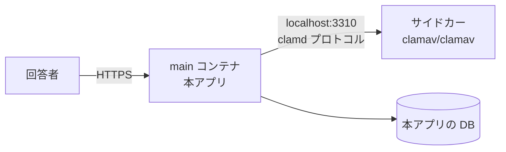

# 添付ファイル検査 運用手順書

添付ファイルの検査をどう構成し、どう運用するか。
設計の背景は [`非機能設計.md`](非機能設計.md) 1 章。

## 1. 何を有効にするか

| 層 | 内容 | 既定 | 止められるもの |
|---|---|---|---|
| 1 | 拡張子の**許可リスト** | **常に有効** | 誤って上げた無関係なファイル |
| 2 | 先頭バイトと拡張子の**一致検査** | **常に有効** | 名乗りと中身の食い違い |
| 3 | **ウイルススキャン** | **無効**（設定で有効化） | 既知のマルウェア |

**1 と 2 は「モノとしては弱い」。** 拡張子は名前でしかなく、正しい形式のファイルにも
悪意ある内容は埋められる。**それでも常に有効にする。**
3 を有効にできない環境でも、素通しにはしないため。

## 2. Azure App Service での構成（前提）

**ClamAV は Azure App Service の「サイドカーコンテナ」として動かす。**

- 出典: [Sidecars in Azure App Service](https://learn.microsoft.com/azure/app-service/overview-sidecar)、
  [Configure sidecars in Azure App Service](https://learn.microsoft.com/azure/app-service/configure-sidecar)
  （参照日 2026-08-18）
- **1 アプリあたり 9 個までのサイドカーを、同じ App Service プラン内で並走**させられる
- **外部トラフィックを受けるのは main コンテナだけ**（`isMain: true`）。
  サイドカーは内部専用になる。**clamd を外へ晒さずに済む**
- 環境変数は main とサイドカーで共有される。サイドカー側で上書きもできる



### 手順（Azure CLI）

```bash
# 1) サイドカー対応のアプリにする（既存アプリを変換する場合）
az webapp sitecontainers convert \
    --mode sitecontainers \
    --name <app-name> \
    --resource-group <resource-group>

# 2) ClamAV をサイドカーとして追加する
az webapp sitecontainers create \
    --name <app-name> \
    --resource-group <resource-group> \
    --container-name clamav \
    --image clamav/clamav:1.5-debian13-slim \
    --target-port 3310

# 3) 本アプリ側の設定を入れる
az webapp config appsettings set \
    --name <app-name> \
    --resource-group <resource-group> \
    --settings \
      QUESTIONNAIRE_VIRUSSCAN_ENABLED=true \
      QUESTIONNAIRE_VIRUSSCAN_HOST=localhost \
      QUESTIONNAIRE_VIRUSSCAN_PORT=3310
```

**新規に作る場合は `az webapp create --sitecontainers-app` を使う。**
ARM テンプレートなら `Microsoft.Web/sites/sitecontainers` リソースを足す。

### 注意

- **App Service プランのメモリに直結する。** ClamAV は定義データベースをメモリへ読む。
  **必要量は実測して、プランのサイズを決めること**（サイドカーは main とプランを共有する）
- **App Service Environment (ASE) や一部のクラウドでは未対応の場合がある。**
  導入前に対象リージョン・プランで確認すること
- **ClamAV を本アプリのイメージへ同梱しないこと。** GPL-2.0 のため、
  同梱すると配布物が引きずられる。**別コンテナとして動かし、接続先を設定で渡す**
  （[`../LICENSING.md`](../LICENSING.md)）

## 3. ローカル開発での構成

```bash
docker compose --profile postgres --profile clamav up -d --wait
```

`compose.yaml` の `clamav` サービスがサイドカー相当になる。
**profile を付けなければ起動しない**（既定で無効という方針に合わせている）。

## 4. 設定項目

| 設定 | 既定 | 意味 |
|---|---|---|
| `VirusScan.Enabled` | `false` | ウイルススキャンを行うか |
| `VirusScan.Host` / `Port` | — | clamd の接続先 |
| `VirusScan.TimeoutSeconds` | 30 | 1 件あたりの上限 |
| `Attachment.AllowedExtensions` | 別表 | 許可する拡張子 |
| `Attachment.MaxFileSizeBytes` | — | 1 件あたりのサイズ上限 |
| `Attachment.MaxFileCount` | — | 1 設問あたりの個数上限 |

**実値は `App_Data/Parameters/` に置く**（[`../App_Data/Parameters/README.md`](../App_Data/Parameters/README.md)）。

## 5. 運用

### 有効にしたのにスキャナへ到達できないとき

**添付を受け付けない。** `503` を返し、管理者へ通知する。

**「スキャンできなかったので通す」にしないこと。** 無効と有効の中間を作ると、
どちらの状態で運用しているのか誰にも分からなくなる。

### 検出したとき

- **添付だけでなく回答ごと拒否する**
- **監査ログへ記録する**（検出名・ファイル名・サイズ。**中身は残さない**）
- 回答者には「受け付けられない添付が含まれている」とだけ返す。
  **検出名を回答者へ出さない**

### 定義データベースの更新

`clamav/clamav` イメージは `freshclam` を同梱しており、コンテナ内で定期更新される。
**サイドカーを長期間再起動しないまま放置しないこと。**

- **起動直後は定義の取得が終わるまでスキャンできない。** 起動直後の失敗を
  「到達できない」と扱うため、デプロイ直後に添付が弾かれ得る。
  **デプロイ手順に、スキャナの準備完了を待つ工程を入れること**

### 監視

- スキャン失敗率、スキャン所要時間、検出件数
- **到達不能が続いたら通知する。** 添付を受け付けられない状態が続いている

## 6. 制約

- **既知のマルウェアしか止められない。** 未知のものは通る
- **スキャンは送信待ちへ保存する前に行う。** 保存してからでは、
  未検査のバイナリが DB に載る
- **Windows へ配置する場合は AMSI という選択肢もある**（OS 同梱）。
  ただし本アプリは Linux コンテナ前提のため、主軸にしない
