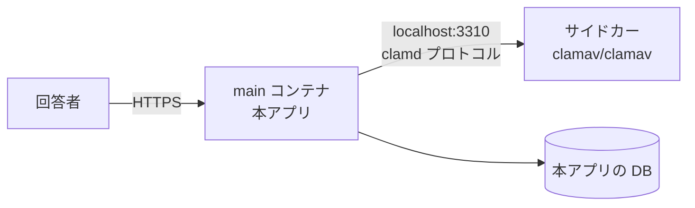
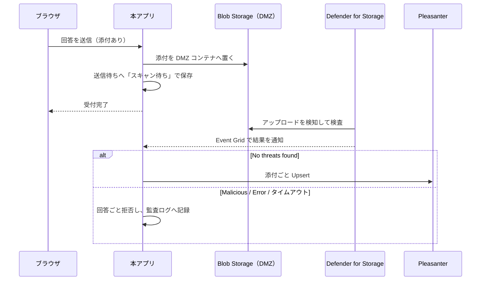

# 添付ファイル検査 運用手順書

添付ファイルの検査をどう構成し、どう運用するか。
設計の背景は [`非機能設計.md`](非機能設計.md) 1 章。

## 1. 何を有効にするか

| 層 | 内容 | 既定 | 止められるもの |
|---|---|---|---|
| 1 | 拡張子の**許可リスト** | **常に有効** | 誤って上げた無関係なファイル |
| 2 | 先頭バイトと拡張子の**一致検査** | **常に有効** | 名乗りと中身の食い違い |
| 3 | **ウイルススキャン** | **無効**（設定で有効化） | 既知のマルウェア |

**1 と 2 は「モノとしては弱い」。** 拡張子は名前でしかなく、正しい形式のファイルにも
悪意ある内容は埋められる。**それでも常に有効にする。**
3 を有効にできない環境でも、素通しにはしないため。

## 2. ウイルススキャンの方式を選ぶ

**2 つ用意する。導入先の事情で選べるようにする。**

| | **A. ClamAV サイドカー** | **B. Defender for Storage** |
|---|---|---|
| 判定のタイミング | **同期。** 保存前にその場で分かる | **非同期。** アップロード後に判定が付く |
| 添付の置き場所 | アプリのメモリ → 送信待ちテーブル | **Azure Blob Storage が必須** |
| 定義の更新 | **自前で面倒を見る**（サイドカーの再起動・メモリ） | **Azure に任せられる** |
| 動く場所 | どこでも（コンテナが動けばよい） | **Azure 限定** |
| ライセンス | ClamAV は GPL-2.0（別プロセス） | Azure のサービス |
| 費用 | App Service プランのメモリ | Defender ＋ ストレージ読み取り ＋ Event Grid |

**A を既定にする。** どこでも動き、判定がその場で付くため実装が素直。
**B は Azure のエコシステムに寄せたい場合の選択肢**として用意する。

> **B は A の差し替えでは済まない。** 判定が非同期になるため、
> **添付の置き場所と受付の流れが変わる**（4 章）。
> `IVirusScanner` の実装を足すだけにはならない。

## 3. A. ClamAV サイドカー（既定）

### Azure App Service での構成

**ClamAV は Azure App Service の「サイドカーコンテナ」として動かす。**

- 出典: [Sidecars in Azure App Service](https://learn.microsoft.com/azure/app-service/overview-sidecar)、
  [Configure sidecars in Azure App Service](https://learn.microsoft.com/azure/app-service/configure-sidecar)
  （参照日 2026-08-18）
- **1 アプリあたり 9 個までのサイドカーを、同じ App Service プラン内で並走**させられる
- **外部トラフィックを受けるのは main コンテナだけ**（`isMain: true`）。
  サイドカーは内部専用になる。**clamd を外へ晒さずに済む**
- 環境変数は main とサイドカーで共有される。サイドカー側で上書きもできる



#### 手順（Azure CLI）

```bash
# 1) サイドカー対応のアプリにする（既存アプリを変換する場合）
az webapp sitecontainers convert \
    --mode sitecontainers \
    --name <app-name> \
    --resource-group <resource-group>

# 2) ClamAV をサイドカーとして追加する
az webapp sitecontainers create \
    --name <app-name> \
    --resource-group <resource-group> \
    --container-name clamav \
    --image clamav/clamav:1.5-debian13-slim \
    --target-port 3310

# 3) 本アプリ側の設定を入れる
az webapp config appsettings set \
    --name <app-name> \
    --resource-group <resource-group> \
    --settings \
      QUESTIONNAIRE_VIRUSSCAN_ENABLED=true \
      QUESTIONNAIRE_VIRUSSCAN_HOST=localhost \
      QUESTIONNAIRE_VIRUSSCAN_PORT=3310
```

**新規に作る場合は `az webapp create --sitecontainers-app` を使う。**
ARM テンプレートなら `Microsoft.Web/sites/sitecontainers` リソースを足す。

#### 注意

- **App Service プランのメモリに直結する。** ClamAV は定義データベースをメモリへ読む。
  **必要量は実測して、プランのサイズを決めること**（サイドカーは main とプランを共有する）
- **App Service Environment (ASE) や一部のクラウドでは未対応の場合がある。**
  導入前に対象リージョン・プランで確認すること
- **ClamAV を本アプリのイメージへ同梱しないこと。** GPL-2.0 のため、
  同梱すると配布物が引きずられる。**別コンテナとして動かし、接続先を設定で渡す**
  （[`../LICENSING.md`](../LICENSING.md)）

### ローカル開発での構成

```bash
docker compose --profile postgres --profile clamav up -d --wait
```

`compose.yaml` の `clamav` サービスがサイドカー相当になる。
**profile を付けなければ起動しない**（既定で無効という方針に合わせている）。

## 4. B. Microsoft Defender for Storage（Azure に寄せる場合）

**Azure Blob Storage へアップロードされた blob を Defender が検査する。**

- 出典: [Introduction to malware scanning](https://learn.microsoft.com/azure/defender-for-cloud/introduction-malware-scanning)、
  [Set up automated remediation for malware detection](https://learn.microsoft.com/azure/defender-for-cloud/defender-for-storage-configure-malware-scan)
  （参照日 2026-08-18）

### 流れ



**送信待ちテーブルに「スキャン待ち」の状態を足すことになる。**
本アプリは元から非同期で Pleasanter へ送るので、その仕組みに乗せられる。

### 必ず守ること

- **結果が出るまで通さない（default deny）。**
  「タグが無い＝まだ検査されていない」を「通してよい」と解釈しないこと
- **blob index tag を唯一の根拠にしないこと。**
  Microsoft は「index tag は改ざん耐性が無い。タグを変更できる権限を持つ利用者は
  書き換えられるため、単独のセキュリティ制御に使うべきではない」と明記している。
  **セキュリティ目的なら Event Grid か Log Analytics、または Defender のアラートを使う**
- **DMZ（untrusted 用）のストレージアカウントを分ける。**
  検査が済んだものだけを本来の置き場へ移す構成が推奨されている
- **アップロード直後にメタデータを更新しないこと。** on-upload スキャンが失敗し得る

### 制約（一次情報より）

| 項目 | 内容 |
|---|---|
| サイズ | **50 GB まで** |
| 対象外 | Azure Files（on-upload）、append blob / page blob、クライアント側暗号化された blob、NFS 3.0 経由 |
| リージョン | **すべてのリージョンで使えるわけではない。** 導入先で確認する |
| 所要時間 | 大きい・複雑な blob は **30 分〜3 時間**でタイムアウトし得る（入れ子の多い ZIP など） |
| 費用 | ストレージ読み取り・blob インデックス・Event Grid の通知が別途かかる |
| 自動対処 | 悪性 blob の**論理削除**（既定は無効。保持期間の既定 7 日） |

> **「スキャンに数十分かかり得る」ことを回答者へどう見せるかを決めること。**
> 受付完了を返してから裏で弾くのか、待たせるのか。**未確定。**

### 判定の受け取り方（実装）

**本アプリは Event Grid の Webhook で判定を受け取る。**

| 項目 | 内容 |
|---|---|
| 受け口 | `POST /api/internal/malware-scan-events` |
| 認証 | ヘッダ `x-questionnaire-eventgrid-key` に合言葉。**一致しなければ 401** |
| 購読の確認 | `Microsoft.EventGrid.SubscriptionValidationEvent` に同期で応答する（HTTP 200） |
| 判定 | `Microsoft.Security.MalwareScanningResult` の `data.blobUri` と `data.scanResultType` |

- **この受け口はアプリの認証の外にある。** 合言葉が無いと誰でも「検出なし」を送り込める。
  **`QUESTIONNAIRE_VIRUSSCAN_DEFENDER_EVENTGRIDKEY` は必須**（未設定なら起動時に落ちる）
- **Defender for Storage を選んだときだけ受け口が生える。** 使わない構成では開かない

> **引き受けた制約: 判定の待ち合わせはインスタンスの中で完結する。**
> スケールアウトすると、アップロードしたインスタンスと通知を受けたインスタンスが
> 食い違って判定を待てない。**この方式を使うならインスタンスを増やさないこと。**
> 既定の方式（ClamAV）にはこの制約は無い。

## 5. 設定項目

**環境変数（Azure App Service のアプリケーション設定）で与える。**

| 環境変数 | 既定 | 意味 |
|---|---|---|
| `QUESTIONNAIRE_VIRUSSCAN_ENABLED` | `false` | ウイルススキャンを行うか |
| `QUESTIONNAIRE_VIRUSSCAN_PROVIDER` | `ClamAv` | `ClamAv` / `DefenderForStorage` |
| `QUESTIONNAIRE_VIRUSSCAN_HOST` | `localhost` | clamd の接続先 |
| `QUESTIONNAIRE_VIRUSSCAN_PORT` | `3310` | clamd のポート |
| `QUESTIONNAIRE_VIRUSSCAN_TIMEOUTSECONDS` | `30` | clamd への問い合わせ 1 件あたりの上限 |
| `QUESTIONNAIRE_VIRUSSCAN_DEFENDER_CONNECTIONSTRING` | — | DMZ ストレージへの接続文字列 |
| `QUESTIONNAIRE_VIRUSSCAN_DEFENDER_CONTAINERURL` | — | DMZ コンテナの URL（SAS 付き。接続文字列の代わり） |
| `QUESTIONNAIRE_VIRUSSCAN_DEFENDER_CONTAINER` | `questionnaire-dmz` | DMZ コンテナ名 |
| `QUESTIONNAIRE_VIRUSSCAN_DEFENDER_RESULTTIMEOUTSECONDS` | `300` | 判定を待つ上限。**超えたら通さない** |
| `QUESTIONNAIRE_VIRUSSCAN_DEFENDER_EVENTGRIDKEY` | — | 判定の受け口を守る合言葉。**Defender を使うなら必須** |
| `QUESTIONNAIRE_ATTACHMENT_ALLOWEDEXTENSIONS` | 下記 | 許可する拡張子（カンマ区切り） |
| `QUESTIONNAIRE_ATTACHMENT_MAXFILESIZEBYTES` | `5242880`（5 MB） | 1 件あたりのサイズ上限 |
| `QUESTIONNAIRE_ATTACHMENT_MAXFILECOUNT` | `5` | 1 設問あたりの個数上限 |
| `QUESTIONNAIRE_ATTACHMENT_MAXTOTALBYTES` | `20971520`（20 MB） | 1 回の送信の合計サイズ上限 |

許可する拡張子の既定値:
`.pdf .png .jpg .jpeg .gif .webp .txt .csv .docx .xlsx .pptx .zip`

- **読めない値は既定値へ倒さずに起動を止める。**「有効にしたつもりが無効だった」を作らない
- **合計サイズの上限は必ず入れる。** 1 件あたりの上限だけでは、上限いっぱいの添付を
  設問の数だけ並べられて DB が溢れる。**添付は送信待ちの行へ Base64（元の約 4/3）で載る**
- 設問ごとの上限（アンケートの定義側）はここで決めた上限より**緩くはならない**

**実値は `App_Data/Parameters/` に置く**（[`../App_Data/Parameters/README.md`](../App_Data/Parameters/README.md)）。

## 6. 運用

### 有効にしたのにスキャナへ到達できないとき

**添付を受け付けない。** `503` を返し、管理者へ通知する。

**「スキャンできなかったので通す」にしないこと。** 無効と有効の中間を作ると、
どちらの状態で運用しているのか誰にも分からなくなる。

### 検出したとき

- **添付だけでなく回答ごと拒否する**
- **監査ログへ記録する**（検出名・ファイル名・サイズ。**中身は残さない**）
- 回答者には「受け付けられない添付が含まれている」とだけ返す。
  **検出名を回答者へ出さない**

> **現状はアプリのログ（`ILogger`）へ出している。**
> 検出名はスキャナ側、ファイル名と理由は受け口側から出る。
> `AuditLogs` テーブルへの記録は、管理画面から読めるようにする時に併せて実装する。

### 定義データベースの更新

`clamav/clamav` イメージは `freshclam` を同梱しており、コンテナ内で定期更新される。
**サイドカーを長期間再起動しないまま放置しないこと。**

- **起動直後は定義の取得が終わるまでスキャンできない。** 起動直後の失敗を
  「到達できない」と扱うため、デプロイ直後に添付が弾かれ得る。
  **デプロイ手順に、スキャナの準備完了を待つ工程を入れること**

### 監視

- スキャン失敗率、スキャン所要時間、検出件数
- **到達不能が続いたら通知する。** 添付を受け付けられない状態が続いている

## 7. 制約

- **既知のマルウェアしか止められない。** 未知のものは通る
- **スキャンは送信待ちへ保存する前に行う。** 保存してからでは、
  未検査のバイナリが DB に載る
- **検査を通った添付は、まだ Pleasanter へは届かない。**
  送信待ちの行には Base64 で載るが、どの添付列（`AttachmentsA` 等）へ入れるかを
  決めていないため、送信ワーカーは添付を送らない。**別途対応する**
- **回答を編集して送り直すときは添付を選び直してもらう。**
  ブラウザは選んだファイルを保持できない
- **Windows へ配置する場合は AMSI という選択肢もある**（OS 同梱）。
  ただし本アプリは Linux コンテナ前提のため、主軸にしない
