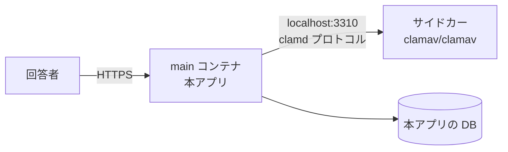
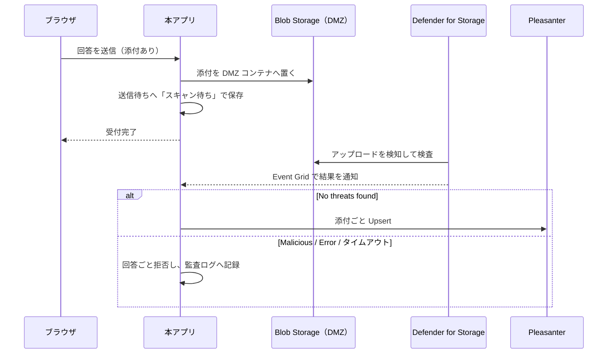

# 添付ファイル検査 運用手順書

添付ファイルの検査をどう構成し、どう運用するか。
設計の背景は [`非機能設計.md`](非機能設計.md) 1 章。

## 1. 何を有効にするか

| 層 | 内容 | 既定 | 止められるもの |
|---|---|---|---|
| 1 | 拡張子の**許可リスト** | **常に有効** | 誤って上げた無関係なファイル |
| 2 | 先頭バイトと拡張子の**一致検査** | **常に有効** | 名乗りと中身の食い違い |
| 3 | **ウイルススキャン** | **無効**（設定で有効化） | 既知のマルウェア |

**1 と 2 は「モノとしては弱い」。** 拡張子は名前でしかなく、正しい形式のファイルにも
悪意ある内容は埋められる。**それでも常に有効にする。**
3 を有効にできない環境でも、素通しにはしないため。

## 2. ウイルススキャンの方式を選ぶ

**2 つの方式を用意する。導入先の事情に応じて選ぶ。**

| | **A. ClamAV サイドカー** | **B. Defender for Storage** |
|---|---|---|
| 判定のタイミング | **同期。** 保存前にその場で分かる | **非同期。** アップロード後に判定が付く |
| 添付の置き場所 | アプリのメモリ → 送信待ちテーブル | **Azure Blob Storage が必須** |
| 定義の更新 | **自前で面倒を見る**（サイドカーの再起動・メモリ） | **Azure に任せられる** |
| 動く場所 | どこでも（コンテナが動けばよい） | **Azure 限定** |
| ライセンス | ClamAV は GPL-2.0（別プロセス） | Azure のサービス |
| 費用 | App Service プランのメモリ | Defender ＋ ストレージ読み取り ＋ Event Grid |

**A が既定の方式である**（`AttachmentOptions` の既定値）。どこでも動き、判定がその場で付く。
**B は Azure のエコシステムに寄せたい場合の選択肢**として用意する。

Azure App Service へ導入する場合、A をサイドカーとして構成できるのは
**Linux Web App だけ**である。Windows Web App では App Service のサイドカーを使えないため、
5 章の選択肢から運用に合うものを選ぶ。

> **B は A の差し替えでは済まない。** 判定が非同期になるため、
> **添付の置き場所と受付の流れが変わる**（4 章）。
> `IVirusScanner` の実装を足すだけにはならない。

## 3. A. ClamAV サイドカー（既定、Linux App Service 向け）

### Linux App Service での構成

**ClamAV は Azure App Service の「サイドカーコンテナ」として動かす。**

- **サイドカーが使えるのは Linux の App Service だけである。Windows Web App では構成できない。**
- 出典: [Sidecars in Azure App Service](https://learn.microsoft.com/azure/app-service/overview-sidecar)、
  [Configure sidecars in Azure App Service](https://learn.microsoft.com/azure/app-service/configure-sidecar)
  （参照日 2026-09-16）
- **1 アプリあたり 9 個までのサイドカーを、同じ App Service プラン内で並走**させられる
- **外部トラフィックを受けるのは main コンテナだけ**（`isMain: true`）。
  サイドカーは内部専用になる。**clamd を外へ晒さずに済む**
- 環境変数は main とサイドカーで共有される。サイドカー側で上書きもできる



#### 手順（Azure CLI）

```bash
# 1) サイドカー対応のアプリにする（既存アプリを変換する場合）
az webapp sitecontainers convert \
    --mode sitecontainers \
    --name <app-name> \
    --resource-group <resource-group>

# 2) ClamAV をサイドカーとして追加する
az webapp sitecontainers create \
    --name <app-name> \
    --resource-group <resource-group> \
    --container-name clamav \
    --image clamav/clamav:1.5-debian13-slim \
    --target-port 3310

# 3) 本アプリ側の設定を入れる
az webapp config appsettings set \
    --name <app-name> \
    --resource-group <resource-group> \
    --settings \
      QUESTIONNAIRE_VIRUSSCAN_ENABLED=true \
      QUESTIONNAIRE_VIRUSSCAN_HOST=localhost \
      QUESTIONNAIRE_VIRUSSCAN_PORT=3310
```

**新規に作る場合は `az webapp create --sitecontainers-app` を使う。**
ARM テンプレートなら `Microsoft.Web/sites/sitecontainers` リソースを足す。

#### 注意

- **App Service プランのメモリに直結する。** ClamAV は定義データベースをメモリへ読む。
  **必要量は実測して、プランのサイズを決めること**（サイドカーは main とプランを共有する）
- **App Service Environment (ASE) や一部のクラウドでは未対応の場合がある。**
  導入前に対象リージョン・プランで確認すること
- **ClamAV を本アプリのイメージへ同梱しないこと。** GPL-2.0 のため、
  同梱すると配布物が引きずられる。**別コンテナとして動かし、接続先を設定で渡す**
  （[`../LICENSING.md`](../LICENSING.md)）
- E2E は Linux コンテナ上で ClamAV まで接続しているが、
  **Azure App Service の Linux Web App では未検証**（2026-09-16）。
  本番導入前に検証用 Web App でサイドカーの起動、準備完了、EICAR の拒否を確認する

### ローカル開発での構成

```bash
docker compose --profile postgres --profile clamav up -d --wait
```

`compose.yaml` の `clamav` サービスがサイドカー相当になる。
**profile を付けなければ起動しない**（既定で無効という方針に合わせている）。

## 4. B. Microsoft Defender for Storage（Azure に寄せる場合）

**Azure Blob Storage へアップロードされた blob を Defender が検査する。**

- 出典: [Introduction to malware scanning](https://learn.microsoft.com/azure/defender-for-cloud/introduction-malware-scanning)、
  [Set up automated remediation for malware detection](https://learn.microsoft.com/azure/defender-for-cloud/defender-for-storage-configure-malware-scan)
  （参照日 2026-08-18）

### 流れ



**送信待ちテーブルに「スキャン待ち」の状態を足すことになる。**
本アプリは元から非同期で Pleasanter へ送るので、その仕組みに乗せられる。

### 必ず守ること

- **結果が出るまで通さない（default deny）。**
  「タグが無い＝まだ検査されていない」を「通してよい」と解釈しないこと
- **blob index tag を唯一の根拠にしないこと。**
  Microsoft は「index tag は改ざん耐性が無い。タグを変更できる権限を持つ利用者は
  書き換えられるため、単独のセキュリティ制御に使うべきではない」と明記している。
  **セキュリティ目的なら Event Grid か Log Analytics、または Defender のアラートを使う**
- **DMZ（untrusted 用）のストレージアカウントを分ける。**
  検査が済んだものだけを本来の置き場へ移す構成が推奨されている
- **アップロード直後にメタデータを更新しないこと。** on-upload スキャンが失敗し得る

### 制約（一次情報より）

| 項目 | 内容 |
|---|---|
| サイズ | **50 GB まで** |
| 対象外 | Azure Files（on-upload）、append blob / page blob、クライアント側暗号化された blob、NFS 3.0 経由 |
| リージョン | **すべてのリージョンで使えるわけではない。** 導入先で確認する |
| 所要時間 | 大きい・複雑な blob は **30 分〜3 時間**でタイムアウトし得る（入れ子の多い ZIP など） |
| 費用 | ストレージ読み取り・blob インデックス・Event Grid の通知が別途かかる |
| 自動対処 | 悪性 blob の**論理削除**（既定は無効。保持期間の既定 7 日） |

> **決着済み（2026-08-20）。待てる時間の上限を決め、超えたら受け付けない。**
>
> 上限を超えたら `ScannerUnavailable` として扱い、**回答ごと断る。**
> 「受付完了を返してから裏で弾く」はしない。
>
> ⚠️ **未検査のバイナリを DB に載せないという決まりを崩さないため**（8 章）。
> 先に受け付けると、判定が返るまで未検査のものが送信待ちに載る。
> 回答者にも一度「受け付けた」と伝えてから翻すことになる。
>
> ⚠️ **結果として、スキャンが遅い導入先では B 案を実質使えない。**
> それは分かったうえでの選択で、**穴を開けるより使えない方がよい。**
> 大きな添付を受け付けるなら A 案（ClamAV サイドカー）を採るか、
> **1 件あたりのサイズ上限を下げて判定が速く返る範囲に収めること。**

### 判定の受け取り方（実装）

**本アプリは Event Grid の Webhook で判定を受け取る。**

| 項目 | 内容 |
|---|---|
| 受け口 | `POST /api/internal/malware-scan-events` |
| 認証 | ヘッダ `x-questionnaire-eventgrid-key` にパスワード。**一致しなければ 401** |
| 購読の確認 | `Microsoft.EventGrid.SubscriptionValidationEvent` に同期で応答する（HTTP 200） |
| 判定 | `Microsoft.Security.MalwareScanningResult` の `data.blobUri` と `data.scanResultType` |

- **この受け口はアプリの認証の外にある。** パスワードが無いと誰でも「検出なし」を送り込める。
  **`QUESTIONNAIRE_VIRUSSCAN_DEFENDER_EVENTGRIDKEY` は必須**（未設定なら起動時に落ちる）
- **Defender for Storage を選んだときだけ受け口が生える。** 使わない構成では開かない

> **引き受けた制約: 判定の待ち合わせはインスタンスの中で完結する。**
> スケールアウトすると、アップロードしたインスタンスと通知を受けたインスタンスが
> 食い違って判定を待てない。**この方式を使うならインスタンスを増やさないこと。**
> 既定の方式（ClamAV）にはこの制約は無い。

## 5. Windows App Service で添付を使う場合の選択肢

Windows Web App では App Service の ClamAV サイドカーを構成できない。
添付を使うか、どの検査方式を使うかは運用者が選ぶ。ここに挙げた選択肢に優劣はない。

| 道 | 使える所 | 注意 |
| --- | --- | --- |
| **Linux App Service へ移す** | Linux App Service | **推奨構成**（Issue #296）。ClamAV サイドカーを使える。サイドカーは Linux 限定であり、App Service プランのメモリを消費する（3 章） |
| **別の場所の `clamd` へ接続する** | Windows App Service | Container Apps、Azure Container Instances、VM などで `clamd` を動かす。**本アプリと同じ仮想ネットワークに閉じ、インターネットへ公開しないこと。** 常時稼働するため別途費用がかかる。`QUESTIONNAIRE_VIRUSSCAN_HOST` と `QUESTIONNAIRE_VIRUSSCAN_PORT` に接続先を設定する |
| **Defender for Storage を使う** | Azure | Azure Blob Storage が前提で、判定は**非同期**である（4 章）。回答添付の DMZ Blob は `QUESTIONNAIRE_VIRUSSCAN_DEFENDER_*` で設定する。`QUESTIONNAIRE_ASSET_STORE=AzureBlob` は配布資産の保存先だけを切り替える設定であり、回答添付の Defender 構成には使わない |
| **添付を使わない** | どこでも | 添付設問を置かない。`QUESTIONNAIRE_ATTACHMENT_ENABLED` という設定は実装されていないため、この環境変数で添付を止めることはできない |
| **検査を切って運用する** | 運用者がリスクを受け入れる環境 | `QUESTIONNAIRE_VIRUSSCAN_ENABLED=false` を設定する。運用者が選ぶものであり、実装の穴ではない。未検査のまま通す振る舞いと制約は次節を参照する |

### 検査を切って受け付ける場合

`QUESTIONNAIRE_VIRUSSCAN_ENABLED=false` は、運用者が承知のうえで検査を切った状態である。
この状態では添付を通す。無効と有効の中間を作らない。

検査を切る運用では、次のことを引き受ける。

- **既知のマルウェアも止まらない**
- **回答者が上げたものが、そのまま Pleasanter へ渡る**
- **閉じた環境（イントラ）でのみ現実的である**
- 検査を切っていることが運用者に分かる状態を保つ。設定を確認すれば分かる状態で足りる

検査を有効にした場合は、スキャナへ到達できなければこれまでどおり
`ScannerUnavailable` として回答を断る。検査の有効・無効にかかわらず、
検査は送信待ちへ保存する前に行う。

### 回答の添付と配布資産で方式を分けない

管理者が登録する配布資産（Issue #266）は配布前に待たせられるため、
**非同期の Defender for Storage でも成立する。** そのため
「回答の添付は `clamd`、配布資産は Defender」という組み合わせもあり得る。

⚠️ **用途ごとに別の方式を選べるようにはしない**（2026-09-17 決定）。
本アプリが提供するのは**検査する手段**であって、組み合わせの最適化ではない。
現在の実装どおり、`QUESTIONNAIRE_VIRUSSCAN_*` で**どちらか一方を選ぶ**まま据え置く。

### AMSI は見送る

Windows の AMSI は選択肢に載せない。Azure App Service には AMSI のプロバイダーがいないため、
`AmsiScanBuffer` は「検出なし」を返す。検査しているつもりで素通りになり、
検査を切ったことが明示される運用より危険である。

- 出典: [Antimalware Scan Interface (AMSI) - Win32 apps](https://learn.microsoft.com/windows/win32/amsi/antimalware-scan-interface-portal)
  （参照日 2026-09-16）

## 6. 設定項目

**環境変数（Azure App Service のアプリケーション設定）で与える。**

| 環境変数 | 既定 | 意味 |
|---|---|---|
| `QUESTIONNAIRE_VIRUSSCAN_ENABLED` | `false` | ウイルススキャンを行うか |
| `QUESTIONNAIRE_VIRUSSCAN_PROVIDER` | `ClamAv` | `ClamAv` / `DefenderForStorage` |
| `QUESTIONNAIRE_VIRUSSCAN_HOST` | `localhost` | clamd の接続先 |
| `QUESTIONNAIRE_VIRUSSCAN_PORT` | `3310` | clamd のポート |
| `QUESTIONNAIRE_VIRUSSCAN_TIMEOUTSECONDS` | `30` | clamd への問い合わせ 1 件あたりの上限 |
| `QUESTIONNAIRE_VIRUSSCAN_DEFENDER_CONNECTIONSTRING` | — | DMZ ストレージへの接続文字列 |
| `QUESTIONNAIRE_VIRUSSCAN_DEFENDER_CONTAINERURL` | — | DMZ コンテナの URL（SAS 付き。接続文字列の代わり） |
| `QUESTIONNAIRE_VIRUSSCAN_DEFENDER_CONTAINER` | `questionnaire-dmz` | DMZ コンテナ名 |
| `QUESTIONNAIRE_VIRUSSCAN_DEFENDER_RESULTTIMEOUTSECONDS` | `300` | 判定を待つ上限。**超えたら通さない** |
| `QUESTIONNAIRE_VIRUSSCAN_DEFENDER_EVENTGRIDKEY` | — | 判定の受け口を守るパスワード。**Defender を使うなら必須** |
| `QUESTIONNAIRE_ATTACHMENT_ALLOWEDEXTENSIONS` | 下記 | 許可する拡張子（カンマ区切り） |
| `QUESTIONNAIRE_ATTACHMENT_MAXFILESIZEBYTES` | `5242880`（5 MB） | 1 件あたりのサイズ上限 |
| `QUESTIONNAIRE_ATTACHMENT_MAXFILECOUNT` | `5` | 1 設問あたりの個数上限 |
| `QUESTIONNAIRE_ATTACHMENT_MAXTOTALBYTES` | `20971520`（20 MB） | 1 回の送信の合計サイズ上限 |
| `QUESTIONNAIRE_ASSET_ALLOWEDEXTENSIONS` | 下記 | 説明文・完了画面で配る資産の許可拡張子 |
| `QUESTIONNAIRE_ASSET_MAXFILESIZEBYTES` | `10485760`（10 MB） | 配布資産 1 件あたりのサイズ上限 |
| `QUESTIONNAIRE_ASSET_MAXFILECOUNT` | `20` | アンケート 1 件あたりの配布資産数 |

許可する拡張子の既定値:

- 回答添付:
  `.pdf .png .jpg .jpeg .gif .webp .txt .csv .docx .xlsx .pptx .zip`
- 配布資産:
  `.pdf .docx .xlsx .pptx .png .jpg .jpeg .gif .webp`

- **読めない値は既定値へ倒さずに起動を止める。**「有効にしたつもりが無効だった」を作らない
- **合計サイズの上限は必ず入れる。** 1 件あたりの上限だけでは、上限いっぱいの添付を
  設問の数だけ並べられて DB が溢れる。**添付は送信待ちの行へ Base64（元の約 4/3）で載る**
- 設問ごとの上限（アンケートの定義側）はここで決めた上限より**緩くはならない**

### 配布資産を広げるときの注意

配布資産も回答添付と同じ `AttachmentInspector` と `IVirusScanner` を通す。
ウイルススキャンの有効・無効と方式は `QUESTIONNAIRE_VIRUSSCAN_*` を共有するが、
**許可拡張子は `QUESTIONNAIRE_ASSET_ALLOWEDEXTENSIONS` で独立させる。**
配布用途で許した形式を、回答者から受け取る入口へ広げないため。

- **`.html` / `.htm` / `.svg` は設定できない。**
  自アプリのドメインから能動的な内容を配る経路にしない
- **`.exe` / `.bat` / `.cmd` / `.ps1` は設定できない。**
  信頼されたドメインを実行ファイルの配布元にしない
- `.txt` / `.csv` は設定できるが、固定の先頭バイトを持たない。
  **この 2 形式は署名検査が効かず、形式面の守りは許可リストとウイルス検査だけになる**
- 未知の拡張子は Content-Type を安全に固定できないため、起動時に拒否する
- 配信は必ず `Content-Disposition: attachment` とし、ブラウザ内で開かせない
- 既定保存先は DB で、バイナリは Base64 になる。
  **数 MB の配布物を複数置く運用では `Path` / `AzureBlob` / `S3` を推奨する**

**実値は `App_Data/Parameters/` に置く**（[`../App_Data/Parameters/README.md`](../App_Data/Parameters/README.md)）。

## 7. 運用

### 有効にしたのにスキャナへ到達できないとき

**添付を受け付けない。** `503` を返し、管理者へ通知する。

**「スキャンできなかったので通す」にしないこと。** 無効と有効の中間を作ると、
どちらの状態で運用しているのか誰にも分からなくなる。

### 検出したとき

- **添付だけでなく回答ごと拒否する**
- **`AttachmentRejections` へ記録する**（Issue #39）。
  残すのは**いつ・どのアンケートで・どの理由で・何件**だけ
- 回答者には「受け付けられない添付が含まれている」とだけ返す。
  **検出名を回答者へ出さない**

⚠️ **送信元もファイル名も残さない**（2026-08-20 決定）。
以前この節には「検出名・ファイル名・サイズを監査ログへ記録する」と書いてあったが、
**回答者を完全匿名にするという前提と両立しない。**

- **ファイル名には氏名が入り得る**（「履歴書_山田太郎.pdf」）
- **`AuditLogs` は `IpAddress` を持つ表**なので、そこへ入れると送信元が残る

**記録の置き場所と理由は
[`データモデル設計.md`](データモデル設計.md) 2.7 を参照すること。**

**検出名とファイル名は、アプリのログ（`ILogger`）にだけ残る。**
ログ基盤の保持期間に従い、**表には持ち込まない。**

**管理画面の「送信状況」から読める**（Issue #39）。
デッドレターと同じ画面に、直近の件数と一覧を出している。

### 定義データベースの更新

`clamav/clamav` イメージは `freshclam` を同梱しており、コンテナ内で定期更新される。
**サイドカーを長期間再起動しないまま放置しないこと。**

- **起動直後は定義の取得が終わるまでスキャンできない。** 起動直後の失敗を
  「到達できない」と扱うため、デプロイ直後に添付が弾かれ得る。
  **デプロイ手順に、スキャナの準備完了を待つ工程を入れること**

### 監視

- スキャン失敗率、スキャン所要時間、検出件数
- **到達不能が続いたら通知する。** 添付を受け付けられない状態が続いている

## 8. 制約

- **既知のマルウェアしか止められない。** 未知のものは通る
- **スキャンは送信待ちへ保存する前に行う。** 保存してからでは、
  未検査のバイナリが DB に載る
- **検査を通った添付は Pleasanter へ届く**（実装済み）。
  どの添付列（`AttachmentsA` 等）へ入れるかは**マッピングで決める**
  （添付の口 `Files` を添付列へ繋ぐ）。
  端から端までの試験で確認済み（`AttachmentMappingEndToEndTests`）
- **回答を編集して送り直すときは添付を選び直してもらう。**
  ブラウザは選んだファイルを保持できない
- **Windows へ配置する場合の AMSI は見送った。**
  ⚠️ **Azure App Service には AMSI のプロバイダーがいないため、
  検査しているつもりで素通りになる。** 理由と代わりの選択肢は 5 章を参照すること

## 検証環境で本当に弾けることを確かめる

**スキャナを差し替えた単体試験では、clamd へ本当に届いているかが分からない。**
EICAR（アンチウイルスの動作確認のために公開されている**無害な**検査用ファイル）で、
実際に弾けることを確かめること。

```bash
DEV_VIRUSSCAN_ENABLED=true docker compose --profile sqlserver --profile clamav up -d --wait
QUESTIONNAIRE_INTEGRATION=1 QUESTIONNAIRE_VIRUSSCAN=1   dotnet test tests/VehicleVision.PleasanterTools.Questionnaire.Integration.Tests   --filter "FullyQualifiedName~AttachmentScanEndToEndTests"
```

PowerShell では環境変数を先に設定する。

```powershell
$env:DEV_VIRUSSCAN_ENABLED = "true"
docker compose --profile sqlserver --profile clamav up -d --wait
$env:QUESTIONNAIRE_INTEGRATION = "1"
$env:QUESTIONNAIRE_VIRUSSCAN = "1"
dotnet test tests/VehicleVision.PleasanterTools.Questionnaire.Integration.Tests `
  --filter "FullyQualifiedName~AttachmentScanEndToEndTests"
```

- **clamav コンテナは定義データベースの取得が終わるまで ready にならない。**
  初回は数分かかる（`start_period: 180s`）
- 通ったときは clamd 側にも記録が出る。**アプリ側のログだけで判断しない**

```text
clamav-1 | instream(172.18.0.3@57752): Eicar-Test-Signature FOUND
```

```bash
docker compose logs clamav | grep "Eicar-Test-Signature FOUND"
```

- **検出した署名名を利用者へ返していないこと**も併せて確認する。
  返すと、何を避ければ通るかの手掛かりになる
