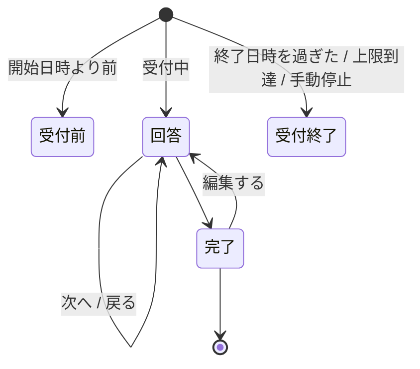

# 画面設計

Google Forms / Microsoft Forms に近い見た目・操作感にする。
対応する機能の範囲は [`機能一覧.md`](機能一覧.md)。

## 1. 回答画面

### 画面遷移

### 各画面

| 画面 | 内容 |
|---|---|
| 回答 | 設問。ページ分割・進捗バー・「次へ / 戻る」 |
| 完了 | 確認メッセージ。「別の回答を送信」「回答を編集」の導線 |
| 受付前・受付終了 | **理由を明示する。** 「エラー」で済ませない |
| 既に回答済み | 同じ端末からの再訪。編集するか、新しく回答するかを選ばせる |

**「既に回答済み」は Web Storage と Cookie の印で判定する。**
**防止ではなく抑止**であり、消されたら普通の回答画面に戻る

### 書きかけの回答（Issue #59）

**端末の中だけに残す。** サーバへは送らない。

⚠️ **アンケートごとに切り替え、既定は無効**（`Surveys.AllowDraft`）。
端末は共有され得る（店頭のタブレット、共用 PC）ので、
**黙って残すと次に使う人が前の人の回答を見る。**

- **勝手には戻さない。** 「前回の続きが残っています」と出し、
  **再開するか破棄するかを回答者が選ぶ**
- **破棄する口を必ず置く。** 共有の端末で、前の人の回答を消せるようにする
- **7 日で捨てる。** 読んだ時点で期限を見て、過ぎていればその場で消す
- **送信できたら消す。** 端末へ残し続けない
- **添付は残さない。** `File` は保存できないうえ、中身を端末へ写すのは重すぎる
（[`非機能設計.md`](非機能設計.md) 1 章「多重投稿の抑止」）。
`AllowEditingAfterSubmit` が有効でも、**前回の回答が読み出せなければ編集の導線は出さない。**
押しても何も入っていない画面が出るだけになる。

### 守ること

- **ページ間の入力はクライアント側で保持し、最後に 1 回だけ送信する。**
  ページごとに送るとレコードが分裂する
- **必須チェックはページ遷移時に、そのページ分だけ行う。**
  最後にまとめて出すと、どのページに戻ればよいか分からない
- **送信に失敗したら、入力内容を画面から消さない。** 完全匿名なので、
  失われたら再入力してもらう以外に手が無い
- **ハニーポット項目を 1 つ置く。** 画面にも読み上げにも出さず、キーボードでも辿れない場所に置く
  （`aria-hidden` ＋ `tabindex="-1"` ＋ 画面外）。**自動入力に拾われる名前を付けないこと。**
  拾われると正規の回答者を弾く
- **送信チケットが取れなければ回答させない。** 送信の段で断られる画面を見せる方が悪い
- **設問のシャッフルと分岐は併用しない**（順序が変わると分岐先が壊れる）。
  管理アプリ側で併用を禁止する
- **1 問 1 ページ表示**はアンケート全体の表示モード。設問側の設定ではない
- **テーマ（色・書体）で自由な CSS を書かせない**（Issue #56）。
  受け付けるのは `#rgb` / `#rrggbb` の色 3 本と、決め打ちの書体の並びから選んだ 1 つだけ。
  **検査せずに CSS へ流すと、`</style>` などを混ぜて画面を乗っ取られる**
    - 反映は CSS のカスタムプロパティへの代入だけで行い、**スタイル表を組み立てない**
    - **設定しなければ既定の見た目のまま**（`:root` に書いてある値がそのまま効く）
- **ヘッダ画像は本アプリが配る。** 外部の URL を貼らせない
    - **完全匿名なので、回答者のブラウザから第三者へ要求を出させない**
      （[`非機能設計.md`](非機能設計.md) 1 章）。**外部の Web フォントも読み込まない**
    - **書体はアプリに同梱する**（Issue #152）。自前配信なので第三者へ要求は出ず、
      **インターネットへ出られないイントラでも同じ見た目になる**

        | テーマの書体 | 同梱するもの |
        |---|---|
        | ゴシック体 | Noto Sans JP Variable |
        | 明朝体 | Noto Serif JP Variable |
        | 丸ゴシック体 | M PLUS Rounded 1c（**可変フォントが無いので 400 と 700 だけ**） |
        | 等幅 | M PLUS 1 Code Variable（**日本語も等幅**） |

        - **unicode-range で分割された woff2。回答者が受け取るのは使った範囲だけ**
        - **後ろに端末の書体も並べたままにする。** 配信に失敗しても文字が出なくならないため
        - ⚠️ **管理画面は明朝体と丸ゴシック体を読み込まない。**
          プレビューではその 2 つだけ端末の書体になる（本番と差が出る）
        - アイコン（Material Icons）は**管理画面だけに読み込む。**
          回答者へ配るものを重くしないため
            - 使い方は `save`。
              **中身はアイコンの名前**（リガチャで字形になる）
            - **`aria-hidden="true"` を必ず付ける。** 付けないと `save` という英単語が読み上げられる
            - **意味は文字でも書く。** アイコンだけの釦は読み上げで何も伝わらない
            - **表の中では `fixed` を足す**（`class="material-icons fixed"`）。
              箱の幅を決めて中央へ置くので、行ごとにずれない
    - 受け入れは**添付ファイルと同じ検査**（拡張子・先頭バイト・大きさ）。
      **SVG は許可しない**（中に script を書けるうえ、先頭バイトで見分けられない）
    - 出すのは**公開中の版が指している画像だけ。** 下書きで差し替えた画像は出ない

### 回答者に見せないもの

- Pleasanter の `ReferenceId`・サイト ID
- Pleasanter の URL・API のエラー本文
- **「まだ Pleasanter へ送っていない」という内部事情。**
  受付完了は受付完了として見せる

## 2. 管理アプリ

### 画面構成

| 画面 | 内容 |
|---|---|
| ログイン | 独自ログイン |
| アンケート一覧 | 状態・回答数・受付期間。複製。**題名と状態で絞り込み、ページ送りで見る**（#79） |
| 設問エディタ | ページ・設問・選択肢の編集。並べ替え |
| マッピングエディタ | 設問 → Pleasanter の列。変換と条件 |
| プレビュー | 回答画面と同じ描画。**分岐も実際に辿れること** |
| 公開設定 | 公開 URL、受付期間、回答上限、proof-of-work の要否、手動停止 |
| 送信状況 | **未送信件数と最古の滞留時刻。** デッドレターの確認と手動再送。**滞留による受付停止**（#72）と**受け付けなかった添付**（#39）もここに出す |
| 管理者管理 | アカウント、役割（**5 種類**。Issue #160）、**最終ログイン日時** |
| 監査ログ | 誰がいつ何を変えたか |
| お知らせ | **自動で止まったこと・届かなかったことの記録**（#80）。**未読の件数をヘッダに常に出す** |

### お知らせ（Issue #80）

**ログを見張っていなくても気付けるようにするための画面。**
デッドレター・Pleasanter の認証失敗・滞留による受付停止・回答数の上限は、
今まで**ログにしか出ていなかった。**

- **未読の件数はヘッダに常に出す。** この画面を開くまで分からないのでは、目的を満たさない
- **件数は印だけでなく数字も出す。** 「1 件」と「300 件」は別のこと
- **同じ知らせは 1 行にまとめ、起きた回数を出す。**
  Pleasanter が壊れていれば回答は全部デッドレターになり、1 件 1 行では一覧が埋まる
- **既読は全体で 1 つ。** 誰かが気付いたら全員にとって既読
- ⚠️ **回答本文も送信元も出さない。** 出るのは「何が」「どのアンケートで」「何回」「いつ」だけ
- **Administrator だけ。** どのアンケートが詰まっているかは Editor へ開く情報ではない

### アンケート一覧の絞り込みとページ送り（Issue #79）

**アンケートは消さずに溜まる**（過去の回答を解釈するために版を残す）。
全件を返して全件を描く作りは、検証環境で 1367 件になった時点で破綻した。

- **1 度に読むのは既定 50 件・上限 200 件。** 増えても開く時間が変わらない
- ⚠️ **総数は数えない。** 1 件多く読んで「次がある」だけを判断する
  （デッドレターの一覧と同じ形）
- **絞り込みは題名の部分一致と状態。** 一覧を上から眺めて探せるのは最初のうちだけ
- **絞り込むとページは先頭へ戻す。** 3 ページ目のまま絞り込むと、
  条件に合う行があっても「1 件も無い」と見える
- **知らない状態は断る**（`400`）。黙って 0 件にすると「アンケートが消えた」と見える
- **受付数の相関副問い合わせは、返す行にだけ効かせる**（Issue #53）

### 設問エディタで必ず出すもの

- **残りの列数。** グリッドやランキングは 1 設問で行数ぶんの列を食う。
  **標準は型ごとに 26 本**（[`実機検証結果.md`](実機検証結果.md) 1 章）。
  **実装済み**（Issue #74。割り当ての画面に型ごとの使用本数を出す）
- **上限を超えたら、その場で知らせる。**
  保存時に初めて失敗すると設問を作り直しになる。

    ⚠️ **止めはしない**（2026-08-20 決定）。**実際に使える本数は
    Pleasanter サイト側の項目拡張で決まり、こちらからは分からない。**
    26 本で止めると、列を増やしてある導入先で正しい設定を作れなくなる。
    **知らせるだけにして、判断は使う人に委ねる**
- **公開済みアンケートを編集していることの警告。**
  公開するまで実行へ影響しないことも併せて示す
- **既存の回答が読めなくなる変更**（列の割り当て変更）の警告

### マッピングエディタ

**「ソース → 変換 → ターゲット」の 3 列の表にする**（2026-08-20 決定。
[`アーキテクチャ方針.md`](アーキテクチャ方針.md) 15 章 決定 1）。
**実装済み**（Issue #86）。

**ノードエディタ部品は使わない。** 出力が必ず 1 本（`N:1:1` か `1:0:1`）なので、
線を引いて繋ぐ必要が無い。**1 行がそのまま 1 列への割り当てになり、表の方が読みやすく、
印刷もできる。** 外部の部品を増やさないので、ライセンスを確認する手間も無い。

| 列 | 中身 |
|---|---|
| ソース | 設問（＋グリッド／ランキングでは行）＋ 口（値・その他・添付の名前・添付そのもの） |
| 変換 | join / map / when など。**無し**もある |
| ターゲット | Pleasanter の列名 |

決めた点。

- **入力が複数のときは、1 つの升の中で積み、番号を振る。**
  行を分けて結合すると、変換とターゲットがどの入力群に掛かるのか読めなくなる
    - **番号は入力が複数のときだけ出す。** 1 つのときに「1.」を出しても手掛かりにならない
    - **番号の順が変換へ渡す順**（「上から順に変換へ渡します」と併記する）
- **不備はその割り当ての直下の行に出す**（変換が無いのに入力が複数、空いている添付列が無い）。
  表の外へ集めると、どの行の話か分からなくなる
- **狭い画面では横へ流す。** 畳むと 3 列の対応が読めなくなる
- **添付の行は左端に色を付けて区別する。** 変換を掛けられず、口も固定なので、
  同じ表でも扱いが違う
- **型ごとの残り列数は表の上に出したまま**（Issue #74）

出すべき情報:

- **循環参照の検出。** 保存を拒否し、どこが循環しているかを示す
- **未接続の設問。** 保存はできるが「この設問は Pleasanter に残らない」と明示する
- **型が合わない接続。** 文字列を `Num` へ繋ぐなど
- **桁溢れの見込み。** `Class` は 1024 文字

> **データモデルは引き続きノードとエッジで持つ**（[`データモデル設計.md`](データモデル設計.md) 2.4）。
> 表はその見せ方であって、持ち方ではない。

## 3. 共通

### 表示

- **画面の文言はすべて多言語対応の器に載せる**（[`データモデル設計.md`](データモデル設計.md) 2.3）
    - **文言の持ち方・言語の決め方・鍵の抜けの見つけ方は
      [`多言語対応方針.md`](多言語対応方針.md)**
    - **回答者の言語はブラウザの中だけで決める**（URL の `?lang=` → ブラウザの言語設定 → `ja`）。
      サーバへ送らず、保存もしない
    - **管理者の言語は利用者ごとの設定**（`AdminUsers.Language`）
- **アクセシビリティ。** ラベルと入力の関連付け、キーボードだけで回答できること、
  エラーの読み上げ。**公開アンケートなので回答者を選べない**

### エラーの見せ方

| 相手 | 見せ方 |
|---|---|
| 回答者 | **何をすればよいかを日本語で。** 内部のエラー文字列を出さない |
| 管理者 | 原因と対処。デッドレターは**どの回答か**まで辿れること |

**デッドレターの画面に回答本文を出さない**（Issue #45）。
`PayloadJson` には個人情報が入り得る（[`データモデル設計.md`](データモデル設計.md) 2.5）ので、
出すのは**失敗の理由・滞留の状況・回答トークン**まで。
本文が要る場面では、トークンを手掛かりに DB を直接見る。

### タイムゾーン

**画面の日時表示は、回答者の端末のタイムゾーンで行う。**
ただし**保存値の解釈には使わない**（[`アーキテクチャ方針.md`](アーキテクチャ方針.md) 6 章）。

**日付・数値の書式は言語に合わせる**（`Intl.DateTimeFormat` / `Intl.NumberFormat`）。
`toLocaleString('ja-JP')` のように言語を焼き付けない。
