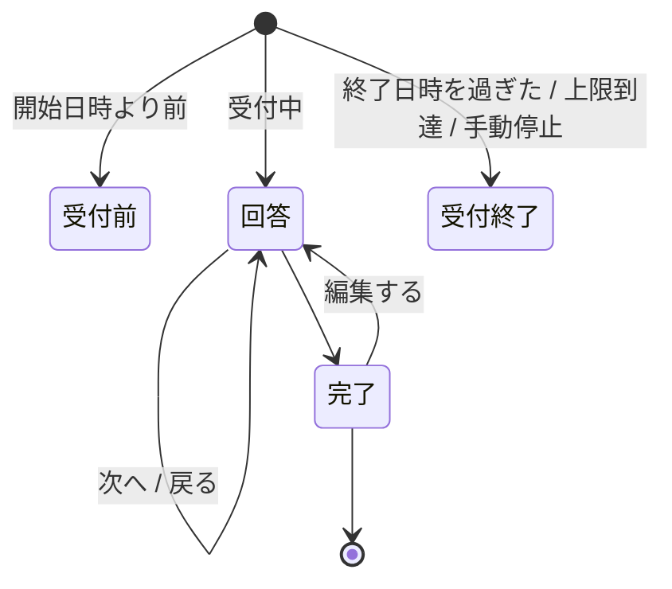
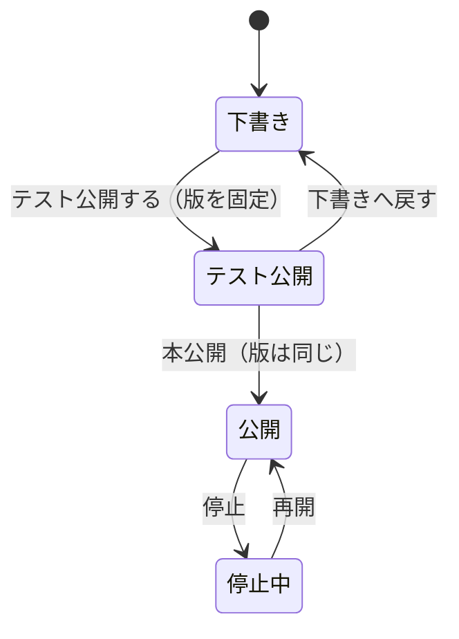
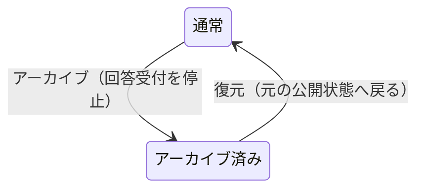

# 画面設計

Google Forms / Microsoft Forms に近い見た目・操作感にする。
対応する機能の範囲は [`機能一覧.md`](機能一覧.md)。

## 1. 回答画面

### 画面遷移

### 各画面

| 画面 | 内容 |
|---|---|
| 回答 | 設問。ページ分割・進捗バー・「次へ / 戻る」 |
| 完了 | 説明文と同じ安全な記法で書いた確認メッセージと自前画像・配布リンク。「別の回答を送信」「回答を編集」の導線 |
| 受付前・受付終了 | **理由を明示する。** 「エラー」で済ませない |
| 既に回答済み | 同じ端末からの再訪。編集するか、新しく回答するかを選ばせる |

**「既に回答済み」は Web Storage と Cookie の印で判定する。**
**防止ではなく抑止**であり、消されたら普通の回答画面に戻る

### 書きかけの回答（Issue #59）

**端末の中だけに残す。** サーバへは送らない。

⚠️ **アンケートごとに切り替え、既定は無効**（`Surveys.AllowDraft`）。
端末は共有され得る（店頭のタブレット、共用 PC）ので、
**黙って残すと次に使う人が前の人の回答を見る。**

- **勝手には戻さない。** 「前回の続きが残っています」と出し、
  **再開するか破棄するかを回答者が選ぶ**
- **破棄する口を必ず置く。** 共有の端末で、前の人の回答を消せるようにする
- **7 日で捨てる。** 読んだ時点で期限を見て、過ぎていればその場で消す
- **送信できたら消す。** 端末へ残し続けない
- **添付は残さない。** `File` は保存できないうえ、中身を端末へ写すのは重すぎる
（[`非機能設計.md`](非機能設計.md) 1 章「多重投稿の抑止」）。
`AllowEditingAfterSubmit` が有効でも、**前回の回答が読み出せなければ編集の導線は出さない。**
押しても何も入っていない画面が出るだけになる。

### 守ること

- **ページ間の入力はクライアント側で保持し、最後に 1 回だけ送信する。**
  ページごとに送るとレコードが分裂する
- **必須チェックはページ遷移時に、そのページ分だけ行う。**
  最後にまとめて出すと、どのページに戻ればよいか分からない
- **確認・同意は見出し全体を押せる単一のチェックボックスにする。**
  必須の場合は未回答だけでなく未チェックも先へ進めない。
- **通常の設問の説明文は複数行で入力でき、設問ごとにプレーンか記法を選ぶ。**
  プレーンを既定とし、改行だけを反映する。記法を選んだ場合は説明文ブロックと同じ
  `NoteMarkup` が作る安全な要素だけを表示する。HTML を直接表示する経路は持たない（#267）。
  説明文ブロック（`Note`）は従来どおり記法を既定とする。
- **記法の画像は ``、配布リンクは
  `[表示文](asset:GUID)` だけを受け付ける。** 外部 URL を画像として解釈しない。
  既定では PDF・DOCX・XLSX・PPTX・PNG・JPEG・GIF・WebP を本アプリから配信する。
  画像だけを `![…]` で画面へ埋め込み、画像以外は `[…]` のリンクにする。
  1 件 10 MB 以内、アンケート当たり 20 件までとする（#266）。
- **完了画面の本文も説明文と同じ `NoteMarkup` で構造化して表示する**（#269）。
  完了画面からだけ参照される配布物は、回答ごとの引換券を持つ人だけが取得できる（#318）。
  引換券は URL の断片 `/f/{publicId}#d={ticket}` で渡し、画面が引き換えたら
  成否にかかわらず断片を消す。引換後の Cookie は資産配信の経路だけへ送り、
  期限内は同じ引換券を何度でも使える。
  実装根拠は
  `src/VehicleVision.PleasanterTools.Questionnaire.Core/Definitions/SurveyDefinition.cs`
  38 行、
  `src/VehicleVision.PleasanterTools.Questionnaire.Web/Endpoints/AdminSurveyEndpoints.cs`
  443 行、
  `src/VehicleVision.PleasanterTools.Questionnaire.Web/Endpoints/FormEndpoints.cs`
  155 行、
  `src/VehicleVision.PleasanterTools.Questionnaire.Frontend/src/admin/components/SurveyEditor.svelte`
  609-624 行（2026-09-16 確認）。
- **確認・同意の補足も、通常の設問と同じくプレーンか記法を選ぶ。**
  記法では説明文ブロックと同じ安全な記法で `https:` のリンクを置ける（#257、#267）。
  実装根拠は
  `src/VehicleVision.PleasanterTools.Questionnaire.Frontend/src/components/QuestionField.svelte`
  177-232 行（2026-09-16 確認）
- **送信に失敗したら、入力内容を画面から消さない。** 完全匿名なので、
  失われたら再入力してもらう以外に手が無い
- **ハニーポット項目を 1 つ置く。** 画面にも読み上げにも出さず、キーボードでも辿れない場所に置く
  （`aria-hidden` ＋ `tabindex="-1"` ＋ 画面外）。**自動入力に拾われる名前を付けないこと。**
  拾われると正規の回答者を弾く
- **送信チケットが取れなければ回答させない。** 送信の段で断られる画面を見せる方が悪い
- **設問のシャッフルと分岐は併用しない**（順序が変わると分岐先が壊れる）。
  管理アプリ側で併用を禁止する
- **1 問 1 ページ表示**はアンケート全体の表示モード。設問側の設定ではない
- **テーマ（色・書体）で自由な CSS を書かせない**（Issue #56）。
  受け付けるのは `#rgb` / `#rrggbb` の色 3 本と、決め打ちの書体の並びから選んだ 1 つだけ。
  **検査せずに CSS へ流すと、`</style>` などを混ぜて画面を乗っ取られる**
    - 反映は CSS のカスタムプロパティへの代入だけで行い、**スタイル表を組み立てない**
    - **設定しなければ既定の見た目のまま**（`:root` に書いてある値がそのまま効く）
- **ヘッダ画像は本アプリが配る。** 外部の URL を貼らせない
    - **完全匿名なので、回答者のブラウザから第三者へ要求を出させない**
      （[`非機能設計.md`](非機能設計.md) 1 章）。**外部の Web フォントも読み込まない**
    - **書体はアプリに同梱する**（Issue #152）。自前配信なので第三者へ要求は出ず、
      **インターネットへ出られないイントラでも同じ見た目になる**

        | テーマの書体 | 同梱するもの |
        |---|---|
        | ゴシック体 | Noto Sans JP Variable |
        | 明朝体 | Noto Serif JP Variable |
        | 丸ゴシック体 | M PLUS Rounded 1c（**可変フォントが無いので 400 と 700 だけ**） |
        | 等幅 | M PLUS 1 Code Variable（**日本語も等幅**） |

        - **unicode-range で分割された woff2。回答者が受け取るのは使った範囲だけ**
        - **後ろに端末の書体も並べたままにする。** 配信に失敗しても文字が出なくならないため
        - ⚠️ **管理画面は明朝体と丸ゴシック体を読み込まない。**
          プレビューではその 2 つだけ端末の書体になる（本番と差が出る）
        - アイコン（Material Icons）は**管理画面だけに読み込む。**
          回答者へ配るものを重くしないため
            - 使い方は `save`。
              **中身はアイコンの名前**（リガチャで字形になる）
            - **`aria-hidden="true"` を必ず付ける。** 付けないと `save` という英単語が読み上げられる
            - **意味は文字でも書く。** アイコンだけの釦は読み上げで何も伝わらない
            - **表の中では `fixed` を足す**（`class="material-icons fixed"`）。
              箱の幅を決めて中央へ置くので、行ごとにずれない
    - 受け入れは**添付ファイルと同じ検査**（拡張子・先頭バイト・大きさ）。
      **SVG は許可しない**（中に script を書けるうえ、先頭バイトで見分けられない）
    - 出すのは**公開中の版が指している画像だけ。** 下書きで差し替えた画像は出ない
    - 説明文・完了画面の配布物も同じく、**公開中の版の記法が参照するものだけ**を
      `/api/forms/{publicId}/assets/{assetId}` から返す。保存先へリダイレクトしない
    - ⚠️ **設問・説明文で参照する画像は引換券なしで返す。**
      回答中にはまだ回答が存在しないため。完了画面からしか参照されない資産だけ、
      回答ごとの引換券を要求する
    - 引換券の期限は「受付終了まで」または「回答から N 日（既定 30 日、上限 365 日）」。
      受付終了が無い場合は既定日数を使う。⚠️ **回答から N 日は受付終了で切り詰めない**
    - 引換券が期限内なら受付終了後も取得できる。アーカイブ・完全削除では取得できない
    - **配布物は必ず `Content-Disposition: attachment` で返す。**
      PDF や Office 文書を回答画面の中で開かせず、画像の `` 取得でも同じ配信口を使う

### 回答者に見せないもの

- Pleasanter の `ReferenceId`・サイト ID
- Pleasanter の URL・API のエラー本文
- **「まだ Pleasanter へ送っていない」という内部事情。**
  受付完了は受付完了として見せる

## 2. 管理アプリ

### 画面構成

| 画面 | 内容 |
|---|---|
| ログイン | 独自ログイン |
| アンケート一覧 | 状態・本番回答数・テスト回答数・受付期間。複製・アーカイブ・復元・完全削除。**題名と状態で絞り込み、ページ送りで見る**（#79）。既定ではアーカイブ済みを隠す |
| 設問・マッピングエディタ | 左でページ・設問・選択肢と分岐を編集し、右で設問 → Pleasanter の列、変換、条件を編集する |
| プレビュー | 回答画面と同じ描画。編集画面の全幅上段にある操作から重ねて開き、**分岐も実際に辿れること** |
| 公開設定 | 公開 URL、受付期間、回答上限、proof-of-work の要否、手動停止。**テスト公開までは Pleasanter サイト ID を変更できる** |
| 送信状況 | **未送信件数と最古の滞留時刻。** デッドレターの確認と手動再送。**滞留による受付停止**（#72）と**受け付けなかった添付**（#39）もここに出す |
| 管理者管理 | アカウント、役割（**5 種類**。Issue #160）、**最終ログイン日時**。追加と招待・停止と再開・**他人の 2 要素の解除**（Issue #156） |
| 自分のアカウント | **パスワードの変更**と**2 要素の登録・解除**。どちらも**パスワードの再確認つき**（Issue #156） |
| 監査ログ | 誰がいつ何を変えたか |
| お知らせ | **自動で止まったこと・届かなかったことの記録**（#80）。**未読の件数をヘッダに常に出す** |

### パンくずリスト（Issue #253）

管理画面の共通枠に現在地を表示する。回答画面には出さない。

- アンケートの編集では「アンケート一覧 → アンケートの編集: 題名」とし、一覧の段を押すと一覧へ戻れる
- 題名は 32 文字を超えた部分を `…` に置き換え、横に伸び続けないようにする
- 一覧と並列の管理画面（操作の記録、送信状況、お知らせ、管理者の管理、自分のアカウント）は、誤った階層を示さないため現在地だけを表示する
- 保存していないアンケート編集を離れるときは、既存の「戻る」とパンくずのどちらでも確認を出す

### 管理者管理と自分のアカウント（Issue #156）

**API だけあって画面が無い状態**を埋めたもの。とくに
**「2 要素を任意にしたのに、管理者が自分で登録できない」**（Issue #154）が解消する。

| 入口 | 見せる相手 |
|---|---|
| ヘッダの「管理者」 | `users.read` を持つ相手だけ |
| ヘッダの「自分の設定」 | **誰でも**（自分の設定なので役割を問わない） |

**押せない釦は出さない。**

- **自分自身は止められない・自分の役割は変えられない**（手が滑ったときに戻せない）
- **最後の Administrator は止められない・降ろせない。**
  「最後」の数え方は**有効かつ一度でもログインしたことがある人**で、
  招待を出しただけの人は数えない（サーバ側の判定と同じ）
- **自分の 2 要素は一覧から解除しない。**
  パスワードの再確認つきの「自分のアカウント」で行う
- ⚠️ **2 要素が必須の設定のときは、解除の釦を出さない**（サーバ側でも断る）

⚠️ **入口を隠すのは守りではない。** 判定はサーバ側（`AdminUserService`）にあり、
画面側（`admin/lib/adminUsers.ts`）は**同じ決まりを写したもの**。

**招待の URL はその場で 1 度だけ出す。** メールを送る仕組みは持っていないため、
出した URL を運用者が本人へ渡す。**保存しているのはハッシュのみ**なので、
画面を閉じたら出し直すしかない。

**2 要素の登録はログインのときと部品を分けてある。**
ログイン時は途中状態（`Admin.Pending`）から、ここはログイン済み（`Admin.Reenroll`）から
始まり、**口も cookie も違う。** 混ぜると読めなくなるため分けた。

### お知らせ（Issue #80）

**ログを見張っていなくても気付けるようにするための画面。**
デッドレター・Pleasanter の認証失敗・滞留による受付停止・回答数の上限は、
今まで**ログにしか出ていなかった。**

- **未読の件数はヘッダに常に出す。** この画面を開くまで分からないのでは、目的を満たさない
- **件数は印だけでなく数字も出す。** 「1 件」と「300 件」は別のこと
- **同じ知らせは 1 行にまとめ、起きた回数を出す。**
  Pleasanter が壊れていれば回答は全部デッドレターになり、1 件 1 行では一覧が埋まる
- **既読は全体で 1 つ。** 誰かが気付いたら全員にとって既読
- ⚠️ **回答本文も送信元も出さない。** 出るのは「何が」「どのアンケートで」「何回」「いつ」だけ
- **Administrator だけ。** どのアンケートが詰まっているかは Editor へ開く情報ではない

### アンケート一覧の絞り込みとページ送り（Issue #79）

**アンケートは消さずに溜まる**（過去の回答を解釈するために版を残す）。
全件を返して全件を描く作りは、検証環境で 1367 件になった時点で破綻した。

- **1 度に読むのは既定 50 件・上限 200 件。** 増えても開く時間が変わらない
- ⚠️ **総数は数えない。** 1 件多く読んで「次がある」だけを判断する
  （デッドレターの一覧と同じ形）
- **絞り込みは題名の部分一致と状態。** 一覧を上から眺めて探せるのは最初のうちだけ
- **アーカイブ済みは既定で除外する。** 「アーカイブ済みも表示」を選んだ場合だけ含める
- アーカイブ前の確認には、**回答受付が停止する**ことを明記する
- アーカイブ済みの行には編集・公開・停止などを出さず、**復元**を出す。
  `surveys.delete` を持つ `Administrator` には**完全削除**も出す
- **絞り込むとページは先頭へ戻す。** 3 ページ目のまま絞り込むと、
  条件に合う行があっても「1 件も無い」と見える
- **知らない状態は断る**（`400`）。黙って 0 件にすると「アンケートが消えた」と見える
- **受付数の相関副問い合わせは、返す行にだけ効かせる**（Issue #53）
- **テスト回答は本番回答と別の件数で出す。** 1 件以上なら、
  Pleasanter 側のレコードは運用側が手で削除する旨を併記する
- **テスト公開の回答用 URL には「テスト中」と出す。** URL 自体は本公開と同じで、
  認証なしで開けるため、状態を見落とさせない

### 公開状態の操作（Issue #223）

- 回答画面はテスト公開中も開け、**「テスト公開中」と常に表示する**
- テスト回答も Pleasanter へ送るが、回答数上限と滞留監視には含めない
- サイト ID の変更は下書き・テスト公開だけに出す。送信待ちがあればサーバが拒否する

### アーカイブ（Issue #233）

アーカイブは公開状態の追加ではなく、どの公開状態にも重なる別の印として扱う。

回答画面では、アーカイブ済みを存在しない公開 ID と同じ画面にする。
`Suspended` の「停止中」とは区別し、実在するアンケートだと推測できる情報を返さない。

完全削除の確認には、回答件数（本番とテストの合計）・Pleasanter サイト ID・
アーカイブ日時を表示する。併せて次を削除前に明示する。

- Pleasanter 側の回答レコードは削除されず、必要なら別途削除する
- 削除後は、残ったレコードが何のアンケートだったかを本アプリから辿れない

実行釦は題名を入力して完全一致したときだけ有効にする。サーバも同じ照合を行う。
送信待ち・送信中の回答またはメールがある場合、サーバは削除を拒否する。

実装根拠: `AdminSurveyEndpoints.cs`、`SurveyDeletionStore.cs`、`SurveyList.svelte`
（2026-09-16 確認）。

### 設問エディタで必ず出すもの

#### 設問とマッピングの配置（Issue #261）

- アンケート全体の設定、テーマ、自動返信、プレビュー操作は全幅の上段へ置く。
- その下を **左 40% の設問作成、右 60% のマッピング**とする。マッピングは入力、行、
  変換、書き込み先、操作を横に並べるため広く取る。
- ページの既定の行き先と設問の選択肢による分岐は、対象の設問と同時に編集できるよう
  左カラムへ置く。
- 左右はそれぞれ内容の高さだけを使い、片方の長さへもう片方を合わせない。
- 画面幅が **1,200px 以下では設問、マッピングの順に 1 カラムへ戻す。**
  この場合も設問から割り当てを作る操作は残す。
- 左で設問の「対応する割り当てを表示」を選ぶと、その設問を入力に含む右の行を枠、
  背景、文言で示す。
  左の「この設問を割り当てる」は、入力へその設問を設定し、書き込み先を空にした行を
  右の末尾へ作る。

実装根拠:
`src/VehicleVision.PleasanterTools.Questionnaire.Frontend/src/admin/components/SurveyEditor.svelte`、
`QuestionEditor.svelte`、`MappingEditor.svelte`（2026-09-16 確認）。

- **残りの列数。** グリッドやランキングは 1 設問で行数ぶんの列を食う。
  **マッピング編集を開くときと「取り直す」を押したときに**、書き込み先サイトの
  `GetSite` 応答にある `SiteSettings.Columns` を接頭辞ごとに数える。
  取得できなければ標準の型ごとに 26 本で数え、どちらを基準にしているかを表示する。
- **上限を超えたら、その場で知らせる。**
  保存時に初めて失敗すると設問を作り直しになる。

    ⚠️ **止めはしない**（2026-08-20 決定）。**実際に使える本数は
    Pleasanter サイト側の項目拡張で決まる。サイトの列定義を取得できないときだけ
    標準の本数で見積もる。**
    標準の本数で止めると、列を増やしてある導入先で正しい設定を作れなくなる。
    **知らせるだけにして、判断は使う人に委ねる**
- **公開済みアンケートを編集していることの警告。**
  公開するまで実行へ影響しないことも併せて示す
- **既存の回答が読めなくなる変更**（列の割り当て変更）の警告

### マッピングエディタ

**「ソース → 変換 → ターゲット」の 3 列の表にする**（2026-08-20 決定。
[`アーキテクチャ方針.md`](アーキテクチャ方針.md) 15 章 決定 1）。
**実装済み**（Issue #86）。

**ノードエディタ部品は使わない。** 出力が必ず 1 本（`N:1:1` か `1:0:1`）なので、
線を引いて繋ぐ必要が無い。**1 行がそのまま 1 列への割り当てになり、表の方が読みやすく、
印刷もできる。** 外部の部品を増やさないので、ライセンスを確認する手間も無い。

| 列 | 中身 |
|---|---|
| ソース | 設問（＋グリッド／ランキングでは行）＋ 口（値・その他・添付の名前・添付そのもの） |
| 変換 | join / map / when など。**無し**もある |
| ターゲット | Pleasanter の列名 |

決めた点。

- **入力が複数のときは、1 つの升の中で積み、番号を振る。**
  行を分けて結合すると、変換とターゲットがどの入力群に掛かるのか読めなくなる
    - **番号は入力が複数のときだけ出す。** 1 つのときに「1.」を出しても手掛かりにならない
    - **番号の順が変換へ渡す順**（「上から順に変換へ渡します」と併記する）
- **不備はその割り当ての直下の行に出す**（変換が無いのに入力が複数、空いている添付列が無い）。
  表の外へ集めると、どの行の話か分からなくなる
- **狭い画面では横へ流す。** 畳むと 3 列の対応が読めなくなる
- **添付の行は左端に色を付けて区別する。** 変換を掛けられず、口も固定なので、
  同じ表でも扱いが違う
- **型ごとの残り列数は表の上に出したまま**（Issue #74）

出すべき情報:

- **循環参照の検出。** 保存を拒否し、どこが循環しているかを示す
- **未接続の設問。** 保存はできるが「この設問は Pleasanter に残らない」と明示する
- **型が合わない接続。** 文字列を `Num` へ繋ぐなど
- **桁溢れの見込み。** `Class` は 1024 文字

> **データモデルは引き続きノードとエッジで持つ**（[`データモデル設計.md`](データモデル設計.md) 2.4）。
> 表はその見せ方であって、持ち方ではない。

## 3. 共通

### 表示

- **画面の文言はすべて多言語対応の器に載せる**（[`データモデル設計.md`](データモデル設計.md) 2.3）
    - **文言の持ち方・言語の決め方・鍵の抜けの見つけ方は
      [`多言語対応方針.md`](多言語対応方針.md)**
    - **回答者の言語はブラウザの中だけで決める**（URL の `?lang=` → ブラウザの言語設定 → `ja`）。
      サーバへ送らず、保存もしない
    - **管理者の言語は利用者ごとの設定**（`AdminUsers.Language`）
- **アクセシビリティ。** ラベルと入力の関連付け、キーボードだけで回答できること、
  エラーの読み上げ。**公開アンケートなので回答者を選べない**

### エラーの見せ方

| 相手 | 見せ方 |
|---|---|
| 回答者 | **何をすればよいかを日本語で。** 内部のエラー文字列を出さない |
| 管理者 | 原因と対処。デッドレターは**どの回答か**まで辿れること |

**デッドレターの画面に回答本文を出さない**（Issue #45）。
`PayloadJson` には個人情報が入り得る（[`データモデル設計.md`](データモデル設計.md) 2.5）ので、
出すのは**失敗の理由・滞留の状況・回答トークン**まで。
本文が要る場面では、トークンを手掛かりに DB を直接見る。

### タイムゾーン

**画面の日時表示は、回答者の端末のタイムゾーンで行う。**
ただし**保存値の解釈には使わない**（[`アーキテクチャ方針.md`](アーキテクチャ方針.md) 6 章）。

**日付・数値の書式は言語に合わせる**（`Intl.DateTimeFormat` / `Intl.NumberFormat`）。
`toLocaleString('ja-JP')` のように言語を焼き付けない。
