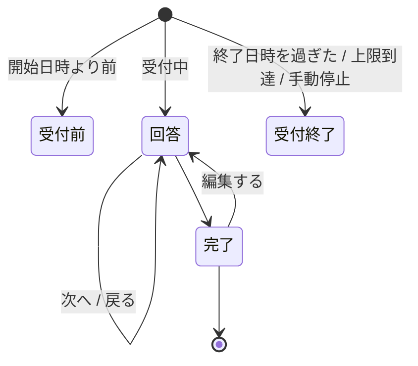

# 画面設計

Google Forms / Microsoft Forms に近い見た目・操作感にする。
対応する機能の範囲は [`機能一覧.md`](機能一覧.md)。

## 1. 回答画面

### 画面遷移

### 各画面

| 画面 | 内容 |
|---|---|
| 回答 | 設問。ページ分割・進捗バー・「次へ / 戻る」 |
| 完了 | 確認メッセージ。「別の回答を送信」「回答を編集」の導線 |
| 受付前・受付終了 | **理由を明示する。** 「エラー」で済ませない |
| 既に回答済み | 同じ端末からの再訪。編集するか、新しく回答するかを選ばせる |

### 守ること

- **ページ間の入力はクライアント側で保持し、最後に 1 回だけ送信する。**
  ページごとに送るとレコードが分裂する
- **必須チェックはページ遷移時に、そのページ分だけ行う。**
  最後にまとめて出すと、どのページに戻ればよいか分からない
- **送信に失敗したら、入力内容を画面から消さない。** 完全匿名なので、
  失われたら再入力してもらう以外に手が無い
- **設問のシャッフルと分岐は併用しない**（順序が変わると分岐先が壊れる）。
  管理アプリ側で併用を禁止する
- **1 問 1 ページ表示**はアンケート全体の表示モード。設問側の設定ではない

### 回答者に見せないもの

- Pleasanter のレコード ID・サイト ID
- Pleasanter の URL・API のエラー本文
- **「まだ Pleasanter へ送っていない」という内部事情。**
  受付完了は受付完了として見せる

## 2. 管理アプリ

### 画面構成

| 画面 | 内容 |
|---|---|
| ログイン | 独自ログイン |
| アンケート一覧 | 状態・回答数・受付期間。複製 |
| 設問エディタ | ページ・設問・選択肢の編集。並べ替え |
| マッピングエディタ | 設問 → Pleasanter の列。変換と条件 |
| プレビュー | 回答画面と同じ描画。**分岐も実際に辿れること** |
| 公開設定 | 公開 URL、受付期間、回答上限、手動停止 |
| 送信状況 | **未送信件数と最古の滞留時刻。** デッドレターの確認と手動再送 |
| 管理者管理 | アカウント、ロール、**最終ログイン日時** |
| 監査ログ | 誰がいつ何を変えたか |

### 設問エディタで必ず出すもの

- **残りの列数。** グリッドやランキングは 1 設問で行数ぶんの列を食う。
  **標準は型ごとに 26 本**（[`実機検証結果.md`](実機検証結果.md) 1 章）
- **上限を超える操作は、保存前にその場で止める。**
  保存時に初めて失敗すると設問を作り直しになる
- **公開済みアンケートを編集していることの警告。**
  公開するまで実行へ影響しないことも併せて示す
- **既存の回答が読めなくなる変更**（列の割り当て変更）の警告

### マッピングエディタ

**FBD 風のノードエディタを検討する**（[`アーキテクチャ方針.md`](アーキテクチャ方針.md) 8 章）。
設問・変換・条件・列をブロックとして置き、コネクタで繋ぐ。

> **段階を踏む。** データモデルは最初からノードとエッジで持つ（[`データモデル設計.md`](データモデル設計.md) 2.4）。
> **UI は最初は表形式でもよい。** 後からグラフへ載せ替えられる。逆にすると作り直しになる。

出すべき情報:

- **循環参照の検出。** 保存を拒否し、どこが循環しているかを示す
- **未接続の設問。** 保存はできるが「この設問は Pleasanter に残らない」と明示する
- **型が合わない接続。** 文字列を `Num` へ繋ぐなど
- **桁溢れの見込み。** `Class` は 1024 文字

## 3. 共通

### 表示

- **画面の文言はすべて多言語対応の器に載せる**（[`データモデル設計.md`](データモデル設計.md) 2.3）
- **アクセシビリティ。** ラベルと入力の関連付け、キーボードだけで回答できること、
  エラーの読み上げ。**公開アンケートなので回答者を選べない**

### エラーの見せ方

| 相手 | 見せ方 |
|---|---|
| 回答者 | **何をすればよいかを日本語で。** 内部のエラー文字列を出さない |
| 管理者 | 原因と対処。デッドレターは元の回答内容まで辿れること |

### タイムゾーン

**画面の日時表示は、回答者の端末のタイムゾーンで行う。**
ただし**保存値の解釈には使わない**（[`アーキテクチャ方針.md`](アーキテクチャ方針.md) 6 章）。
