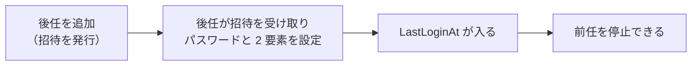

# 管理者の棚卸し 運用手順書

**本アプリの管理者アカウントを定期的に見直し、辞めた人・異動した人の権限を止めるための手順。**
決定の背景は [`アーキテクチャ方針.md`](アーキテクチャ方針.md)「引き受けたリスク：退職者の止め忘れ」
および 15 章 決着済み #8。

## 1. なぜ人手で行うのか

**本アプリの管理者は Pleasanter のユーザ・グループと連動しない。**
異動や退職があっても本アプリ側は何も変わらないため、**機械は止め忘れを検知しない。**

**それでも自動で無効化しない**（2026-08-20 決定）。

⚠️ **「最後の `Administrator` を残す」条件と噛み合わず、締め出し事故の元になる。**
自動処理が最後の 1 人に当たると、その回だけ静かに失敗するか、
条件が緩ければ**誰も入れない状態**を作る。復旧手段は DB の直接操作しか無い
（[`非機能設計.md`](非機能設計.md)「管理者の管理」）。

**判断は人が行う。この手順書がその代わりになる。**

## 2. いつ行うか

| 契機 | 行うこと |
|---|---|
| **四半期ごと**（定例） | 3 章の全手順 |
| 退職・異動を知ったとき | 待たずにその場で 3 章 4 を行う |
| 管理者を追加したとき | 追加した本人が居るうちに、不要になった枠が無いか見る |

**定例をやめないこと。** 個別の連絡は届かないことがあり、
届かなかったぶんは定例でしか拾えない。

## 3. 手順

### 1. 一覧を出す

管理画面の **「管理者管理」**（[`画面設計.md`](画面設計.md)）を開く。
`Administrator` だけが開ける。

一覧に出るもの:

| 列 | 見方 |
|---|---|
| ログイン ID | 誰のアカウントか |
| ロール | `Administrator` / `Editor` |
| 状態 | 有効 / 停止中 / **招待中** |
| **最終ログイン日時**（`LastLoginAt`） | **空欄は「一度も入っていない」。** 停止の判断はこれを見る |

> **`LastLoginAt` は 2 要素の登録を終えた時点でも記録される。**
> パスワードと使い捨てパスワードが揃った時点でログインとして扱うため、
> **招待を受け取って設定を済ませた人は空欄にならない**
> （[`非機能設計.md`](非機能設計.md)「管理者の管理」）。

### 2. 洗い出す

次のいずれかに当たるアカウントを控える。

- **`LastLoginAt` が長く空いている**（目安 **90 日**。定例の間隔と合わせてある）
- **`LastLoginAt` が空欄のまま招待の期限（既定 48 時間）を大きく過ぎている**
    - 招待は期限切れで使えなくなるが、**アカウントの枠は残る**
- **心当たりの無いログイン ID**
- **必要以上に強いロール**（`Editor` で足りるのに `Administrator`）

**ロールの見直しも棚卸しに含める。** 止めるほどではないが権限が過剰、という形の方が多い。

### 3. 確かめる

⚠️ **一覧だけで止めないこと。** 長期休職・長期出張・別担当への一時的な引き継ぎなど、
`LastLoginAt` からは区別できない事情がある。

**本人と所属へ確かめてから、次の手順へ進む。**
連絡が付かないときは、**所属の責任者の判断を取ってから止める。**

### 4. 止める

**消さずに「停止」する。**

- 管理画面の「管理者管理」から**停止**を選ぶ
- **削除する口は用意していない。** 監査ログに残る操作の主体を後から辿れなくなるため
  （[`データモデル設計.md`](データモデル設計.md)）
- **止めた相手はその場で追い出される。** cookie は 8 時間有効だが、
  要求のたびに DB と突き合わせているので、止めた瞬間に効く
- **止めた相手宛ての未使用の招待は取り消される**

ロールを下げるだけでよい場合は、**停止ではなくロールの変更**（`Administrator` → `Editor`）を使う。

### 5. 記録を残す

**管理画面の操作は自動で監査ログへ残る**（`AuditLogFilter`）。
別途の台帳は作らない。**監査ログ画面で「誰がいつ誰を止めたか」を確認できること**だけ見ておく。

> 監査ログの保持期間は **365 日**（[`アーキテクチャ方針.md`](アーキテクチャ方針.md) 15 章 決定 6）。
> **四半期ごとの棚卸しなら、前回ぶんは必ず残っている。**

## 4. できないこと（仕様）

**次の操作は本アプリが断る。手順の側で回避しようとしないこと。**

| 断るもの | 理由 |
|---|---|
| **最後の `Administrator` を停止する** | 誰も入れなくなる。`POST /api/admin/setup` は「1 人も居ない」ときしか通らないので、復旧が DB の直接操作しか無くなる |
| **最後の `Administrator` を `Editor` へ降格する** | 同上 |
| **自分自身を停止する** | 手が滑ったときに自分では戻せない |
| **自分の役割を変える** | 同上 |

**頭数に入るのは、有効かつ `LastLoginAt` が入っている `Administrator` だけ。**
停止中の管理者と、招待しただけでまだ入っていない管理者は数に入らない。

⚠️ **したがって「後任を招待したので前任を止める」は、後任が一度ログインするまで通らない。**
**後任に先に入ってもらってから、前任を止めること。**

## 5. チェックリスト

四半期ごとに、次をすべて満たしたことを確認する。

- [ ] 「管理者管理」の一覧を最後まで見た
- [ ] `LastLoginAt` が 90 日以上空いている管理者を洗い出した
- [ ] 招待中のまま放置されている枠を洗い出した
- [ ] 洗い出した相手について、本人または所属へ確かめた
- [ ] 不要な枠を**停止**した（削除ではない）
- [ ] 過剰なロールを `Editor` へ下げた
- [ ] 監査ログに今回の操作が残っていることを確認した
- [ ] **有効な `Administrator` が 2 人以上**残っていることを確認した

> **最後の 1 つを飛ばさないこと。** `Administrator` が 1 人だけの状態は、
> その人が使えなくなった時点で誰も入れなくなる。**棚卸しの結果として作らない。**
