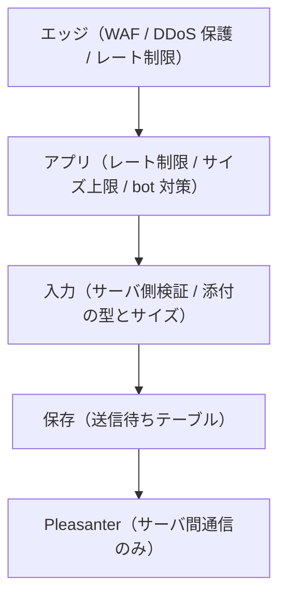

# 非機能設計

## 1. セキュリティ

**第 1 弾から作り込む**（2026-08-18 決定）。**完全匿名の公開フォームを認証なしで
インターネットへ晒す**ため、後回しにできる部分が無い。

### 前提：この製品が晒すもの

| 面 | 誰でも到達できるか | 攻撃者にとっての価値 |
|---|---|---|
| 回答画面 | **できる**（URL を知っていれば） | **書き込みができる。** DB とストレージを消費させられる |
| 回答の編集 | できる（GUID を知っていれば） | **他人の回答の改ざん** |
| 管理画面 | ログインが要る | 全アンケートの定義と設定 |

**「読み取りだけの公開ページ」ではない。** 匿名の第三者が書き込み・添付・編集を
行える点が、通常の公開サイトと違う。

### 多層で守る

**どれか 1 つに頼らない。** レート制限を抜けても入力検証で止まり、
入力検証を抜けても Pleasanter 側の権限で止まる、という重なりを作る。

### エッジ層

- **WAF を前段に置く。** 既知の攻撃パターンをアプリへ届かせない
- **プラットフォームの DDoS 保護を有効にする**
- **HTTPS 強制と HSTS。** 平文での接続を受け付けない
- 必要なら地域・IP による制限。**ただし公開アンケートでは絞れないことが多い**

### レート制限（複数の軸で掛ける）

**1 つの軸だけでは抜けられる。**

| 軸 | 目的 |
|---|---|
| 送信元 IP | 単一ホストからの連投 |
| 送信元 IP × 回答の送信 | **書き込みは読み取りより高くつく。** 画面を開くだけの要求と同じ枠で数えない |
| `PublicId`（アンケート単位） | 特定のアンケートへの集中 |
| `ResponseToken` | 同じ回答の連続更新 |
| サーバ全体 | 総量。**Pleasanter を落とさないため** |

- **DB へ書く前に効かせる。** 書いてから弾いても消費は起きている
- 超過時は `429` と `Retry-After` を返す
- **制限値は設定で外部化する**（`App_Data/Parameters/`）

### 入力

- **サーバ側で必ず検証する。** 画面側は体験のためだけ
- **リクエストボディのサイズ上限**を設ける。既定値に任せない
- 正規表現による検証は**実行時間の上限**を設ける（ReDoS）

### 添付ファイル

**3 層で受ける。上に行くほど弱く、下に行くほど重い。**

| 層 | 内容 | 既定 |
|---|---|---|
| 1. 拡張子の許可リスト | 許可した拡張子以外を受け付けない | **常に有効** |
| 2. 内容による種別判定 | 先頭バイト（マジックナンバー）が拡張子と一致するか | **常に有効** |
| 3. ウイルススキャン | 外部のスキャナへ渡して判定する | **既定は無効。設定で有効化** |

**1 は弱い。** 拡張子は名前でしかなく、`.png` と名乗る実行ファイルを止められない。
**それでも入れる。** 誤って上げた無関係なファイルを弾く役には立つ。

**2 で「名乗りと中身の食い違い」を見る。** 拡張子と先頭バイトが一致しないものを拒否する。
これも万能ではない（正しい PNG に悪意ある内容は埋められる）が、1 だけよりは効く。

**禁止リストではなく許可リストにすること。** 危険な拡張子を挙げていく方式は、
必ず漏れる。

#### ウイルススキャン（オプション）

**既定は無効。設定で有効にできるようにする**（2026-08-18 決定）。
導入先にスキャナが無い環境でも動くようにするため。

- **スキャナは差し替え可能にする。** アプリはインターフェースだけを知る
- **有効にしたのにスキャナへ到達できないときは、添付を受け付けない。**
  「スキャンできなかったので通す」にしない。**無効と有効の中間を作らない**
- **スキャンは送信待ちへ保存する前に行う。** 保存してからでは、
  未検査のバイナリが DB に載る
- 検出したら**添付だけでなく回答ごと拒否し、監査ログへ記録する**

##### 実装の候補（ライセンス確認済み・2026-08-18）

| 方式 | ライセンス | 評価 |
|---|---|---|
| **ClamAV（`clamd`）＋ nClam** | ClamAV は **GPL-2.0**、nClam は **Apache-2.0** | **本命。** ClamAV は**別プロセスとして TCP 越しに使う**ので、リンクも同梱もしない。商用ライセンスの前提を壊さない |
| Windows AMSI | OS 同梱 | **Windows 限定。** 本アプリは Linux コンテナ前提なので主軸にしない。Windows 配置向けの追加実装として残す |
| **Microsoft Defender for Storage** | Azure のサービス | **Azure に寄せる場合の選択肢。** ただし**判定が非同期**で **Blob Storage が前提**になり、添付の置き場所と受付の流れが変わる。`IVirusScanner` の差し替えでは済まない |
| その他クラウドの検査 API | サービスによる | **添付が第三者へ渡る。** 採用するなら要件として合意が要る |

> **ClamAV を製品へ同梱しないこと。** GPL-2.0 なので、同梱すると配布物が GPL に
> 引きずられる。**導入先が別途動かすものとして扱い、本アプリは接続先を設定で受け取る。**
> Pleasanter と同じ「別プログラムとネットワーク越しに話すだけ」の関係にする
> （[`../LICENSING.md`](../LICENSING.md)）。

**方式は 2 つ用意する**（[`添付ファイル検査-運用手順書.md`](添付ファイル検査-運用手順書.md) 2 章）。
既定は ClamAV。Azure のエコシステムに寄せたい場合は Defender for Storage を選べるようにする。

**Azure App Service では ClamAV をサイドカーコンテナとして動かす。**
1 アプリあたり 9 個までのサイドカーを同じプラン内で並走でき、
**外部トラフィックを受けるのは main コンテナだけ**なので clamd を外へ晒さずに済む。
構成と運用の手順は
[`添付ファイル検査-運用手順書.md`](添付ファイル検査-運用手順書.md)。

### 出力

- 回答内容をそのまま HTML へ差し込まない
- **CSP を設定する。** インラインスクリプトに依存しない作りにする
- セキュリティヘッダを一式付ける
  （`X-Content-Type-Options` / `Referrer-Policy` / `Permissions-Policy` / `frame-ancestors`）

#### 埋め込みの配信元（Issue #104 / #107）

**画像・動画・外部ページを設問の間へ差し込める。**
差し込める先は **`QUESTIONNAIRE_EMBED_ALLOWEDHOSTS` に書いたホストだけ**で、
**既定は空**（設定しなければ一切埋め込めない）。

書き方は CSP のホスト源に揃える。

| 書き方 | 一致するもの |
| --- | --- |
| `www.example.com` | そのホストだけ |
| `*.example.net` | `video.example.net` などその下のホスト。**`example.net` 自体は含まない** |

- **管理者に任意のホストを書かせない。** 書けるなら実質 `frame-src https:` と変わらず、
  絞った意味が無くなる。**許すのは運用側だけが触れる設定**
- **許していないホストは、公開のときではなく保存のときに断る。**
  設問の不備と違い、直せば通る類ではなく、**運用側が許していない相手**なので、
  「保存はできたが公開できない」より早く分かる方がよい
- **CSP はアンケートごとに出し分けない。**
  回答画面は `/f/{publicId}` で index.html を返す静的 SPA なので、
  出し分けると **DB を引く必要が生まれ、存在する公開 ID と存在しない公開 ID で
  ヘッダが変わって実在が漏れる**（下記「識別子の秘匿」と同じ理由）。
  **代わりに、設定の許可ホストを常に載せる**
- `iframe` には **`sandbox="allow-scripts"` だけを付ける。**
  **`allow-same-origin` は付けない**（付けると埋め込み先が本アプリと同じ生成元として扱われ、
  回答画面の Cookie や localStorage の下書きへ届く）
- `referrerpolicy="no-referrer"` を付け、**どのアンケートを見ているかを配信元へ知らせない**
- **埋め込みがあるページには、第三者へ通信が出る旨と繋がる先を回答画面に出す**

### bot・スパム対策

**第 1 弾から入れる。外部の CAPTCHA は使わない**（2026-08-19 決定）。

#### なぜ CAPTCHA を入れないか

**本製品は完全匿名を掲げている。**
主要な CAPTCHA サービスは、判定のために**回答者の IP と操作の癖を第三者へ送る。**
「匿名で答えられます」と言いながら第三者へ渡すことはできない。
一次情報で確認した内容は次のとおり（いずれも参照日 2026-08-19）。

| 手段 | ライセンス・提供形態 | 回答者の情報 | 判断 |
|---|---|---|---|
| Cloudflare Turnstile | Cloudflare のサービス（自前配置は不可） | ブラウザの信号を Cloudflare が解析。`api.js` は **`challenges.cloudflare.com` から取得することが必須**で、代理配信もキャッシュも禁止 | **不採用。** CSP に外部ホストを開ける必要がある |
| hCaptcha | hCaptcha のサービス | 公式のプライバシーポリシーが「**マウスの移動・スクロール位置・キー入力・タッチ**」「**発信元 IP アドレス**」の収集を明記 | **不採用。** 完全匿名と両立しない |
| Google reCAPTCHA | Google のサービス | **`_GRECAPTCHA` Cookie** を置いてリスク解析を行う。自前配置の手段は無い | **不採用。** 同上 |
| ALTCHA | **MIT**。自前配置できる proof-of-work | **外部へ出ない**（自前サーバで完結） | **採用**（Issue #55 / #63）。下記 |
| mCaptcha | **AGPL-3.0** | 自前配置できる | **不採用。** コピーレフトは商用ライセンスでの提供と両立しない（[`../LICENSING.md`](../LICENSING.md)） |

**ALTCHA は license も個人情報の扱いも条件を満たす**ので、これだけを採る
（Issue #55、実装は Issue #63）。当初は見送っていたが、次の 2 点で覆した。

- **公式の部品を使わない。** 解くのは十数行なので画面側に自分で書いた
  （`Frontend/src/lib/altcha.ts`）。**Web Worker も Web Component も使わないので、
  CSP を緩めずに済む**（見送った当時の主な理由がこれだった）
- **`crypto.subtle` にも依存しない。** 安全なコンテキスト（https か localhost）でしか
  使えず、平文の http で開かれると解けない。SHA-256 を自前で持ち、
  あるときだけ Web Crypto を使う（`Frontend/src/lib/sha256.ts`）

**それでも万能ではない。proof-of-work の非対称性は攻撃者に有利。**
同じ難易度でも、スマートフォンの JavaScript より攻撃者のネイティブコードの方が桁違いに速く、
**人が待てる範囲の難易度では bot をほとんど遅くできない。**
だから**置き換えではなく重ねる。**

#### 重ねているもの

**4 つを重ねる**（`Web/Services/SubmissionGuard.cs` と `Web/Services/AltchaGuard.cs`）。

| 手段 | 内容 |
|---|---|
| **送信チケット** | 画面を開くと `POST /api/forms/{publicId}/ticket` が**署名付きのチケット**と回答トークンを返す。送信時に検証する |
| **投稿までの最短時間** | チケットの発行時刻を署名に含めてあるので、**サーバに何も覚えずに**経過時間を測れる。既定 3 秒 |
| **ハニーポット項目** | 画面にも読み上げにも出さない項目。埋まっていたら bot |
| **proof-of-work** | 同じチケットの口で ALTCHA の課題も返す。**使い終えた課題は `AltchaChallenges` に覚え、同じ解答を 2 度通さない** |

**チケットは公開 ID と回答トークンに結び付いている。**
回答トークンが同じなら送信待ちは上書きなので、**1 枚のチケットで作れる行は 1 行だけ**。
たくさん投稿するにはそのぶんチケットを取りに来る必要があり、そこにレート制限が効く。

守ったこと。

- **回答者を識別しない。** チケットに入るのは公開 ID・回答トークン・発行時刻だけ。
  IP も UA も指紋も入れない。**サーバ側に状態を持たない**ので、
  「同じ人が来た」を突き合わせる手掛かりも残らない
- **チケットの発行は DB を見ない。** 見ると応答の速さで公開 ID の実在が分かる。
  **存在しない公開 ID にも同じようにチケットを返し、受付の段で断る**
- **bot の判定は DB を見る前に行う。** 書いてから弾いても消費は起きている。
  この順序のおかげで、**bot 対策で断った応答は公開 ID の実在を漏らさない**
- **断った理由は外へ返さない**（`{"reason":"rejected"}` の 1 種類だけ）。
  返すと bot にどこを直せばよいか教えることになる。理由はログにだけ残す
- **黙って捨てない。** ハニーポットに引っかかった回答も `403` を返す。
  正規の回答者が自動入力などで巻き込まれたときに、**気づけないまま消えるのが一番まずい**

##### proof-of-work だけはアンケートごとに切り替えられる（Issue #66）

**社内向けの短いアンケートでは要らない一方、公開の窓口では要る。**
同じ導入先に両方が同居するので、アプリ全体の設定では足りない。
旗は `Surveys.RequireProofOfWork`（[`データモデル設計.md`](データモデル設計.md) 2.1）で、
**既定は有効**。管理画面の公開設定から切り替える。

**切り替えても、送信チケット・最短時間・ハニーポットは外れない。**
外れるのは proof-of-work だけ。

**要否の出し方が肝。** 素直に作ると、ここで公開 ID の実在が漏れる。

| 口 | 振る舞い | 理由 |
|---|---|---|
| `POST /api/forms/{publicId}/ticket` | **要否に関わらず課題を出す** | 出し分けるには DB を見るしかなく、**見た時点で応答の速さから実在が分かる** |
| `GET /api/forms/{publicId}` | **要否を返す** | 存在しない ID に `404` を返す口なので、**実在をもともと隠していない** |
| `PUT /api/forms/{publicId}/responses/{token}` | **DB の旗で判定する** | **画面が「要らない」と言ってきても信じない。** 信じると解答を付けずに投げるだけで外せる |

**受付側は、アンケートが無いときも「要る」として扱う**（`ResponseIntake.RequiresProofOfWorkAsync`）。
「無いから要らない」にすると、解答を付けずに投げるだけで実在が分かる。

**これは万能ではない。** 画面を素直に辿る bot は素通りする。
**分散した bot への最後の壁はエッジの WAF**であり、ここは多層のうちの 1 枚。

#### 多重投稿の抑止

**「防止」ではなく「抑止」**（完全匿名なので本人確認ができない）。

- 回答トークンは Web Storage、**回答済みの印は Web Storage と Cookie の 2 か所**に置く。
  片方だけ消えても効くようにするため（Safari は JavaScript が置いた Cookie を
  7 日で切ることがある）
- **Cookie に入るのは公開 ID ごとの真偽値だけ。** 回答者を識別する値は入れない
- **Cookie の `path` を `/f/{publicId}` に絞る。** API の要求には付かないので、
  回答トークンや印がサーバ側のログへ流れる経路を作らない
- 回答済みの端末が再訪したら、いきなり空のフォームを出さず
  **「既に回答済み」の画面**を出す（[`画面設計.md`](画面設計.md) 1 章）。
  `AllowEditingAfterSubmit` が有効で前回の回答が読めれば**編集の導線**を出す
- **消されたら終わり。** それを前提に、抑止できなかったときに壊れない作りにしてある
  （回答トークンが変われば別の回答として積まれるだけ）

#### 設定

**制限値は設定で外部化してある**（[`../App_Data/Parameters/README.md`](../App_Data/Parameters/README.md)）。

| 変数 | 既定 | 内容 |
|---|---|---|
| `QUESTIONNAIRE_BOT_MITIGATION` | 有効 | `off` で bot 対策を切る。**検証環境のためだけ** |
| `QUESTIONNAIRE_SUBMIT_MIN_SECONDS` | `3` | チケット発行から送信までの最短時間（秒） |
| `QUESTIONNAIRE_SUBMIT_TICKET_HOURS` | `24` | チケットの有効期間（時間） |
| `QUESTIONNAIRE_SUBMITS_PER_MIN` | `20` | 送信元 IP ごとの送信回数（1 分あたり） |
| `QUESTIONNAIRE_ALTCHA_ENABLED` | 有効 | `false` で proof-of-work を切る。**アプリ全体。検証環境のためだけ** |
| `QUESTIONNAIRE_ALTCHA_MIN_NUMBER` | `50000` | 探させる数の下限。**大きいほど bot の費用が上がり、古い携帯の待ち時間も伸びる** |
| `QUESTIONNAIRE_ALTCHA_MAX_NUMBER` | `150000` | 探させる数の上限 |

**proof-of-work の要否は、これとは別にアンケートごとにも切り替えられる**（Issue #66）。
**アプリ全体で切ってあれば、アンケート側で有効にしていても課さない**（どちらも有効なときだけ課す）。

### 識別子の秘匿

| 識別子 | 守り方 |
|---|---|
| `PublicId`（アンケート） | **暗号論的乱数。** 連番や UUIDv1 のような推測可能なものにしない |
| `ResponseToken`（回答） | 同上。**Cookie / Web Storage にのみ置き、URL に載せない** |
| Pleasanter の `ReferenceId` | **ブラウザへ渡さない。** 連番なので他人の回答を書き換えられる |

- **存在しない `PublicId` でも、応答の文言と時間を変えない。** 列挙の手掛かりを与えない
- **`ResponseToken` を知っている人は、その回答を書き換えられる。**
  URL・メール・ログへ載せる経路を作らないこと

### 管理画面

- **ログイン試行の回数制限とアカウントロック**
- パスワードポリシー（長さ・使い回しの禁止）
- **セッション Cookie は `Secure` / `HttpOnly` / `SameSite`**
- CSRF 対策
- **多要素認証（TOTP）を第 1 弾から入れる**（2026-08-18 決定）。
  管理画面は全アンケートの定義と設定を握るうえ、**独自ログインで IdP の保護が無い。**
  パスワードだけだと漏洩時に直接入られる
    - 認証アプリの 6 桁コード。外部サービスに依存しない
    - **回復コードを発行する。** 端末紛失で全員が締め出される事故を防ぐ
    - **シークレットは暗号化して保存する。** 平文で持たない
- **最終ログイン日時を記録する。** 退職者の止め忘れを見つける唯一の手掛かり

#### 実装（2026-08-18）

**2 段階で通す。**

| 段階 | 入口 | 通ったときの状態 |
|---|---|---|
| 1 | `POST /api/admin/login` | `Admin.Pending`（**まだ何も操作させない**・5 分） |
| 2 | `POST /api/admin/login/totp` または `.../login/recovery` | `Admin.Session`（8 時間） |

**まだ管理者が 1 人も居ないときだけ `POST /api/admin/setup` が通る。**
既定のパスワードを仕込むより、空の状態から作らせる方が安全（変え忘れが残らない）。

**2 要素は必須・任意・無効から選ぶ**（2026-09-08 決定。Issue #154）。
設定は `QUESTIONNAIRE_ADMIN_TWOFACTOR`（`required` / `optional` / `disabled`）で、
**既定は `optional`（任意）。**

| 設定 | 未登録の管理者 | 登録済みの管理者 | 自分で解除 |
|---|---|---|---|
| `required` | **登録するまで `Admin.Session` にならない** | 毎回求める | できない |
| `optional`（既定） | そのまま入れる | 毎回求める | **できる**（パスワードの再確認つき） |
| `disabled` | そのまま入れる | **毎回求める** | できる |

- ⚠️ **`disabled` でも、登録済みの人からは 2 要素を外さない。**
  設定 1 つで既存の保護が消えるのは危ない。外すのは本人か `Administrator` の操作だけ
- **`disabled` では登録の口を閉じる**（`enroll/begin` も `me/totp/begin` も断る）。
  画面から隠すだけでは、API を直接叩かれたときに通ってしまう
- **知らない値は起動時に落とす。** 黙って既定へ落ちると、必須にしたつもりで任意のまま動く
- **`Administrator` は他人の 2 要素を解除できる**（`POST /api/admin/users/{id}/totp/reset`）。
  端末を失って復旧コードも使い切った人には、他に手が無い。
  **解除は監査ログへ残す。** 復旧コードも一緒に消える
- `required` で解除された人は、**次回ログイン時に登録へ回る**

決めた点と、その理由。

- **パスワードは PBKDF2-HMAC-SHA512・210,000 回。** 書式に版を持たせ、
  反復回数を将来上げても既存の利用者を締め出さずに移行できるようにした
- **パスワードに求める条件は設定で決める**（Issue #157。`App_Data/Parameters/Security.json`）。
  **Pleasanter 本体の `Security.json` と同じ書き方**にしてあるので、
  本体を使い慣れた運用者は設定をそのまま持ってこられる

    | 設定 | 既定 | 内容 |
    |---|---|---|
    | `PasswordMinimumLength` | `12` | 最低の長さ |
    | `PasswordAllowSameAsLoginId` | `false` | **ログイン ID と同じパスワードを許すか**（大文字小文字は区別しない） |
    | `PasswordPolicies` | 空（見本は無効で置いてある） | 正規表現の条件。`Enabled` / `Regex` / `Languages` |

    - **判定は部分一致**（本体の `RegexExists` と同じ）。全体一致にしたいときは `^…$` を書く
    - **上から順に見て、最初に合わなかった条件の文言を返す。** まとめて返さないのは、
      直す側が 1 つずつ潰せる方が分かりやすいため
    - ⚠️ **設定の正規表現は ReDoS になり得る。** 回答側の検証（Issue #102）と同じく
      **後退戻りしない照合器（`RegexOptions.NonBacktracking`）＋時間の上限**で動かす。
      そのため**先読み・後方参照・原子グループは使えず、起動時に落ちる**
      （黙って無効にすると、条件が無いまま動く）
    - **条件の判定は 1 か所に置いたまま**（`AdminPasswordPolicy`）。最初の管理者・
      招待の受け取り・パスワードの変更のどこかだけ緩いと、そこが一番弱い所になる
- **利用者が居なくても照合する。** すぐ返すと、応答の速さで実在が分かる
- **どの段階で外れたかを外へ伝えない。** 「居ない」と「パスワードが違う」を
  区別して返すと、利用者名の総当たりに使える
- **同じ時間枠の使い捨てパスワードは二度通さない**（`AdminUsers.TotpLastTimeStep`）。
  30 秒の間は同じ数字が有効なので、盗み見られた数字がそのまま使える
- **締め出しは DB に持つ**（`FailedLoginCount` / `LockedUntil`）。
  プロセス内の記憶だと、**インスタンスの数だけ試せる**
- **恒久的には締め出さない**（既定 15 分）。
  正規の利用者を狙って締め出す嫌がらせが成立してしまう
- **復旧コードは 10 本・使い切り**（`UsedAt` を条件に含めた `UPDATE` の件数で判断）。
  読んでから書くと、同時に来た 2 つが両方通る
- **登録し直すと前の復旧コードは消える。** 残すと配り直した意味が無い
- **共有鍵は `QUESTIONNAIRE_SECRET_KEY` による AES-GCM で暗号化して保存する。**
  Data Protection の鍵束を使わないのは、**App Service では保存先が既定で一時領域**になり、
  再起動で鍵を失うと登録済みの 2 要素が全部使えなくなるため
- **ログインの試行だけ別枠のレート制限**（IP ごと 5 分に 10 回）。
  全体の枠（1 分に 60 回）に紛れさせると総当たりが通る

#### 管理者の管理（2026-08-19）

**2 人目を足す口と、辞めた人を止める口。** すべて `Admin.Session` が要る。

| 入口 | 誰が使えるか | 何が起きるか |
|---|---|---|
| `GET /api/admin/users` | `users.read` | 一覧（**`LastLoginAt` と「招待中」を含む**） |
| `POST /api/admin/users` | `users.write` | 追加し、**招待を 1 通発行する** |
| `POST /api/admin/users/{id}/invitation` | `users.write` | 招待の出し直し（**前の招待は死ぬ**） |
| `POST /api/admin/users/{id}/disable` / `enable` | `users.write` | 止める・戻す |
| `POST /api/admin/users/{id}/role` | `users.write` | 役割の切り替え（**定義されている役割だけを受け付ける**） |
| `POST /api/admin/me/password` | 全員 | 自分のパスワードの変更 |
| `POST /api/admin/me/totp/begin` → `.../complete` | 全員 | 2 要素の登録・登録し直し（**`disabled` では断る**） |
| `DELETE /api/admin/me/totp` | 全員 | 自分の 2 要素の解除（**`required` では断る**。パスワードの再確認つき） |
| `POST /api/admin/users/{id}/totp/reset` | `Administrator` | **他人の 2 要素の解除**（端末を失った人の救済。監査ログへ残す） |
| `POST /api/admin/invitations/accept` | **認証なし** | 招待を受け取り、パスワードを自分で決める |

決めた点と、その理由。

### 権限（Issue #160）

**役割へ直接ぶら下げず、権限の集合を役割に割り当てる。**
機能が増えたときに**権限を 1 つ足すだけ**で済むようにするため。

| 権限 | 内容 |
|---|---|
| `surveys.read` / `surveys.write` | アンケートの閲覧 / 作成・編集 |
| `surveys.publish` | **公開・停止・複製・公開設定** |
| `templates.read` / `templates.write` | テンプレートの利用 / 作成・削除 |
| `outbox.read` / `outbox.requeue` | 送信状況の閲覧 / 送信待ちへ戻す |
| `notifications.read` | お知らせ |
| `audit.read` | 操作の記録 |
| `users.read` / `users.write` | 管理者の閲覧 / 追加・招待・役割変更・停止 |
| `users.resetTwoFactor` | 他人の 2 要素の解除 |

| 役割 | 権限 | 用途 |
|---|---|---|
| `Administrator`（特権管理者） | **すべて** | 今までの `Administrator` |
| `SurveyAdministrator`（アンケート管理者） | `surveys.*` `templates.*` `outbox.*` `notifications.read` | アンケートの運用を任せる相手。**人には触れない** |
| `UserAdministrator`（ユーザ管理者） | `users.*` `audit.read` | 人の出入りを管理する相手。**アンケートには触れない** |
| `Editor`（アンケート編集者） | `surveys.read` `surveys.write` `templates.read` | **公開はできない** |
| `Auditor`（監査担当） | `audit.read` `notifications.read` `outbox.read` | **見るだけ** |

決めた点。

- ⚠️ **役割の値（`Editor` = 0、`Administrator` = 1）は動かさない。**
  DB へ数値で入っているので、入れ替えると既存の管理者の役割が別のものになる
- **権限は cookie へ焼かない。** 役割の claim から、その都度対応表を引く。
  焼くと、役割を変えても**再ログインまで効かない**
- **`/session` は権限の一覧を返し、画面はそれで出し分ける。**
  「`Administrator` かどうか」で分けると、役割を増やすたびに画面を直すことになる
- **知らない役割には何も持たせない**（通してしまうより安全な壊れ方を選ぶ）
- ⚠️ **`UserAdministrator` は `users.write` を持つので、特権管理者を止められる。**
  そのため「他に入れる特権管理者が居なくなる操作」は、**誰がやっても DB 側で断る**
  （`OtherAdministratorExists`）
- ⚠️ **`Editor` の意味が少し変わった。** 今までは複製だけができなかったが、
  `surveys.publish` を持たないので**公開・停止・公開設定もできない。**
  今までどおり公開もさせたい相手は `SurveyAdministrator` へ移す

- **他人に触れるのは `users.*` を持つ役割だけ。** `Editor` にできるのは自分のパスワードと
  自分の 2 要素だけにした。役割の判定は認可の方針（`Admin.Session.Administrator`）で行い、
  入口ごとの書き忘れが起きないようにしている
- **既定のパスワードを配らない。** 追加した時点では**誰も知らない値**でハッシュを埋め、
  **期限付き（既定 48 時間）で 1 回しか使えない招待**を渡す。
  パスワードは招かれた本人が決める。変え忘れた既定値が残らない
- **招待のトークンはハッシュのみ保存**する。ただし**パスワードと違って PBKDF2 は使わない**。
  256 ビットの乱数なので辞書攻撃の的にならない一方、
  PBKDF2 だと**ハッシュで引けず全件を総当たりで照合**することになり、
  認証を通っていない入口を重い計算に晒してしまう
- **最後の `Administrator` を止めない・降格させない。** 通すと誰も入れなくなり、
  `POST /api/admin/setup` も「1 人も居ない」ときしか通らないので**復旧手段が DB 直接操作しか無くなる**
    - 判定は**1 文の `UPDATE` の中**で行う（更新できた件数で判断）。読んでから書くと、
      同時に来た 2 つが両方通る
    - **同じ表を副問い合わせで読む書き方は MySQL が拒む**（ERROR 1093）ので、派生表に包んでいる
    - **止まっている `Administrator` は数に入れない。** 止め忘れの人数を当てにしない
    - **一度もログインしていない `Administrator` も数に入れない**（`LastLoginAt IS NULL`）。
      招待しただけの管理者は**誰も知らないパスワード**しか持たないので、
      頭数に入れると「招いたが受け取っていない相手」を頼りに最後の 1 人を止められる。
      **この条件は厳しい側に外れる**（まだ入っていない人が居る間は操作を断る）が、断るのは安全側
    - **2 要素の登録を終えた時点でログインとして記録する。** パスワードと使い捨てパスワードの
      両方が揃って `Admin.Session` になる以上、それはログインであり、
      記録しないと**入れているのに「一度も入っていない」ように見える**
    - なお**画面からの操作だけを見れば、この条件が効く場面は無い。**
      操作できるのは有効な `Administrator` だけで、自分自身は触れないので、
      **操作した本人が必ず残る。** SQL 側の条件は、
      画面以外から呼ばれたときと同時実行のための備え
- **自分自身は止めさせない・自分の役割は変えさせない。** どちらも、
  手が滑ったときに**自分では戻せない**
- **止めた・降格した相手は、その場で追い出す。** cookie は 8 時間有効なので、
  要求のたびに DB と突き合わせないと**止めたのに最大 8 時間は操作できてしまう**。
  「止め忘れを見つけて止める」ことに意味を持たせるには、止めた瞬間に効く必要がある
- **2 要素の登録し直しには、今のパスワードをもう一度求める。**
  ログイン済みの画面を離席で奪われただけで 2 要素を差し替えられては、乗っ取りが完成する
    - 共有鍵は**登録し直し専用の cookie（`Admin.Reenroll`・5 分）**に預ける。
      画面から送り返させると差し替えられる
    - **ログインの途中状態（`Admin.Pending`）とは別の方式にする。**
      登録し直しの cookie がログインの途中として使えないようにするため
- **パスワードの変更でも失敗を数え、締め出す。** ログインと同じ道を通す。
  ここだけ免れると総当たりの抜け道になる
- **止めた相手宛ての未使用の招待は取り消す。** 止めたのにパスワードを決められては困る
- **止め忘れは機械が検知しない。** 定期的な棚卸しの手順は
  [`管理者の棚卸し-運用手順書.md`](管理者の棚卸し-運用手順書.md)

### 資格情報

- **Pleasanter の API キーはサーバ側だけが持つ。** ログ・例外・キャッシュにフル値を残さない
- 管理者のパスワードは**ソルト付きの実績ある KDF でハッシュのみ**保存
- **設定ファイルへ実値を書かない。** 環境変数か Azure Key Vault
- **ログに回答本文・資格情報・`ResponseToken` を出さない**

### 依存とサプライチェーン

- **依存の脆弱性を継続的に検査する**（CI）
- **依存は寛容ライセンスに限定する**（[`../LICENSING.md`](../LICENSING.md)）。
  コピーレフトが 1 つ入ると商用ライセンスでの提供ができなくなる
- **`NOTICE` を維持する**

## 2. DDoS とコストへの攻撃

**回答画面は書き込みを伴うため、キャッシュでは守れない。**
通常の公開サイトのように CDN 前段で吸収する手が使えない。

### 何が起きるか

| 影響 | 内容 |
|---|---|
| DB が溢れる | 送信待ちテーブルへ書き込まれ続ける。**添付があると桁違いに速い** |
| Pleasanter が落ちる | 送信ワーカーが溜まった分を送り続ける |
| **課金が跳ねる** | スケールアウト、ストレージ、送信の回数。**サービスは生きたまま費用だけ増える** |

**アウトボックスは障害を吸収するが、攻撃は吸収しない。** 溜まるだけ溜まる。

### 対処

1. **DB へ書く前にレート制限を効かせる**（前章）
2. **送信待ちの件数に上限を設け、超えたら受付を止める**（2026-08-18 決定）。
   **無制限に受け付けるほうが危険**
3. **上限は 2 段構えにする**（Issue #72 で実装）

   | 段 | 既定の閾値 | 設定名 | 超えたとき |
   |---|---|---|---|
   | **アンケート単位** | 1 万件 | `QUESTIONNAIRE_BACKLOG_PER_SURVEY` | **そのアンケートだけ受付を断る** |
   | **全体** | 5 万件 | `QUESTIONNAIRE_BACKLOG_TOTAL` | 全アンケートで受付を断る |

   **攻撃されている 1 本を切り離し、他のアンケートは生かしたままにする**のが狙い。
   ただし **Pleasanter が止まると全アンケートが等しく溜まる**ため、
   全体上限も併用しないと DB が溢れる。**0 以下にするとその段を使わない。**

   **数えるのは「まだ届いていない回答」＝送信待ち＋デッドレター。**
   デッドレターは自然に捌けないので、除くと
   「送信待ちは 0 件なのに DB が溢れる」が起きる。
   **回答数の上限（`ResponseLimit`）とは別物。** あちらは受け付けた総数で、
   送信できた分も含む

   **受け付けのたびには数えない。** 一定間隔で 1 回だけ数え、
   その間に受け付けた件数を足して補う。
   アンケートごとの件数は `HAVING` で危ない水準のものだけを返す
4. **止めているかどうかを管理画面に出す**（「送信状況」）。
   **手で止めたのか、回答数の上限に達したのか、滞留で止まっているのかを区別できること。**
   止めた瞬間・戻した瞬間はログへ残す
5. **滞留による停止は「弁」であって「開閉器」ではない**（2026-08-20 決定）。
   **上限の 8 割まで捌けたら自動で受け付け直す。**

   ⚠️ **手で止めた停止・回答数の上限（勝手に再開しない）とは、扱いが違う。**
   あちらは「もう募集しない」という決めごとで、放っておいても消えない。
   **滞留は過ぎ去る状態**で、Pleasanter が半日落ちただけで
   人気のアンケートが永久に閉じてよい理由にはならない。
   **溜まる速さを送信が捌ける速さに縛る**方が、目的（DB を溢れさせない）に対して素直で、
   攻撃側から見ても「送信ワーカーの速度までしか押し込めない」状態になる。
   **境界でばたつかないよう、止める水準と戻す水準をずらしてある**
6. **アンケート単位の回答上限と受付期間を使う。** 機能であると同時に防御でもある
7. **送信ワーカーの流量に上限を設ける**（Issue #72 で実装）。
   既定は 1 分あたり 600 件（`QUESTIONNAIRE_SEND_PER_MINUTE`）。
   **等間隔に均す。** 「1 分に N 件」だけだと分の頭に N 件を一気に投げても条件を満たす。

   **同時送信数は構造として 1。** ワーカーは 1 件確保して送り終えてから次を取るので、
   並列に送る口をわざと作っていない。
   ⚠️ **流量の上限はインスタンスごと。** スケールアウトすると台数ぶん増える
8. **費用のアラートを設定する。** 攻撃に気づく最後の手段になることがある

> **決着済み（2026-08-20）。** 通知先は**本アプリの DB へ溜め、
> 未読の件数を管理画面に常に出す**（9 章）。
> **滞留の閾値は既定値を置いた。** 導入先の DB の余力と、
> 添付を受け付けるアンケートの多さに応じて下げること。
> **費用アラートは本アプリの外**（Azure 側の予算アラート等）で設定すること。

## 3. 障害時の挙動

| 事象 | 挙動 |
|---|---|
| Pleasanter が停止 | **回答は受け付け続ける。** 送信待ちに溜まり、復旧後に送られる |
| 本アプリの DB が停止 | **回答を受け付けられない。** 受付不可を明示する。黙って捨てない |
| 送信ワーカーが落ちた | `LockedUntil` 経過で `Pending` へ戻る。**回答は失われない** |
| 送信が失敗し続ける | 上限でデッドレターへ分離し、**管理者へ通知** |

**溜まっていることに気づけないのが一番まずい。** 未送信件数と最古の滞留時刻を
管理画面に出し、閾値超過で通知する。

## 4. 性能

- **回答画面の表示はスナップショットを読むだけ。** Pleasanter へ問い合わせない
- 送信は非同期なので、**回答者から見た応答時間は DB への 1 書き込み**
- **想定は社内・取引先向け（同時数十人）**（2026-08-20 決定）。
  今の既定値（1 分 60 リクエスト・送信 600 件/分・滞留 1 万件）で足りる。
  **一般公開の規模になったら、閾値と流量を見直して負荷試験を行うこと**
- 送信ワーカーの同時送信数に上限を設ける。**Pleasanter を落とさない**

## 5. 監査

- 管理アプリの操作（公開・停止・設問変更・マッピング変更・管理者変更）を記録する
- **記録するのは「誰が・いつ・何を」。回答本文は入れない**
- 保持期間を決めて超過分を削除する

## 6. テスト

| 種別 | 対象 |
|---|---|
| 単体 | マッピング評価、検証規則、タイムゾーン変換 |
| 結合 | 送信待ち → 送信 → 削除の流れ。**失敗と再送も通す** |
| **3 RDBMS 統合** | SQL Server / PostgreSQL / MySQL で同じシナリオ。**CI 必須** |
| E2E | 回答画面（分岐・ページ送り・編集）、管理アプリ |
| 実機 | Pleasanter との往復。`QUESTIONNAIRE_INTEGRATION=1` を設定したときだけ走る。**CI では必ず設定する**（設定しないと何も検証せずに緑になる） |

**緑のテストだけで満足しない。** 次を必ず含める。

- **Pleasanter が落ちている状態での送信**（常時アウトボックスの本体）
- **タイムゾーンが食い違う状態での日付の往復**（[`実機検証結果.md`](実機検証結果.md) 4 章）
- **列の本数の上限を超える設問構成**
- **未回答の日付**（`1899-12-30` と区別できない。編集で消したときに前の値が残らないこと）
- **応答が返らなかった `Create` の再送**（二重登録が起きないこと）

## 7. バックアップと復元

**設定は本アプリの DB、回答は Pleasanter。2 系統ある。**

- **片方だけ古い状態へ戻さない。** マッピングと回答の対応が崩れる
- **`SurveyVersions` は消さない。** 過去の回答を解釈するために要る
- 復元手順は「両方を同じ時点へ戻す」ことを前提に文書化する
- **送信待ちが残った状態で復元すると、復元後に再送される。** `Upsert` は冪等なので
  二重登録にはならないが、**古い内容で上書きし得る**。復元手順に明記する

## 8. 配置と運用

- **`WEBSITE_TIME_ZONE` を `Tokyo Standard Time` に設定する**
- **`Always On` を有効にする。** 無効だと送信ワーカーが止まる
- Pleasanter の接続先と API キーは**スロット設定**にする（swap で入れ替えない）
- **マイグレーションはアプリ起動時に自動適用しない。** デプロイ手順で明示的に流す

### 変えてはいけない設定

**運用開始後に変更すると、保存済みデータの解釈が変わる。**

- API キー保有ユーザの `TimeZone`
- Pleasanter サーバの OS タイムゾーン（`WEBSITE_TIME_ZONE`）

## 9. 未確定

| # | 論点 | 状態 |
|---|---|---|
| 5 | 最短時間の既定値（3 秒）が実運用で妥当か。**1 問だけのアンケートで正規の回答者を弾かないか** | **実運用の数字が出るまで判断できない。** 弾いた記録が溜まったら見直す |

### 決着させた事項（2026-08-20）

| # | 論点 | 決定 |
|---|---|---|
| 1 | 自動停止の閾値 | **滞留はアンケート 1 万件／全体 5 万件**（2 章）。回答上限はアンケートごとに管理者が決める |
| 2 | 同時回答数の想定値 | **社内・取引先向け（同時数十人）。** 今の既定値で足りる |
| 3 | 保持期間 | 監査ログ **365 日**、添付を弾いた記録 **90 日**、デッドレターは**設定で決め、既定は消さない** |
| 4 | 通知先 | **本アプリの DB へ溜め、未読の件数を管理画面に常に出す。** ⚠️ **Pleasanter を経由しない。** 401 と滞留は**まさに Pleasanter へ届かない事象**で、届かない相手に知らせを預けられない。**費用アラートは本アプリの外**（Azure 側）で設定する。**実装済み**（Issue #80） |

### 決着済み（2026-08-19）

| 論点 | 決定 |
|---|---|
| bot・スパム対策の方式 | **外部の CAPTCHA を使わない。** 送信チケット・最短時間・ハニーポットを自前で重ねる（1 章） |
