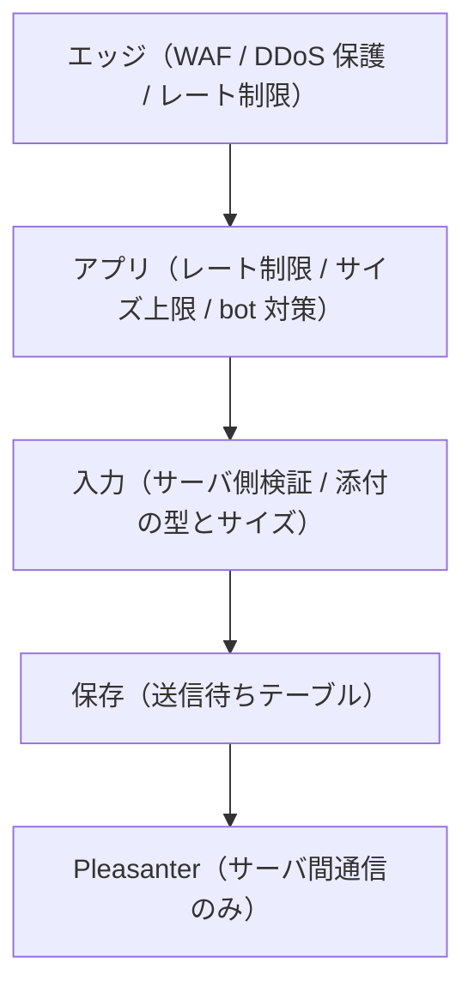

# 非機能設計

## 1. セキュリティ

**第 1 弾から作り込む**（2026-08-18 決定）。**完全匿名の公開フォームを認証なしで
インターネットへ晒す**ため、後回しにできる部分が無い。

### 前提：この製品が晒すもの

| 面 | 誰でも到達できるか | 攻撃者にとっての価値 |
|---|---|---|
| 回答画面 | **できる**（URL を知っていれば） | **書き込みができる。** DB とストレージを消費させられる |
| 回答の編集 | できる（GUID を知っていれば） | **他人の回答の改ざん** |
| 管理画面 | ログインが要る | 全アンケートの定義と設定 |

**「読み取りだけの公開ページ」ではない。** 匿名の第三者が書き込み・添付・編集を
行える点が、通常の公開サイトと違う。

### 多層で守る

**どれか 1 つに頼らない。** レート制限を抜けても入力検証で止まり、
入力検証を抜けても Pleasanter 側の権限で止まる、という重なりを作る。

### エッジ層

- **WAF を前段に置く。** 既知の攻撃パターンをアプリへ届かせない
- **プラットフォームの DDoS 保護を有効にする**
- **HTTPS 強制と HSTS。** 平文での接続を受け付けない
- 必要なら地域・IP による制限。**ただし公開アンケートでは絞れないことが多い**

### レート制限（複数の軸で掛ける）

**1 つの軸だけでは抜けられる。**

| 軸 | 目的 |
|---|---|
| 送信元 IP | 単一ホストからの連投 |
| `PublicId`（アンケート単位） | 特定のアンケートへの集中 |
| `ResponseGuid` | 同じ回答の連続更新 |
| サーバ全体 | 総量。**Pleasanter を落とさないため** |

- **DB へ書く前に効かせる。** 書いてから弾いても消費は起きている
- 超過時は `429` と `Retry-After` を返す
- **制限値は設定で外部化する**（`App_Data/Parameters/`）

### 入力

- **サーバ側で必ず検証する。** 画面側は体験のためだけ
- **リクエストボディのサイズ上限**を設ける。既定値に任せない
- **添付ファイルは、拡張子ではなく内容で種別を判定する。** サイズ・個数の上限を設ける
- **添付は送信待ちの `PayloadJson` に Base64 で載る**（[`実機検証結果.md`](実機検証結果.md) 6 章）。
  **サイズ上限が無いと DB が溢れる**
- 正規表現による検証は**実行時間の上限**を設ける（ReDoS）
- 添付のウイルス対策は**要件として確認する**（未確定）

### 出力

- 回答内容をそのまま HTML へ差し込まない
- **CSP を設定する。** インラインスクリプトに依存しない作りにする
- セキュリティヘッダを一式付ける
  （`X-Content-Type-Options` / `Referrer-Policy` / `Permissions-Policy` / `frame-ancestors`）

### bot・スパム対策

**第 1 弾から入れる。**

- **CAPTCHA。** 送信時に検証する
- **ハニーポット項目。** 画面に見えない項目が埋まっていたら bot
- **送信までの最短時間。** 人間があり得ない速さで送ってきたら弾く
- 同一 IP・同一 UA の連投を検知する

> **要確認。** CAPTCHA サービスは**第三者へ回答者の情報が渡る。**
> 選定時にライセンスと個人情報の扱いを一次情報で確認すること（[`アーキテクチャ方針.md`](アーキテクチャ方針.md) 15 章）。

### 識別子の秘匿

| 識別子 | 守り方 |
|---|---|
| `PublicId`（アンケート） | **暗号論的乱数。** 連番や UUIDv1 のような推測可能なものにしない |
| `ResponseGuid`（回答） | 同上。**Cookie / Web Storage にのみ置き、URL に載せない** |
| Pleasanter のレコード ID | **ブラウザへ渡さない。** 連番なので他人の回答を書き換えられる |

- **存在しない `PublicId` でも、応答の文言と時間を変えない。** 列挙の手掛かりを与えない
- **`ResponseGuid` を知っている人は、その回答を書き換えられる。**
  URL・メール・ログへ載せる経路を作らないこと

### 管理画面

- **ログイン試行の回数制限とアカウントロック**
- パスワードポリシー（長さ・使い回しの禁止）
- **セッション Cookie は `Secure` / `HttpOnly` / `SameSite`**
- CSRF 対策
- **多要素認証（TOTP）を第 1 弾から入れる**（2026-08-18 決定）。
  管理画面は全アンケートの定義と設定を握るうえ、**独自ログインで IdP の保護が無い。**
  パスワードだけだと漏洩時に直接入られる
    - 認証アプリの 6 桁コード。外部サービスに依存しない
    - **回復コードを発行する。** 端末紛失で全員が締め出される事故を防ぐ
    - **シークレットは暗号化して保存する。** 平文で持たない
- **最終ログイン日時を記録する。** 退職者の止め忘れを見つける唯一の手掛かり

### 資格情報

- **Pleasanter の API キーはサーバ側だけが持つ。** ログ・例外・キャッシュにフル値を残さない
- 管理者のパスワードは**ソルト付きの実績ある KDF でハッシュのみ**保存
- **設定ファイルへ実値を書かない。** 環境変数か Azure Key Vault
- **ログに回答本文・資格情報・`ResponseGuid` を出さない**

### 依存とサプライチェーン

- **依存の脆弱性を継続的に検査する**（CI）
- **依存は寛容ライセンスに限定する**（[`../LICENSING.md`](../LICENSING.md)）。
  コピーレフトが 1 つ入ると商用ライセンスでの提供ができなくなる
- **`NOTICE` を維持する**

## 2. DDoS とコストへの攻撃

**回答画面は書き込みを伴うため、キャッシュでは守れない。**
通常の公開サイトのように CDN 前段で吸収する手が使えない。

### 何が起きるか

| 影響 | 内容 |
|---|---|
| DB が溢れる | 送信待ちテーブルへ書き込まれ続ける。**添付があると桁違いに速い** |
| Pleasanter が落ちる | 送信ワーカーが溜まった分を送り続ける |
| **課金が跳ねる** | スケールアウト、ストレージ、送信の回数。**サービスは生きたまま費用だけ増える** |

**アウトボックスは障害を吸収するが、攻撃は吸収しない。** 溜まるだけ溜まる。

### 対処

1. **DB へ書く前にレート制限を効かせる**（前章）
2. **送信待ちの件数に上限を設ける。** 超えたら受付を止める。
   **無制限に受け付けるほうが危険**
3. **アンケート単位の回答上限と受付期間を使う。** 機能であると同時に防御でもある
4. **異常な流量を検知したら、そのアンケートだけ自動で受付を停止する。**
   全体を止めない
5. **送信ワーカーの同時送信数と流量に上限を設ける。** Pleasanter を巻き込まない
6. **費用のアラートを設定する。** 攻撃に気づく最後の手段になることがある

> **要確認。** 自動停止の閾値、受付上限、費用アラートの通知先は要件で決める。

## 3. 障害時の挙動

| 事象 | 挙動 |
|---|---|
| Pleasanter が停止 | **回答は受け付け続ける。** 送信待ちに溜まり、復旧後に送られる |
| 本アプリの DB が停止 | **回答を受け付けられない。** 受付不可を明示する。黙って捨てない |
| 送信ワーカーが落ちた | `LockedUntil` 経過で `Pending` へ戻る。**回答は失われない** |
| 送信が失敗し続ける | 上限でデッドレターへ分離し、**管理者へ通知** |

**溜まっていることに気づけないのが一番まずい。** 未送信件数と最古の滞留時刻を
管理画面に出し、閾値超過で通知する。

## 4. 性能

- **回答画面の表示はスナップショットを読むだけ。** Pleasanter へ問い合わせない
- 送信は非同期なので、**回答者から見た応答時間は DB への 1 書き込み**
- **同時回答数の想定値を要件として確定させる。** 未確定
- 送信ワーカーの同時送信数に上限を設ける。**Pleasanter を落とさない**

## 5. 監査

- 管理アプリの操作（公開・停止・設問変更・マッピング変更・管理者変更）を記録する
- **記録するのは「誰が・いつ・何を」。回答本文は入れない**
- 保持期間を決めて超過分を削除する

## 6. テスト

| 種別 | 対象 |
|---|---|
| 単体 | マッピング評価、検証規則、タイムゾーン変換 |
| 結合 | 送信待ち → 送信 → 削除の流れ。**失敗と再送も通す** |
| **3 RDBMS 統合** | SQL Server / PostgreSQL / MySQL で同じシナリオ。**CI 必須** |
| E2E | 回答画面（分岐・ページ送り・編集）、管理アプリ |
| 実機 | Pleasanter との往復。[`tools/pleasanter-testenv/`](../tools/pleasanter-testenv/README.md) |

**緑のテストだけで満足しない。** 次を必ず含める。

- **Pleasanter が落ちている状態での送信**（常時アウトボックスの本体）
- **タイムゾーンが食い違う状態での日付の往復**（[`実機検証結果.md`](実機検証結果.md) 4 章）
- **列の本数の上限を超える設問構成**
- **未回答の日付**（`1899-12-30` と区別できない）
- **同じ GUID での二重送信**（冪等であること）

## 7. バックアップと復元

**設定は本アプリの DB、回答は Pleasanter。2 系統ある。**

- **片方だけ古い状態へ戻さない。** マッピングと回答の対応が崩れる
- **`SurveyVersions` は消さない。** 過去の回答を解釈するために要る
- 復元手順は「両方を同じ時点へ戻す」ことを前提に文書化する
- **送信待ちが残った状態で復元すると、復元後に再送される。** `Upsert` は冪等なので
  二重登録にはならないが、**古い内容で上書きし得る**。復元手順に明記する

## 8. 配置と運用

- **`WEBSITE_TIME_ZONE` を `Tokyo Standard Time` に設定する**
- **`Always On` を有効にする。** 無効だと送信ワーカーが止まる
- Pleasanter の接続先と API キーは**スロット設定**にする（swap で入れ替えない）
- **マイグレーションはアプリ起動時に自動適用しない。** デプロイ手順で明示的に流す

### 変えてはいけない設定

**運用開始後に変更すると、保存済みデータの解釈が変わる。**

- API キー保有ユーザの `TimeZone`
- Pleasanter サーバの OS タイムゾーン（`WEBSITE_TIME_ZONE`）

## 9. 未確定

| # | 論点 |
|---|---|
| 1 | CAPTCHA サービスの選定（**ライセンスと個人情報の扱いを一次情報で確認**） |
| 2 | 添付ファイルのウイルス対策の要否と方式 |
| 3 | 自動停止の閾値・回答上限・送信待ちの件数上限 |
| 4 | 同時回答数の想定値 |
| 5 | 監査ログとデッドレターの保持期間 |
| 6 | 通知先（デッドレター発生・滞留超過・401 検知・流量異常・費用アラート） |
